Mastering LLM Techniques: Inference Optimization | NVIDIA Technical Blog

Related Resources

Agentic AI / Generative AI

English日本語

# Mastering LLM Techniques: Inference Optimization

Local figures (copyright remains with the original site; study copies):

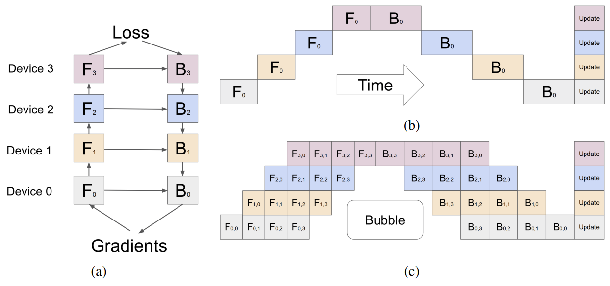

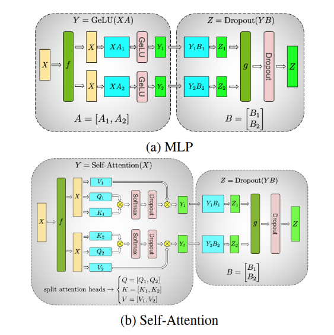

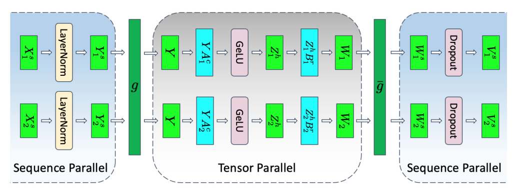

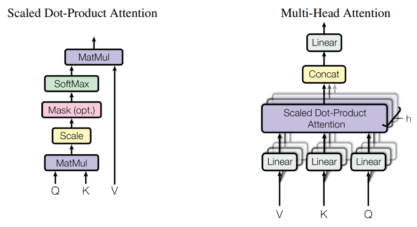

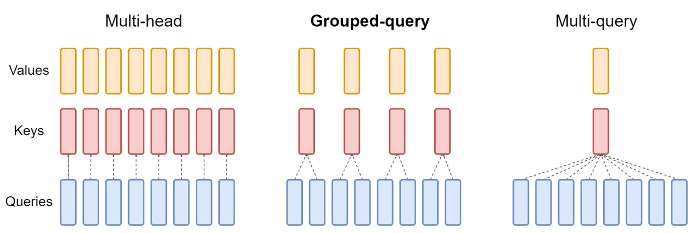

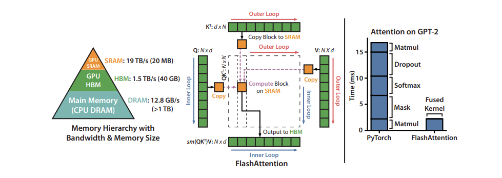

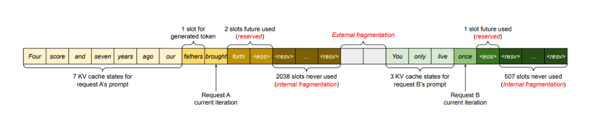

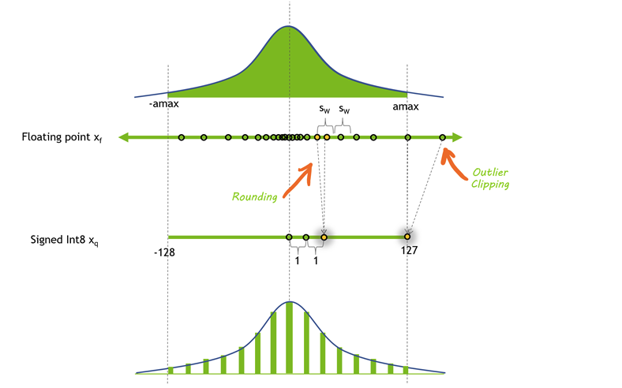

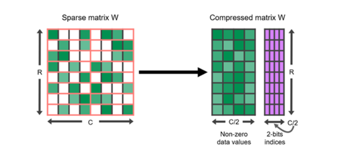

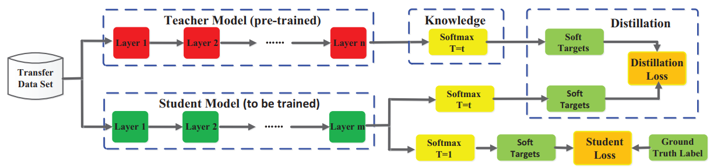

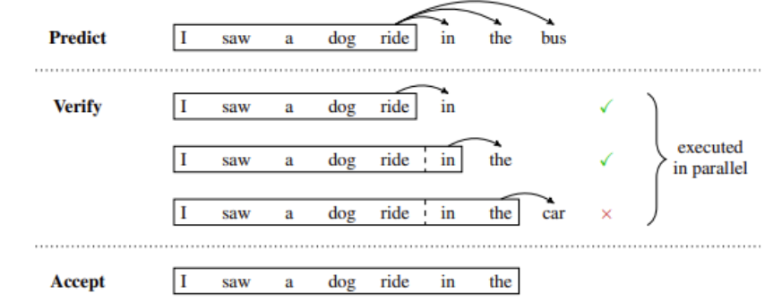

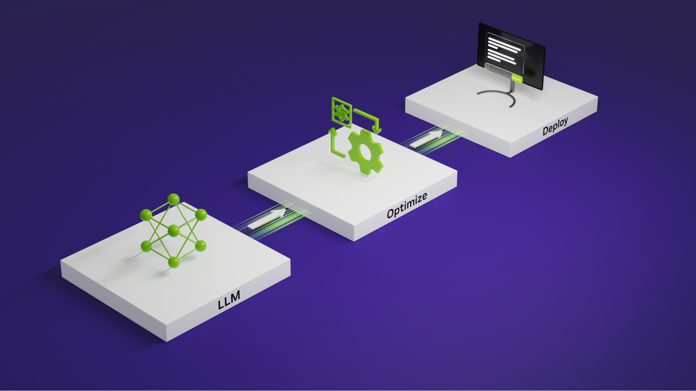

## AI-Generated Summary

- Large language models require two distinct inference phases: a prefill phase that processes input tokens in parallel and a decode phase that generates output tokens autoregressively and is memory-bound.
- Key-value caching avoids recomputing attention tensors during decoding, but its memory footprint grows linearly with batch size and sequence length, limiting throughput for long-context workloads such as retrieval-augmented generation.
- Model parallelism techniques including pipeline parallelism, tensor parallelism, and sequence parallelism distribute model weights and activations across multiple GPUs to reduce per-device memory requirements.
- Attention optimizations such as multi-query attention, grouped-query attention, and FlashAttention reduce key-value memory usage and improve GPU memory hierarchy utilization without changing model accuracy.
- PagedAttention manages the key-value cache in fixed-size blocks stored non-contiguously, eliminating fragmentation from static over-provisioning and enabling larger batch sizes.
- Model optimization techniques including quantization, structured sparsity, and knowledge distillation shrink model size and accelerate inference, while serving techniques such as in-flight batching and speculative inference increase GPU utilization and throughput.

### Next Steps

- Explore the NVIDIA TensorRT-LLM open-source library for optimized kernels and multi-GPU communication primitives.
- Deploy NVIDIA NIM microservice containers to run prepackaged, validated inference workloads on NVIDIA GPUs.
- Get started at build.nvidia.com to experiment with inference optimization techniques using production-grade code.

Powered by NVIDIA Nemotron. AI-generated content may summarize information incompletely. Verify important information. Learn more

Stacking transformer layers to create large models results in better accuracies, few-shot learning capabilities, and even near-human emergent abilities on a wide range of language tasks. These foundation models are expensive to train, and they can be memory- and compute-intensive during inference (a recurring cost). The most popular large language models (LLMs) today can reach tens to hundreds of billions of parameters in size and, depending on the use case, may require ingesting long inputs (or contexts), which can also add expense. For example, retrieval-augmented generation(RAG) pipelines require putting large amounts of information into the input of the model, greatly increasing the amount of processing work the LLM has to do.

This post discusses the most pressing challenges in LLM inference, along with some practical solutions. Readers should have a basic understanding of transformer architecture and the attention mechanism in general.

Developers can also explore these inference optimization techniques using open NVIDIA and community models—such as the Nemotron 3 family of open models—running on the open-source TensorRT-LLM library, available on GitHub. This makes it possible to experiment with real-world inference tradeoffs using production-grade code rather than abstract examples.

## Understanding LLM inference

Most of the popular decoder-only LLMs (GPT-3, for example) are pretrained on the causal modeling objective, essentially as next-word predictors. These LLMs take a series of tokens as inputs, and generate subsequent tokens autoregressively until they meet a stopping criteria (a limit on the number of tokens to generate or a list of stop words, for example) or until it generates a special` ` token marking the end of generation. This process involves two phases: the prefill phase and the decode phase.

Note that tokens are the atomic parts of language that a model processes. One token is approximately four English characters. All inputs in natural language are converted to tokens before inputting into the model.

### Prefill phase or processing the input

In the prefill phase, the LLM processes the input tokens to compute the intermediate states (keys and values), which are used to generate the “first” new token. Each new token depends on all the previous tokens, but because the full extent of the input is known, at a high level this is a matrix-matrix operation that’s highly parallelized. It effectively saturates GPU utilization.

### Decode phase or generating the output

In the decode phase, the LLM generates output tokens autoregressively one at a time, until a stopping criteria is met. Each sequential output token needs to know all the previous iterations’ output states (keys and values). This is like a matrix-vector operation that underutilizes the GPU compute ability compared to the prefill phase. The speed at which the data (weights, keys, values, activations) is transferred to the GPU from memory dominates the latency, not how fast the computation actually happens. In other words, this is a memory-bound operation.

Many of the inference challenges and corresponding solutions featured in this post concern the optimization of this decode phase: efficient attention modules, managing the keys and values effectively, and others.

Different LLMs may use different tokenizers, and thus, comparing output tokens between them may not be straightforward. When comparing inference throughput, even if two LLMs have similar tokens per second output, they may not be equivalent if they use different tokenizers. This is because corresponding tokens may represent a different number of characters.

### Batching

The simplest way to improve GPU utilization, and effectively throughput, is through batching. Since multiple requests use the same model, the memory cost of the weights is spread out. Larger batches getting transferred to the GPU to be processed all at once will leverage more of the compute available.

Batch sizes, however, can only be increased up to a certain limit, at which point they may lead to a memory overflow. To better understand why this happens requires looking at key-value (KV) caching and LLM memory requirements.

Traditional batching (also called static batching) is suboptimal. This is because for each request in a batch, the LLM may generate a different number of completion tokens, and subsequently they have different execution times. As a result, all requests in the batch must wait until the longest request is finished, which can be exacerbated by a large variance in the generation lengths. There are methods to mitigate this, such as in-flight batching.

For example, open-source runtimes like NVIDIA TensorRT-LLM have in-flight batching and related scheduling optimizations for popular open models (for example, Llama and Nemotron). This does not require writing custom schedulers or CUDA kernels.

### Key-value caching

One common optimization for the decode phase is KV caching. The decode phase generates a single token at each time step, but each token depends on the key and value tensors of all previous tokens (including the input tokens’ KV tensors computed at prefill, and any new KV tensors computed until the current time step).

To avoid recomputing all these tensors for all tokens at each time step, it’s possible to cache them in GPU memory. Every iteration, when new elements are computed, they are simply added to the running cache to be used in the next iteration. In some implementations, there is one KV cache for each layer of the model.

Figure 1. An illustration of the key-value caching mechanism

### LLM memory requirement

In effect, the two main contributors to the GPU LLM memory requirement are model weights and the KV cache.

- Model weights: Memory is occupied by the model parameters. As an example, a model with 7 billion parameters (such as Llama 2 7B), loaded in 16-bit precision (FP16 or BF16) would take roughly 7B * sizeof(FP16) ~= 14 GB in memory.
- KV caching: Memory is occupied by the caching of self-attention tensors to avoid redundant computation.

With batching, the KV cache of each of the requests in the batch must still be allocated separately, and can have a large memory footprint. The formula below delineates the size of the KV cache, applicable to most common LLM architectures today.

Size of KV cache per token in bytes = 2 * (num_layers) * (num_heads * dim_head) * precision_in_bytes

The first factor of 2 accounts for the K and V matrices. Commonly, the value of (num_heads * dim_head) is the same as the hidden_size (or dimension of the model, d_model) of the transformer. These model attributes are commonly found in model cards or associated config files.

This memory size is required for each token in the input sequence, across the batch of inputs. Assuming half-precision, the total size of KV cache is given by the formula below.

Total size of KV cache in bytes = (batch_size) * (sequence_length) * 2 * (num_layers) * (hidden_size) * sizeof(FP16)

For example, with a Llama 2 7B model in 16-bit precision and a batch size of 1, the size of the KV cache will be 1 * 4096 * 2 * 32 * 4096 * 2 bytes, which is ~2 GB.

Managing this KV cache efficiently is a challenging endeavor. Growing linearly with batch size and sequence length, the memory requirement can quickly scale. Consequently, it limits the throughput that can be served, and poses challenges for long-context inputs. This is the motivation behind several optimizations featured in this post.

## Scaling up LLMs with model parallelization

One way to reduce the per-device memory footprint of the model weights is to distribute the model over several GPUs. Spreading the memory and compute footprint enables running larger models, or larger batches of inputs. Model parallelization is a necessity to train or infer on a model requiring more memory than available on a single device, and to make training times and inference measures (latency or throughput) suitable for certain use cases. There are several ways of parallelizing the model based on how the model weights are split.

Note that data parallelism is also a technique often mentioned in the same context as the others listed below. In this, weights of the model are copied over multiple devices, and the (global) batch size of inputs is sharded across each of the devices into microbatches. It reduces the overall execution time by processing larger batches. However, it is a training time optimization that is less relevant during inference.

Note that any model-parallel techniques—including pipeline and tensor parallelism—are available in open frameworks such as NVIDIA Megatron-LM and the NVIDIA NeMo framework, which underpin training and inference workflows for a wide range of open models.

### Pipeline parallelism

Pipeline parallelism involves sharding the model (vertically) into chunks, where each chunk comprises a subset of layers that is executed on a separate device. Figure 2a is an illustration of four-way pipeline parallelism, where the model is sequentially partitioned and a quarter subset of all layers are executed on each device. The outputs of a group of operations on one device are passed to the next, which continues executing the subsequent chunk.

and

indicate forward and backward passes respectively on device n. The memory requirement for storing model weights on each device is effectively quartered.

The main limitation of this method is that, due to the sequential nature of the processing, some devices or layers may remain idle while waiting for the output (activations, gradients) of previous layers. This results in inefficiencies or “pipeline bubbles” in both the forward and backward passes. In Figure 2b, the white empty areas are the large pipeline bubbles with naive pipeline parallelism where devices are idle and underutilized.Microbatching can mitigate this to some extent, as shown in Figure 2c. The global batch size of inputs is split into sub-batches, which are processed one by one, with gradients being accumulated at the end. Note that

and

indicate forward and backward passes respectively on device

with microbatch

. This approach shrinks the size of pipeline bubbles, but it does not completely eliminate them.

Figure 2. An illustration of four-way pipeline parallelism. Credit: GPipe: Easy Scaling with Micro-Batch Pipeline Parallelism

### Tensor parallelism

Tensor parallelism involves sharding (horizontally) individual layers of the model into smaller, independent blocks of computation that can be executed on different devices. Attention blocks and multi-layer perceptron (MLP) layers are major components of transformers that can take advantage of tensor parallelism. In multi-head attention blocks, each head or group of heads can be assigned to a different device so they can be computed independently and in parallel.

Figure 3. Illustration of tensor parallelism in multi-layer perceptron (MLP) and self-attention layers. Credit: Megatron-LM: Training Multi-Billion Parameter Language Models Using Model Parallelism

Figure 3a shows an example of two-way tensor parallelism on a two-layer MLP, with each layer represented by a rounded box. Within the first layer, the weight matrix

is split into

and

. The computations

and

can be independently executed on the same batch (

is an identity operation) of inputs

on two different devices. This effectively halves the memory requirement of storing weights on each device. A reduction operation

combines the outputs in the second layer.

Figure 3b is an example of two-way tensor parallelism in the self-attention layer. The multiple attention heads are parallel by nature and can be split across devices.

### Sequence parallelism

Tensor parallelism has limitations, as it requires layers to be divided into independent, manageable blocks. It’s not applicable to operations like LayerNorm and Dropout, which are instead replicated across the tensor-parallel group. While LayerNorm and Dropout are computationally inexpensive, they do require a considerable amount of memory to store (redundant) activations.As shown in Reducing Activation Recomputation in Large Transformer Models, these operations are independent across the input sequence, and these ops can be partitioned along that “sequence-dimension,” making them more memory efficient. This is called sequence parallelism.

Figure 4. An illustration of a transformer layer with both tensor and sequence parallelism. Credit: Reducing Activation Recomputation in Large Transformer Models

Techniques for model parallelism are not exclusive and can be used in conjunction. They can help scale and reduce the per-GPU memory footprint of LLMs, but there are also optimization techniques specifically for the attention module.

## Optimizing the attention mechanism

The scaled dot-product attention (SDPA) operation maps query and key-value pairs to an output, as described in Attention Is All You Need.

### Multi-head attention

As an enhancement to the SDPA, executing the attention layer multiple times in parallel with different, learned projections of the Q, K, and V matrices, enables the model to jointly attend to information from different representational subspaces at different positions. These subspaces are learned independently, providing the model with a richer understanding of different positions in the input.

As depicted in Figure 5, the outputs from the multiple parallel attention operations are concatenated and linearly projected to combine them. Each parallel attention layer is called a ‘head,’ and this approach is called multi-head attention (MHA).

In the original work, each attention head operates on a reduced dimension of the model (such as

) when using eight parallel attention heads. This keeps the computational cost similar to single-head attention.

Figure 5. An illustration of the scaled dot-product attention (left) and multi-head attention (right), which is simply multiple SDPA heads in parallel. Credit: Attention Is All You Need

### Multi-query attention

One of the inference optimizations to MHA, called multi-query attention (MQA), as proposed in Fast Transformer Decoding, shares the keys and values among the multiple attention heads. The query vector is still projected multiple times, as before.

While the amount of computation done in MQA is identical to MHA, the amount of data (keys, values) read from memory is a fraction of before. When bound by memory-bandwidth, this enables better compute utilization. It also reduces the size of the KV-cache in memory, allowing space for larger batch sizes.

The reduction in key-value heads comes with a potential accuracy drop. Additionally, models that need to leverage this optimization at inference need to train (or at least fine-tuned with ~5% of training volume) with MQA enabled.

### Grouped-query attention

Grouped-query attention(GQA) strikes a balance between MHA and MQA by projecting key and values to a few groups of query heads (Figure 6). Within each of the groups, it behaves like multi-query attention.

Figure 6 shows that multi-head attention has multiple key-value heads (left). Grouped-query attention (center) has more key-value heads than one, but fewer than the number of query heads, which is a balance between memory requirement and model quality. Multi-query attention (right) has a single key-value head to help save memory.

Figure 6. A comparison of different attention mechanisms. Credit: GQA: Training Generalized Multi-Query Transformer Models from Multi-Head Checkpoints

Models originally trained with MHA, can be “uptrained” with GQA using a fraction of the original training compute. They attain quality close to MHA while maintaining a computational efficiency closer to MQA. Llama 2 70B is an example of a model that leverages GQA.

Optimizations like MQA and GQA help reduce the memory required by KV caches by reducing the number of key and value heads that are stored. There may still be inefficiencies in how this KV cache is managed. Of a different flavor than optimizing the attention module itself, the next section presents a technique for more efficient KV cache management.

### Flash attention

Another way of optimizing the attention mechanism is to modify the ordering of certain computations to take better advantage of the memory hierarchy of GPUs. Neural networks are generally described in terms of layers, and most implementations are laid out that way as well, with one kind of computation done on the input data at a time in sequence. This doesn’t always lead to optimal performance, since it can be beneficial to do more calculations on values that have already been brought into the higher, more performant levels of the memory hierarchy.

Fusing multiple layers together during the actual computation can enable minimizing the number of times the GPU needs to read from and write to its memory and to group together calculations that require the same data, even if they are parts of different layers in the neural network.

One very popular fusion is FlashAttention, an I/O aware exact attention algorithm, as detailed in FlashAttention: Fast and Memory-Efficient Exact Attention with IO-Awareness. Exact attention means that it is mathematically identical to the standard multi-head attention (with variants available for multi-query and grouped-query attention), and so can be swapped into an existing model architecture or even an already-trained model with no modifications.

I/O aware means it takes into account some of the memory movement costs previously discussed when fusing operations together. In particular, FlashAttention uses “tiling” to fully compute and write out a small part of the final matrix at once, rather than doing part of the computation on the whole matrix in steps, writing out the intermediate values in between.

Figure 7 shows the tiled FlashAttention computation pattern and the memory hierarchy on a 40 GB GPU. The chart on the right shows the relative speedup that comes from fusing and reordering the different components of the Attention mechanism.

Figure 7. The tiled FlashAttention computation pattern and the memory hierarchy on a 40 GB GPU. Credit: FlashAttention: Fast and Memory-Efficient Exact Attention with IO-Awareness

## Efficient management of KV cache with paging

At times, KV caches are statically “over-provisioned” to account for the largest possible input (the supported sequence length) because the size of inputs is unpredictable. For example, if the supported maximum sequence length of a model is 2,048, then regardless of the size of input and the generated output in a request, a reservation of size 2,048 would be made in memory. This space may be contiguously allocated, and often, much of it remains unused, leading to memory waste or fragmentation. This reserved space is tied up for the lifetime of the request.

Figure 8. An illustration of memory wastage and fragmentation due to over-provisioning and inefficient KV cache management. Credit: Efficient Memory Management for Large Language Model Serving with PagedAttention

Inspired by paging in operating systems, the PagedAttention algorithm enables storing continuous keys and values in noncontiguous space in memory. It partitions the KV cache of each request into blocks representing a fixed number of tokens, which can be stored non-contiguously.

These blocks are fetched as required during attention computation using a block table that keeps account. As new tokens are generated, new block allocations are made. The size of these blocks is fixed, eliminating inefficiencies arising from challenges like different requests requiring different allocations. This significantly limits memory wastage, enabling larger batch sizes (and, consequently, throughput).

## Model optimization techniques

So far, we’ve discussed the different ways LLMs consume memory, some of the ways memory can be distributed across several different GPUs, and optimizing the attention mechanism and KV cache. There are also several model optimization techniques to reduce the memory use on each GPU by making modifications to the model weights themselves. GPUs also have dedicated hardware for accelerating operations on these modified values, providing even more speedups for models.

### Quantization

Quantization is the process of reducing the precision of a model’s weights and activations. Most models are trained with 32 or 16 bits of precision, where each parameter and activation element takes up 32 or 16 bits of memory—a single-precision floating point. However, most deep learning models can be effectively represented with eight or even fewer bits per value.

Figure 9 shows the distribution of values before and after one possible method of quantization. In this case, some precision is lost to rounding, and some dynamic range is lost to clipping, allowing the values to be represented in a much smaller format.

Figure 9. The distribution of values before and after one possible method of quantization

Reducing the precision of a model can yield several benefits. If the model takes up less space in memory, you can fit larger models on the same amount of hardware. Quantization also means you can transfer more parameters over the same amount of bandwidth, which can help to accelerate models that are bandwidth-limited.

There are many different quantization techniques for LLMs involving reduced precision on either the activations, the weights, or both. It’s much more straightforward to quantize the weights because they are fixed after training. However, this can leave some performance on the table because the activations remain at higher precisions. GPUs don’t have dedicated hardware for multiplying INT8 and FP16 numbers, so the weights must be converted back into a higher precision for the actual operations.

It’s also possible to quantize the activations, the inputs of transformer blocks and network layers, but this comes with its own challenges. Activation vectors often contain outliers, effectively increasing their dynamic range and making it more challenging to represent these values at a lower precision than with the weights.

One option is to find out where those outliers are likely to show up by passing a representative dataset through the model, and choosing to represent certain activations at a higher precision than others (LLM.int8()). Another option is to borrow the dynamic range of the weights, which are easy to quantize, and reuse that range in the activations.

### Sparsity

Similar to quantization, it’s been shown that many deep learning models are robust to pruning, or replacing certain values that are close to 0 with 0 itself. Sparse matrices are matrices where many of the elements are 0. These can be expressed in a condensed form that takes up less space than a full, dense matrix.

Figure 10. A sparse matrix represented in a compressed format consisting of non-zero data values and their corresponding two-bit indices

GPUs in particular have hardware acceleration for a certain kind of structured sparsity, where two out of every four values are represented by zeros. Sparse representations can also be combined with quantization to achieve even greater speedups in execution. Finding the best way to represent large language models in a sparse format is still an active area of research, and offers a promising direction for future improvements to inference speeds.

### Distillation

Another approach to shrinking the size of a model is to transfer its knowledge to a smaller model through a process called distillation. This process involves training a smaller model (called a student) to mimic the behavior of a larger model (a teacher).

Successful examples of distilled models include DistilBERT, which compresses a BERT model by 40% while retaining 97% of its language understanding capabilities at a speed 60% faster.While distillation in LLMs is an active field of research, the general approach was first described for neural networks in Distilling the Knowledge in a Neural Network:

- The student network is trained to mirror the performance of a larger teacher network, using a loss function that measures the discrepancy between their outputs. This objective is in addition to potentially including the original loss function of matching the student’s outputs with the ground-truth labels.
- The teacher’s outputs that are matched can be the very last layer (called logits) or intermediate layer activations.

Figure 11 shows a general framework for knowledge distillation. The logits of the teacher are soft targets that the student optimizes for using a distillation loss. Other distillation methods may use other measures of loss to “distill” knowledge from the teacher.

Figure 11. A general framework for knowledge distillation. Credit: Knowledge Distillation: A Survey

An alternative approach to distillation is to use data synthesized by the teacher for supervised training of a student LLM, which is especially useful when human annotations are scarce or not available. Distilling Step by Step! goes one step further by extracting rationales from a teacher LLM in addition to the labels that serve as ground truth. These rationales serve as intermediate reasoning steps to train smaller student LLMs in a data-efficient way.

It’s important to note that many state-of-the-art LLMs today have restrictive licenses that prohibit using their outputs to train other LLMs, making it challenging to find a suitable teacher model.

## Model serving techniques

Model execution is frequently memory-bandwidth bound—in particular, bandwidth-bound in the weights. Even after applying all the model optimizations previously described, it’s still very likely to be memory bound. So you want to do as much as possible with your model weights when they are loaded. In other words, try doing things in parallel. Two approaches can be taken:

- In-flight batching involves executing multiple different requests at the same time.
- Speculative inference involves executing multiple different steps of the sequence in parallel to try to save time.

### In-flight batching

LLMs have some unique execution characteristics that can make it difficult to effectively batch requests in practice. A single model can be used simultaneously for a variety of tasks that look very different from one another. From a simple question-and-answer response in a chatbot to the summarization of a document or the generation of a long chunk of code, workloads are highly dynamic, with outputs varying in size by several orders of magnitude.

This versatility can make it challenging to batch requests and execute them in parallel effectively—a common optimization for serving neural networks. This could result in some requests finishing much earlier than others.

To manage these dynamic loads, many LLM serving solutions include an optimized scheduling technique called continuous or in-flight batching. This takes advantage of the fact that the overall text generation process for an LLM can be broken down into multiple iterations of execution on the model.

With in-flight batching, rather than waiting for the whole batch to finish before moving on to the next set of requests, the server runtime immediately evicts finished sequences from the batch. It then begins executing new requests while other requests are still in flight. In-flight batching can therefore greatly increase the overall GPU utilization in real-world use cases.

### Speculative inference

Also known as speculative sampling, assisted generation, or blockwise parallel decoding, speculative inference is a different way of parallelizing the execution of LLMs. Normally, GPT-style large language models are autoregressive models that generate text token by token.

Every token that is generated relies on all of the tokens that come before it to provide context. This means that in regular execution, it’s impossible to generate multiple tokens from the same sequence in parallel—you have to wait for the nth token to be generated before you can generate n+1.

Figure 12 shows an example of speculative inference in which a draft model temporarily predicts multiple future steps that are verified or rejected in parallel. In this case, the first two predicted tokens in the draft are accepted, while the last is rejected and removed before continuing with the generation.

Figure 12. An example of speculative inference. Credit: Blockwise Parallel Decoding for Deep Autoregressive Models

Speculative sampling offers a workaround. The basic idea of this approach is to use some “cheaper” process to generate a draft continuation that is several tokens long. Then, execute the main “verification” model at multiple steps in parallel, using the cheap draft as “speculative” context for the execution steps where it is needed.

If the verification model generates the same tokens as the draft, then you know to accept those tokens for the output. Otherwise, you can throw out everything after the first non-matching token, and repeat the process with a new draft.

There are many different options for how to generate draft tokens, and each comes with different tradeoffs. You can train multiple models, or fine-tune multiple heads on a single pretrained model, that predict tokens that are multiple steps in the future. Or, you can use a small model as the draft model, and a larger, more capable model as the verifier.

## Key takeaways for optimizing LLM inference

This post outlines popular solutions to help optimize and serve LLMs efficiently, be it in the data center, cloud, or at the edge on a PC. Many of these techniques are optimized and available through NVIDIA TensorRT-LLM. It’s an open source library consisting of the TensorRT deep learning compiler alongside optimized kernels, preprocessing and postprocessing steps, and multi-GPU/multi-node communication primitives for groundbreaking performance on NVIDIA GPUs.

NVIDIA TensorRT-LLM is supported by NVIDIA Dynamo, enabling enterprises to serve multiple AI models concurrently across different AI frameworks, hardware accelerators, and deployment models with peak throughput and minimum latency. Open models like the Nemotron 3 family, alongside leading community models such as Llama, are available with optimized TensorRT-LLM configs. See reference deployments and example scripts on GitHub and NVIDIA AI Models.

NVIDIA NIM is the fastest way to leverage the latest inference optimization techniques in NVIDIA TensorRT-LLM, as well as popular community frameworks including vLLM and SGLang. NIM microservice containers for the latest AI models from NVIDIA and the community come prepackaged with everything AI teams need to deploy and scale AI models on NVIDIA GPUs—-optimized inference technology, runtime dependencies, and industry-standard APIs. And they’re validated, secured, and maintained by NVIDIA. NIM delivers workload-optimized inference performance with the lowest TCO through a streamlined, consistent workflow that integrates seamlessly into automated software delivery pipelines.

Get started today at build.nvidia.com.

Updated on Aug. 15 with key takeaways.

Discuss (0)

+341

Like

## About the Authors

## Comments