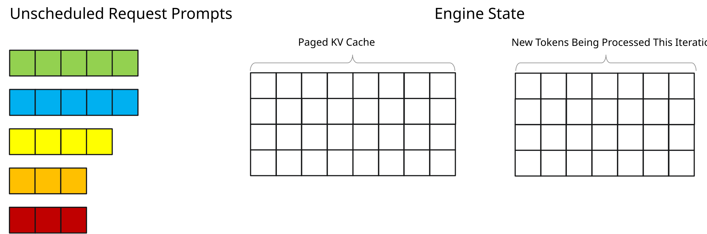
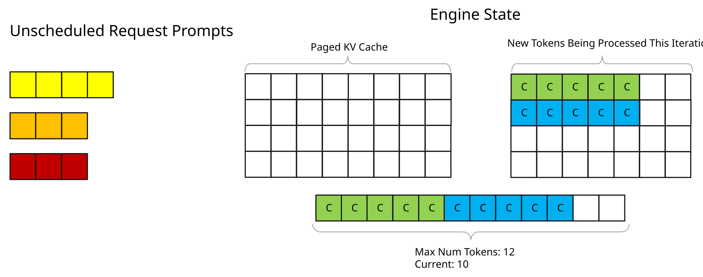
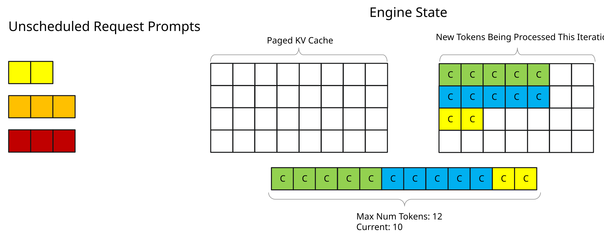

# Tuning Max Batch Size and Max Num Tokens

In-flight batching mixes context (prefill) and generation in one iteration. Two build-time caps decide who is scheduled: `max_batch_size` and `max_num_tokens`. Numbers below are illustrative.


Local figures (copyright remains with the original site; study copies):








## How the scheduler thinks

Toy values in the official page: `max_batch_size = 4`, `max_num_tokens = 12`. Squares = tokens; color = request. Rows are visualization only, not memory layout.

1. Requests 1 and 2 enter context (5 tokens each = 10). Two tokens of budget remain — not enough for any remaining prompt unless **context chunking** is on. Prompt tokens marked **C**.
2. After one iteration, KV exists and each request has generated **G1**.
3. Scheduler **prioritizes generation**. Those two G tokens leave most of the 12-token budget free, so Requests 3 and 4 can prefill. Request 5 cannot: token budget is fine, **batch is already 4**.
4. When Request 1 emits a stop token it is evicted; Request 5 can start. Request 2’s G1 is appended to its KV — the cache grows with decode.

The scheduler also looks at free KV memory and runtime policies (next pages). These two caps still decide the mix of old decode vs new prefill.

## Max batch size

Default **2048**. Too small bottlenecks admission. Sweep powers of 2.

```python
build_config = BuildConfig(max_batch_size=512)
```

CLI: `trtllm-build --max_batch_size <N>`

Continuing the case study (multiple profiles, GEMM plugin, paged context, reduce fusion):

| Metric | Batch 64 | Batch 512 | Batch 2048 |
|---|---|---|---|
| Token Throughput (tokens/sec) | 1944.3031 | 2466.7933 | 2044.2628 |
| Request Throughput (req/sec) | 0.9494 | 1.2045 | 0.9982 |
| Average TTFT (ms) | 145.7607 | 147.7876 | 146.6628 |
| Average ITL (ms) | 14.6475 | 14.6554 | 14.4493 |

**512** is the sweet spot (~+20% throughput vs 2048). 64 bottlenecks. Latency barely moves.

## Max num tokens

Default **8192**. Too small: cannot schedule long prompts. Too large: prompt tokens starve KV (or OOM) on long context. Sweep powers of 2 ≥ 1024. Grid-search with batch size if you can.

```python
build_config = BuildConfig(max_batch_size=512, max_num_tokens=2048)
```

CLI: `trtllm-build --max_num_tokens <N>`

At batch 512:

| Metric | Tokens 2048 | Tokens 8192 | Tokens 16384 |
|---|---|---|---|
| Token Throughput (tokens/sec) | 2474.2581 | 2466.7933 | 2461.0165 |
| Request Throughput (req/sec) | 1.2081 | 1.2045 | 1.2017 |
| Average TTFT (ms) | 147.5742 | 147.7876 | 147.9623 |
| Average ITL (ms) | 14.6852 | 14.6554 | 14.6769 |

2048 slightly best here; the delta is small. Measure yours.

## Why always enable paged context attention

It turns on **context chunking**: a prompt can span several iterations. Request 3 that did not fit the leftover budget can still schedule its **first chunk**.

1. Long prompts are not blocked forever behind in-flight work (better worst-case TTFT).
2. `max_num_tokens` need not be ≥ the longest prompt — **memory returns to KV cache**. Critical for long context.

Worst case ~noise; often a win. NVIDIA: enable it even when a given run looks flat.

## Uplift

Vs previous page (build flags only):

| Metric | Flags ON | Tuned batch/tokens | % |
|---|---|---|---|
| Token Throughput (tokens/sec) | 2044.2628 | 2474.2581 | 21.03 |
| Request Throughput (req/sec) | 0.9982 | 1.2081 | 21.03 |
| Average TTFT (ms) | 146.6628 | 147.5742 | -0.62 |
| Average ITL (ms) | 14.4493 | 14.6852 | -1.63 |

Latency delta is within run-to-run noise.

Vs raw baseline: token/s **+58.17%**, ITL **−53.12%**, TTFT ~flat.
