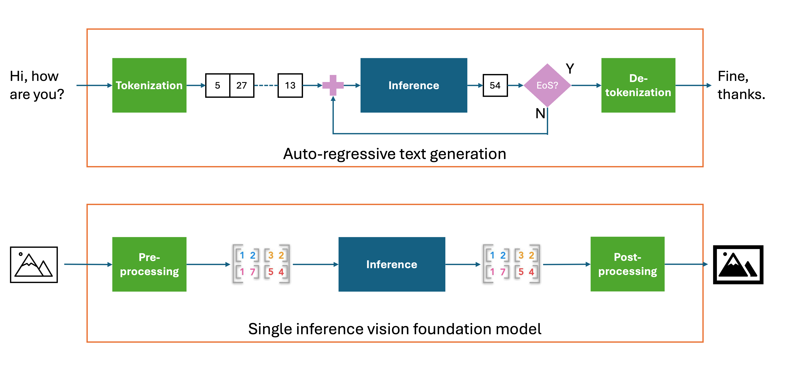
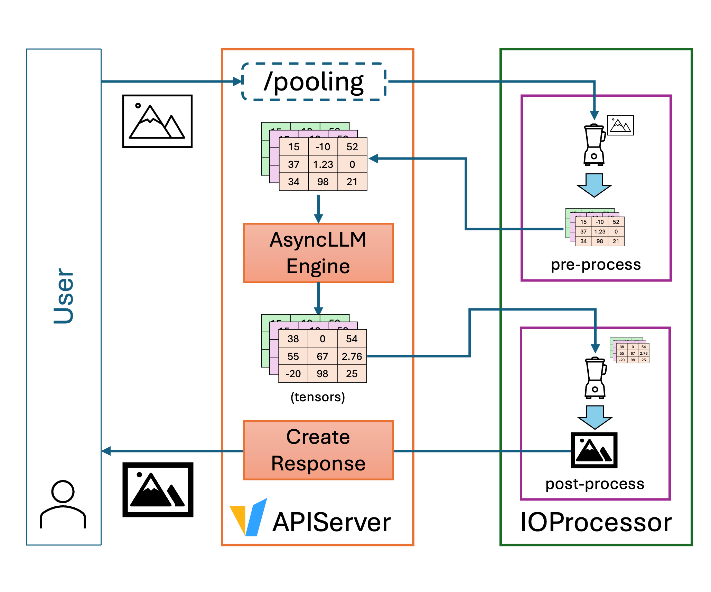
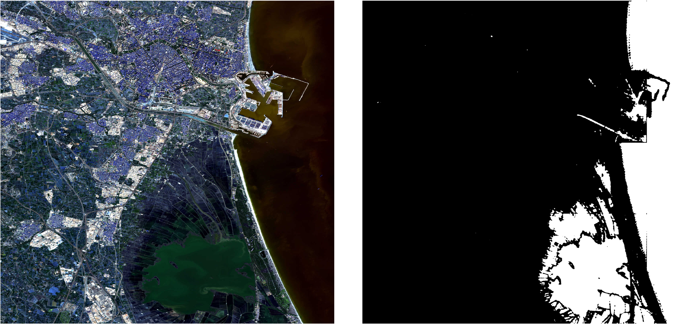

# Serving Geospatial, Vision, and Beyond: Enabling Multimodal Output Processing in vLLM

Chinese: [zh/vllm/blog/architecture/beyond-text.md](../../../../zh/vllm/blog/architecture/beyond-text.md)

2025-09-05. **Christian Pinto, Michele Gazzetti, Michael Johnston** (IBM Research Europe — Dublin), **Maximilien Philippe Marie de Bayser** (IBM Research — Brazil). Study note. Later multimodal pipeline: [vllm-omni.md](../serving/vllm-omni.md). Plugin door: [plugin-system.md](plugin-system.md). Same “backend for a whole family” pattern as HuggingFace: [transformers-backend.md](transformers-backend.md). Pooling hidden-state cousins: [extract-hidden-states.md](extract-hidden-states.md).

Fits: non-autoregressive models that emit multimodal output in one pass — geospatial / vision / structured tensors — served as pooling models with custom I/O. Does not fit: expecting `/pooling` to behave like chat completions, or asking Transformers processors to parse GeoTIFF.

## Overview

Until recently, generative serving was coupled to **autoregressive text**: token by token, natural language. vLLM followed that: text in, text out. Then MLLMs (images, video, audio as input) and LLaVA-style support: multimodal in, **text out**.

The next shift: **non-autoregressive models that generate multimodal outputs in a single inference pass**. From the engine’s standpoint they look like [pooling models](https://docs.vllm.ai/en/latest/models/pooling_models.html); they still need extra input/output handling. Applications named on the page: image classification and segmentation, audio synthesis, structured data.

First landing: **geospatial foundation models** — convolutional or ViT models that want more than RGB (multispectral / radar) plus metadata (geolocation, acquisition date). Disaster response, land-use classification from satellite imagery. The changes are generic; geospatial is the first family.

Concrete: all geospatial models from [TerraTorch](https://github.com/IBM/terratorch) (some with NASA / ESA) enter vLLM through a **generic backend**, first-class.

## Integrating geospatial models as pooling

Unlike text models, these often skip token decoding. One input image → one forward → raw output → post-process into an output image. Large inputs may be partitioned into patches, batched, then stitched using metadata.



**Figure.** Autoregressive text vs LLaVA-style MLLM vs pooling-shaped geospatial / vision models (study copy; copyright remains with the original site).

Pooling in vLLM already covers embedding and classification. **Identity poolers** return hidden states unchanged — the path these models need. Input: pre-process images into tensors and reuse existing multimodal input. A TerraTorch model-implementation backend was added on the same pattern as the HuggingFace Transformers backend.

Engine changes named on the page:

- attention-free models
- models that do not need a tokenizer
- raw input tensors instead of default multimodal embeddings
- serving API extensions

## IO Processor: tensor↔tensor is only halfway

With the above, geospatial models serve **tensor-to-tensor**. The user still pre-processes the image outside vLLM and post-processes the raw tensor outside. There is no endpoint that takes an image and returns an image.

Before this work, pre-processing of multimodal input went through Transformers processors — standard types, not GeoTIFF (pixels plus geospatial metadata). Output processing was detokenization into text, or poolers on hidden states. Nothing else.

**IO Processor** plugins customize pre- and post-processing **inside the same serving instance**. String, JSON, image tensor, custom structure — the plugin translates before the client sees it.



**Figure.** Request → IO Processor pre-process → engine `/pooling` → post-process → client (study copy).

Claim: non-text models (image generators, image→segmentation mask, tabular→classification) can share the vLLM serving stack. One plugin per instance at the time of the post; only the `/pooling` endpoint. Other endpoints were future work.

### Using plugins

Each plugin implements the [IO Processor interface](https://github.com/vllm-project/vllm/blob/main/vllm/plugins/io_processors/interface.py) and lives **outside** the vLLM tree. At install it registers one or more entry points in `vllm.io_processor_plugins`. The engine discovers them at init.

Install the plugin in the same Python env, then:

```bash
--io-processor-plugin <plugin_name>
```

Then-current rule: **one** IO Processor plugin per vLLM instance. Pre/post-process apply automatically on `/pooling`.

## Step-by-step: Prithvi flood detection

Example class: [Prithvi for flood detection](https://huggingface.co/ibm-nasa-geospatial/Prithvi-EO-2.0-300M-TL-Sen1Floods11). Full plugin: [christian-pinto/prithvi_io_processor_plugin](https://github.com/christian-pinto/prithvi_io_processor_plugin).

### Plugin pseudocode

Decouple data-specific transforms from model tensors — any model, any I/O type; later, multiple plugins on the same output.

```python
def pre_process(request_data: dict):
    # Downloads geotiff
    # In this example the input image has 7 bands
    image_url = request_data["url"]
    image_obj = download_image(image_url)

    # Extract image data:
    # - pixel_values([n, 6, 512, 512])
    #   - 6 input bands R, G, B, +3 multispectral wavelengths
    #   - n > 1 if the size of the input image is > [512, 512]
    # - metadata
    #   - GPS coordinates
    #   - date
    pixel_values, metadata = process_image(image_obj)

    # Process the image data into n vLLM prompts
    model_prompts = pixels_to_prompts(pixel_values)

    return model_prompts


def post_process(model_outputs: list[PoolingRequestOutput]):
    # Uses the previously extracted metadata to guarantee the output
    # contains the same georeferences and date.
    return image_object(model_outputs, metadata)
```

### Install

`terratorch` **>=1.1rc3** and `vllm`. At posting, the needed trunk was **not** in a release (latest then **v0.10.1.1**) — install [latest code](https://docs.vllm.ai/en/latest/getting_started/installation/gpu.html#install-the-latest-code_1).

```bash
git clone git@github.com:christian-pinto/prithvi_io_processor_plugin.git
cd prithvi_io_processor_plugin
pip install .
```

That installs the `prithvi_to_tiff` plugin.

### Serve

```bash
vllm serve \
    --model=ibm-nasa-geospatial/Prithvi-EO-2.0-300M-TL-Sen1Floods11 \
    --model-impl terratorch \
    --task embed --trust-remote-code \
    --skip-tokenizer-init --enforce-eager \
    --io-processor-plugin prithvi_to_tiff
```

Logs named on the page: API server on `http://0.0.0.0:8000`.

### Request `/pooling`

JSON: `model` and `softmax` are fixed; `data` is plugin-defined. **`softmax: false`** is required so the plugin sees **raw** model output. This example sends a URL and asks for a GeoTIFF as `b64_json`; the script writes `online_prediction.tiff`.

```python
import base64
import os
import requests

def main():
  image_url = "https://huggingface.co/christian-pinto/Prithvi-EO-2.0-300M-TL-VLLM/resolve/main/valencia_example_2024-10-26.tiff"
  server_endpoint = "http://localhost:8000/pooling"

  request_payload = {
      "data": {
          "data": image_url,
          "data_format": "url",
          "image_format": "tiff",
          "out_data_format": "b64_json",
      },
      "model": "ibm-nasa-geospatial/Prithvi-EO-2.0-300M-TL-Sen1Floods11",
      "softmax": False,
  }

  ret = requests.post(server_endpoint, json=request_payload)

  if ret.status_code == 200:
    response = ret.json()
    decoded_image = base64.b64decode(response["data"]["data"])
    out_path = os.path.join(os.getcwd(), "online_prediction.tiff")
    with open(out_path, "wb") as f:
        f.write(decoded_image)
  else:
    print(f"Response status_code: {ret.status_code}")
    print(f"Response reason:{ret.reason}")


if __name__ == "__main__":
    main()
```

Input (left): satellite picture of Valencia, Spain during the **2024** flood. Output (right): areas predicted flooded (white).



**Figure.** Prithvi flood mask over Valencia 2024 (study copy).

## What’s next / docs

Expand IO Processors across more TerraTorch models and modalities; smoother install. Longer-term: vision-language systems, structured reasoning agents, multimodal pipelines on the same stack. Community uses of IO Processors were invited.

Start: [IO Processor plugin docs](https://docs.vllm.ai/en/latest/design/io_processor_plugins.html), [examples](https://github.com/vllm-project/vllm/tree/main/examples), [TerraTorch](https://github.com/IBM/terratorch).

## Acknowledgement

vLLM community; in particular **[Cyrus Leung](https://github.com/DarkLight1337)** for shaping the “beyond text” concept. TerraTorch at IBM: **[Paolo Fraccaro](https://github.com/paolo-fraccaro)**, **[Joao Lucas de Sousa Almeida](https://github.com/Joao-L-S-Almeida)** for the generic TerraTorch backend.
