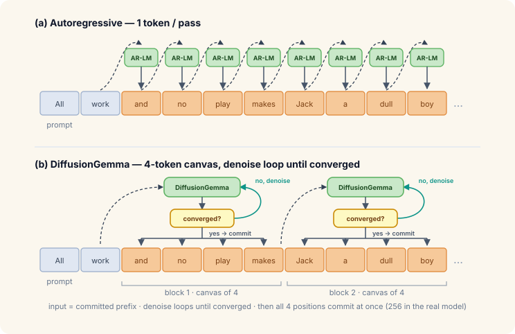
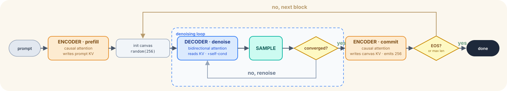
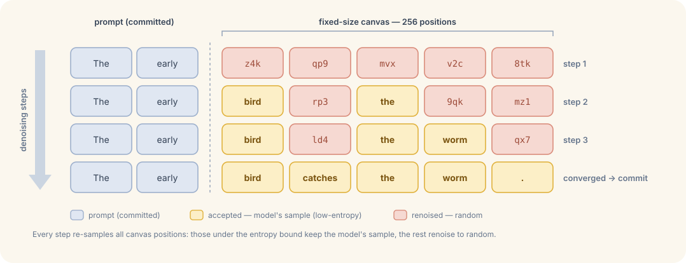
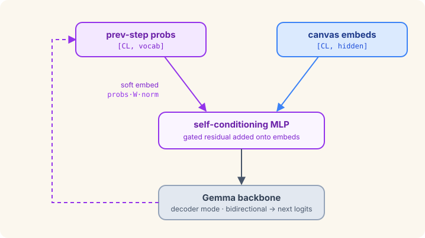
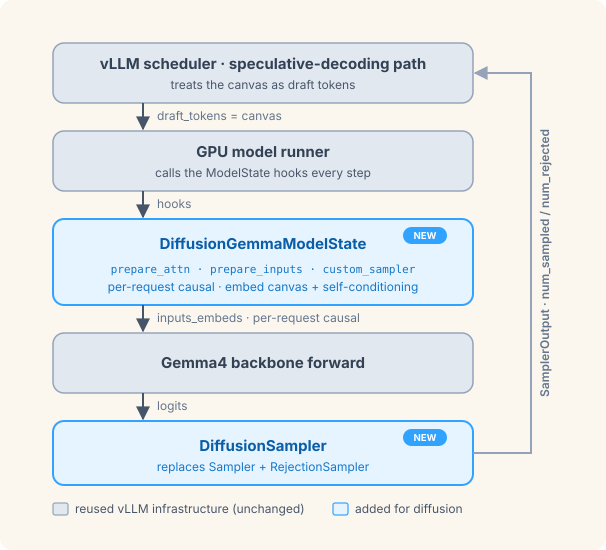
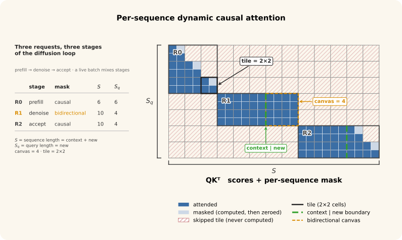
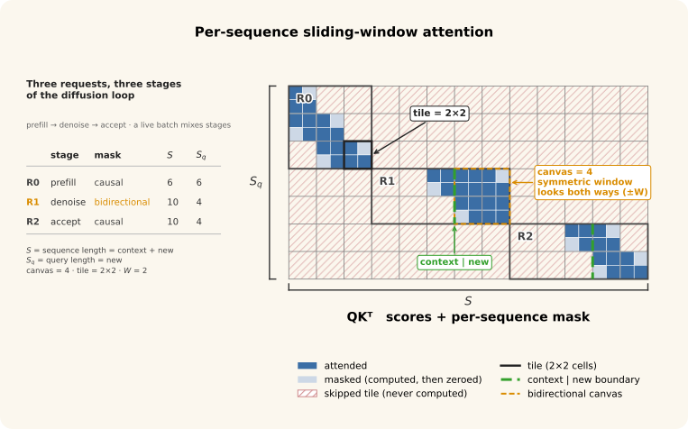
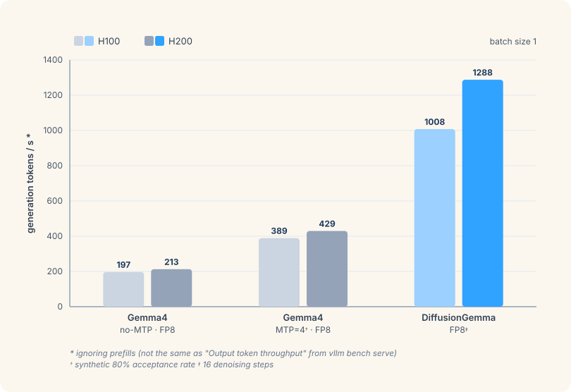

# DiffusionGemma: The First Diffusion LLM (dLLM) Natively Supported in vLLM

Chinese: [zh/vllm/blog/architecture/diffusion-gemma.md](../../../../zh/vllm/blog/architecture/diffusion-gemma.md)

2026-06-10. **The vLLM Team and Google DeepMind Team**. Study note; batch=1 demos, not an SLA. Deploy recipe: [vLLM recipe](https://recipes.vllm.ai/Google/diffusiongemma-26B-A4B-it). Runner hooks: [mrv2.md](mrv2.md). Spec path reused: [spec-decode.md](../performance/spec-decode.md). Gemma4 backbone family: [gemma4.md](../serving/gemma4.md). Omni / diffusion serving: [vllm-omni.md](../serving/vllm-omni.md). Local figures stay under `assets/vllm/blog/architecture/diffusion-gemma/`.

Fits: serving the first in-tree dLLM — 256-token canvas, bidirectional denoise, ModelState hooks, no runner fork. Does not fit: treating **1288 tok/s** as a multi-batch number; the page is H100/H200 **batch=1**.

## Overview

Google’s DiffusionGemma: **26B** discrete diffusion LM on a Gemma4 backbone; first dLLM in vLLM. dLLMs do not fit the AR path: bidirectional attention, iterative refinement, block generation, custom sampling each denoise step.

Integration uses Model Runner V2’s **ModelState**: custom input prep and per-request state hooks. Claim: Hugging Face reference accuracy, batched serving.

AR transformers emit one token left-to-right. Diffusion LMs **denoise a fixed-length canvas**. Many tokens per forward pass — compute vs bandwidth, attractive at **low batch** (spare FLOPs, bandwidth-bound). DiffusionGemma denoises **256 tokens** at a time.

**Figure.** Autoregressive vs block diffusion (study copy; copyright remains with the original site).

## Architecture and sampling loop

One Gemma4 backbone, two modes, **shared weights**:

- **Encoder:** *causal* attention, **writes** KV. Twice per block: prefill the prompt; **commit** a finished block.
- **Decoder:** *bidirectional* attention, **reads** KV only. Denoise — every canvas position attends to every other.

Causal encoder writes KV the AR way, so **automatic prefix cache** works with no diffusion-specific change.

Per 256-token block: prefill (encoder) → canvas = random tokens, state = denoise → each step runs decoder over the full canvas, samples every position, keeps the confident ones → when the block stops changing, encoder commit writes KV and emits 256 tokens → next block from a fresh random canvas.

**Figure.** Per-block sampling loop (study copy).

Inside a block: all 256 positions in parallel. Across blocks: still left-to-right — each new block conditions on committed tokens.

### Entropy-bound denoising

Every denoise step re-samples **all** positions; only confident ones are kept, the rest get fresh random tokens. Confidence = entropy of the predicted distribution (low entropy = decided).

**Entropy-bound:** walk most-confident → least, accept until accumulated entropy exceeds a budget. Early: almost everything is unsure, a few anchors lock. Neighbors sharpen; more positions fit the budget; the block snaps into focus.

**Figure.** Entropy-bound denoising over several steps (study copy).

**Converged:** argmax prediction unchanged for a couple of consecutive steps **and** mean per-token entropy below a threshold — or a hard step limit. Commit is that **clean argmax**, not the noisy sampled canvas.

### Self-conditioning

Between steps, condition on the model’s **own previous prediction**. Not hard tokens: full softmax → probability-weighted average of token embeddings → add through a small **gated MLP** onto canvas embeddings.

**Figure.** Self-conditioning feedback (study copy).

Renoised positions still carry last step’s belief. **Decoder/denoise only** — encoder prefill and commit zero the feedback (plain token embeddings).

## Implementation in vLLM

### Reusing speculative decoding

Engine already has a mature spec-decode path. Inspired by [RFC #36155](https://github.com/vllm-project/vllm/issues/36155): the canvas is a huge draft, **fully accepted or fully rejected**. Scheduler and runner stay almost unchanged. Exception: spec decode normally samples one extra (bonus) token; **`num_sampled=0`** was added, controlled by ModelState.

Scheduler, runner, Gemma4 backbone reused; only ModelState and sampler are diffusion-specific:

**Figure.** DiffusionGemma in vLLM’s speculative-decoding stack (study copy).

### ModelState hooks

Without ModelState, a non-AR model would fork the runner (input prep, attention metadata, sampling). Hooks the runner calls:

| Hook | DiffusionGemma uses it to… |
| --- | --- |
| `prepare_inputs()` | Embed canvas tokens and apply self-conditioning |
| `prepare_attn()` | Per-request causal (encoder) vs bidirectional (denoise) |
| `custom_sampler()` | Replace the default sampler with `DiffusionSampler` |
| `add_request()` / `remove_request()` | Init / tear down per-request state (canvas, self-conditioning probs) |

Models register via `get_model_state_cls()` on the model class. Runner stays generic: `prepare_attn(...)`, merge `prepare_inputs(...)` into forward kwargs, sample via `custom_sampler()` → `DiffusionSampler`. New block-diffusion model = one ModelState + one-line registration; no runner / scheduler / shared-infra change. Blueprint for later dLLMs.

### `DiffusionGemmaModelState` and `DiffusionSampler`

Per-request GPU tensors, updated in place: phase (commit vs denoise), `canvas`, convergence history, self-conditioning probabilities. `prepare_inputs()`: embed canvas, softmax-weighted embeddings from last denoise through gated MLP. `prepare_attn()`: causal vs bidirectional from the phase flag. Mixed prefill / denoise / commit in one batch; per-request causal flag is set asynchronously on GPU → attention-kernel changes below.

`DiffusionSampler` replaces `(Sampler, RejectionSampler)`. Owns canvas init/reset on phase changes. Per-step work is one `@torch.compile`d `_compiled_sample_step`, vectorized over in-flight decode requests:

- **Prefill:** random canvas, `num_sampled = 0`
- **Denoise:** temperature-scale logits; Gumbel-max (`argmax(logits/T + gumbel_noise)`); accept confident positions up to the entropy bound; renoise the rest. Record argmax canvas; check convergence (stable argmax for N steps and mean entropy below threshold, or step cap)
- **Commit:** emit clean `argmax_canvas` (`num_sampled = 256`), reinit canvas, reset per-request state

During denoise: `num_sampled = 0`, `num_rejected = query_len` — **KV cursor does not move**. Marking every canvas position rejected tells the scheduler to reschedule the same block. Denoise loop stays inside existing spec-decode accounting.

### Dynamic per-sequence causal attention

Until this work, causality was **batch-wide**. Decoder-only = causal; Whisper encoder = bidirectional. DiffusionGemma alternates per request; vLLM mixes stages in one forward. **Per-sequence causal attention:**

- Request 0: prefill length 6, **encoder** causal (above-diagonal masked). Attention in tiles (example 2×2; real tiles hardware-tuned); all-masked tiles skipped (compute + HBM K/V).
- Request 1: prefill done, **decoder** canvas size 4 — bidirectional inside the canvas, plus all context keys. Nothing masked, no skip.
- Request 2: canvas accepted — last **encoder** pass, causal, fill KV with new tokens; queries also attend to cached keys.

**Figure.** Dynamic per-sequence causal attention (study copy).

Backends: Triton Attention (`TRITON_ATTN`) and FlashAttention 4 (`FLASH_ATTN`). Boolean `causal` becomes a **per-request tensor**. Mask updates; tiling kept.

### Sliding window

Some layers use sliding-window attention. On the canvas it must be **symmetric**: window `W` → attend `W` before **and** `W` after → **`2*W + 1`**.

**Figure.** Dynamic causal sliding-window attention (study copy). Same three requests, `W=2`: Requests 0 and 2 keep one-sided causal window; Request 1’s denoise canvas uses the symmetric window (only context tokens that fall inside it).

Both backends: change the window’s **right-hand bound** for bidirectional requests.

## Quantized checkpoints

[LLM Compressor](https://github.com/vllm-project/llm-compressor) → [compressed-tensors](https://github.com/vllm-project/compressed-tensors). FP8 (quantized weights, fully dynamic activations) and NVFP4 (weights and activations). RedHatAI:

1. [diffusiongemma-26B-A4B-it-NVFP4](https://huggingface.co/RedHatAI/diffusiongemma-26B-A4B-it-NVFP4)
2. [diffusiongemma-26B-A4B-it-FP8-dynamic](https://huggingface.co/RedHatAI/diffusiongemma-26B-A4B-it-FP8-dynamic)

Preliminary evals with/without thinking: AIME 2025, GPQA Diamond, GSM8k on vLLM. Numbers on the model cards.

## Results

Batch=1, one H100 / H200, `vllm bench serve`. FP8 diffusion: **1,288 generation tok/s on H200** (~**6×** standard AR, ~**3×** MTP); **1,008 tok/s on H100** (~**5×** and ~**2.6×**).

**Figure.** Generation throughput on H100 and H200 — FP8 diffusion vs AR baselines (study copy). [Repro commands](https://gist.github.com/LucasWilkinson/89185e4dc05d300df33a4ce030973911).

## Acknowledgements

Google DeepMind × vLLM.

- **Google DeepMind:** Martin Kukla, João Gante, Luciano Martins
- **vLLM:** Lucas Wilkinson, Matthew Bonanni, Nicolò Lucchesi, Dipika Sikka, Doug Smith, Edward Arthur Quarm Jnr, Alon Kellner (Red Hat), Nick Hill (Inferact)
- **NVIDIA:** Dimitrios Bariamis, Alec Kohlhoff, Porras Huang, Eugene Rakhmatulin
