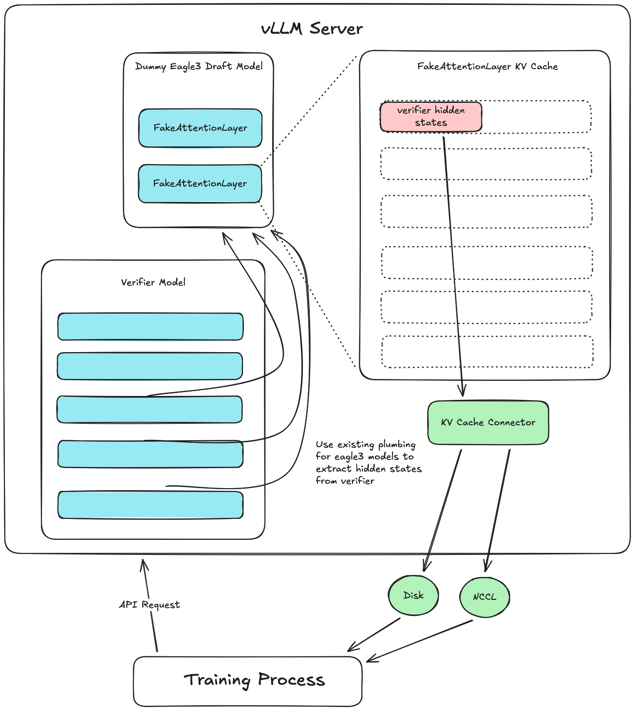

# Extracting hidden states from vLLM

Chinese: [zh/vllm/blog/architecture/extract-hidden-states.md](../../../../zh/vllm/blog/architecture/extract-hidden-states.md)

2026-03-30. **Fynn Schmitt-Ulms**. PR [#33736](https://github.com/vllm-project/vllm/pull/33736), included in `vllm>=0.18.0`. Study note, not an official translation. The page is about pulling verifier hidden states through a dummy draft model and the existing [KV Connector API](https://docs.vllm.ai/en/stable/api/vllm/distributed/kv_transfer/kv_connector/v1/), so [Speculators](https://github.com/vllm-project/speculators/) can train without patching vLLM internals.

Same plumbing the later drafts eat: [P-EAGLE](../performance/p-eagle.md), [parallel drafting](../performance/parallel-drafting.md) (P-EAGLE / DFlash / DSpark). Speculators wires this path in [v0.5.0](../performance/speculators-v050.md) (library PR [#353](https://github.com/vllm-project/speculators/pull/353)). The export door is the same `KVConnector` family as [KV offload](../serving/kv-offload.md) / [Mooncake](../serving/mooncake.md). Spec-decode recap on the engine side: [spec-decode.md](../performance/spec-decode.md).

Fits: offline or online speculator training that needs verifier hidden states, without a `transformers`-only dump or a forked engine. Does not fit: stuffing hidden states into the HTTP JSON body, or expecting Decode-token hidden — the then-current connector saved **prompt** tokens only.

## Motivation

Hidden states are the model's internal intermediate representations of the token sequence. Speculative decoding uses them heavily.

### Speculative decoding recap

Typical speculative decoding pairs a **verifier** (the large LLM you serve) with a small **draft** model. The draft proposes tokens; the verifier checks them in parallel. The page's range: up to **2–5×** faster decoding depending on method, especially at **lower batch size**, where the model is memory-bound.

Giving the draft the verifier's internal hidden states improves drafting alignment. Methods that take **hidden states from multiple verifier layers** as input: [EAGLE-3](https://arxiv.org/abs/2503.01840), [P-EAGLE](https://arxiv.org/abs/2602.01469), [DFlash](https://arxiv.org/abs/2602.06036).

Training those drafts needs a large dataset of hidden states plus verifier outputs. Most libraries (including Speculators) used one of two paths:

1. **Generate with `transformers`.** Works, with two costs: (A) you lose vLLM's performance path (large models, distributed, etc.); (B) small mismatches between Transformers and vLLM hidden states become a whole class of bugs.
2. **Heavy patching of vLLM.** Manually wire core components and call internal APIs. Maintenance tax as internals move. Many features had to be **disabled**: prefix caching, auto batching, async server, etc. This is how Speculators **`<0.5.0`** generated hidden states.

Both get worse as speculative decoding gets more common. The post wants a performant, in-engine extraction path.

## Design considerations

Requirements the page lists for in-engine extraction:

**Do not return hidden states in the response body.** They are large. For `Qwen3-8B` with `hidden_size` **4096**, extracted hidden has shape `[seq_len, num_layers_to_extract, 4096]`. A sequence of **8k** tokens, **4** layers, **FP16** is **268 MB**. Serializing that into the request response is not practical.

**VRAM for concurrent requests is non-trivial.** Even a temporary buffer must be pre-allocated and managed across concurrent requests, including **chunked prefill** and **request preemption**, or you OOM.

**No hot-path tax** when the feature is off. Most deployments never want hidden states. Limit the scope of the change; reuse existing features. No new runtime or cognitive overhead on the serving path.

**Flexible sink.** Offline speculator training: generate hidden for a full dataset, cache to disk, then train. Online training: generate on the fly and transfer to each training process, ideally **without writing disk first**. The extraction system has to be extensible for those sinks.

## Design insights

Four existing pieces, then the composition (Figure 1):

1. vLLM already serves EAGLE-3 (and similar) speculative models that take verifier hidden as draft input. Plumbing from verifier → draft already exists.
2. The extensible [KV Connector API](https://docs.vllm.ai/en/stable/api/vllm/distributed/kv_transfer/kv_connector/v1/) already pulls data out of vLLM's KV cache (Prefill/Decode disaggregation and related). Existing connectors: transfer over **Nixl**, write to **disk**, store in **shared memory**, and more. The API supports **async** KV transfers and holds blocks until the transfer finishes.
3. Hidden states map onto the token sequence the same way KV does: one value per token, valid only in the prefix that precedes it.
4. vLLM already allows **separate KV cache config / sizes** for speculative draft models.

Composition:

1. Create a **dummy draft model** that receives verifier hidden states on the existing EAGLE-3 path.
2. The dummy has a dummy attention layer with its **own KV cache**. It does not run attention. It **inserts the hidden-state inputs into that KV cache**.
3. A **custom KV Connector** saves (or otherwise transfers) the dummy draft's KV cache — which now holds hidden states.

That reuses EAGLE-3 plumbing for the pipe, and KV Connector for the sink. Because hidden lives in dummy attention layers, vLLM allocates VRAM for it. Because that memory is the same **paged** KV system, prefix caching, chunked prefill, efficient batching, and the rest stay on.



**Figure 1.** Hidden-states extraction: dummy draft on the EAGLE-3 path, dummy KV cache as the buffer, KV Connector as the export.

## Usage and limitations

Python API walkthrough on the tree: [`examples/offline_inference/extract_hidden_states.py`](https://github.com/vllm-project/vllm/blob/main/examples/offline_inference/extract_hidden_states.py). The same system works on the vLLM **server**. Launch command from the page:

```bash
vllm serve Qwen/Qwen3-8B --speculative_config '{
	"method": "extract_hidden_states",
	"num_speculative_tokens": 1,
	"draft_model_config": {
		"hf_config": {
			"eagle_aux_hidden_state_layer_ids": [3, 18, 33, 36]
		}
	}
}' --kv_transfer_config '{
	"kv_connector": "ExampleHiddenStatesConnector",
	"kv_role": "kv_producer",
	"kv_connector_extra_config": {
		"shared_storage_path": "/tmp/hidden_states"
	}
}'
```

Two components, **both required**:

- `--speculative_config` selects the fake speculative method `extract_hidden_states`, which stands up the dummy draft, and lists which layers to extract (`eagle_aux_hidden_state_layer_ids`).
- `--kv_transfer_config` stands up the custom KV Connector that pulls hidden out of those dummy draft layers.

At the time of the post, only **`ExampleHiddenStatesConnector`** existed: a simple disk writer. More performant connectors were promised. Using only one of the two configs is not enough.

Once the server is up, each request returns a `kv_transfer_params` dict with `hidden_states_path`. That path is a **safetensors** file of hidden states and token ids. Save directory: `shared_storage_path` in the config above.

```
# `/tmp/hidden_states/{req_id}.safetensors`
{
	"token_ids": [prompt_seq_len],
	"hidden_states": [prompt_seq_len, num_hidden_layers, hidden_size]
}
```

Notes from the page:

- Works with `--tensor-parallel-size` and `--data-parallel-size` for **single-node multi-GPU**.
- **Only prompt tokens and their hidden states are saved.** Call the `v1/completions` endpoint with `max_tokens=1`.

## Ongoing work

- **Speculators integration.** The library trains speculative algorithms. Merged [speculators PR #353](https://github.com/vllm-project/speculators/pull/353) switched it onto this native extraction path and enabled **online** draft training. Shipped in `speculators v0.5.0`.
- **Performance of the example connector.** `ExampleHiddenStatesConnector` is not optimized: **blocking** hidden-state writes. Async writes were in progress.
- **Device-to-device connectors.** The example writes to disk for the trainer to read. Fine as a test implementation; does not scale to larger training loads. Future work: connectors that move hidden **device-to-device**, including **multi-node**.
