# Serving LLMs on AMD MI300X: Best Practices

Chinese: [zh/vllm/blog/architecture/mi300x-serving.md](../../../../zh/vllm/blog/architecture/mi300x-serving.md)  
Source: https://vllm.ai/blog/2024-10-23-vllm-serving-amd

2024-10-23. Guest post: **Embedded LLM** and **Hot Aisle Inc.** Study extract, not an official reprint. vLLM **0.6.2** (commit `cb3b2b9`). Flags, images, and numbers are of that vintage; check current docs. Later ROCm attention: [rocm-attention.md](rocm-attention.md). Hardware plugins: [hardware-plugin.md](hardware-plugin.md). CK vs Triton, hipBLASLt, TP vs PP: [Leonard Lin](https://shisa.ai/blog/posts/tuning-vllm-mi300x/).

**TL;DR.** On AMD MI300X, vLLM vs Text Generation Inference (TGI): Llama 3.1 **405B** ~**1.5×** throughput and **1.7×** TTFT; Llama 3.1 **70B** ~**1.8×** throughput and **5.1×** TTFT. Eight knobs below. Jump to [Quick Start Guide](#quick-start-guide) for the then-optimal parameters.

Local figures (copyright remains with the original site; study copies):

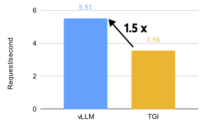
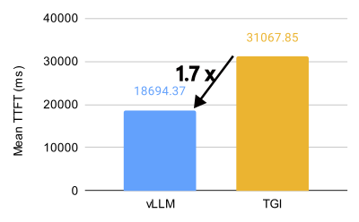

vLLM vs TGI, Llama 3.1 405B, 8× MI300X, BF16, 32 QPS.

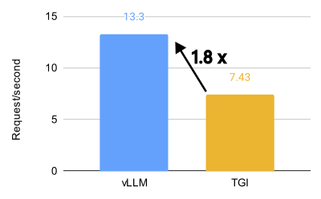
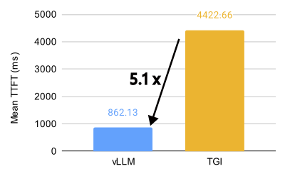

Same for Llama 3.1 70B.

## Introduction

Meta said they were running **100%** of live Llama 3.1 405B traffic on AMD MI300X — a claim that ROCm was ready for LLM inference. That news landed with **ROCm 6.2**, which made vLLM on AMD GPUs easier to use.

ROCm is AMD’s counterpart to CUDA. Less familiar to some, but maturing into a performant alternative. With vLLM, using that hardware is easier than it was.

## vLLM v.s. TGI

The headline numbers again. On MI300X, vLLM vs TGI: Llama 3.1 **405B** **1.5×** throughput / **1.7×** TTFT; **70B** **1.8×** / **5.1×**.

On 405B, TTFT and throughput beat TGI across QPS levels. Optimized config, **16 QPS**: TTFT about **3.8×** faster on average. Throughput: ShareGPT, optimized, **1000 QPS** peaks at **5.76** requests/second vs TGI **3.55**.

Default (untuned) vLLM still ahead. At 16 QPS: vLLM default **4.05** requests/second vs TGI **2.58**. That gap held across QPS levels.

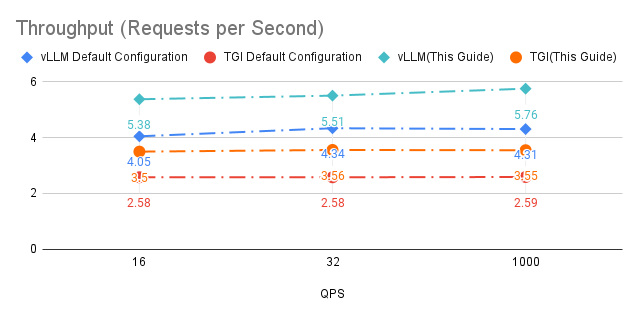
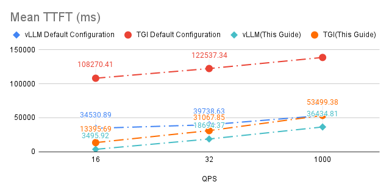

vLLM vs TGI, Llama 3.1 405B, 8× MI300X, BF16, QPS 16 / 32 / 1000; commands in the Appendix.

## How to run vLLM with Optimal Performance

### Key Settings and Configurations

What they learned on MI300X:

- **Chunked Prefill.** Rule of thumb: disable it on MI300X in most cases for better performance.
- **Multi-Step Scheduling.** GPU utilization and overall performance can rise. `--num-scheduler-steps` between **10 and 15**.
- **Prefix Caching.** Combined with chunked prefill, it can help in some traffic. If prefix-cache hit rate is low, disable **both** chunked prefill and prefix caching.
- **Graph Capture.** For long-context models, `--max-seq-len-to-capture` **16384**. Larger is not always faster; coarser buckets can hurt.
- **AMD-Specific Optimizations.** Disable NUMA balancing; tune `NCCL_MIN_NCHANNELS`.
- **KV Cache Data Type.** For best performance, use the default KV dtype (matches the model).
- **Tensor Parallelism.** Throughput: **minimum TP** that fits weights and context, then several vLLM instances. Latency: TP equal to GPUs in the node.
- **Maximum Number of Sequences.** `--max-num-seqs` to **512** or higher, given VRAM and compute. Helps especially on short inputs and outputs.
- **Use CK Flash Attention.** CK is a lot faster than the Triton implementation.

### Detailed Analysis and Experiments

#### Case 1: Chunked Prefill

Chunked prefill was still experimental: split large prefills into chunks and batch them with decode requests. Compute-bound prefill overlaps with memory-bound decode. Enable with `--enable_chunked_prefill=True` in the LLM constructor or `--enable-chunked-prefill` on the CLI.

They saw a **slight** improvement from tuning chunked-prefill values vs turning the feature off. If unsure, start **disabled** — generally better than defaults. This is **MI300X-specific**.

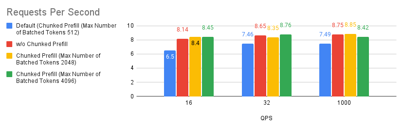
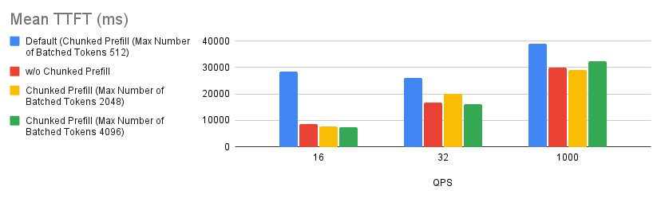
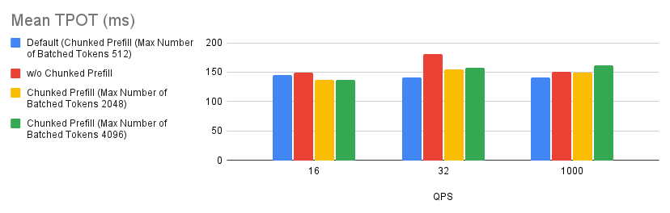

#### Case 2: Number of scheduler steps

_Multi-step scheduling_ arrived in vLLM **v0.6.0**: higher GPU utilization, better overall performance. Same-day cousin: [v0.6 throughput post](https://vllm.ai/blog/2024/09/05/perf-update.html) (this repo: [v0.6-throughput.md](../performance/v0.6-throughput.md)). Schedule and pack inputs once, then run the model for several steps without interrupting the GPU. CPU overhead spreads across those steps; GPU idle time drops.

Enable: `--num-scheduler-steps` larger than **1** (the default). They saw diminishing returns as the value rose, so they cap at **15**.

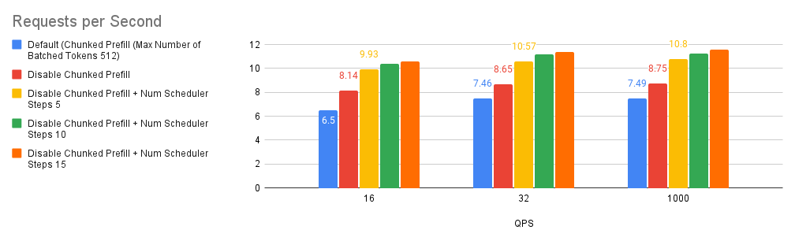
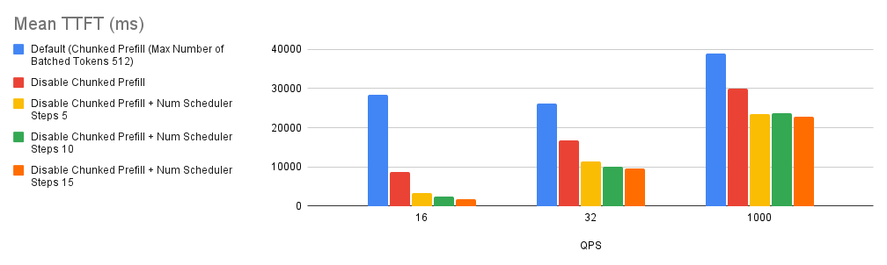
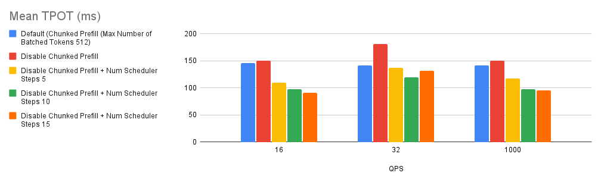

#### Case 3: Chunked Prefill and Prefix caching

Chunked prefill splits large prefills for batching. Prefix caching reuses KV already computed for a shared prefix.

By default, vLLM **auto-enables chunked prefill** if context is **more than 32k tokens**. Default max tokens per prefill chunk: **512**.

**Fresh Run:** prefix-cache memory empty. **2nd Run:** rerun the same benchmark after Fresh Run. ShareGPT on the 2nd run: about **50%** prefix-cache hit rate.

Three observations:

1. Bar 2 (red) vs baseline (blue): a large performance gain.
2. Bars 3 (yellow), 5 (orange), 6 (teal) vs baseline: chunked-prefill quality depends on the prompt-length mix.
3. Hit rates for bar 3 (yellow) and bar 4 (green) were about **0.9%** and **50%**. If requests do not have a high prefix-cache hit rate, **disabling both chunked prefill and prefix caching** is a good rule of thumb.

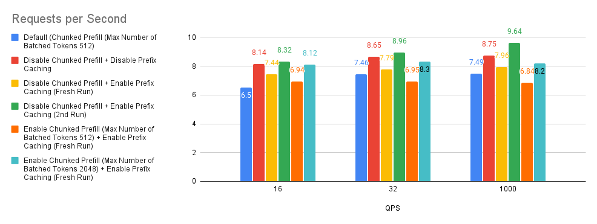
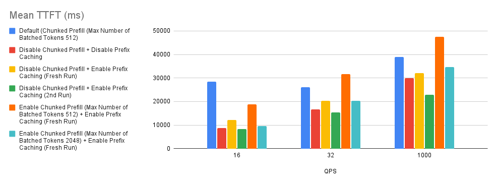
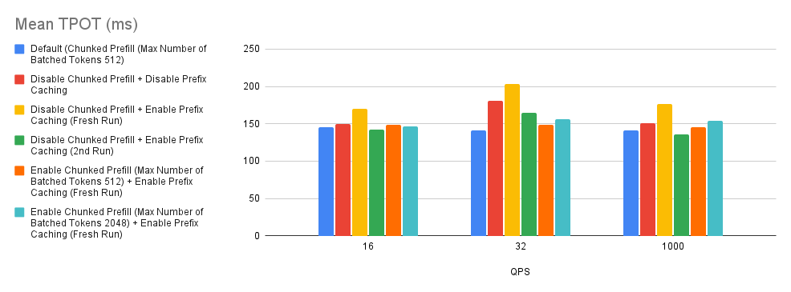

#### Case 4: Max sequence length to capture

`--max-seq-len-to-capture` is the longest sequence CUDA/HIP graphs will capture and replay. Longer than that, the system falls back to eager (op by op), which can be slower. Applies to regular and encoder-decoder models.

Benchmarks: raising `--max-seq-len-to-capture` does **not always** help and can hurt. They blame how vLLM buckets sequence lengths.

- **Bucketing.** Similar lengths share a bucket; graph capture is optimized per bucket.
- **Optimal buckets.** Fine at first, e.g. `[4, 8, 12, …, 2048, 4096]`.
- **Coarser buckets.** A larger capture length can coarsen them, e.g. `[4, 8, 12, 2048, 8192]`.
- **Performance impact.** Real inputs landing in those coarser buckets get graphs that may not match the actual length.

Capturing longer sequences sounds good; bucket granularity still matters. The right `--max-seq-len-to-capture` needs a measurement on the real mix.

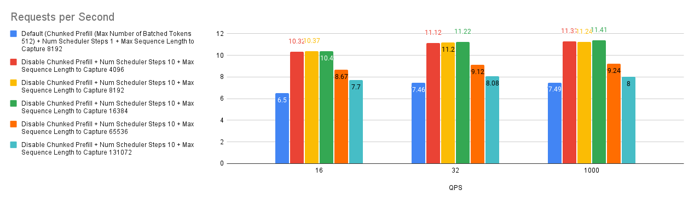
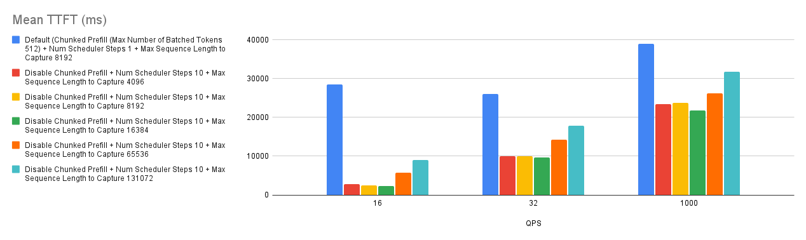
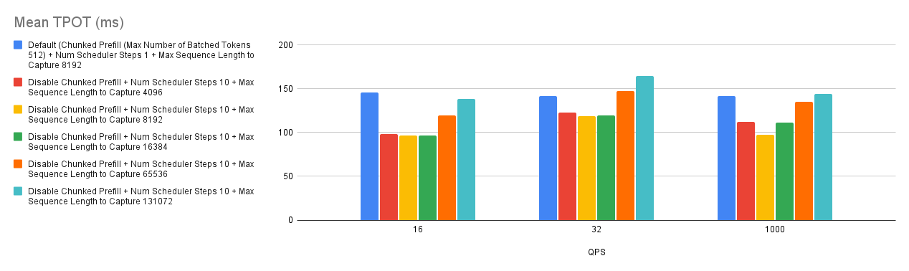

#### Case 5: AMD Recommended Environmental Variables

Two AMD-side knobs:

- **Disabling NUMA Balancing.** Automatic NUMA balancing can hurt GPU performance or hang. [AMD MAD vLLM README](https://github.com/ROCm/MAD/blob/develop/benchmark/vllm/README.md):

```bash
# disable automatic NUMA balancing
sh -c 'echo 0 > /proc/sys/kernel/numa_balancing'
# check if NUMA balancing is disabled (returns 0 if disabled)
cat /proc/sys/kernel/numa_balancing
0
```

- **Tuning NCCL Communication.** NCCL is the inter-GPU library. For MI300X, the then [AMD vLLM fork performance note](https://github.com/ROCm/vllm/blob/main/ROCm_performance.md) suggested `NCCL_MIN_NCHANNELS=112`.

Together, a **slight** improvement. That matches [NanoFlow](https://arxiv.org/abs/2408.12757): network tuning helps, but LLM inference is still mostly compute-bound and memory-bound.

Small gains; still worth setting if you want the last millimetre.

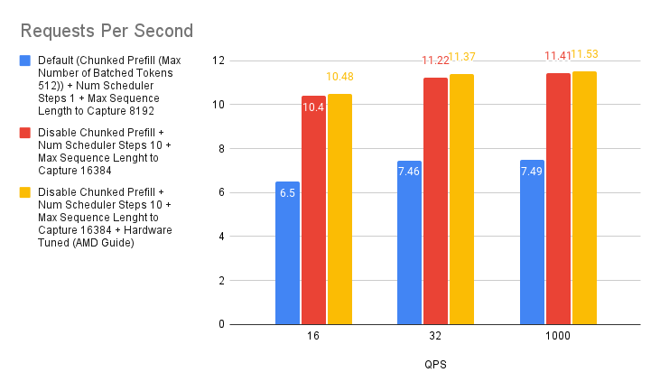
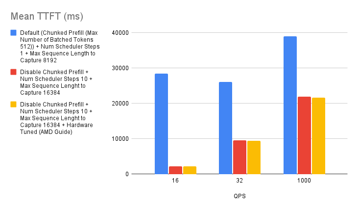
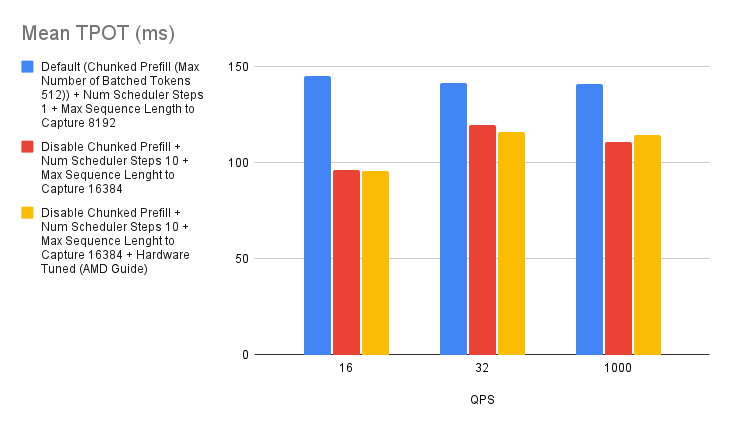

#### Case 6: KVCache Type Auto/FP8

Default: KV cache dtype matches the model. MI300X also has native FP8 KV — thinner cache, longer deployable context.

Auto KV vs FP8 KV vs default baseline. Auto (red) beats FP8 (yellow) on requests per second. Likely a quant tax on `Llama-3.1-70B-Instruct (bfloat16)`. The tax looks small; a large KV-memory win can still be the right trade.

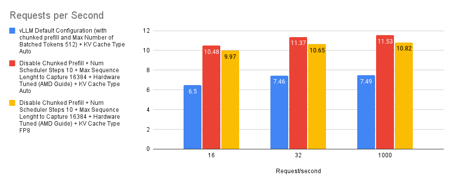
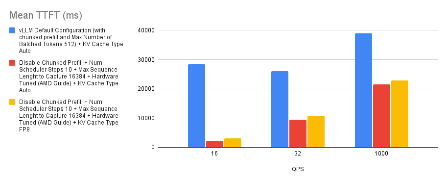
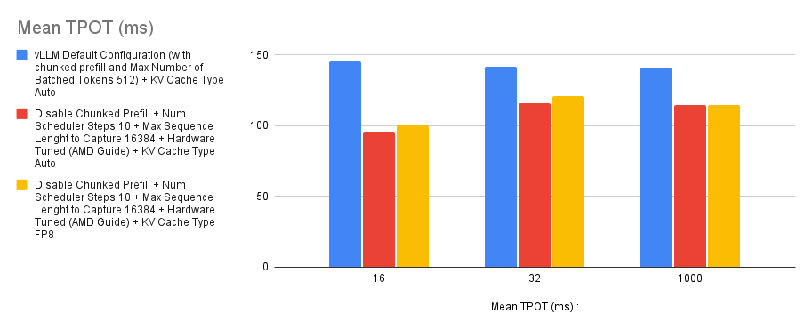

#### Case 7: Performance Difference between TP 4 and TP 8

Tensor parallelism splits tensors across devices so layers or ops can run in parallel. Per-GPU footprint shrinks; the model can span cards.

More TP is more compute, but speedup is **not always linear**: more devices, more communication, less work per GPU. MI300X is fat; too little work per card under-utilizes and scaling looks worse.

Throughput: **several vLLM instances** rather than maxing TP — closer to linear. Latency first: raising TP may be better.

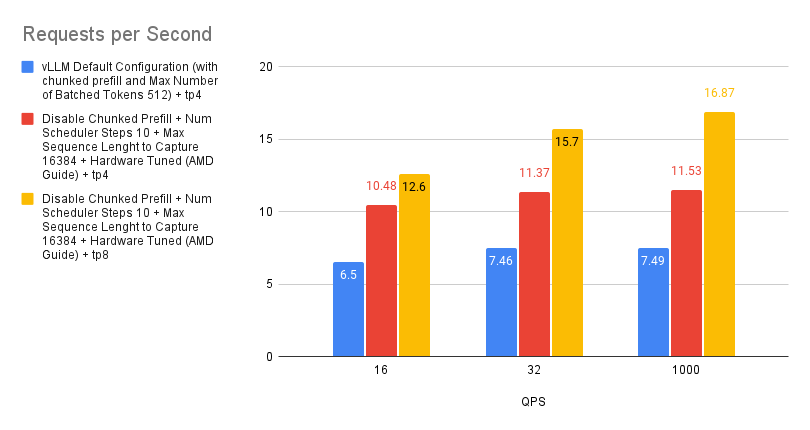
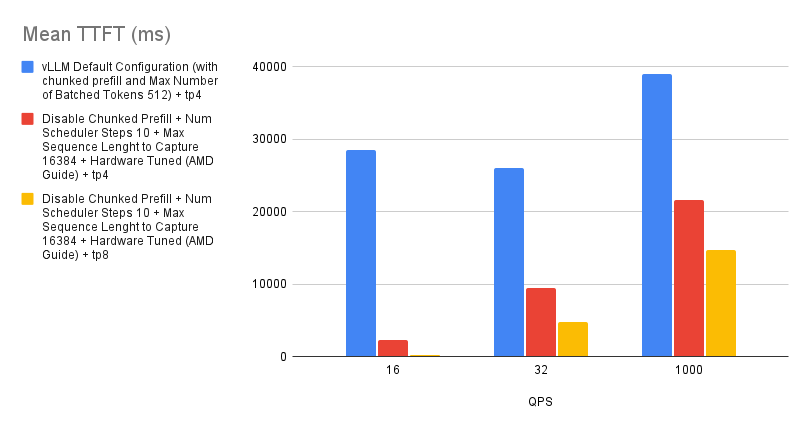
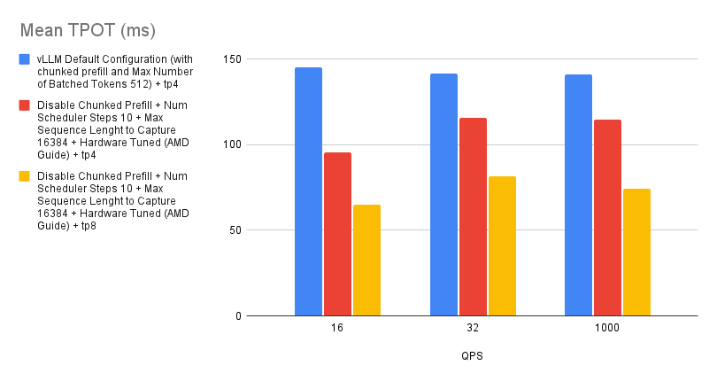

#### Case 8: Effect of Maximum Number of (Parallel) Sequences

`--max-num-seqs`: max sequences per iteration — concurrent requests in a batch, memory, and performance. ShareGPT samples are short; `Llama-3.1-70B-Instruct` on MI300X can process many requests per iteration. Even at **1024**, `--max-num-seqs` was **still** the limiter.

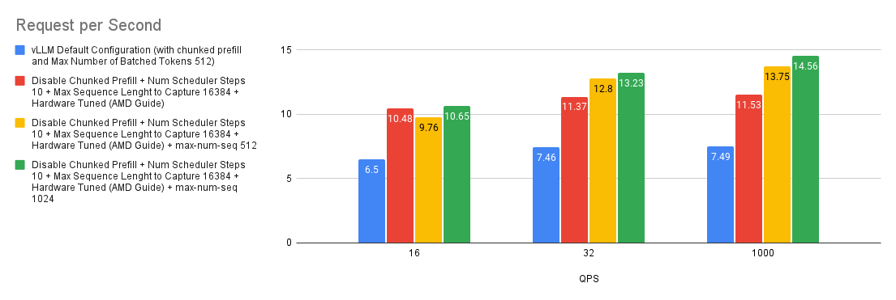
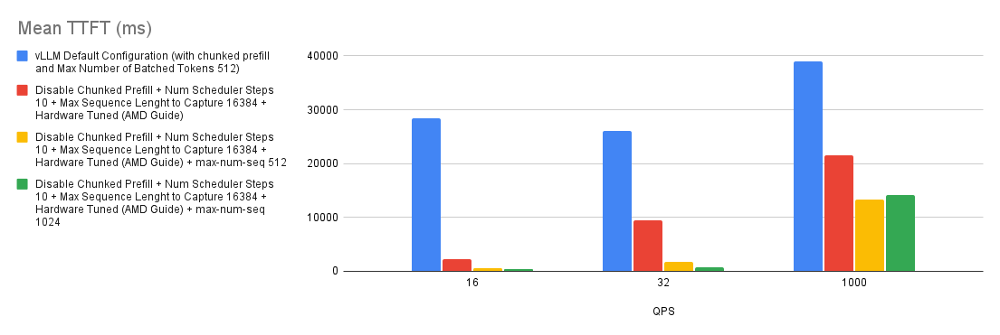
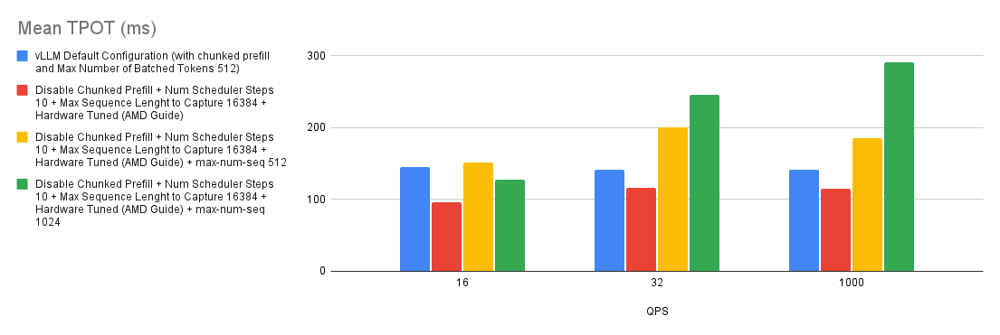

## Quick Start Guide

If you do not know the deployment mix or the request distribution:

- Use CK Flash Attention (they did not plot it here; they say CK is a lot faster than Triton)
  - `export VLLM_USE_TRITON_FLASH_ATTN=0`
- Disable chunked prefill: `--enable-chunked-prefill=False`
- Disable prefix caching
- If the model is long-context: `--max-seq-len-to-capture` **16384**
- `--num-scheduler-steps` **10** or **15**
- AMD env:
  - `sh -c 'echo 0 > /proc/sys/kernel/numa_balancing'`
  - `export NCCL_MIN_NCHANNELS=112`
- `--max-num-seqs` **512+**, given GPU memory and compute

```bash
VLLM_USE_TRITON_FLASH_ATTN=0 vllm serve meta-llama/Llama-3.1-70B-Instruct --host 0.0.0.0 --port 8000 -tp 4 --max-num-seqs 1024 --max-seq-len-to-capture 16384 --served-model-name meta-llama/Llama-3.1-70B-Instruct --enable-chunked-prefill=False --num-scheduler-steps 15 --max-num-seqs 1024
```

(The original repeats `--max-num-seqs 1024`; copied as printed.)

Quick setup: they pushed a vLLM **0.6.2** image (commit `cb3b2b9ba4a95c413a879e30e2b8674187519a93`) to GitHub Container Registry.

```bash
# v0.6.2 post
docker pull ghcr.io/embeddedllm/vllm-rocm:cb3b2b9
# P.S. We also have compiled the image for v0.6.3.post1 at commit 717a5f8
docker pull ghcr.io/embeddedllm/vllm-rocm:v0.6.3.post1-717a5f8
```

Launch:

```bash
sudo docker run -it \
   --network=host \
   --group-add=video \
   --ipc=host \
   --cap-add=SYS_PTRACE \
   --security-opt seccomp=unconfined \
   --device /dev/kfd \
   --device /dev/dri \
   -v /path/to/hfmodels:/app/model \ # if you have pre-downloaded the model weight, else ignore
   ghcr.io/embeddedllm/vllm-rocm:cb3b2b9 \
   bash
```

Then the same `vllm serve` line inside the container.

## Conclusion

Tuning chunked prefill, multi-step scheduling, and CUDA graph capture on AMD MI300X raised throughput and response time vs defaults and vs other serving stacks. Their conclusion then: vLLM was a good way to deploy LLMs on AMD hardware.

Scope: **short chatbot I/O**. Summarization and long-form generation need more work. Triton vs CK attention kernels too.

They also point at Leonard Lin’s [MI300X tuning post](https://shisa.ai/blog/posts/tuning-vllm-mi300x/): hipBLAS vs hipBLASLt, CK Flash Attention vs Triton Flash Attention, Tensor Parallelism vs Pipeline Parallelism.

## Acknowledgements

Drafted by [Embedded LLM](https://embeddedllm.com/). MI300X time: [Hot Aisle Inc.](https://hotaisle.xyz/).

## Appendix

### Server Specification

Hot Aisle box:

- CPU: 2 × Intel Xeon Platinum 8470
- GPU: 8 × AMD Instinct MI300X

Models and software:

- Model: `meta-llama/Llama-3.1-405B-Instruct` and `meta-llama/Llama-3.1-70B-Instruct`
- vLLM (v0.6.2): commit `cb3b2b9ba4a95c413a879e30e2b8674187519a93`
- Dataset: ShareGPT
- Benchmark script: `benchmarks/benchmark_serving.py`

ROCm image from `Dockerfile.rocm` (`docker pull ghcr.io/embeddedllm/vllm-rocm:cb3b2b9`).

**All benchmarks ran inside that container, on 4 MI300X GPUs, CK Flash Attention, `VLLM_USE_TRITON_FLASH_ATTN=0`.**

### Detail Benchmark Configuration

| Configuration | Command |
| --- | --- |
| vLLM Default Configuration | `VLLM_RPC_TIMEOUT=30000 VLLM_USE_TRITON_FLASH_ATTN=0 vllm serve Llama-3.1-405B-Instruct -tp 8 --max-num-seqs 1024 --max-num-batched-tokens 1024` |
| TGI Default Configuration | `ROCM_USE_FLASH_ATTN_V2_TRITON=false TRUST_REMOTE_CODE=true text-generation-launcher --num-shard 8 --sharded true --max-concurrent-requests 1024 --model-id Llama-3.1-405B-Instruct` |
| vLLM (This Guide) | `VLLM_RPC_TIMEOUT=30000 VLLM_USE_TRITON_FLASH_ATTN=0 vllm serve Llama-3.1-405B-Instruct -tp 8 --max-seq-len-to-capture 16384 --enable-chunked-prefill=False --num-scheduler-steps 15 --max-num-seqs 1024` |
| TGI (This Guide) | `ROCM_USE_FLASH_ATTN_V2_TRITON=false TRUST_REMOTE_CODE=true text-generation-launcher --num-shard 8 --sharded true --max-concurrent-requests 1024 --max-total-tokens 131072 --max-input-tokens 131000 --model-id Llama-3.1-405B-Instruct` |
