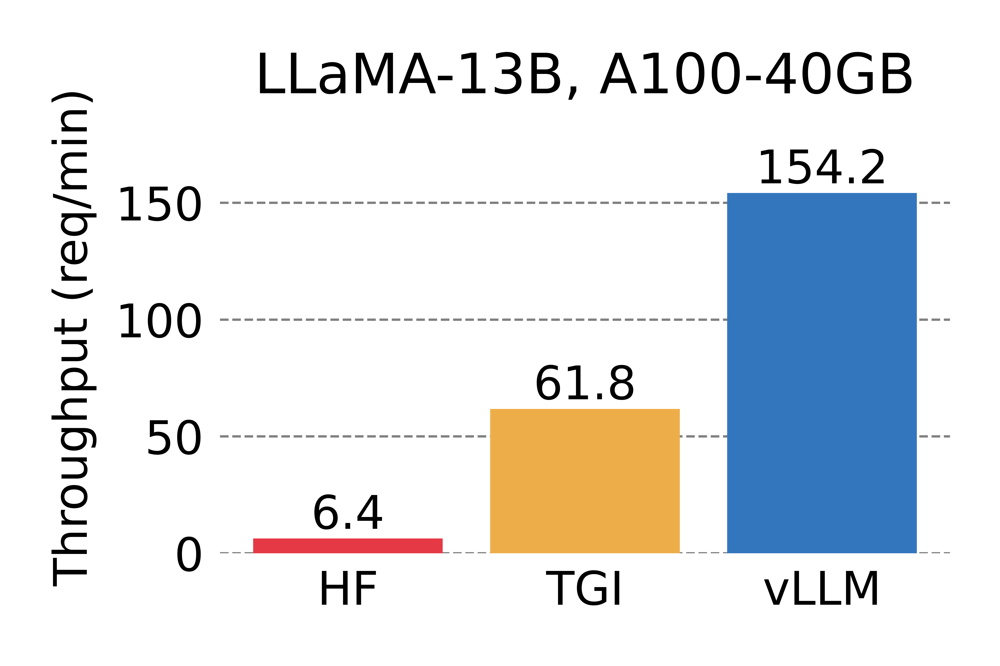
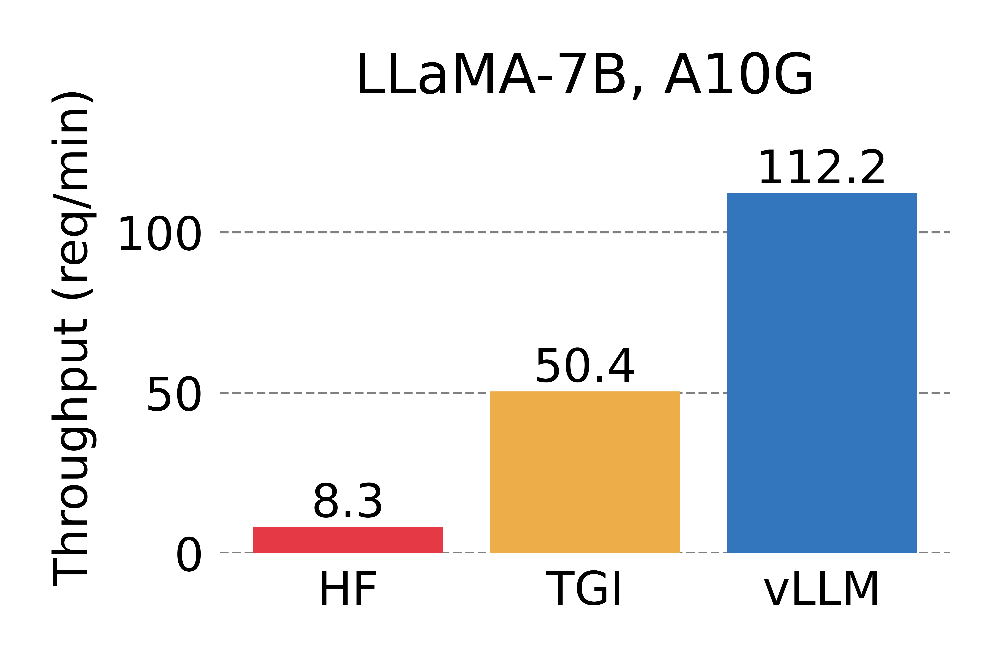
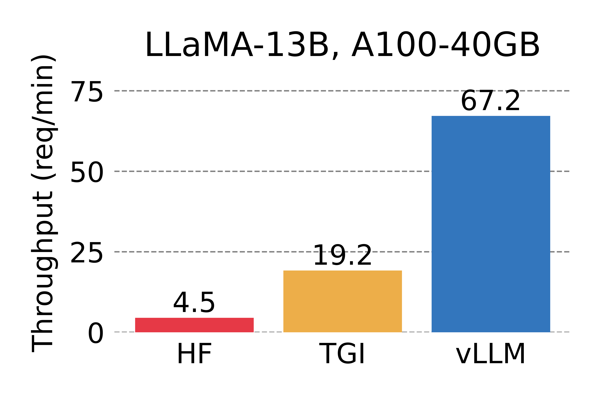
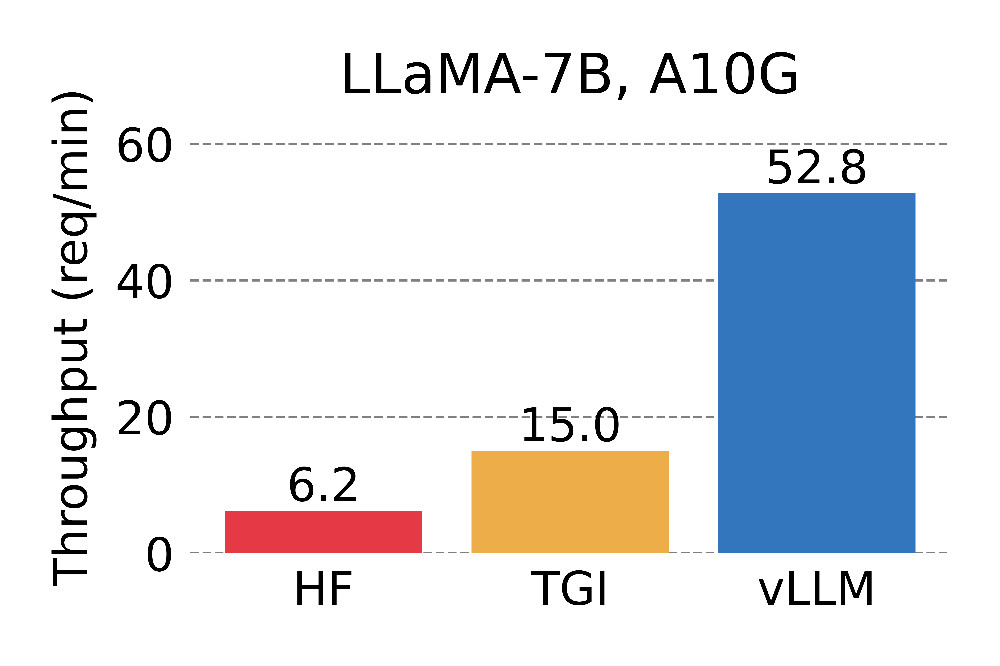
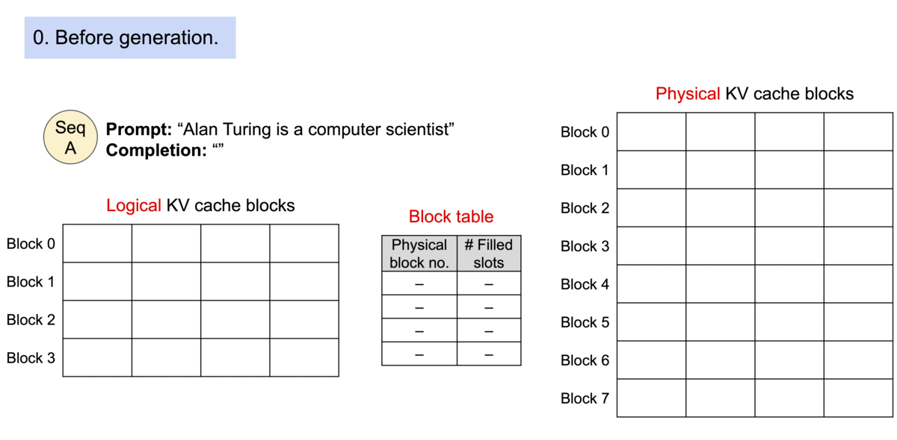
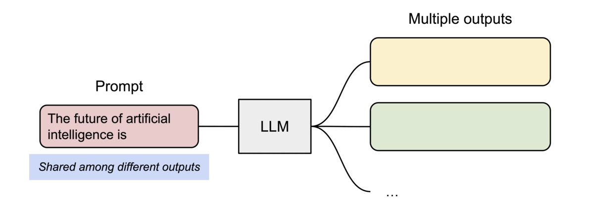
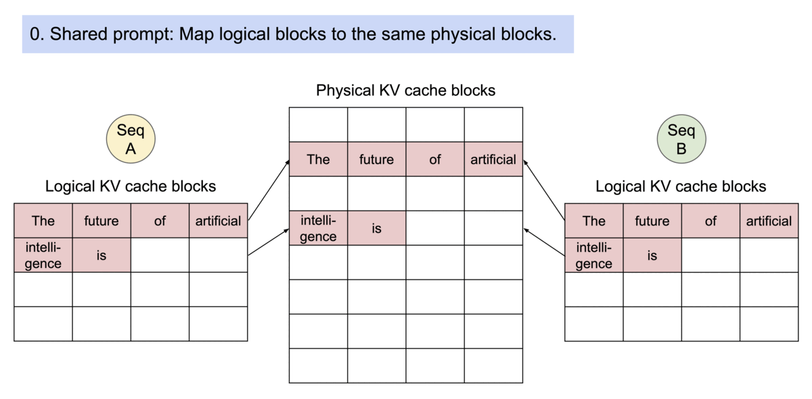
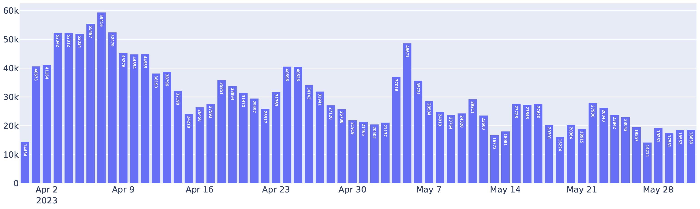

# vLLM: Easy, Fast, and Cheap LLM Serving with PagedAttention

Chinese: [zh/vllm/blog/architecture/paged-attention.md](../../../../zh/vllm/blog/architecture/paged-attention.md)  
Source: https://vllm.ai/blog/2023-06-20-vllm

2023-06-20. Authors: **Woosuk Kwon\***, **Zhuohan Li\***, Siyuan Zhuang, Ying Sheng, Lianmin Zheng, Cody Yu, Joey Gonzalez, Hao Zhang, and Ion Stoica (\* equal contribution). Study extract, not an official reprint. Paper later: [arXiv:2309.06180](https://arxiv.org/pdf/2309.06180.pdf). Links on the original page: [GitHub](https://github.com/vllm-project/vllm), then-current [Documentation](https://vllm.readthedocs.io/en/latest/) on Read the Docs. Do not treat the marketing logo as a figure. Later [Anatomy](anatomy.md), V1, and prefix-cache posts still sit on this page table.

LLMs promise to change how we use AI across industries. Serving them is hard, and can be surprisingly slow even on expensive hardware. This post introduces **vLLM**, an open-source library for fast LLM inference and serving. The core is not a model-architecture change: it is **PagedAttention**, an attention algorithm that manages attention keys and values. Claim: up to **24×** throughput vs HuggingFace Transformers; up to **3.5×** vs then-SOTA HuggingFace Text Generation Inference (TGI).

Developed at UC Berkeley. Already serving [Chatbot Arena and Vicuna Demo](https://chat.lmsys.org) for two months. Core technology that made LLM serving affordable for a small research team like LMSYS with limited compute. They pointed people at GitHub to try it with a single command.

Local figures (copyright remains with the original site; study copies). The Chinese note also has a study diagram for the OS metaphor.

## Beyond State-of-the-art Performance

Compared with [HuggingFace Transformers (HF)](https://huggingface.co/docs/transformers/main_classes/text_generation) (then the most popular LLM library) and [HuggingFace Text Generation Inference (TGI)](https://github.com/huggingface/text-generation-inference) (then the previous SOTA). Two settings: **LLaMA-7B on NVIDIA A10G**, **LLaMA-13B on NVIDIA A100 (40GB)**. Input/output lengths sampled from ShareGPT. In their experiments: up to **24×** vs HF, up to **3.5×** vs TGI.




Serving throughput when each request asks for **one** output completion. vLLM: **14×–24×** vs HF, **2.2×–2.5×** vs TGI.




Serving throughput when each request asks for **three parallel** output completions. vLLM: **8.5×–15×** vs HF, **3.3×–3.5×** vs TGI. Parallel sampling is more KV-hungry; PagedAttention shares the prompt pages.

## The Secret Sauce: PagedAttention

Bottleneck is **memory**, not FLOPs. In autoregressive decoding, every input token produces attention key and value tensors, kept in GPU memory to generate the next tokens — the KV cache:

- **Large:** up to **1.7GB for a single sequence** in LLaMA-13B.
- **Dynamic:** size tracks sequence length, which is highly variable and unpredictable.

Managing that cache is hard. Existing systems wasted **60%–80%** of memory to fragmentation and over-reservation.

**PagedAttention** is attention inspired by virtual memory and paging. Unlike traditional attention, continuous keys and values can live in **non-contiguous** physical space. Partition each sequence’s KV into **blocks**, each block holding K/V for a fixed number of tokens. During attention, the kernel identifies and fetches those blocks.


PagedAttention: KV cache partitioned into blocks. Blocks need not be contiguous in memory.

Because blocks need not be contiguous, management can look like OS virtual memory: blocks as pages, tokens as bytes, sequences as processes. Contiguous **logical blocks** of a sequence map to non-contiguous **physical blocks** via a **block table**. Physical blocks are allocated on demand as new tokens appear.



Example generation process for a request with PagedAttention.

Waste is almost only the **last, partially filled block** — **under 4%** in practice. More sequences fit in the batch → higher GPU utilization → the throughput numbers above.

Second gift: **sharing**. In parallel sampling, several outputs share one prompt. Computation and memory for the prompt can be shared.



Example of parallel sampling.

The block table lets different sequences map logical blocks onto the same physical block — like processes sharing physical pages. Reference counts and **Copy-on-Write** keep sharing safe.



Example generation process for a request that samples multiple outputs.

Parallel sampling and beam search cut memory overhead by up to **55%**, up to **2.2×** throughput — those algorithms become serviceable, not lab-only.

PagedAttention is the core of vLLM: many models, high performance, easy interface. Technical follow-up: GitHub then, paper later.

## The Silent Hero Behind LMSYS Vicuna and Chatbot Arena

April 2023: [LMSYS](https://lmsys.org) released Vicuna publicly. Vicuna has been served in [Chatbot Arena](https://arena.lmsys.org/) for millions of users. FastChat first used an HF Transformers [serving backend](https://github.com/lm-sys/FastChat/blob/main/fastchat/serve/model_worker.py). Peak traffic jumped several times; HF became the bottleneck. LMSYS + vLLM shipped FastChat-vLLM (`vllm_worker.py` as the [new backend](https://github.com/lm-sys/FastChat/blob/main/fastchat/serve/vllm_worker.py)) to absorb up to **~5×** more peak traffic. Early LMSYS [internal micro-benchmark](https://github.com/lm-sys/FastChat/blob/main/fastchat/serve/test_throughput.py): up to **~30×** vs the original HF backend.

From mid-April, Vicuna, Koala, and LLaMA were served with FastChat as the multi-model chat frontend and vLLM as the inference backend, on a limited number of university-sponsored GPUs — high throughput, low latency. LMSYS was expanding to Databricks Dolly, LAION OpenAssistant, and Stability AI StableLM; [more model support](https://vllm.readthedocs.io/en/latest/models/supported_models.html) was forthcoming.



Requests served by FastChat-vLLM in Chatbot Arena, April–May. **More than half** of Arena requests used vLLM.

GPU count for that traffic **cut ~50%**. Average **~30K requests/day**, peak **~60K**. Robustness, not just a lab number.

## Get started with vLLM

Then-current install ([installation guide](https://docs.vllm.ai/en/latest/getting_started/installation.html)):

```bash
pip install vllm
```

Offline and online. Offline: import `LLM` in Python:

```python
from vllm import LLM

prompts = ["Hello, my name is", "The capital of France is"]  # Sample prompts.
llm = LLM(model="lmsys/vicuna-7b-v1.3")  # Create an LLM.
outputs = llm.generate(prompts)  # Generate texts from the prompts.
```

Online OpenAI-compatible server (vintage entrypoint; today: `vllm serve`):

```bash
python -m vllm.entrypoints.openai.api_server --model lmsys/vicuna-7b-v1.3
```

Query in the same format as the OpenAI API:

```bash
curl http://localhost:8000/v1/completions \
    -H "Content-Type: application/json" \
    -d '{
        "model": "lmsys/vicuna-7b-v1.3",
        "prompt": "San Francisco is a",
        "max_tokens": 7,
        "temperature": 0
    }'
```

More ways then: [quickstart](https://vllm.readthedocs.io/en/latest/getting_started/quickstart.html).

## Credits

Written by Woosuk Kwon and Zhuohan Li (UC Berkeley). Hao Zhang: FastChat integration and that section of the post. Team thanked: Siyuan Zhuang, Ying Sheng, Lianmin Zheng (UC Berkeley), Cody Yu (Independent Researcher), Joey Gonzalez (UC Berkeley), Hao Zhang (UC Berkeley & UCSD), Ion Stoica (UC Berkeley).
