# Beyond Porting: Seven ROCm Attention Backends

Chinese: [zh/vllm/blog/architecture/rocm-attention.md](../../../../zh/vllm/blog/architecture/rocm-attention.md)

2026-02-27. **AMD and Embedded LLM**. Study note; benches on the page, not your SLA. Snapshot: `vllm` **0.14.0rc2** / Docker `rocm/vllm-dev:nightly_main_20260115`, **ROCm 7.0.0**. Triton default (one unified kernel): [triton-attn.md](triton-attn.md). This post is **AITER FA’s three paths** plus the other six ROCm backends. Hardware plugin door: [hardware-plugin.md](hardware-plugin.md). Mixed Prefill/Decode at cluster scale: [large-scale.md](../serving/large-scale.md).

**TL;DR from the page:** vLLM ships **7** attention backends on AMD ROCm. `ROCM_AITER_FA` (MHA) and the AITER MLA backends claim **1.2–4.4×** higher system TPS vs the other ROCm options on the page, via AITER primitives plus vLLM kernel orchestration. Preshuffled KV is **15–20%** decode TPS vs a standard layout. Auto-select with `VLLM_ROCM_USE_AITER=1`. Local figures below are study copies (copyright remains with the original site).

## Introduction

For a long time, AMD support meant **porting** — make the code run. The page says that era is over. CDNA 3 hardware (Instinct **MI300X**, **MI325X**, **MI355X**) plus structures like DeepSeek **MLA** need **architectural co-design**: software orchestration and hardware primitives together.

The post walks each of the seven backends: why it exists, trade-offs, when to use it. Transparent benches compare all of them. Headline claim: `ROCM_AITER_FA` for MHA and the AITER MLA backends deliver **1.2–4.4×** higher TPS through AMD’s AITER primitives and vLLM’s kernel orchestration.

## Mixed workloads in every batch

Production serving does not get a clean Prefill batch or a clean Decode batch. Each inference step mixes tokens from different request types. Industry answers range from one unified kernel with internal scheduling to multi-path routing with specialized kernels. AMD’s `ROCM_AITER_FA` takes the **explicit routing** path: workload-aware optimization is a first-class design, not an internal kernel detail.

- **Prefill.** New prompts. Thousands of input tokens attend at once. Heavy GEMM → **compute-bound**.
- **Extend.** More prompt-side tokens for a request whose KV is already partly built (chunked Prefill, prefix-cache reuse, a prior turn). New tokens attend to **cached context and fresh input** → mixed/hybrid. Online schedulers break long prompt work into pieces and interleave Decode from other in-flight requests.
- **Decode.** One output token at a time. Each step loads the whole KV from memory → **memory-bound**.

These types arrive randomly and are batched together.

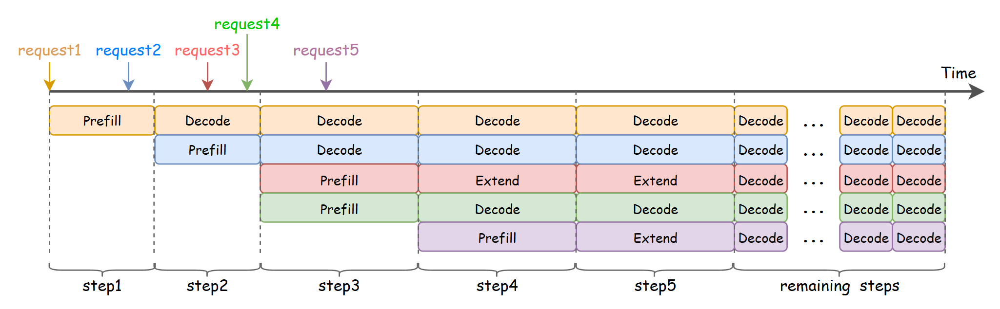

**Figure 1.** Online serving with 5 concurrent requests. Step 4 batches Prefill, Extend, and Decode tokens together.

Prefill wants large tiles and max ALU use. Decode wants coalesced memory access and minimal cache fetches. **A kernel tuned for one leaves performance on the table for the other.** That mixed-batch problem is what `ROCM_AITER_FA`’s 3-path routing is for: route each type to a specialized kernel instead of forcing one kernel to serve all three.

## Other MHA backends

### Unified attention

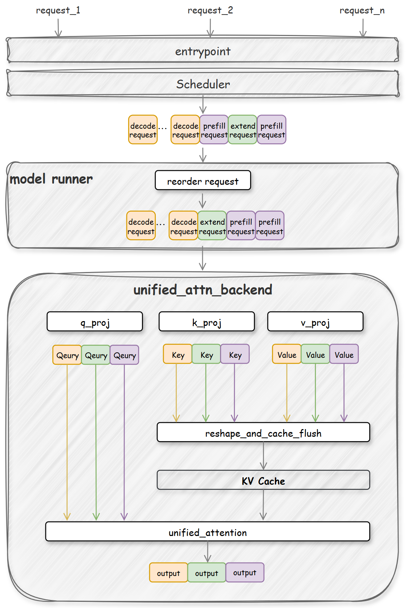

**Figure 2.** Unified attention: all tokens (Prefill / Extend / Decode) through one kernel.

| Backend | Kernel source | Use case |
| --- | --- | --- |
| [TRITON_ATTN](https://github.com/vllm-project/vllm/blob/v0.14.0rc2/vllm/v1/attention/backends/triton_attn.py) | [vLLM Triton kernel](https://github.com/vllm-project/vllm/blob/v0.14.0rc2/vllm/v1/attention/ops/triton_unified_attention.py) | Default fallback |
| [ROCM_AITER_UNIFIED_ATTN](https://github.com/vllm-project/vllm/blob/v0.14.0rc2/vllm/v1/attention/backends/rocm_aiter_unified_attn.py) | [AITER Triton kernel](https://github.com/ROCm/aiter/blob/v0.1.10.post3/aiter/ops/triton/_triton_kernels/attention/unified_attention.py) | Single-kernel AITER path |

```python
def forward():
    # Stage 1: Save Key/Value into KV-Cache
    reshape_and_cache_flush(new_key, new_value, ...)
    # Stage 2: Single kernel for all attention
    unified_attention_kernel(new_query, KV-Cache, ...)
```

`TRITON_ATTN` is the portable default in [triton-attn.md](triton-attn.md): one Triton source, always-on fallback. This post’s `ROCM_AITER_FA` is the other bet — **three explicit paths**, not one mega-kernel.

### `ROCM_ATTN`: legacy 2-path

[ROCM_ATTN](https://github.com/vllm-project/vllm/blob/v0.14.0rc2/vllm/v1/attention/backends/rocm_attn.py) routes with two kernels:

- **Prefill:** Triton kernel
- **Decode:** HIP paged attention (when supported)

Two traits the page names:

1. **Legacy 2-path.** Separate Prefill (Triton) and Decode (HIP paged attention). HIP paged attention only supports certain KV head sizes. Unsupported configs (the page names **Qwen3-235B**) fall back to Triton Decode kernels and become **significantly slower**.
2. **Radeon GPU support.** Together with `TRITON_ATTN`, this backend supports **Radeon** — useful on consumer hardware where AITER primitives are not available.

## `ROCM_AITER_FA`: kernel orchestration for AMD

Not just a kernel wrapper. An orchestration layer that routes requests to specialized kernels: vLLM’s high-level management plus AMD’s AITER primitives.

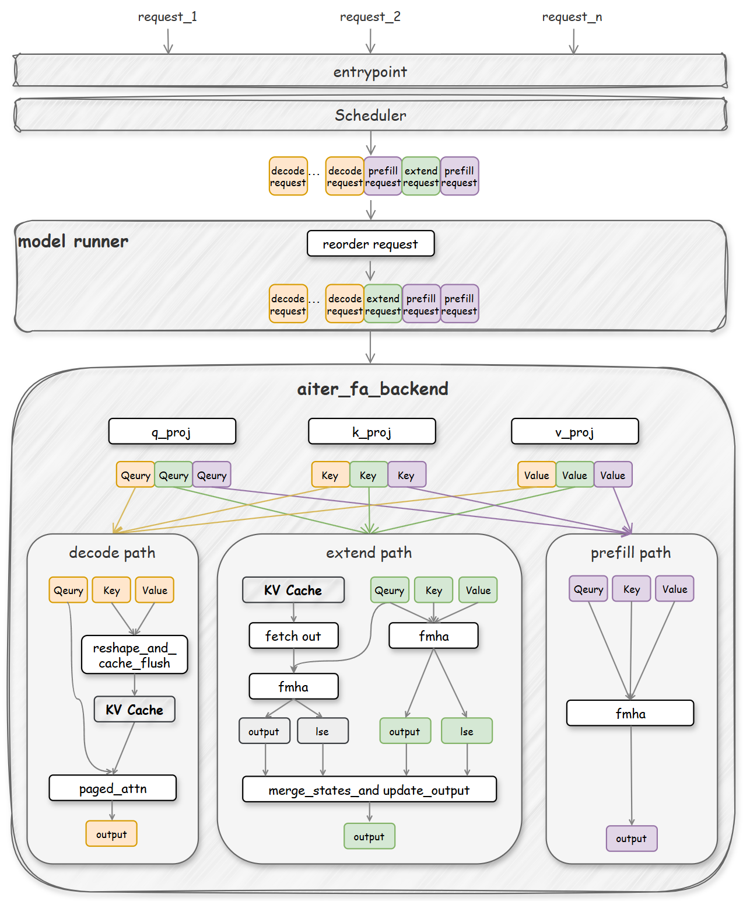

**Figure 3.** `ROCM_AITER_FA` routes tokens onto three specialized paths.

### Four innovations

**1. Three-path routing.** Requests are categorized into Decode, Prefill, and Extend, each with its own kernel:

- **Prefill path.** New sequences use `flash_attn_varlen_func` — CDNA matrix cores for compute-heavy work.
- **Extend path.** Continuing sequences use chunked attention with LSE merging — **100K+** contexts.
- **Decode path.** Single-token generation uses a highly optimized AITER kernel for memory bandwidth.

The original page also has a short animation: R1 (Decode token) → Decode path, R2 (Prefill tokens) → Prefill path. Not copied here.

**2. Batch reordering (model runner).** `ROCM_AITER_FA` is one of the few backends that reorder requests before processing. The model runner reorders to `[decode:extend:prefill]` for contiguous memory. Each backend opts in with `reorder_batch_threshold`. `ROCM_AITER_FA` sets this to **1**, so every mixed batch is reordered before the three-path router consumes it.

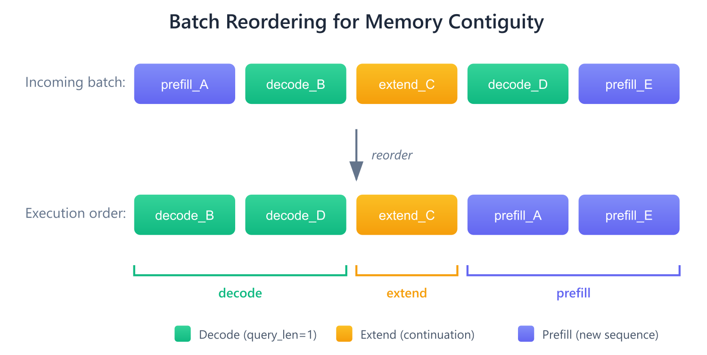

**Figure 4.** Batch reordering so each kernel path sees contiguous tokens and skips redundant KV fetches.

The page’s second animation (not copied): reorder to `[decode > extend > prefill]`, then route R3 onto the Extend path.

**3. Chunked context.** Long sequences are processed in chunks sized by a fixed per-iteration token budget (**~32K tokens** total), split across extend requests. LSE-based merging for numerical stability.

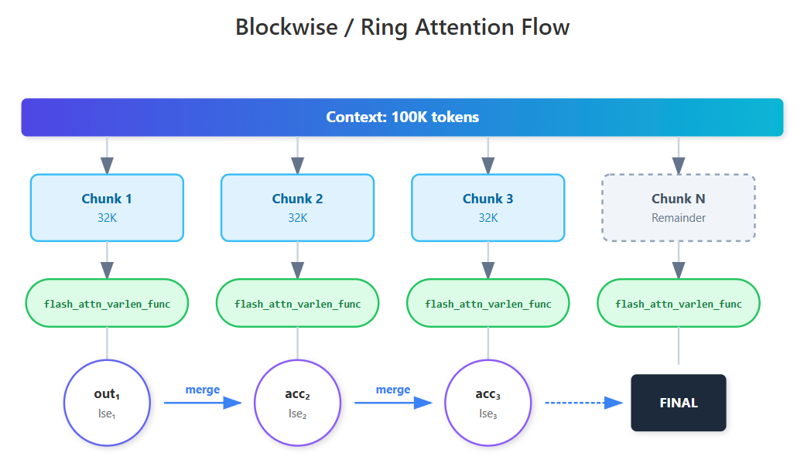

**Figure 5.** 100K+ token contexts processed in 32K chunks with LSE merge.

**4. Hardware-optimized KV layout.** Preshuffled layout from AMD’s AITER kernel team:

```python
k_cache: [num_blocks, num_heads, head_dim // x, block_size, x]
v_cache: [num_blocks, num_heads, block_size // x, head_dim, x]
```

Aligned with CDNA memory access. Decode can call AITER `pa_fwd_asm` with **zero layout conversion** → **15–20%** decode TPS vs a standard KV layout.

### Why explicit 3-path routing?

Route at the software layer rather than asking one kernel to handle everything:

- **Debuggability.** Each path can be profiled, tuned, and optimized independently.
- **Portability.** Same routing from **MI300X → MI325X → MI355X** without hardware-specific changes.
- **Extensibility.** New workload types or kernel variants without redesigning the core.
- **Predictability.** Deterministic paths; performance analysis is straightforward.

The Extend path is the production one: prefix caching and multi-turn conversations are standard. A dedicated path with chunked context attention makes those first-class, not a fallback.

### Three paths in detail

**Prefill.** Q/K/V stay in standard `[num_tokens, num_heads, head_dim]` to match the optimized AITER MHA kernel and avoid extra copies.

**Extend.** Hardest path. New tokens must attend to context stored in the **shuffled** KV layout. That layout is incompatible with AITER’s MHA kernel for long-context work, so an extra gather (`cp_mha_gather_cache`) fetches and converts context K/V back to standard layout. Long contexts are chunked:

```python
def extend_forward():
    # Stage 1: Attention for new tokens
    flash_attn_varlen_func()  # calling AITER MHA

    # Stage 2: Context Chunk Loop Processing
    for chunk in context_chunks:
        cp_mha_gather_cache()      # Triton gather kernel
        flash_attn_varlen_func()   # calling AITER MHA
        merge_attn_states()        # LSE-based merge

    # Stage 3: Get the final result
    merge_attn_states()
```

Each chunk produces an output and an LSE (log-sum-exp). LSE is the softmax denominator, so merge is numerically stable — chunks with higher attention scores dominate.

**Decode.** Uses the shuffled layout directly. A custom `reshape_and_cache_flush` keeps the cache shuffled so the backend can call `pa_fwd_asm` with zero conversion.

### Request-flow iterations (from the page’s animation)

The original has a seven-iteration interactive animation (not copied). Same story, written out:

| Iteration | Key events |
| --- | --- |
| **1** | R1 enters → tokenization → scheduler queue → QKV projection → **Prefill path** → sample 1 token. R2 arrives mid-iteration, waits in queue. |
| **2** | R1 + R2 batched. R1 → **Decode path**, R2 → **Prefill path**. R3, R4 arrive and enter the queue. |
| **3** | 4 requests batched. Token budget = **100**, so R3 schedules 100 tokens (180 remaining). R3 output = 0 (not all prompt tokens computed yet). |
| **4** | R3 enters **Extend path** for remaining prompt tokens. Batch reordering: tensors to `[decode > extend > prefill]`. |
| **5** | Reordering continues: `[decode > extend]`. R5 finishes Extend, transitions to Decode. |
| **6–7** | All requests on the **Decode path**, generating until stop. |

`ROCM_AITER_FA` routes Prefill → Extend → Decode from request state, so mixed batches stay efficient.

## AITER MLA backends: DeepSeek

DeepSeek / Kimi **MLA** compresses KV to **576** dimensions (vs ~**8K** for standard MHA) — about **14×** less memory. That changes attention’s performance shape; MHA recipes do not transfer.

### Hybrid approach

Two AITER-based MLA backends, different Prefill implementations:

| Backend | Prefill kernel | Decode kernel |
| --- | --- | --- |
| `TRITON_MLA` | vLLM Triton | vLLM Triton |
| `ROCM_AITER_MLA` | AITER MHA | AITER Assembly |
| `ROCM_AITER_TRITON_MLA` | AITER Triton MHA | AITER Assembly |

Base `TRITON_MLA` uses vLLM’s default Triton for both phases. The AITER backends replace Decode with hand-tuned assembly (`mla_decode_fwd`) — **most of the gain**. The only difference between the two AITER backends is Prefill: `ROCM_AITER_MLA` calls `aiter.flash_attn_varlen_func` (AITER MHA auto-dispatches to CK or assembly), while `ROCM_AITER_TRITON_MLA` calls `aiter.ops.triton.mha.flash_attn_varlen_func` (AITER Triton MHA).

### Absorbed vs non-absorbed

All MLA backends share one recipe:

- **Prefill / Extend (non-absorbed).** Standard MHA kernels on the uncompressed representation.
- **Decode (absorbed).** Specialized MLA kernels on the compressed **576-dim** latent space.

```python
def _forward_prefill():
    # Stage 1: Attention for new tokens (non-absorbed)
    _run_prefill_new_tokens()

    # Stage 2: For extend path, context chunk loop
    for chunk in context_chunks:
        gather_and_maybe_dequant_cache()
        _run_prefill_context_chunk()
        merge_attn_states()

    # Stage 3: Final merge
    merge_attn_states()
```

Decode is still **memory-bound** — one token, compressed KV, HBM3 bandwidth. AITER assembly `mla_decode_fwd` is written to use that bandwidth; generic Triton Decode kernels lose.

### Why the assembly Decode kernel matters

Both `ROCM_AITER_MLA` and `ROCM_AITER_TRITON_MLA` share **the same** assembly Decode kernel (`mla_decode_fwd`):

| Phase | AITER MLA backends | vLLM `TRITON_MLA` baseline |
| --- | --- | --- |
| **Prefill** | AITER MHA or Triton (varies) | Triton flash attention |
| **Decode** | Assembly `mla_decode_fwd` | Triton `decode_attention_fwd` |

The **1.2–1.6×** speedup is mostly that shared assembly Decode. TPOT is Decode-heavy (**1K** iterations for OSL=1K), so Decode work dominates throughput. Prefill kernel differences between the two AITER backends barely move the end-to-end number.

They also inherit FlashMLABackend features: `FULL_AND_PIECEWISE` CUDA graph support and MTP. Near-identical performance across almost any KV cache **block size** — you can treat every token as prefix cache without the usual fine-grained-cache penalty.

## Performance benchmarks

**Methodology.** `rocm/vllm-dev:nightly_main_20260115`, **ROCm 7.0.0**. Nightly Docker from `vllm` main on **January 15, 2026**. Kernels warmed with initial requests; **first run excluded** (JIT).

### Server commands from the page

**MHA (Qwen3-235B):**

```bash
export SAFETENSORS_FAST_GPU=1
export VLLM_ROCM_USE_AITER=1
export VLLM_RPC_TIMEOUT=1800000
export VLLM_ROCM_SHUFFLE_KV_CACHE_LAYOUT=1

# Choose backend: TRITON_ATTN, ROCM_ATTN, ROCM_AITER_FA, ROCM_AITER_UNIFIED_ATTN
ATTN_BACKEND="ROCM_AITER_FA"

model_path=Qwen/Qwen3-235B-A22B-Instruct-2507-FP8
vllm serve $model_path \
    --tensor-parallel-size 8 \
    --max-num-batched-tokens 16384 \
    --trust-remote-code \
    --no-enable-prefix-caching \
    --enable-expert-parallel \
    --disable-log-requests \
    --gpu_memory_utilization 0.9 \
    --attention-backend ${ATTN_BACKEND} \
    --compilation-config '{"cudagraph_mode": "FULL_AND_PIECEWISE"}' \
    --async-scheduling \
    --port 1234
```

**MLA (DeepSeek-R1):**

```bash
export SAFETENSORS_FAST_GPU=1
export VLLM_ROCM_USE_AITER=1
export VLLM_RPC_TIMEOUT=1800000

# Choose backend: TRITON_MLA, ROCM_AITER_MLA, ROCM_AITER_TRITON_MLA
ATTN_BACKEND="ROCM_AITER_MLA"

model_path=deepseek-ai/DeepSeek-R1-0528
vllm serve $model_path \
    --tensor-parallel-size 8 \
    --max-num-batched-tokens 16384 \
    --trust-remote-code \
    --no-enable-prefix-caching \
    --disable-log-requests \
    --gpu_memory_utilization 0.9 \
    --attention-backend ${ATTN_BACKEND} \
    --compilation-config '{"cudagraph_mode": "FULL_AND_PIECEWISE"}' \
    --async-scheduling \
    --port 1234
```

### MHA results

**Model:** [Qwen3-235B-A22B-FP8](https://huggingface.co/Qwen/Qwen3-235B-A22B-Instruct-2507-FP8), TP8 for attention + EP8 for MoE. **Workload:** ISL=10K, OSL=1K, **64** and **128** concurrent requests.

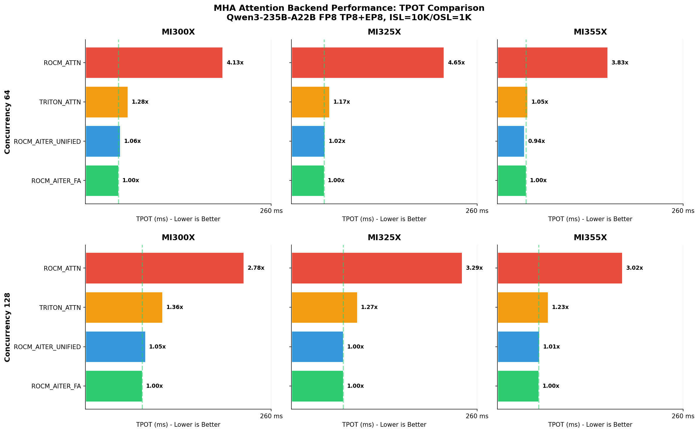

**Figure 6.** `ROCM_AITER_FA` **2.8–4.6×** faster TPOT vs legacy `ROCM_ATTN` across MI300X / MI325X / MI355X.

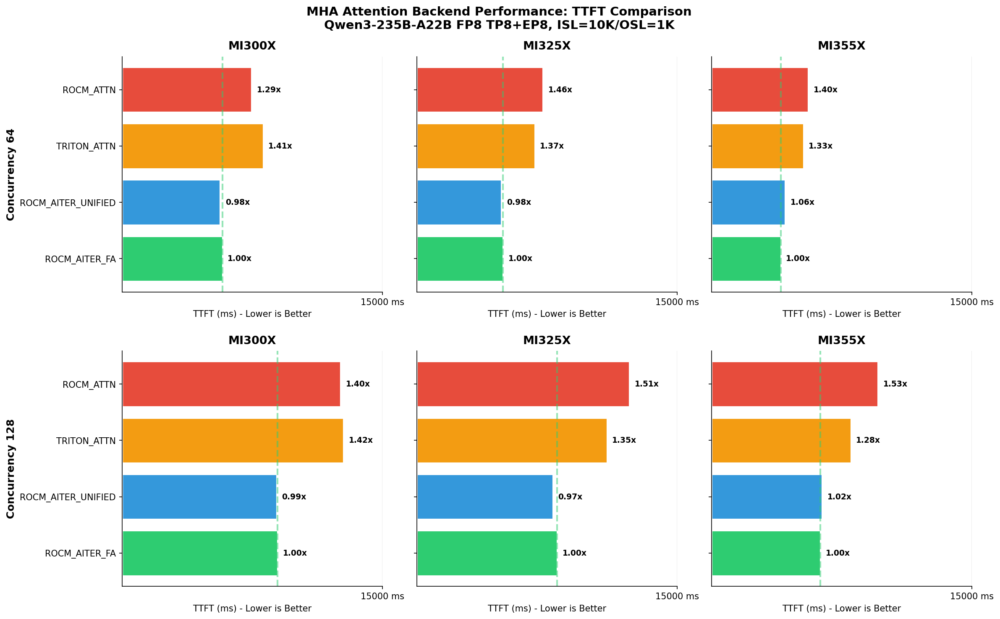

**Figure 7.** TTFT: `ROCM_AITER_FA` and `ROCM_AITER_UNIFIED_ATTN` lead Prefill at 64 and 128 concurrency.

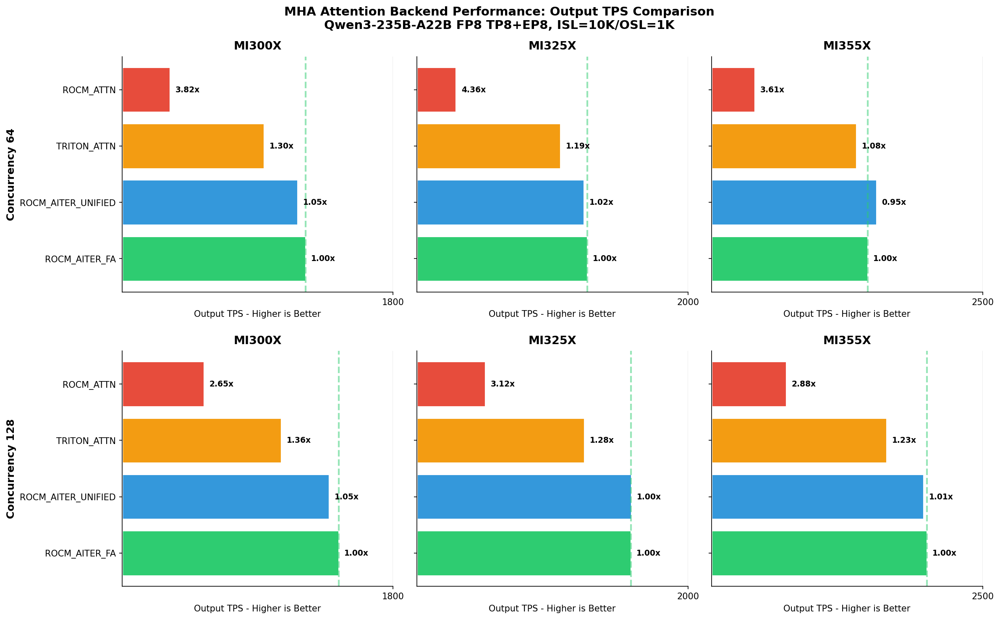

**Figure 8.** Output TPS mirrors TPOT — `ROCM_AITER_FA` **2.7–4.4×** higher throughput than legacy `ROCM_ATTN`.

**How many times slower in TPS vs `ROCM_AITER_FA` (64 concurrent requests):**

| Hardware | ROCM_AITER_FA | ROCM_AITER_UNIFIED_ATTN | TRITON_ATTN | ROCM_ATTN |
| --- | ---: | ---: | ---: | ---: |
| MI300X | **1.00×** | 1.05× | 1.30× | 3.82× |
| MI325X | **1.00×** | 1.02× | 1.19× | 4.36× |
| MI355X | **1.00×** | 0.95× | 1.08× | 3.61× |

**How many times slower in TPS vs `ROCM_AITER_FA` (128 concurrent requests):**

| Hardware | ROCM_AITER_FA | ROCM_AITER_UNIFIED_ATTN | TRITON_ATTN | ROCM_ATTN |
| --- | ---: | ---: | ---: | ---: |
| MI300X | **1.00×** | 1.05× | 1.36× | 2.65× |
| MI325X | **1.00×** | 1.00× | 1.28× | 3.12× |
| MI355X | **1.00×** | 1.01× | 1.23× | 2.88× |

Relative ranking is stable across GPU generations. `ROCM_AITER_UNIFIED_ATTN` (single kernel) is within **5%** of `ROCM_AITER_FA` (3-path) on this **uniform** workload — the 3-path advantage would show more with mixed traffic and prefix-cache hits.

`ROCM_ATTN` is **2.7–4.4×** slower in TPS here because Qwen3-235B has unsupported KV head sizes for HIP paged attention, so it falls back to Triton Decode. The page notes `ROCM_ATTN` is **faster than `TRITON_ATTN`** on models with supported head sizes.

### MLA results

**Model:** [DeepSeek-R1-0528](https://huggingface.co/deepseek-ai/DeepSeek-R1-0528), TP8, `block_size=16`. **Workload:** ISL=10K, OSL=1K, **64** and **128** concurrent requests.

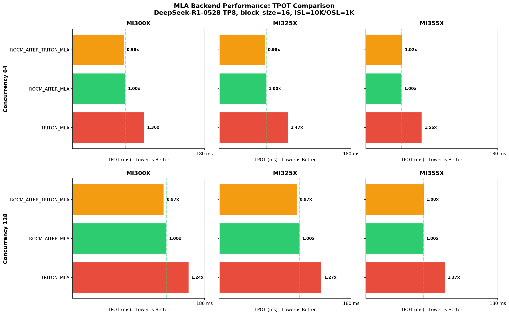

**Figure 9.** AITER MLA backends **1.2–1.6×** faster TPOT vs `TRITON_MLA` across MI300X / MI325X / MI355X, from the shared assembly Decode kernel.

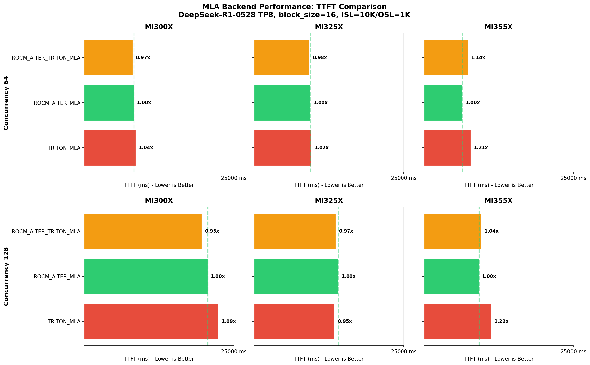

**Figure 10.** TTFT: `ROCM_AITER_MLA` best on **MI355X** at 128 concurrency.

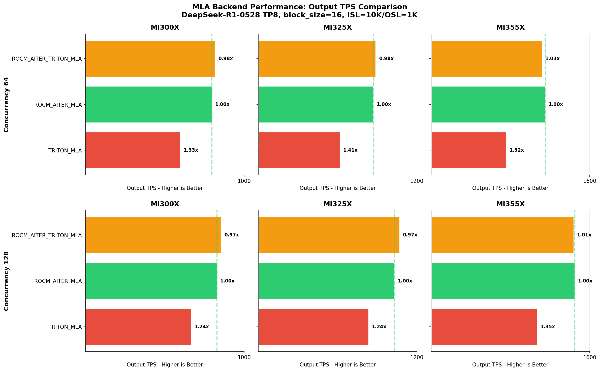

**Figure 11.** Output TPS: AITER MLA backends up to **1.5×** vs `TRITON_MLA`.

**How many times slower in TPS vs `ROCM_AITER_MLA` (64 concurrent requests):**

| Hardware | ROCM_AITER_MLA | ROCM_AITER_TRITON_MLA | TRITON_MLA |
| --- | ---: | ---: | ---: |
| MI300X | **1.00×** | 0.98× | 1.33× |
| MI325X | **1.00×** | 0.98× | 1.41× |
| MI355X | **1.00×** | 1.03× | 1.52× |

**How many times slower in TPS vs `ROCM_AITER_MLA` (128 concurrent requests):**

| Hardware | ROCM_AITER_MLA | ROCM_AITER_TRITON_MLA | TRITON_MLA |
| --- | ---: | ---: | ---: |
| MI300X | **1.00×** | 0.97× | 1.24× |
| MI325X | **1.00×** | 0.97× | 1.24× |
| MI355X | **1.00×** | 1.01× | 1.35× |

Both AITER MLA backends are close overall. On **gfx942** (MI300X / MI325X), `ROCM_AITER_TRITON_MLA` shows **2–3%** higher TPS. On **gfx950** (MI355X), `ROCM_AITER_MLA` matches or beats `ROCM_AITER_TRITON_MLA` because it uses AITER assembly MHA Prefill. `ROCM_AITER_MLA` also has the best TTFT on MI355X. Auto-selected `ROCM_AITER_MLA` is the page’s recommendation for all workloads.

These benches use **uniform** request sizes. Production traffic with prefix caching, mixed lengths, and varied patterns would exercise 3-path routing more fully.

## Collaboration: vLLM + AITER

Gains are not one kernel trick. They come from vLLM’s orchestration layer and AMD’s AITER primitives together. That is why “just porting” falls short.

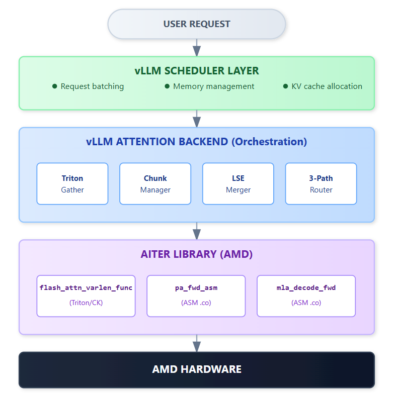

**Figure 12.** Stack: user request → vLLM orchestration → AITER primitives on AMD hardware.

### Innovation attribution

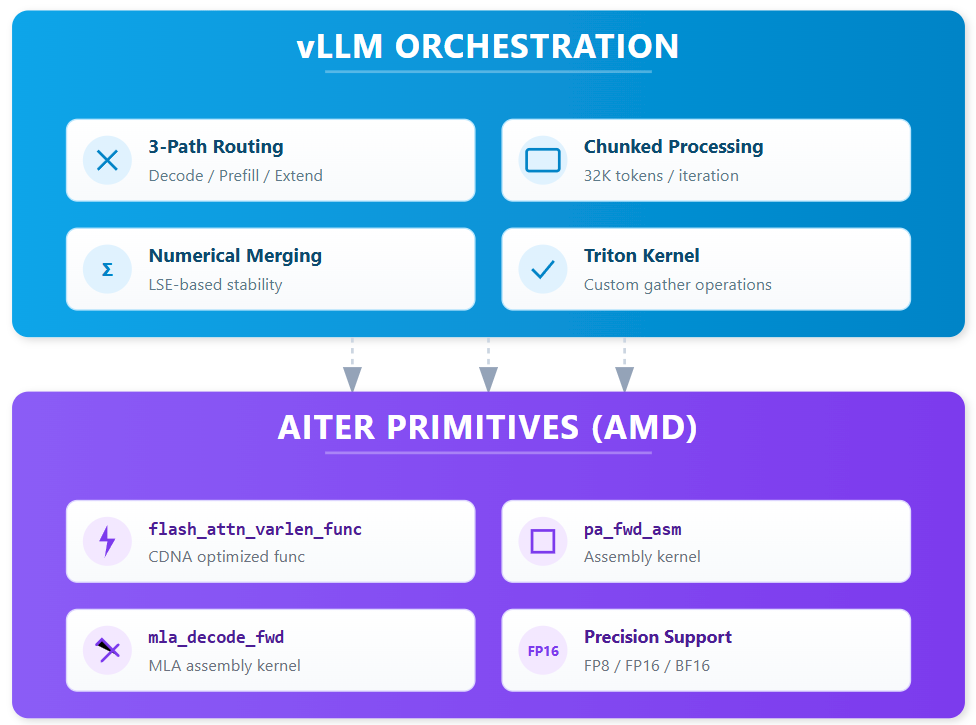

**Figure 13.** vLLM orchestration handles routing and chunking; AITER supplies hardware-optimized primitives.

AITER: attention primitives purpose-built for CDNA. vLLM: workload-aware routing and chunked processing that unlock the last tier. **Neither alone is optimal.**

## Get started

### Auto-select

```bash
# Recommended: Let vLLM auto-select optimized backends
export VLLM_ROCM_USE_AITER=1
vllm serve <your-model> --tensor-parallel-size <tp>
```

With `VLLM_ROCM_USE_AITER=1`, vLLM selects:

- `ROCM_AITER_FA` for MHA models (Llama, Qwen, Mistral)
- `ROCM_AITER_MLA` for MLA models (DeepSeek, Kimi)

### Explicit `--attention-backend`

```bash
vllm serve deepseek-ai/DeepSeek-R1-0528 \
    --tensor-parallel-size 8 \
    --attention-backend ROCM_AITER_TRITON_MLA
```

Both AITER MLA backends share the assembly Decode kernel, so overall numbers stay close. Prefill differs slightly by architecture; Decode dominates, so the gap is small. For most users, auto-selected `ROCM_AITER_MLA` is enough.

### Hardware support

| GPU | Memory | Architecture |
| --- | --- | --- |
| MI300X | 192GB HBM3 | gfx942 |
| MI325X | 256GB HBM3e | gfx942 |
| MI355X | 288GB HBM3e | gfx950 |

### Complete backend reference

Seven attention backends on AMD ROCm:

| Category | Backend | How to enable | Notes |
| --- | --- | --- | --- |
| MHA | TRITON_ATTN | `--attention-backend TRITON_ATTN` | Baseline, Radeon support |
| MHA | ROCM_AITER_UNIFIED_ATTN | `--attention-backend ROCM_AITER_UNIFIED_ATTN` | AITER unified kernel |
| MHA | ROCM_ATTN | `--attention-backend ROCM_ATTN` | Legacy 2-path, Radeon support |
| MHA | **ROCM_AITER_FA** | `--attention-backend ROCM_AITER_FA` + `VLLM_ROCM_SHUFFLE_KV_CACHE_LAYOUT=1` | **Recommended**, auto-selected with AITER |
| MLA | TRITON_MLA | `--attention-backend TRITON_MLA` | Baseline, Radeon support |
| MLA | **ROCM_AITER_MLA** | `--attention-backend ROCM_AITER_MLA` | **Recommended**, auto-selected with AITER |
| MLA | ROCM_AITER_TRITON_MLA | `--attention-backend ROCM_AITER_TRITON_MLA` | Alternative AITER MLA backend |

## Conclusion

The era of “just porting” is over. The post covers all **7** ROCm attention backends with benches.

**Key results (ISL=10K, OSL=1K):**

- `ROCM_AITER_FA`: **2.7–4.4×** higher TPS than `ROCM_ATTN` on MHA models
- `ROCM_AITER_MLA`: **1.2–1.5×** higher TPS than `TRITON_MLA` on DeepSeek MLA via assembly Decode
- Ranking holds across **MI300X → MI325X → MI355X**

**Recommendation on the page:** `export VLLM_ROCM_USE_AITER=1` and let vLLM pick. Defaults (`ROCM_AITER_FA` for MHA, `ROCM_AITER_MLA` for MLA) were the winners on the tested workloads.

Native AMD optimization: not ported, purpose-built. 3-path routing is a deliberate choice — explicit workload separation in software, each path calling AITER primitives. Debuggable, portable across GPU generations, aimed at mixed production batches.

## Acknowledgements

**AMD:** Hattie Wu, Yi Gan, Zejun Chen, Carlus Huang, Lingpeng Jin, Peng Sun, and the AITER team.

**Embedded LLM:** Pin Siang Tan, Tun Jian Tan, Jun Kang Chow, and the Embedded LLM team.

## Resources

- [AITER Library (AMD)](https://github.com/ROCm/aiter)
- [vLLM Documentation](https://docs.vllm.ai/)
- [Qwen3-235B Model](https://huggingface.co/Qwen/Qwen3-235B-A22B-Instruct-2507-FP8)
- [DeepSeek-R1 Model](https://huggingface.co/deepseek-ai/DeepSeek-R1-0528)

## Disclaimer

Testing by the AMD AI Framework team as of **Jan. 29, 2026**, measuring inference performance in TPS on Instinct MI300X, MI325X, MI355X.

**Hardware configuration**

- **MI300X:** AMD EPYC 9654 96-Core Processor server with 8× AMD Instinct MI300X (192GB, 750W) GPUs, Supermicro AS-8125GS-TNMR2, NPS1 (1 NUMA per socket), 2.2TiB (24 DIMMs, 4800 mts memory, 96 GiB/DIMM), BIOS version: 3.2
- **MI325X:** AMD EPYC 9575F 64-Core Processor server with 8× AMD Instinct MI325X (256GB, 1000W) GPUs, Supermicro AS-8125GS-TNMR2, NPS1 (1 NUMA per socket), 2.2TiB (24 DIMMs, 4800 mts memory, 96 GiB/DIMM), BIOS version: 3.2
- **MI355X:** AMD EPYC 9575F 64-Core Processor server with 8× AMD Instinct MI355X (288GB, 1400W) GPUs, Supermicro AS-8125GS-TNMR2, NPS1 (1 NUMA per socket), 2.2TiB (24 DIMMs, 4800 mts memory, 96 GiB/DIMM), BIOS version: 3.2

**Software configuration**

Ubuntu 22.04 LTS, Linux kernel **5.15.0-116-generic**, **ROCm 7.0**, PyTorch **2.9.0a0**, vLLM **0.14.0rc2** (from Jan 15, 2026).

Server manufacturers may vary configurations. Performance may vary with configuration, software, vLLM version, and driver / optimization vintage. Study note, not an SLA.
