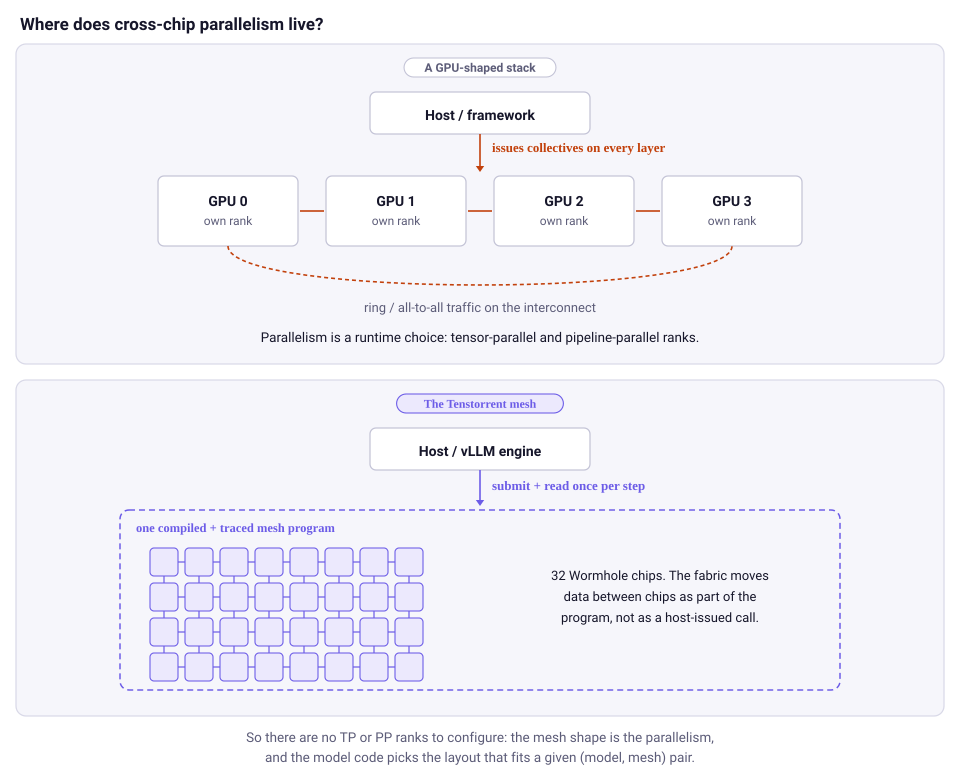
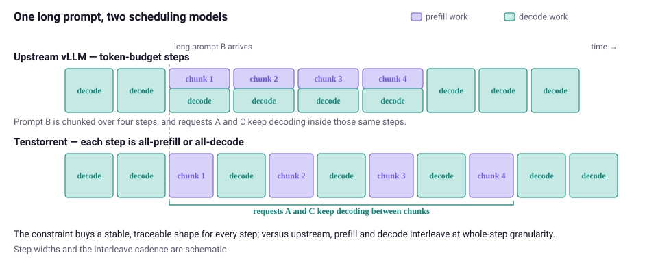
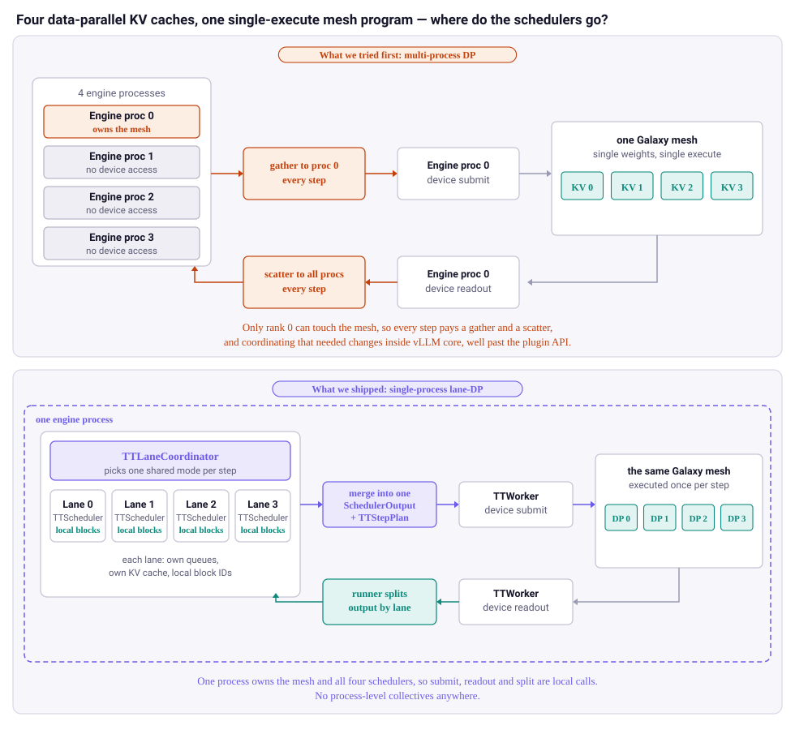
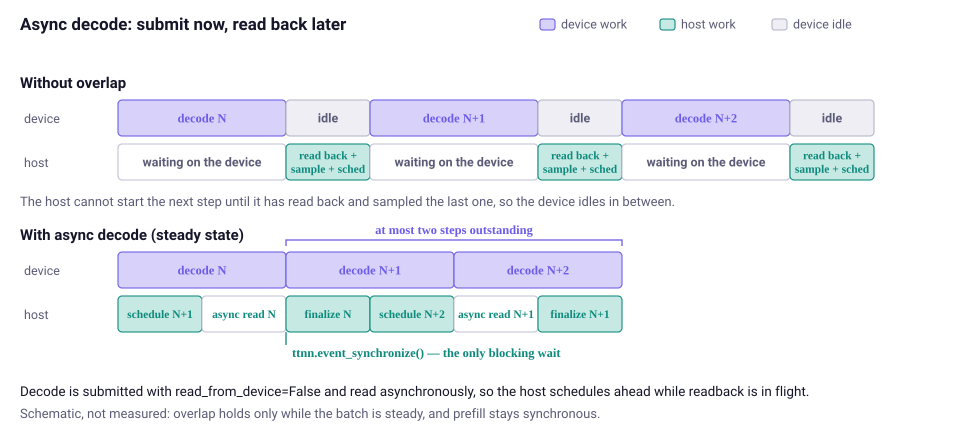

# Serving LLMs on Tenstorrent Hardware: Inside the vLLM TT Plugin

Chinese: [zh/vllm/blog/architecture/tt-plugin.md](../../../../zh/vllm/blog/architecture/tt-plugin.md)

2026-09-07. **Tenstorrent Team**. Study extract, not an official reprint. Out-of-tree platform plugin: [tenstorrent/vllm-tt-plugin](https://github.com/tenstorrent/vllm-tt-plugin). Hardware: [Tenstorrent](https://tenstorrent.com/). Runtime: [TT-Metal](https://github.com/tenstorrent/tt-metal). Same plugin door as [hardware-plugin.md](hardware-plugin.md) and [plugin-system.md](plugin-system.md). Page quotes no tokens/$; live numbers stay on tenstorrent.com and tt-metal. Skip site logos.

Install next to vLLM. Whenever `ttnn` from TT-Metal is importable, Tenstorrent hardware is discovered and registered as a vLLM platform. Serving surface does not change: OpenAI-compatible API, same request format, same client code.

The interesting claim is not that a backend exists. A Tenstorrent device does not look like a GPU, and vLLM's plugin interfaces were general enough to express a phase-constrained scheduler, a different data-parallel topology, and a sampling path that partly lives on device — entirely outside vLLM core.

## Supported models

The plugin registers Tenstorrent-backed architectures under a `TT`-prefixed convention. A checkpoint is picked up by the architecture it declares, not by name:

| Model family | Architectures |
|---|---|
| Llama 3.1 / 3.2 / 3.3 | `TTLlamaForCausalLM` |
| Llama 3.2 Vision | `TTMllamaForConditionalGeneration` |
| Qwen 2.5 / Qwen 3 | `TTQwen2ForCausalLM`, `TTQwen3ForCausalLM` |
| Qwen 3.5 / Qwen 3.6 | `TTQwen3_5ForConditionalGeneration` |
| Qwen 2.5-VL / Qwen 3-VL | `TTQwen2_5_VLForConditionalGeneration`, `TTQwen3VLForConditionalGeneration` |
| Mistral / Mistral 3 | `TTMistralForCausalLM`, `TTMistral3ForConditionalGeneration` |
| Gemma 3 | `TTGemma3ForConditionalGeneration` |
| Gemma 4 | `TTGemma4ForCausalLM`, `TTGemma4ForConditionalGeneration`, `TTGemma4UnifiedForConditionalGeneration` |
| DeepSeek V3 | `TTDeepseekV3ForCausalLM` |
| GPT-OSS 20B / 120B | `TTGptOssForCausalLM` |

Those classes live in TT-Metal, next to the runtime: each is a vLLM-facing generator wrapped around a hand-written TTNN implementation. The plugin carries **no** model code — it registers names; tt-metal provides what they resolve to.

Because the match is on architecture, one entry covers several releases. Example: `TTQwen3_5ForConditionalGeneration` serves `Qwen/Qwen3.6-27B`.

Multimodal coverage (often missing on new backends): Llama 3.2 Vision, Qwen-VL, Qwen 3.6, Mistral 3, Gemma 3 all serve through the plugin at publication.

Models do not have to be built into the plugin. Point `EXTRA_MODELS_DIR` at bundle folders, each holding a `vllm_metadata.json` and an adapter class, and architectures register at startup under the `TT` convention. A distribution tool can ship a ready-to-serve model without a source edit. `TT_VLLM_BUILTIN_MODELS=0` narrows the registry to only what was supplied.

## Why a Tenstorrent backend looks different

A Tenstorrent system is a **mesh of cores and chips connected by an on-fabric network**. A single card (n150 or n300) is already a small mesh; a [QuietBox](https://tenstorrent.com/hardware/tt-quietbox) is larger; a [Galaxy](https://tenstorrent.com/hardware/galaxy) is 32 Wormhole chips wired into a topology the runtime configures directly (`FABRIC_1D`, `FABRIC_2D`, `FABRIC_1D_RING`). Programs are compiled and traced against a mesh shape. The fabric moves data between chips as part of the compiled program, not as a host-issued collective.

Models in this plugin are **hand-written [TTNN](https://github.com/tenstorrent/tt-metal) implementations** for TT mesh, from a two-chip n300 up to a 32-chip Galaxy. Inside that system they still use tensor parallelism across chips and data parallelism across submeshes, but expressed in TTNN and compiled into the mesh program rather than configured as runtime ranks. That hand-tuning is what delivers better tokens/$; the post does not quote numbers.



**Figure 1.** Where cross-chip parallelism lives. In a GPU-shaped stack the host issues collectives on every layer; parallelism is a runtime choice (TP / PP ranks). On Tenstorrent the mesh is compiled and traced as one program; the fabric moves data inside it, so the host submits and reads once per step.

That compilation model — one traced program for the whole mesh — drives nearly everything downstream:

- **There are no TP or PP ranks to configure.** A 70B model on Galaxy is not "TP=32 processes"; it is one program compiled for a 32-chip mesh. `MESH_DEVICE=TG` replaces `--tensor-parallel-size`. The plugin rejects `-tp`/`-pp` rather than pretending to honor them. Parallelism that fits the (model, mesh) pair lives in the model code.
- **The unit of work is a whole traced step.** Device execution is dominated by replaying a captured trace for a fixed batch shape. Homogeneous, shape-stable batches are dramatically cheaper than heterogeneous ones.
- **Sampling can happen on device.** The mesh program can carry sampling to the end, so the token often comes back already chosen and the host never sees the logits.

Each of those is in tension with a GPU-shaped inference stack. The rest of the post is how they resolved it.

## Plugging in, not forking

vLLM's hardware plugin mechanism was [introduced in May 2025](https://vllm.ai/blog/2025-05-12-hardware-plugin) with `vllm-ascend` and `vllm-spyre`. The pluggable-scheduler work from Spyre is what makes this approach viable. They depend on it heavily.

Two entry points:

| Entry point group | Name | Target |
|---|---|---|
| `vllm.platform_plugins` | `tt` | `vllm_tt_plugin.entrypoints:platform_plugin` |
| `vllm.general_plugins` | `tt_model_registry` | `vllm_tt_plugin.entrypoints:register` |

`platform_plugin()` returns `TTPlatform` **only when `ttnn` is importable**, so installing the package into an ordinary CUDA environment cannot accidentally select Tenstorrent.

From there, everything flows through one handoff. `TTPlatform.check_and_update_config()` validates config, registers model architectures, and swaps in Tenstorrent-owned runtime classes through existing extension points:

| vLLM config field | TT implementation |
|---|---|
| `parallel_config.worker_cls` | `vllm_tt_plugin.worker.TTWorker` |
| `scheduler_config.scheduler_cls` | `vllm_tt_plugin.scheduler.TTScheduler` or `vllm_tt_plugin.lane_scheduler.TTLaneCoordinator` |

Device-specific options ride on vLLM's generic additional-config namespace, not new CLI flags:

```bash
--additional-config.tt.sample_on_device_mode all
--additional-config.tt.fabric_config FABRIC_1D_RING
```

**Nothing Tenstorrent-specific lives in vLLM core.** Support tracks vLLM's release cadence rather than a fork three months behind. At publication they validate against a pinned vLLM release and are widening that window as the plugin's API surface settles.

## Phase-based scheduling: prefill-only or decode-only steps

Upstream V1 scheduling is token-budget based. A request has computed tokens and target tokens; each step hands out more token work subject to budgets. Prefill and decode are not separate modes, which is what lets chunked prefill and mixed-progress batches fall out naturally.

The Tenstorrent path is more constrained. Every scheduling step resolves to one of three outcomes:

- **prefill-only**
- **decode-only**
- **empty**

No mixed prefill+decode batches. Chunked prefill is still supported inside that constraint: a prompt that exceeds the per-step token budget splits across multiple prefill steps, and decode-only steps interleave between the chunks, so in-flight requests keep advancing while a long prefill is in flight. Prefill work is admitted first by default, so later decode steps run with bigger, more efficient batches. If no prefill can be admitted but decode requests are running, the step is decode-only, so progress continues and KV pressure can relax.



**Figure 2.** The same long prompt under both models. Upstream spreads it across four chunked steps and mixes decode work for other requests into those same steps. On Tenstorrent a step is still all-prefill or all-decode: the prompt runs as prefill-only chunks with decode-only steps interleaved, so every step keeps a stable, traceable shape while in-flight requests keep advancing.

**What it buys.** Traced execution rewards batch-shape stability: a uniformly prefill or uniformly decode step replays a trace captured for that shape. A mixed step would need a shape the trace was never captured for. The phase split is not a Tenstorrent eccentricity: the largest GPU deployments make the same choice at instance granularity — [disaggregated serving](https://docs.vllm.ai/en/stable/features/disagg_prefill/). The Tenstorrent scheduler applies the split at **step** granularity inside one engine.

**What it does not cost.** Continuous batching still holds in the broad sense. Requests arrive into `waiting`, may park in `skipped_waiting` while structured-output grammar compiles, are admitted while others remain active, can be preempted back, and complete independently. The restriction is *within* a device step, not across the request lifecycle.

**What it does cost.** Interleave granularity is a whole step. Upstream mixes a prefill chunk and ongoing decode into the same step; here the scheduler alternates, so a decode request waits out each prefill chunk between its own steps, and each mode switch drains the async decode overlap pipeline below. Both are scheduling-policy costs, not hardware limits: nothing prevents capturing a mixed-shape step in later versions.

## Single-process lane data parallelism on Galaxy

This piece has no analogue elsewhere in vLLM. The post asks for feedback on it.

Some Tenstorrent models — Llama 3.3 70B via `TT_LLAMA_TEXT_VER=llama3_70b_galaxy`, Qwen3-32B via `TT_QWEN3_TEXT_VER=qwen3_32b_galaxy`, and GPT-OSS — are served by *single-execute* generators: one program spanning the entire Galaxy mesh, executed once per step. There is no submesh to give a second engine process. Standard multi-process data parallelism, which assigns each rank its own devices, has nothing to partition.

These models are single-*weights* and single-*execute*, yet they keep **four independent data-parallel KV caches**, each on its own DP submesh. Nothing to partition at process level; four things to schedule independently.

The first attempt gave each DP rank its own process, as vLLM normally does. Ranks must negotiate the prefill vs. decode step type, and there is only one mesh submit/readout, so they would have needed to modify vLLM core well beyond the hardware-plugin surface. Per-rank schedulers did run in parallel, but the extra inter-process scatter/gather on every step cost more than that parallelism won back.

The shipped answer puts the parallelism *inside* one engine process:

`TTLaneCoordinator` owns one independent `TTScheduler` per **lane**. Each lane has its own `waiting` and `running` queues, its own admission decisions, its own KV cache manager, and its own lane-local block ID space. New requests go to the least-loaded lane and stay bound to it.

Because the device executes all lanes together, the coordinator must pick one shared mode per step:

- if any lane can admit prefill, **all** lanes run a prefill step, bounded by the same decode-interleave cadence as the single-scheduler case
- otherwise, all lanes run a decode step
- a lane with no work for the selected mode contributes an empty slice of the merged batch

The coordinator then merges the per-lane `SchedulerOutput` objects, the worker builds one merged device input, and the runner splits the result back out by lane — all in one process, with **no process-level collectives**. That is the scatter/gather cost that sank the multi-process attempt.



**Figure 3.** The same four data-parallel KV caches, scheduled two ways. Top (abandoned): four engine processes negotiate a shared prefill-or-decode mode over inter-process scatter/gather every step, even though there is only one mesh submit and readout. Bottom (shipped): one engine process, a coordinator that picks the shared mode, four independent schedulers with lane-local block IDs, one merged device input, results split back by lane.

Subtle retry: if a forced prefill step admits zero tokens (typically KV pressure) while some lane still has running decode work, the step is retried in decode mode. Without that retry, KV pressure can drive a no-progress loop: prefill is selected because a lane *wants* to admit, admits nothing because no blocks are free, and the decode that would have freed those blocks never runs.

User-facing surface:

```bash
MESH_DEVICE=TG \
TT_LLAMA_TEXT_VER=llama3_70b_galaxy \
VLLM_RPC_TIMEOUT=900000 \
python examples/server_example_tt.py \
  --model "meta-llama/Llama-3.3-70B-Instruct" \
  --data_parallel_size 4 \
  --max_num_seqs 8 \
  --async-scheduling \
  --additional-config.tt.dispatch_core_axis col \
  --additional-config.tt.sample_on_device_mode all \
  --additional-config.tt.fabric_config FABRIC_1D_RING \
  --additional-config.tt.worker_l1_size 1344544 \
  --additional-config.tt.trace_region_size 220000000
```

`--data_parallel_size 4 --max_num_seqs 8` becomes four in-process lanes of eight requests each: 32 concurrent. `--max_num_seqs` means **per-lane** capacity. Users write the same flags they already know; the backend maps them to in-process lanes for single-execute Galaxy models, or ordinary multi-process DP with per-rank submeshes (discovered at startup and assigned via `TT_VISIBLE_DEVICES`) for everything else. The startup log states which one it chose.

## On-device sampling, with a fallback nobody configures

When `sample_on_device_mode` is set, the mesh program carries sampling through to token selection and returns tokens rather than logits.

Plenty of requests cannot use that path: logprobs, penalties, allowed-token masks, bad-word filtering, custom logits processors. The plugin does not reject them and does not ask the user to pick a mode. **It decides per batch**, falling back to vLLM's own `LogitProcessor` and sampler path whenever the batch needs something the device path cannot express, then returning to the device path when it can. Requests that need host-side sampling get correct results at the cost of a readback; everything else keeps the fast path. `always_compat_sampling` forces the host path for debugging or A/B.

## Decode overlap is asynchronous readback, not an async execution model

The plugin supports decode/host overlap, gated on a per-model `supports_async_decode` declaration. If a model has not declared it, the platform disables async scheduling rather than letting a user turn on something unvalidated.

"Async" here means **asynchronous host readback**, not a device-side execution thread:

1. Submit decode work with `read_from_device=False` (non-blocking).
2. Start host readback with `read_decode_output(..., async_read=True)` and keep the returned events with the submission record (also non-blocking).
3. Later, at finalization, wait on those events via `ttnn.event_synchronize(...)`.
4. Only then convert device output into host tensors and sampling results.



**Figure 4.** Where the overlap comes from. Without it, the device waits while the host reads back and samples the previous step. With async decode the readback is left in flight, so the host schedules the next step and finalizes the previous one while the device is still busy. The only blocking wait is `ttnn.event_synchronize()` at finalization.

The engine keeps an in-flight queue of depth 2 and fills it before blocking, so the host can schedule step *N+1* while step *N*'s readback is still in flight. Overlap is kept only while the batch is *steady* — stable shape, on-device sampling, no structured-output bookkeeping, no resumed prefill. When any of those break, pending work is drained first.

Prefill remains synchronous in practice. Decode overlap is a fast path for steady-state generation, not a universal async pipeline. Full treatment: [`docs/SCHEDULING.md`](https://github.com/tenstorrent/vllm-tt-plugin/blob/main/docs/SCHEDULING.md), including finalization bookkeeping when the executor's output thread and the engine thread race to the same result.

## Current limitations

`TTPlatform` rejects or adjusts unsupported combinations at configuration time, so users get a clear error before anything reaches the device:

- **Tensor parallel and pipeline parallel are supported, but differently.** Parallelism comes from the mesh shape (`MESH_DEVICE`) and model implementation, not from vLLM's TP/PP ranks.
- **Speculative decoding is not supported yet.**
- **LoRA is not supported yet.**
- **Prompt logprobs are not supported yet** and are rejected at request validation.
- **Prefix caching** is enabled only for models that declare support.
- **Async decode overlap** is enabled only for models that declare the capability.
- **Standard multi-process DP does not support MoE models.** Single-execute models needing internal data parallelism, such as GPT-OSS, fold into lane-DP instead.
- **Multi-host serving is not supported yet.** Tenstorrent hardware scales well past a single machine, but the current TT multi-host model implementation does not map directly onto vLLM's multi-host paradigm.

These are properties of the current Tenstorrent runtime and model implementations, not fundamental limits of the hardware, the software stack, or vLLM's plugin API.

## Try it out

Install [TT-Metal](https://github.com/tenstorrent/tt-metal/blob/main/INSTALLING.md) first and activate that environment, then clone the plugin and run its install script from the repository root:

```bash
git clone https://github.com/tenstorrent/vllm-tt-plugin.git
cd vllm-tt-plugin
source docs/install-vllm-tt.sh
```

The script builds vLLM with `VLLM_TARGET_DEVICE=empty` — the `tt` platform is supplied by the plugin at runtime — and installs the plugin. Then serve and query:

```bash
MESH_DEVICE=T3K VLLM_RPC_TIMEOUT=100000 python examples/server_example_tt.py
```

```bash
curl http://localhost:8000/v1/completions \
  -H "Content-Type: application/json" \
  -d '{"model": "meta-llama/Llama-3.1-70B-Instruct", "prompt": "San Francisco is a", "max_tokens": 32}'
```

Existing OpenAI-client code needs no changes.

Setup currently performs a from-source vLLM build against **0.26.0** inside a tt-metal environment. Per-model commands, mesh shapes, and required environment variables: [plugin README](https://github.com/tenstorrent/vllm-tt-plugin) and the corresponding tt-metal model demos.

## What's next

- Broader async decode coverage — more families declaring `supports_async_decode`, fewer conditions that force a drain (especially on-device sampling modes).
- Prefix caching across more models, and lane-DP support for request-specific RoPE so vision models can use it.
- Speculative decoding, once the mesh-side draft/verify story is settled.
- Multi-host serving — models larger than one machine can hold.

## Acknowledgements

This work rests on the vLLM platform plugin mechanism from the Ascend team and the pluggable-scheduler design from the Spyre team — without the latter, a phase-based scheduler would have meant a fork. Thanks to vLLM maintainers for keeping V1 extension points general enough that a mesh architecture fits through them.

Contributors named on the page: Viktor Puš, Tomasz Cheda, Sanjar Adylov, Salar Hosseini.

They especially want feedback on two things: whether folding `--data_parallel_size` into in-process lanes is the right user-facing surface for single-execute models, and which model families to prioritize next. Issues and PRs: [vllm-tt-plugin](https://github.com/tenstorrent/vllm-tt-plugin); also vLLM Slack.
