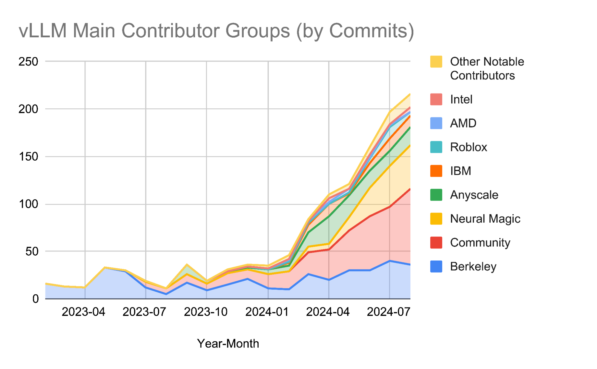
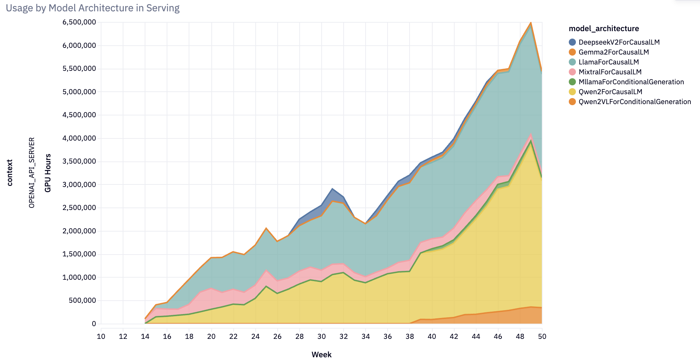
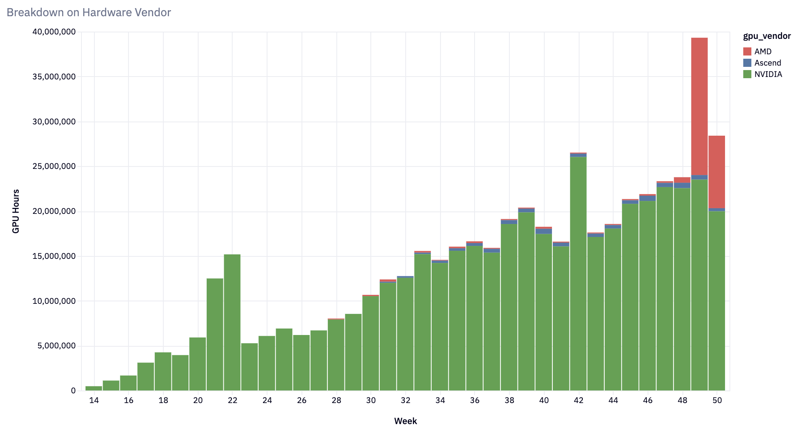
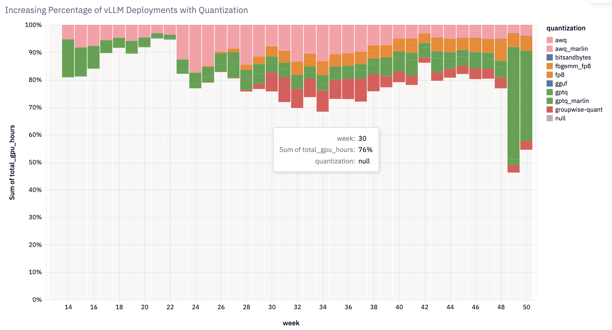

# 2024 wrap / 2025 vision: stars 2.3×, V1 rewrite, telemetry opt-out

Chinese: [zh/vllm/blog/architecture/vllm-2024-wrapped.md](../../../../zh/vllm/blog/architecture/vllm-2024-wrapped.md)  
Stars 14k→32.6k, contributors 190→740, monthly downloads 6k→27k, GPU hours ~10×. https://2024.vllm.ai

~100 architectures by year-end; hardware from A100 to H100/MI300/TPU/Inferentia/Gaudi/XPU/CPU. Quant in >20% of deployments. 2025 talk: GPT-4o-class on one GPU/node, quant/prefix/spec as defaults, pluggable V1. Usage UUID + hardware/model/quant; off: `VLLM_NO_USAGE_STATS=1` or `~/.config/vllm/do_not_track`. A then-vision doc; V1/MRV2/Wide-EP landed later.

Local figures (copyright remains with the original site; study copies):

