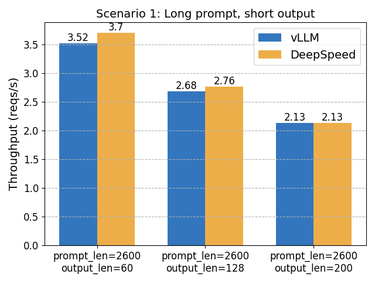
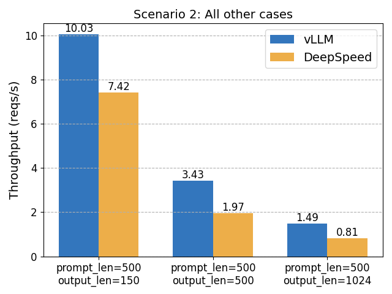

# Notes on vLLM vs DeepSpeed-FastGen

2023-11-14 reply to DeepSpeed’s “2× vs vLLM” post. Snapshot, not a 2026 bake-off. Figures on the official page.

Local figures (copyright remains with the original site; study copies):

## TL;DR

- vLLM matches FastGen on common work; **faster when outputs are long**.
- FastGen wins mainly on **long prompt + short output**, via **Dynamic SplitFuse** (then on vLLM’s roadmap; later everyday name: **chunked prefill**).
- vLLM: Apache 2.0, community-owned, broad model/optimization coverage.

## Two differences they named

1. FastGen’s KV allocation is conservative — waste shows up when generations are long.
2. SplitFuse helps when **ISL ≫ OSL**.

A100-80GB, LLaMA-7B: other cases vLLM up to **~1.8×**. The long-prompt/short-output win was smaller than the advertised 2×.

## Feature table (Nov 2023 capsule)

Both: Python/PyTorch, PagedAttention + FlashAttention. FastGen: 3 model types, random sampling, EOS only. vLLM: 16 architectures; random / parallel / beam; stop strings. KV allocation: vLLM “near-optimal”, FastGen “suboptimal/conservative”.

Read after the PagedAttention launch post: the 2023 fight was no longer “whether to page”, but **whether to split prefill**. That is `max_num_batched_tokens` in today’s vLLM optimization page.
