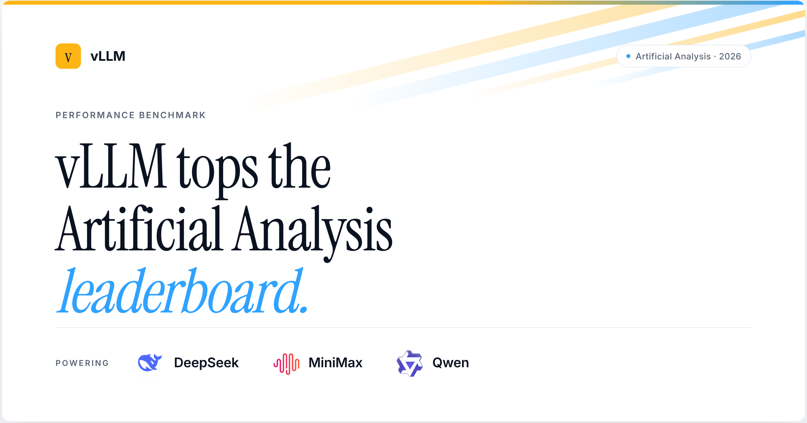
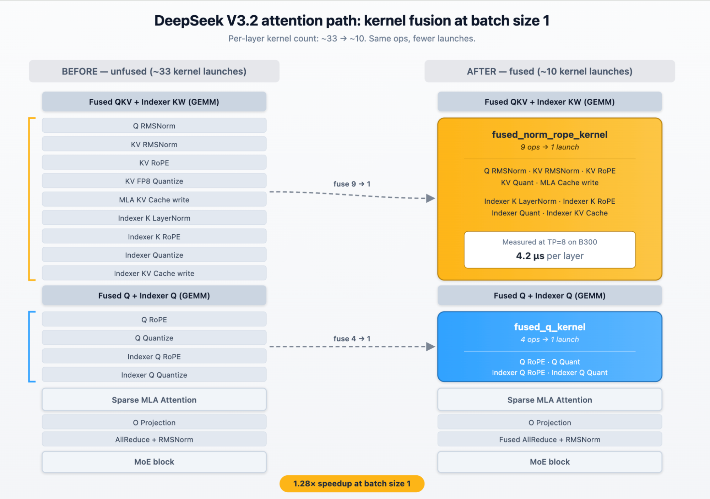
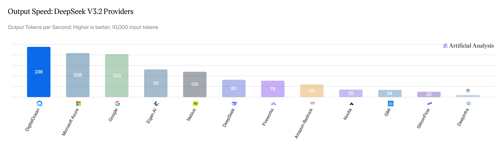
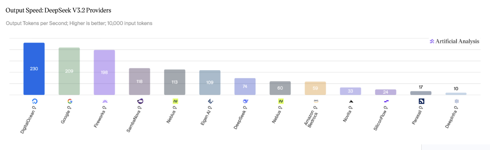
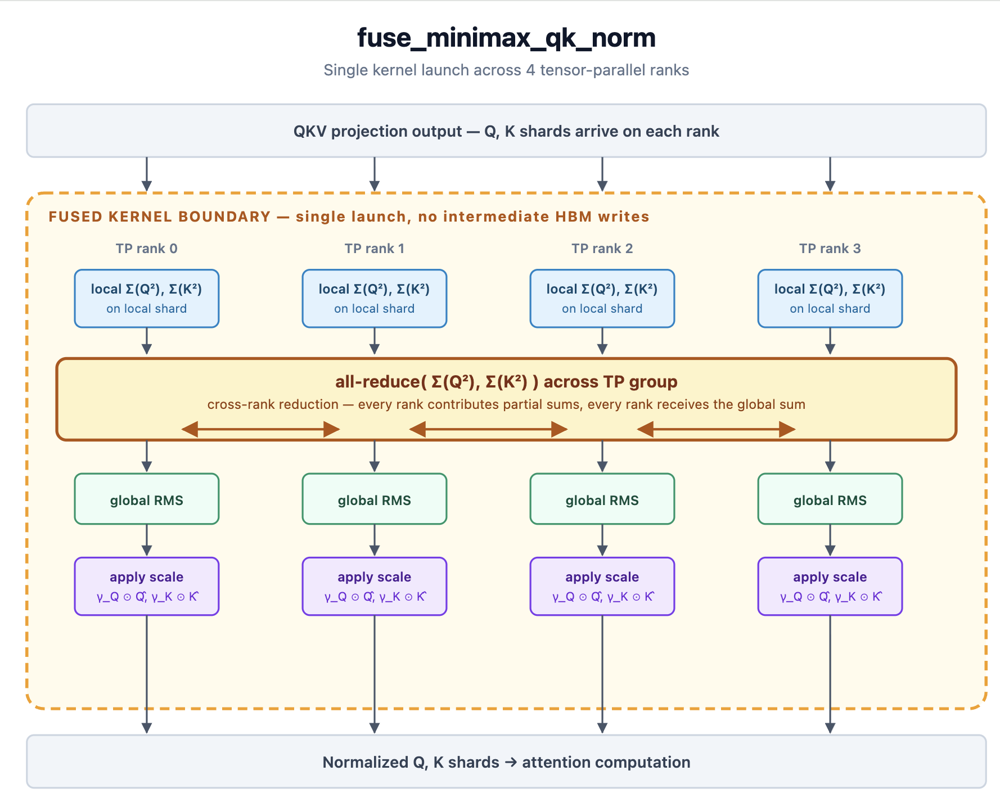
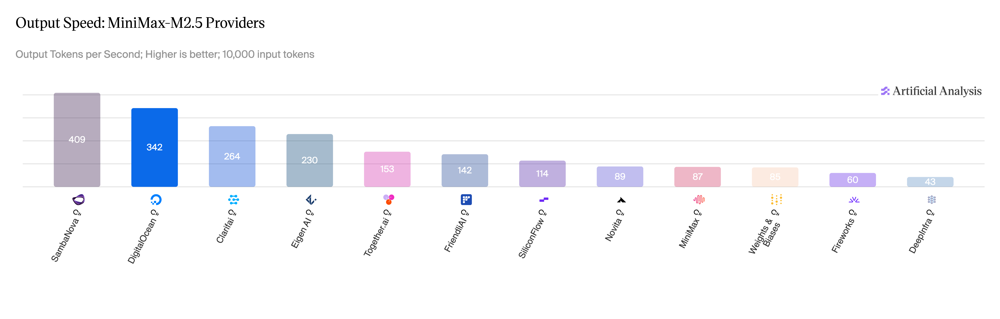
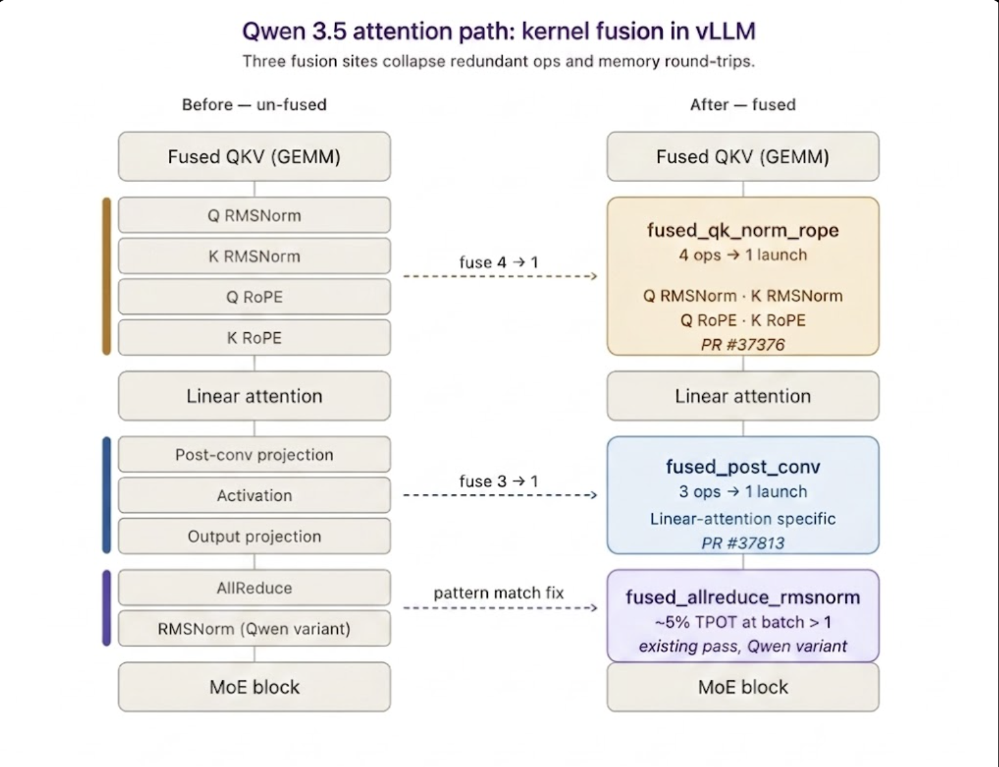
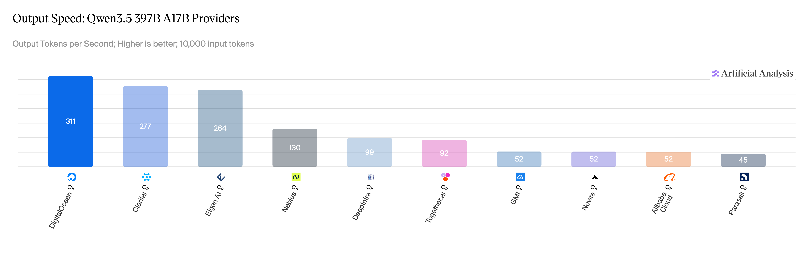

# Artificial Analysis: three models, three bottlenecks; fusions and drafts in main

Chinese: `../../zh/vllm/blog/performance/artificial-analysis.md`  
May 2026 DigitalOcean week. Numbers follow that day’s board.

DeepSeek V3.2: low batch launch-bound; attention path ~33 kernels → ~10, **1.28×** at bs=1 (85.8→109.3 tok/s, 4×GB200, no MTP). One 8×B300 cc=1: no MTP TP8 **125**; MTP=1 **234** (~90% accept); P/D TP4+TP4+MTP=3 **262**. Router GEMM ~6%; indexer TopK one graph, up to **17%** TPOT on 128K decode. MiniMax-M2.5: TorchSpec EAGLE3 + `fuse_minimax_qk_norm`; ceiling (100% accept) TP4 **326 tok/s**. Qwen 3.5 397B: missed `allreduce_rms` spent ~half decode on unfused cross-device reduce; then post-conv fusion + dual-stream, TEP=8 cc=1 **163 tok/s**, cc=256 **6.69→7.33 req/s**. System TPS ≠ per-user TPS. Read [gpt-oss-optimizations](gpt-oss-optimizations.md) / [qwen35-25k-tps](../serving/qwen35-25k-tps.md).

Local figures (copyright remains with the original site; study copies):

