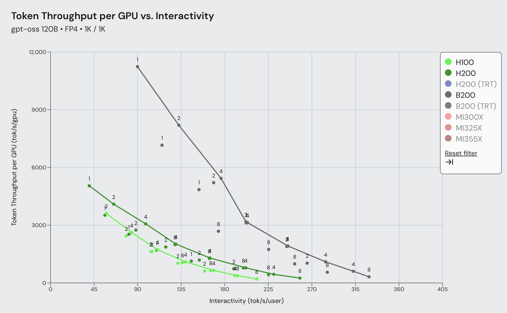
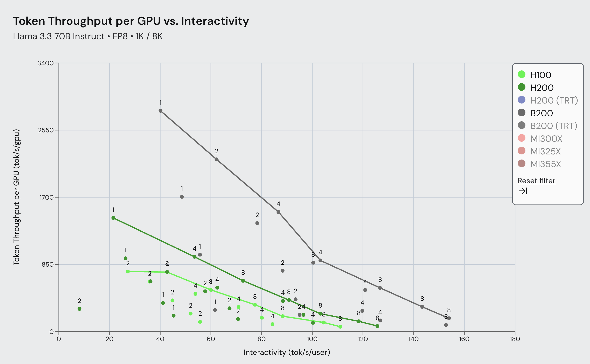

# InferenceMAX: Blackwell vs Hopper is a Pareto, not a point

Chinese: [zh/vllm/blog/performance/blackwell-inferencemax.md](../../../../zh/vllm/blog/performance/blackwell-inferencemax.md)  
Oct 2025. gpt-oss 120B / Llama 3.3 70B. Later numbers: [gpt-oss-optimizations](gpt-oss-optimizations.md).

InferenceMAX reruns daily. Three ISL/OSL: 1K/1K, 1K/8K, 8K/1K. Blackwell vs Hopper: gpt-oss 1k/1k up to ~**4.3×** throughput at similar interactivity; Llama 3.3 70B 1k/8k up to ~**3.7×**. A single TPS lies — max-throughput is rarely min per-user latency.

Stack: FlashInfer (FP8 attention/GEMM/MoE, fused AR+RMSNorm+quant); `torch.compile` extended to Attention+Output Quant; `--async-scheduling` overlaps host with GPU. Auto backend/attention selection; FlashInfer GEMM/MoE autotune at startup. Next bets: EAGLE3 / DEP at cluster scale. Numbers follow SemiAnalysis’s curve that day — not a permanent plate.

Local figures (copyright remains with the original site; study copies):

