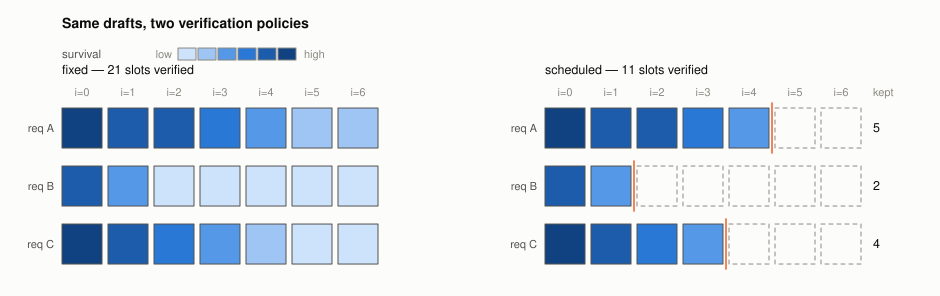
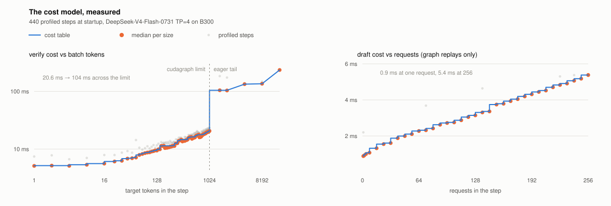
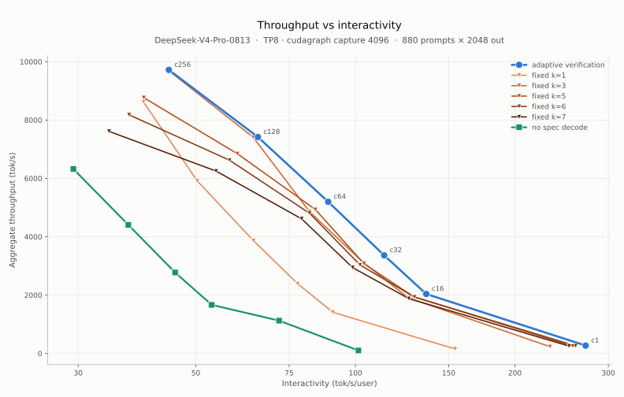

# DSpark adaptive verification: budget from confidence × load

Chinese: [zh/vllm/blog/performance/dspark-adaptive.md](../../../../zh/vllm/blog/performance/dspark-adaptive.md)  
PR #47808, `enable_adaptive_verification`. Demo: DS-V4-Pro TP8, 8×B300.

Fixed-K speculation is sweet at low concurrency; at high concurrency draft + verify saturates the GPU and system TPS falls. Each DSpark step sets the verify budget from **draft confidence × current load**: go deep when idle, shorten when crowded. Official curves stay on the Pareto frontier out to **c=256** — not “always K=7”.

Local figures (copyright remains with the original site; study copies):

## Engine constraints

Needs **FULL varlen decode graphs** (`AttentionCGSupport.ALWAYS`, the SM100 DSV4 path). Eager, LoRA, PP, and requests that want output logprobs were out at the time. Without those graphs the adaptive budget cannot resize the capture range.

Read with [parallel drafting](parallel-drafting.md) and [spec-decode](spec-decode.md): this changes **how many tokens you verify per step**, not the draft architecture.
