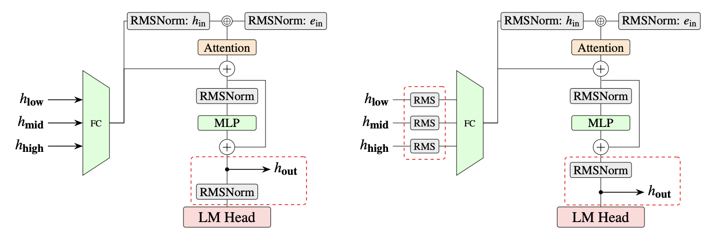
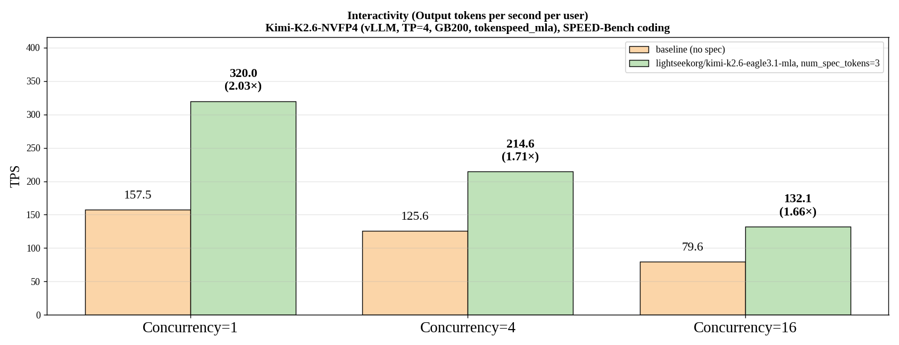

# EAGLE 3.1: Advancing Speculative Decoding Through Collaboration Between the EAGLE Team, vLLM, and TorchSpec

Chinese: [zh/vllm/blog/performance/eagle-3-1.md](../../../../zh/vllm/blog/performance/eagle-3-1.md)

2026-05-26. **EAGLE Team, vLLM Team, and TorchSpec Team**. Study note. Repos: [SafeAILab/EAGLE](https://github.com/SafeAILab/EAGLE), [vllm-project/vllm](https://github.com/vllm-project/vllm), [lightseekorg/TorchSpec](https://github.com/lightseekorg/TorchSpec). Accept math still [spec-decode](spec-decode.md). Parallel one-forward cousin: [P-EAGLE](p-eagle.md). Eagle3 training base: [speculators-v030](speculators-v030.md). Throughput numbers are their SPEED-Bench, not your SLA.

The EAGLE series (1 / 2 / 3) is already one of the most widely deployed speculative-decoding families in research and production. This post is the three teams shipping **EAGLE 3.1**: more robust, more deployable.

## EAGLE 3.1 innovations

Speculative decoding can look strong in controlled settings. Change the chat template, stretch context, or swap an OOD system prompt, and accept length drops.

The EAGLE team traces that brittleness to [attention drift](https://arxiv.org/pdf/2605.09992): as speculation depth grows, the drafter’s attention leaves sink tokens and stares at its own tokens.

Two causes. First, the fused input becomes imbalanced — higher-layer hidden states dominate the drafter input. Second, an unnormalized residual grows hidden-state magnitude across speculation steps. Together, the drafter gets less stable at deeper depths.

Local figures (copyright remains with the original site; study copies):



**Figure 1.** EAGLE 3 vs EAGLE 3.1. 3.1: **FC normalization** after each target hidden state, before the FC; the next step eats **post-norm** hidden states.

Two architectural changes:

- FC normalization after each target hidden state and before the FC
- Feed post-norm hidden states into the next decoding step

Intuition: post-norm behaves more like **recursively calling** the drafter across steps, rather than stacking extra layers on the target.

Versus EAGLE 3, the page claims:

- Better train-time to inference-time extrapolation
- Stronger long-context robustness
- More resilience to chat-template and system-prompt variation
- More stable accept length across serving environments

On long-context workloads, EAGLE 3.1 accept length is up to about **2×** vs EAGLE 3.

## Training with TorchSpec

[TorchSpec](https://github.com/lightseekorg/torchspec) now trains [EAGLE 3.1](https://github.com/lightseekorg/TorchSpec/pull/97) and leaves a door for later algorithms. Lower training overhead; faster iteration.

With TorchSpec and vLLM they trained and open-sourced an EAGLE 3.1 draft for Kimi K2.6:

https://huggingface.co/lightseekorg/kimi-k2.6-eagle3.1-mla

That checkpoint is the example of TorchSpec training + vLLM serving on a real serving model.

## Integration with vLLM

EAGLE 3.1 lands in vLLM as a **config-driven** extension of the existing EAGLE 3 path ([PR #42764](https://github.com/vllm-project/vllm/pull/42764)).

The integration includes:

- FC normalization
- Post-norm hidden-state feedback
- Removal of hardcoded assumptions about target hidden states

Backward compatibility with EAGLE 3 checkpoints is **kept**. 3.1 drafts use the same speculative-decoding path, for example:

```bash
vllm serve nvidia/Kimi-K2.6-NVFP4 \
  --trust-remote-code \
  --tensor-parallel-size 4 \
  --tool-call-parser kimi_k2 \
  --enable-auto-tool-choice \
  --reasoning-parser kimi_k2 \
  --attention-backend tokenspeed_mla \
  --speculative-config '{"model":"lightseekorg/kimi-k2.6-eagle3.1-mla","method":"eagle3","num_speculative_tokens":3}' \
  --language-model-only
```

Draft upgrades in production serving stay smooth. Merged to vLLM main at the time of the post; nightly, and the then-upcoming **v0.22.0**.

Early data point: Kimi K2.6 EAGLE 3.1 draft, Kimi-K2.6-NVFP4, vLLM **TP=4**, **GB200**, non-disagg, SPEED-Bench coding. Versus no-spec baseline: **2.03×** per-user output throughput at concurrency **1**; still meaningful as concurrency scales — **1.71× at C=4**, **1.66× at C=16**.



**Figure 2.** Per-user output throughput (TPS) on Kimi-K2.6-NVFP4 with vLLM, TP=4, GB200, SPEED-Bench coding. EAGLE 3.1-MLA vs no-spec baseline.

## Open-source collaboration

Algorithm research (EAGLE), systems (vLLM), and training infrastructure (TorchSpec) on one line. EAGLE keeps moving the algorithms; vLLM brings them into production-scale inference; TorchSpec makes the next speculative algorithm cheaper to train and try.

NVIDIA for GPU support and continued partnership: development, validation, and the benchmarks that took 3.1 from an algorithm to something you can deploy.

The closing hope: raise the speculative-decoding baseline, and push token efficiency across the broader LLM ecosystem.
