# DeepSeek-V3.2 on GB300: deployment validation, not a peak hunt

Chinese: [zh/vllm/blog/performance/gb300-deepseek.md](../../../../zh/vllm/blog/performance/gb300-deepseek.md)

2026-02-13. **The DaoCloud and vLLM team**. Study note; page benches, not your SLA. Stack on the page: **vLLM v0.14.1**, **CUDA 13.0**. GB300 / B300 **288 GB**. Day-0 sparse attention: [deepseek-v32.md](../architecture/deepseek-v32.md). Later compression stack: [deepseek-v4.md](../architecture/deepseek-v4.md). P/D cousins: [mooncake.md](../serving/mooncake.md) / [large-scale.md](../serving/large-scale.md).

**TL;DR from the page:**

- DeepSeek-V3.2 NVFP4 + TP2 on GB300 (SM103, Blackwell Ultra): prefill-only **7360 TGS** (tokens / GPU / second); mixed ISL=2k / OSL=1k output **2816 TGS**.
- Two GB300: DeepSeek-R1 NVFP4 + EP2 prefill-only **22476 TGS** (ISL=2k, OSL=1, batch=256); mixed ISL=2k / OSL=1k **3072 TGS**.
- vs Hopper: Prefill ~**8×**, mixed-context ~**10–20×**. Architectural and deployment validation over peak-throughput tuning — **reproducible baseline**.
- v0.14.1 P/D needed [PR #32698](https://github.com/vllm-project/vllm/pull/32698) by hand; merged on later main.

## Summary

V3.2 ran smoothly on GB300. FP4 quantization is the lever. Relative to R1, V3.2 in vLLM still has significant inference headroom — Indexer / Sparse MLA, not the NVFP4 MoE kernel.

## Benchmark setup

Three representative scenarios:

- **Prefill-only.** OSL = 1, so wall time is dominated by Prefill. Used to compare architectures and parallelization on long input.
- **Mixed-context, short output.** ISL=2k, OSL=64/128 with long input.
- **Mixed-context, moderate output.** Closer to online serving; typically ISL=2k, OSL=1k so Prefill and Decode both matter.

Example command on the page:

```bash
vllm bench serve --model nvidia/DeepSeek-R1-0528-NVFP4 \
  --seed $RANDOM \
  --dataset-name random \
  --base-url http://${PROXY_NODE_IP}:8000 \
  --tokenizer /mnt/models/DeepSeek-V3.2 \
  --num-prompts 1000 \
  --max-concurrency $MAX_CONCURRENCY \
  --random-input-len $ISL \
  --random-output-len $OSL \
  --ignore-eos
```

Figures use `vllm bench serve` metrics: Prefill throughput = total token throughput (tok/s); Decode throughput = output token throughput (tok/s).

## Basic recipe with FP4 weight quantization

Blackwell’s fifth-generation Tensor Core has native NVFP4.

### 1. Download NVFP4 model weights from Hugging Face

- [DeepSeek-V3.2-NVFP4](https://huggingface.co/nvidia/DeepSeek-V3.2-NVFP4)
- [DeepSeek-R1-0528-NVFP4](https://huggingface.co/nvidia/DeepSeek-R1-0528-NVFP4)

### 2. Use FP4 MoE kernel provided by FlashInfer

FP4 MoE on Blackwell needs FlashInfer explicitly:

```bash
export VLLM_USE_FLASHINFER_MOE_FP4=1
```

### 3. Serve the model

Two GPUs hold DeepSeek-series NVFP4 weights (288 GB each):

```bash
vllm serve nvidia/DeepSeek-V3.2-NVFP4    -tp 2
# or
vllm serve nvidia/DeepSeek-R1-0528-NVFP4 -tp 2
```

### 4. Optimized configurations

Prefill-throughput boundary batch via `--max-num-batched-tokens`: R1 **32768**; V3.2 **20480**.

```bash
# DeepSeek-R1-0528-NVFP4
--max-num-batched-tokens 32768

# DeepSeek-V3.2-NVFP4
--max-num-batched-tokens 20480
```

## Performance boost by Blackwell

### FP8 vs FP4 (DeepSeek V3.2)

NVFP4 delivers large gains while using **half the GPU count** of the FP8 recipe. Low precision alone is not enough; parallelization strategy is equally critical.

NVFP4 + **TP2** is the clear winner. Prefill-only (ISL=2k, OSL=1, batch=64): TP2 **1.8×** over FP8, up to **7360 TGS**. Mixed (ISL=2k, OSL=1k): output **2816 TGS** (**8×**). TP4 is modest — **14%** Prefill, **2×** mixed — so TP2 is the efficient choice.

Two drivers named: lower memory overhead and simpler attention compute. NVFP4 eases bandwidth pressure (output token throughput) and simplifies attention (Prefill latency).

**Why NVFP4 + TP2:** quantization shrinks weights and KV so batches can grow; TP2 keeps per-GPU work large enough for Tensor Cores to use FP4 FLOPs and bandwidth. TP4 thins per-GPU work and starves that gain.

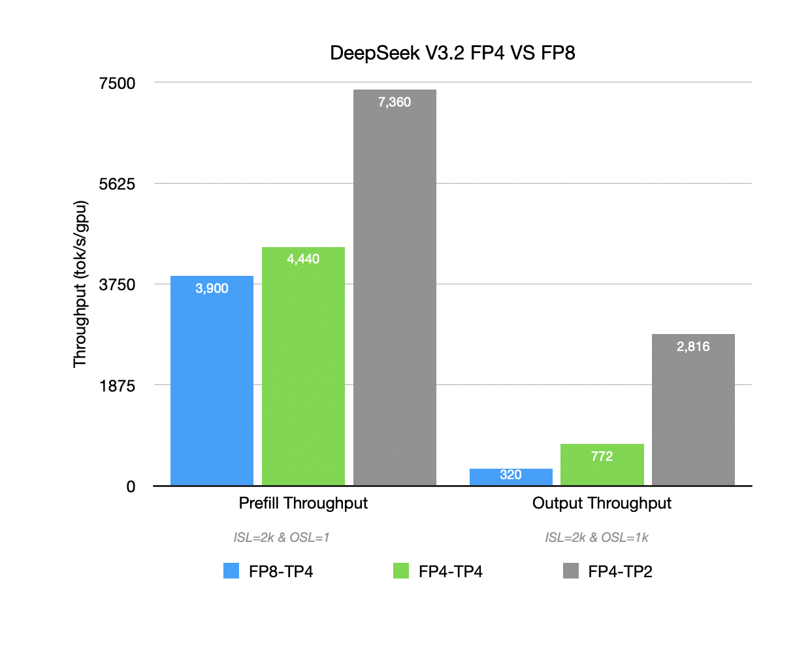

**Figure 1.** V3.2 FP4 vs FP8 throughput. FP8 recipe: switch to FP8 weights, `VLLM_USE_FLASHINFER_MOE_FP8=1`, `-tp 4` (four GPUs).

### Blackwell Ultra vs Hopper (DeepSeek R1)

Same requests, same vLLM, per-GPU total throughput: GB300 (NVL72), B300 (HGX), last-gen H200.

- Prefill-only (ISL=2k): GB300 **14%** above B300, **8×** H200.
- Short-output mixed (ISL=2k, OSL=128): GB300 **12%** above B300, **20×** H200.

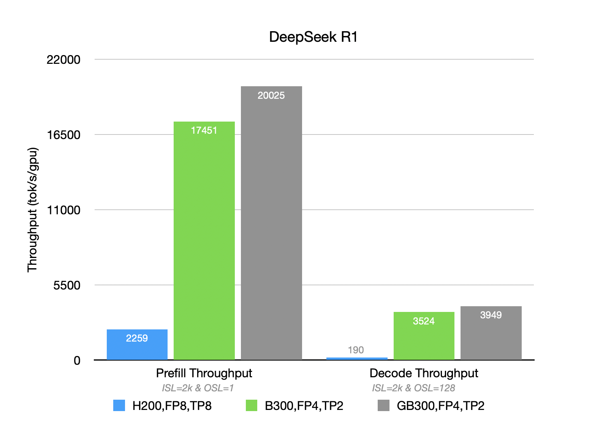

**Figure 2.** R1 per-GPU throughput across H200 / B300 / GB300.

Reasons listed: besides FP4, B300 FLOPs are **7.5×** Hopper (peak ~**15 PFLOPs**); SM SFU attention helps Prefill; **288 GB** is **2×** H200 HBM, bandwidth nearly doubled; Blackwell Ultra NVFP4 FLOPs speed MoE vs Hopper FP8 — a Decode leap. Reference named on the page: [Inside NVIDIA Blackwell Ultra](https://developer.nvidia.com/blog/inside-nvidia-blackwell-ultra-the-chip-powering-the-ai-factory-era/). GB300 still edges B300 even at small intra-node TP2.

## Deployment tuning

### EP2 vs TP2

R1 weights fit two B300 HBMs. Question: scale DP on TP2 or on EP2? EP2 CLI: `-dp=2 --enable-expert-parallel`.

**Prefill-only (ISL=2k, OSL=1).** EP2 (blue) ceiling **22476 TGS**, better throughput and gentler TTFT slope than TP2 (green). EP’s “large packet, low frequency” pattern uses RDMA/NVLink bandwidth under high concurrency. The EP curve fluctuates: unbalanced expert routing changes per-batch expert load and all-to-all volume.

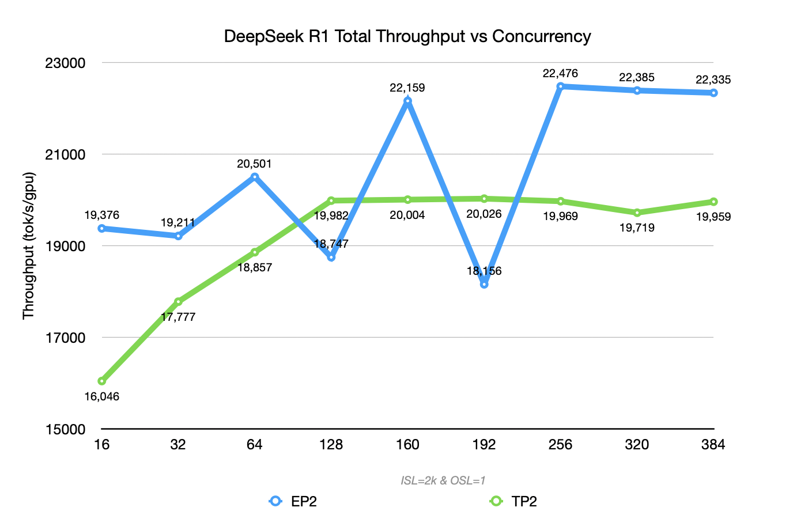

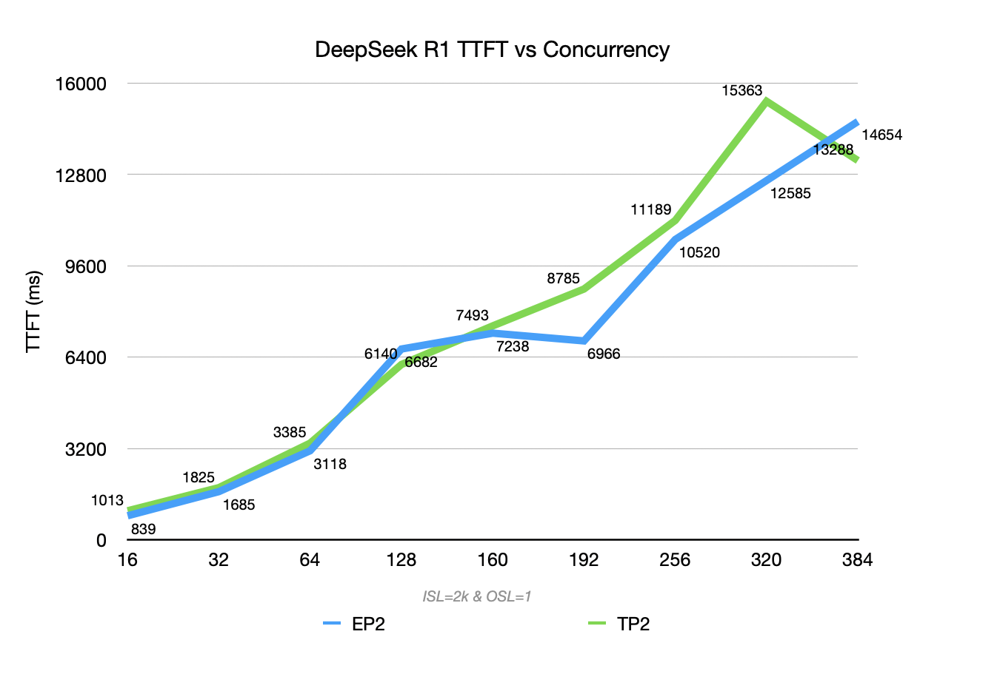

**Figure 3–4.** Prefill-only EP2 vs TP2 throughput and TTFT.

**Short-output mixed (ISL=2k, OSL=64).** TP2 Decode pays inter-GPU communication → TPOT **50% to 2×** worse than EP2. TP also improves TTFT by ~**50%** (faster steps). That offsets TPOT and yields **5%–20%** higher output-token throughput.

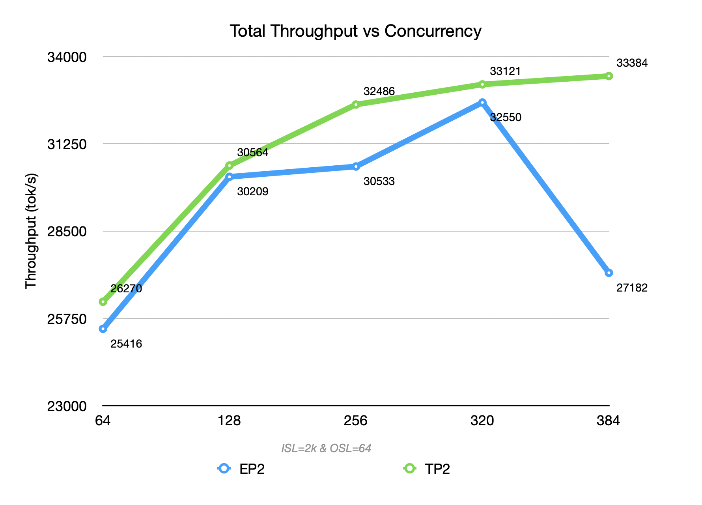

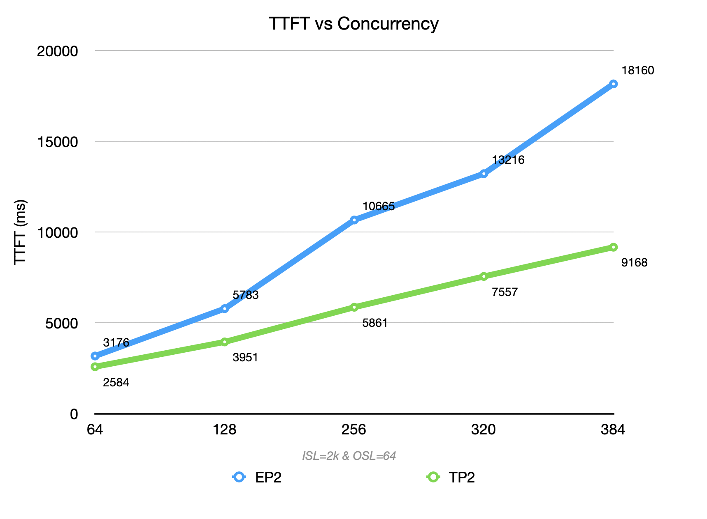

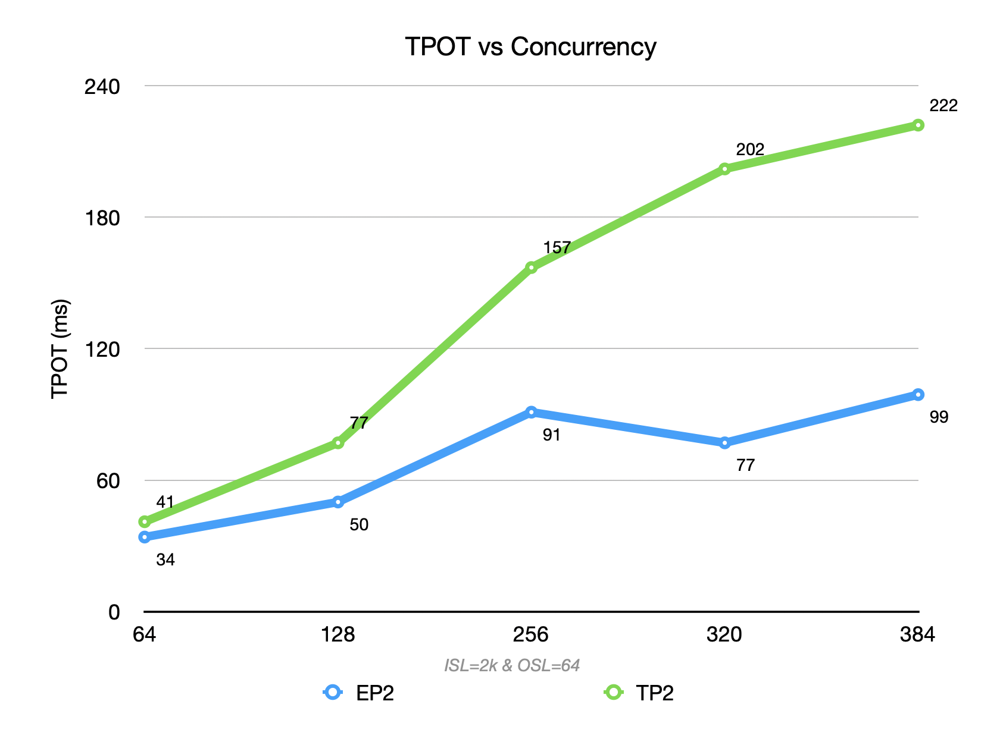

**Figure 5–7.** Mixed P+D throughput / TTFT / TPOT for EP2 vs TP2.

### Conclusions

- Disaggregated Prefill for R1 on GB300: EP is the better prefiller (then raise DP to scale). Prefill ceiling ~**10–15%** above TP2; TTFT grows more slowly — better for queueing and tail latency.
- Colocated P+D: if ISL is large and OSL small, Prefill dominates → **TP2**, so attention latency does not crowd Decode GPU time. Output-heavy: EP2’s TPOT win dominates.

### Benefits of MTP

MTP helps Decode; not always a silver bullet. Built-in draft speculates **1 token** at a time:

```bash
--speculative-config.method mtp \
--speculative-config.num_speculative_tokens 1
```

When context is not long, MTP (blue) beats no-MTP (green) up to concurrency **≤256** (acceptance can exceed **80%**). Throughput drops sharply with MTP at high concurrency.

Mixed ISL=2k / OSL=64: Decode share is tiny. MTP’s extra compute, memory, and scheduling cannot amortize. Low concurrency cannot hide the tax; high concurrency further squeezes Prefill batching. Overall throughput is **lower with MTP** at both ends.

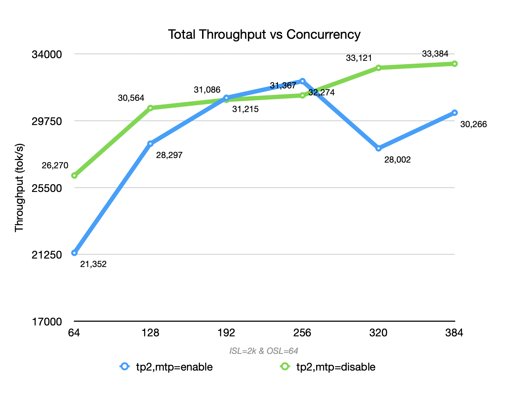

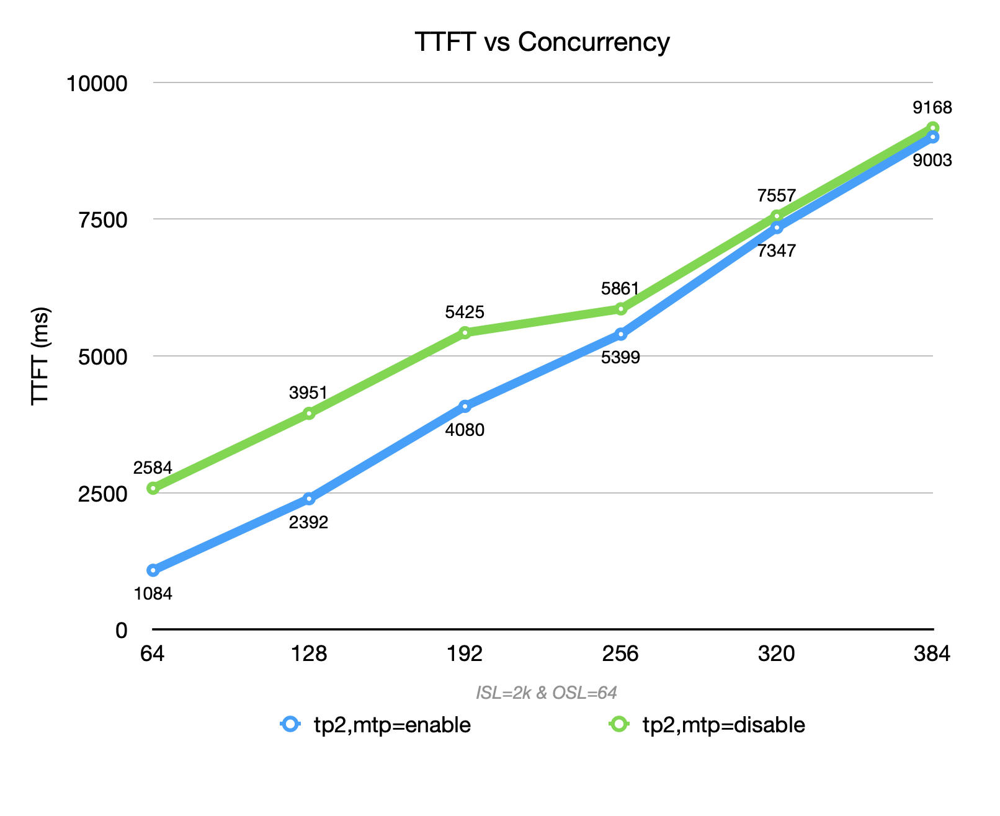

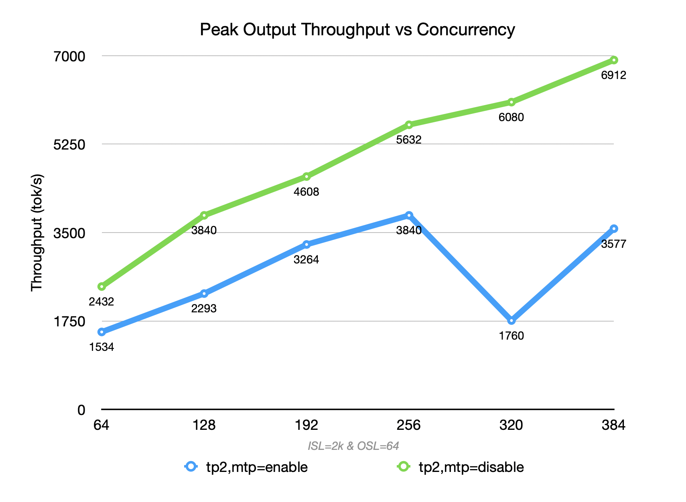

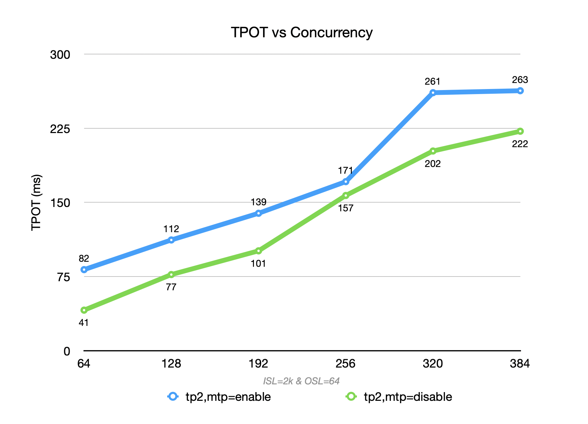

**Figure 8–11.** MTP on / off: throughput, TTFT, peak output, TPOT.

## DeepSeek V3.2 — still way to go

Same GB300 setup: R1 Prefill is ~**3×** V3.2.

- R1 EP2 Prefill peak ~**22476 TGS**.
- V3.2 EP2 Prefill peak ~**7360 TGS**.
- Both TP2: R1 TTFT ~**55%** lower than V3.2.

Mixed ISL=2k / OSL=1k: output throughput and TPOT gaps are **not** significant.

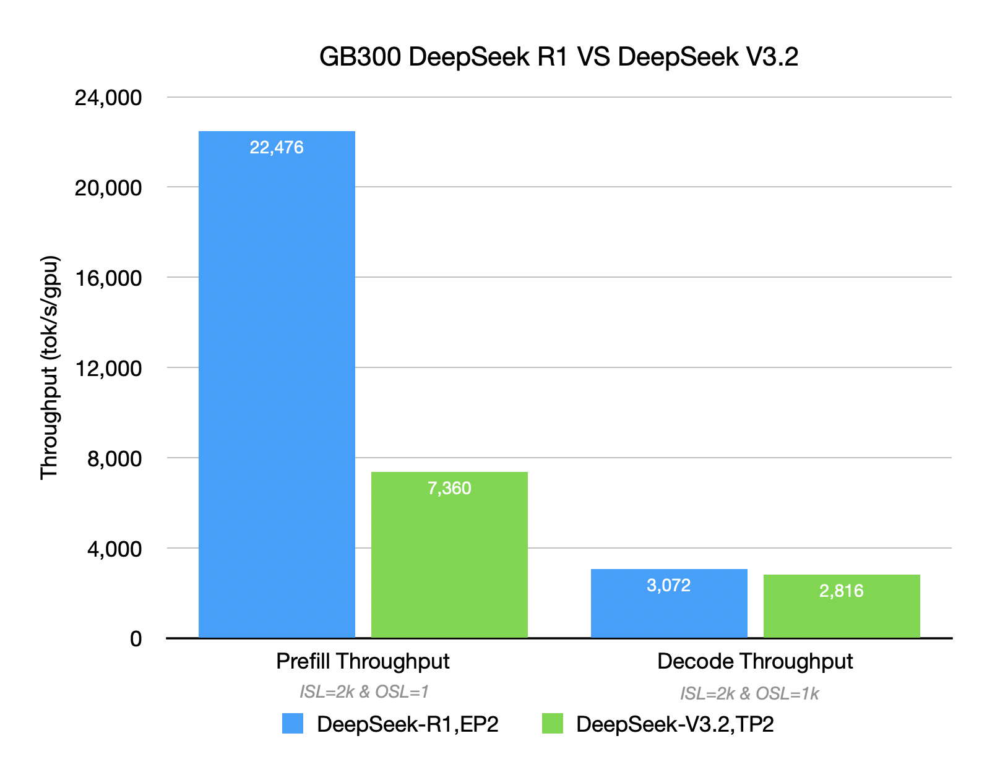

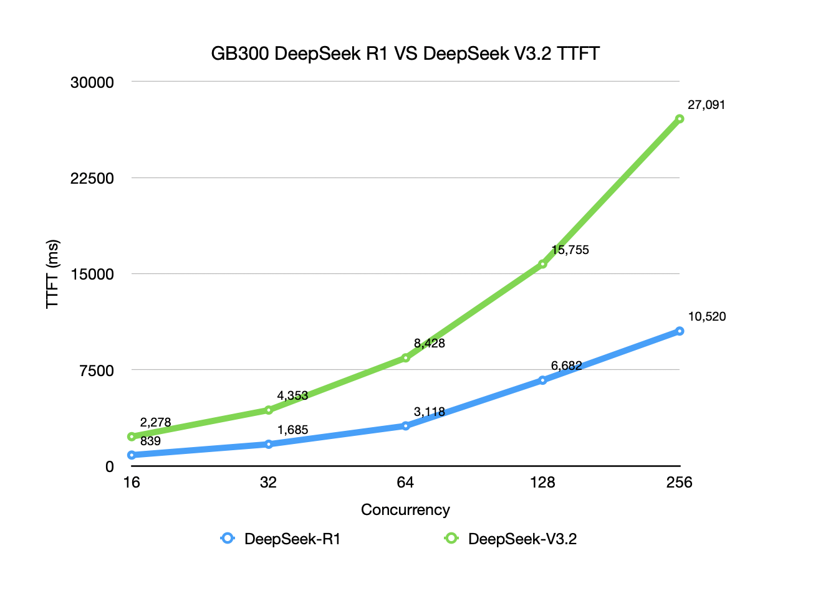

**Figure 12–13.** R1 vs V3.2 throughput and TTFT.

**Why R1 wins Prefill.** V3.2 adds Indexer / Sparse MLA (`Indexer` + `SparseAttnIndexer`) and `DeepseekV32IndexerBackend` with its own cache. Prefill pays extra quant/index compute. Profiling: one DSA layer kernel step is **2.7×** MLA. Apart from the Indexer path, NVFP4 MoE kernel selection is identical — the Prefill gap is Indexer / Sparse Attention. FP8 KV layout detail: [fp8-kvcache.md](fp8-kvcache.md).

DSA pays off on ultra-long context. Short of that, the extra tax shows. As context grows, DSA’s Decode TPOT advantage appears between **10k–20k** tokens and then leads with about a **6×** steeper slope. `DeepseekV32IndexerBackend` is still new.

## Disaggregated Prefill (DeepSeek-V3.2)

Quick-start 1P+1D over RDMA (page previews a later NVL72 GB200 write-up). Nixl KV Connector; both roles **TP2**.

```bash
# Prefill Node
export VLLM_USE_FLASHINFER_MOE_FP4=1
export UCX_NET_DEVICES=mlx5_bond_0:1   # optional, tell NIXL which RDMA NIC
export VLLM_NIXL_SIDE_CHANNEL_HOST=${PREFILL_NODE_IP}
vllm serve nvidia/DeepSeek-V3.2-NVFP4 -tp 2 --max-num-batched-tokens 20480 \
  --kv-transfer-config \
  '{"kv_connector":"NixlConnector","kv_role":"kv_both","kv_load_failure_policy":"fail","kv_buffer_device":"cuda"}' \
  --port 8000

# Decode Node
export VLLM_NIXL_SIDE_CHANNEL_HOST=${DECODE_NODE_IP}
...
# Exactly the same environment variables and vLLM CLI as Prefill Node, except `VLLM_NIXL_SIDE_CHANNEL_HOST`

# Proxy
python tests/v1/kv_connector/nixl_integration/toy_proxy_server.py \
  --port 8000 \
  --prefiller-hosts ${PREFILL_NODE_IP}   --prefiller-ports 8000 \
  --decoder-hosts ${DECODE_NODE_IP}      --decoder-ports   8000
# Multiple P or D: append hosts/ports, e.g. --prefiller-hosts ${IP1} ${IP2} --prefiller-ports 8000 8000

vllm bench serve --model nvidia/DeepSeek-V3.2-NVFP4 \
  --seed $RANDOM --dataset-name random \
  --base-url http://${PROXY_NODE_IP}:8000 \
  --tokenizer /mnt/models/DeepSeek-V3.2   \
  --num-prompts 500    --max-concurrency 100 \
  --random-input-len 4096  --random-output-len 1024 \
  --ignore-eos
```

**Note from the page:** PD disaggregation on v0.14.1 needs the patch from [PR #32698](https://github.com/vllm-project/vllm/pull/32698). Later main already has it.

As concurrency rises, disagg beats colocated on throughput (gap widens) with lower TTFT and TPOT and a stabler latency slope. At batch **256**, disagg holds TPOT within **60 ms**; colocated exceeds **80 ms**. Both 1P1D and 3P1D beat non-disagg on TPOT.

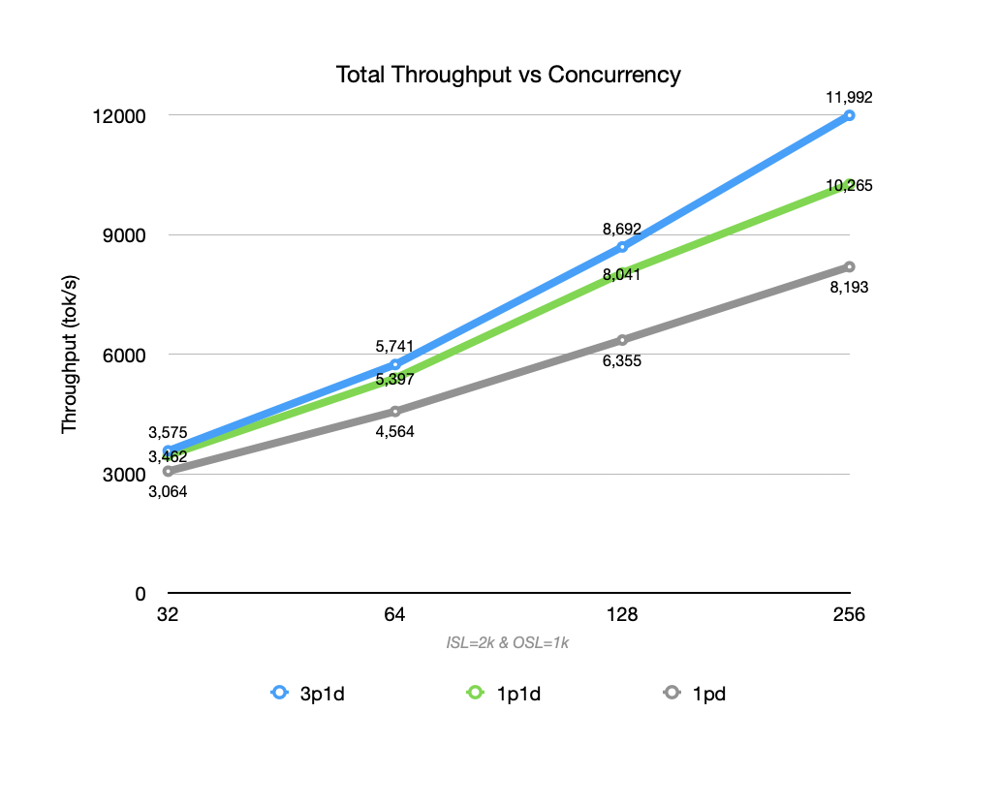

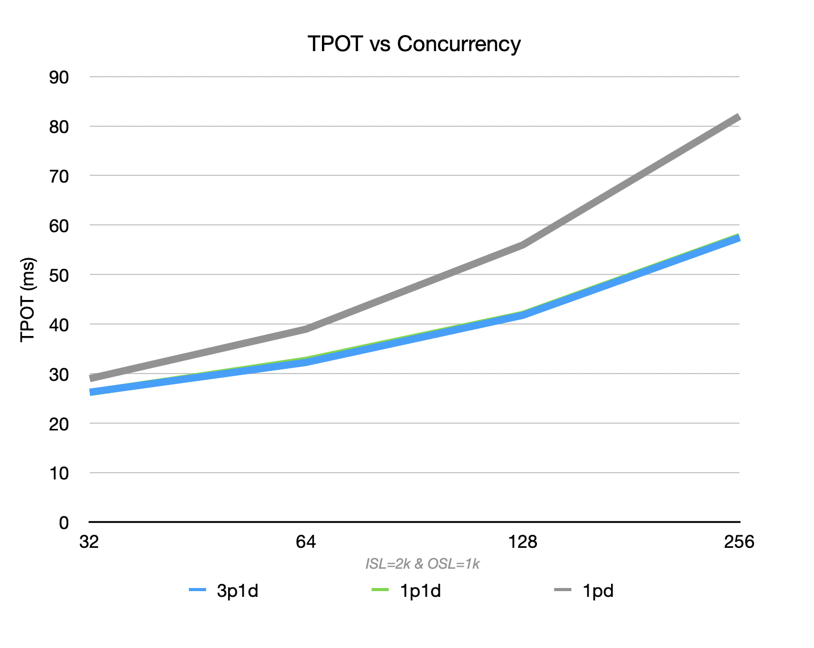

**Figure 14–15.** V3.2 disagg vs colocated throughput and TPOT.

When ISL grows 2k→8k, 1P1D Prefill becomes the bottleneck: requests queue on P, Decoder idles. Adding two P replicas (3P1D) parallelizes more Prefill and raises total throughput. Per-GPU throughput may not peak, but Goodput and SLO improve with more hardware.

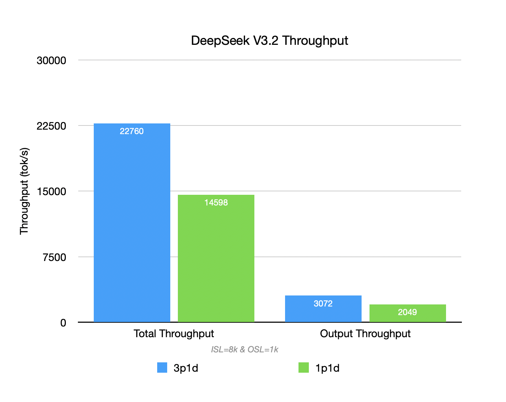

**Figure 16.** ISL=8k: 1P1D vs 3P1D total throughput.

## Acknowledgements (from the page)

- [Verda](https://verda.com/?utm_source=vllm&utm_medium=referral&utm_campaign=gb300-deepseek) for the GB300 cluster.
- DaoCloud: Xingyan Jiang, Nicole Li, Peter Pan, Kebe Liu.
- InferAct: Jie Li, Kaichao You.
