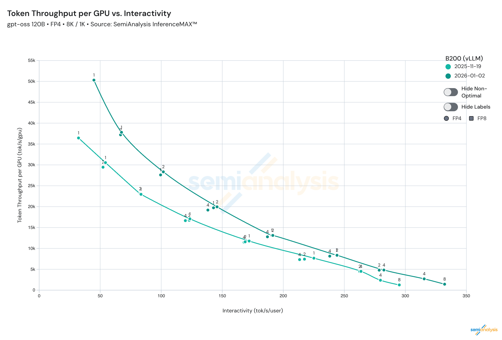

# gpt-oss on Blackwell: push the Pareto, not a single TPS point

Chinese: [zh/vllm/blog/performance/gpt-oss-optimizations.md](../../../../zh/vllm/blog/performance/gpt-oss-optimizations.md)

2026-02-01. **The vLLM and NVIDIA team**. Study note; B200/GB200 benches, not your SLA. Earlier InferenceMAX plate: [blackwell-inferencemax.md](blackwell-inferencemax.md). Day-0 model note: [gpt-oss.md](../serving/gpt-oss.md). `torch.compile` door: [torch-compile.md](../architecture/torch-compile.md). FP8 KV layout: [fp8-kvcache.md](fp8-kvcache.md). Continuous boards: [SemiAnalysis Inference MAX](https://inferencemax.semianalysis.com/) and [vLLM Recipes](https://docs.vllm.ai/projects/recipes/en/latest/OpenAI/GPT-OSS.html). System TPS ≠ per-user TPS.

**TL;DR from the page:** gpt-oss-120b MXFP4 MoE on Blackwell. Hardware–software co-design with FlashInfer, `torch.compile` fusions, async scheduling, stream interval. Max-throughput ~**+38%**, min-latency ~**+13%** — both ends of the Pareto (TPS/GPU vs TPS/user). Recipe: `--cuda-graph-capture-size 2048`; high concurrency `--api-server-count 20` or `--stream-interval 20`; `VLLM_USE_FLASHINFER_MOE_MXFP4_MXFP8=1`. DEP2 projected better than TP, measured worse (wrong MoE kernel). Track [Issue #30758](https://github.com/vllm-project/vllm/issues/30758).

## Introduction

A single metric — max TPS or single-batch latency — is the wrong objective. Workloads differ in latency SLO and concurrency. The curve that matters is the **Pareto frontier**: TPS per GPU (TCO) vs TPS per user (interactivity). Up and to the right = faster per user **and** more users on the same silicon. InferenceMAX exists to measure that envelope.

`gpt-oss-120b` is natively 4-bit (MXFP4) MoE. SoTA-for-size plus agentic claims on the page. vLLM served it on B200/GB200 at the InferenceMAX showcase. Blackwell brings native FP4 Tensor Cores and **192 GB** HBM per GPU — necessary, not sufficient. The rest is kernel fusion, less communication, host–device overlap.

## FlashInfer + torch.compile fusion

FlashInfer is the primary kernel backend for attention, MoE, and other fused compute on Blackwell.

**Compute kernels:**

- **MoE:** `trtllm-gen` ([#23819](https://github.com/vllm-project/vllm/pull/23819)) and CUTLASS ([#23696](https://github.com/vllm-project/vllm/pull/23696)) backends through FlashInfer. Pick the faster expert-routing / compute kernel. FlashInfer also JIT-compiles, autotunes, and caches kernels.
- **FP8 KV-cache:** more in-flight requests in the same KV budget; some attention math in FP8 cuts compute/memory. FlashInfer attention kernels: [#25674](https://github.com/vllm-project/vllm/pull/25674/).

**Graph fusions via `torch.compile`.** Not hardcoded fusion. vLLM’s [compilation infra](https://github.com/vllm-project/vllm/tree/main/vllm/compilation) fuses automatically — cheaper to generalize and keep.

- **AR + RMSNorm:** AllReduce fused with RMSNorm. Matters on TP, where communication otherwise dominates. [#20691](https://github.com/vllm-project/vllm/pull/20691).
- **Pad+Quant / Finalize+Slice:** rolling out ([#30647](https://github.com/vllm-project/vllm/pull/30647)) on the MoE path; expected ~**6%**.

New fused ops keep landing through the same infra.

## Runtime improvements

On Blackwell the GPU can idle waiting for the host: kernel dispatch, `prepare_batch`, scheduling, sampling. Gaps between kernels.

**Async scheduling** ([#23569](https://github.com/vllm-project/vllm/pull/23569)):

- CPU prepares the next batch while the GPU still runs the current one.
- ~**10%** on more capable GPUs (H200 / B200 / GB200). High-throughput **and** min-latency for gpt-oss.
- Default in later vLLM releases.

**Stream interval** ([#27869](https://github.com/vllm-project/vllm/pull/27869)):

- Buffer later tokens before the HTTP/gRPC send. **First token still goes immediately** (TTFT stays low).
- Cuts CPU tax from per-token serialization. gpt-oss-20b @ **1024** concurrency: they quote ~**57%** e2e — that is the **output-queue** bottleneck loosening, not a 57% kernel. Also better TPOT.
- `--stream-interval <num_tokens>`. Default `1`. High-throughput recipes try `10` or `20`.

## Deployment recipes

Most of this is default on a current release. To reproduce gpt-oss on B200/GB200 (also on the Recipes page):

- `--cuda-graph-capture-size 2048`
- High concurrency: `--api-server-count 20` **or** `--stream-interval 20` (decouple HTTP from the engine)
- MoE: `VLLM_USE_FLASHINFER_MOE_MXFP4_MXFP8=1` (CUTLASS FP8/FP4 MoE)

## Results

Since the [InferenceMAX launch post](https://vllm.ai/blog/2025-10-09-blackwell-inferencemax): **+38%** at max-throughput, **+13%** at min-latency — across the curve, not one operating point.

**Figure (page).** gpt-oss-120b 8K/1K Pareto, November → January.

## Next steps ([Issue #30758](https://github.com/vllm-project/vllm/issues/30758))

- **Disaggregation.** Prefill and Decode on different GPUs; still hunting configs that beat colocated TPS/GPU.
- **DEP2.** Projection: Attention DP + MoE EP on 2 GPUs should beat TP1/TP2 at the same TPS/user. Measured: **worse**, MoE kernel selection. Active fix.
- **Min-latency** (TP8, concurrency 8): RoPE+Q+Cache fusion (kernel in FlashInfer, vLLM integration in progress); specialized tiny GEMMs for router / `fc_qkv` / `fc_o_proj` with PDL.

## Acknowledgements (from the page)

- Red Hat: Michael Goin, Alexander Matveev, Lucas Wilkinson, Luka Govedič, Wentao Ye, Ilia Markov, Matt Bonanni, Varun Sundar Rabindranath, Bill Nell, Tyler Michael Smith, Robert Shaw
- NVIDIA: Po-Han Huang, Pavani Majety, Shu Wang, Elvis Chen, Zihao Ye, Duncan Moss, Kaixi Hou, Siyuan Fu, Benjamin Chislett, Xin Li, Vadim Gimpelson, Minseok Lee, Amir Samani, Elfie Guo, Lee Nau, Kushan Ahmadian, Grace Ho, Pen Chun Li
- vLLM: Chen Zhang, Yongye Zhu, Bowen Wang, Kaichao You, Simon Mo, Woosuk Kwon, Zhuohan Li
- Meta: Yang Chen, Xiaozhu Meng, Boyuan Feng, Lu Fang
