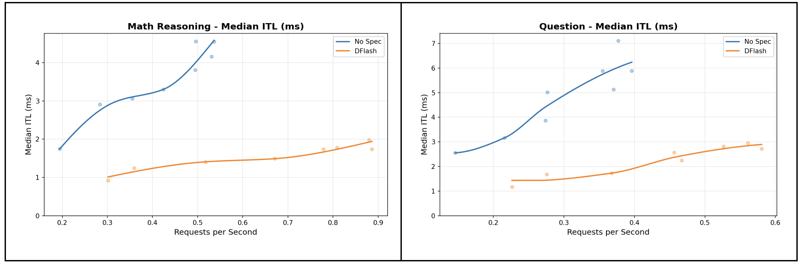

# Laguna XS.2: day-0 serve + DFlash draft + LLM Compressor checkpoints

Chinese: [zh/vllm/blog/performance/laguna-xs2.md](../../../../zh/vllm/blog/performance/laguna-xs2.md)  
Poolside 33B-A3B MoE, agentic coding. Parallel drafting: [parallel-drafting](parallel-drafting.md).

First-class vLLM. DFlash: 5-layer 0.6B draft, target hidden states, **8 tokens in one forward**, one verify pass. They quote **2–3×** with no quality loss vs autoregressive (accept-or-reject). Trained on Ultrachat + Magpie regenerated from Laguna with thinking on, 6 epochs, seq 8192. LLM Compressor ships FP8 / NVFP4 / INT4 / INT8 compressed-tensors. Full CLI lives in vLLM Recipes, not copied here.

Local figures (copyright remains with the original site; study copies):

