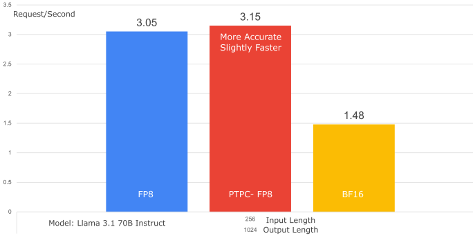
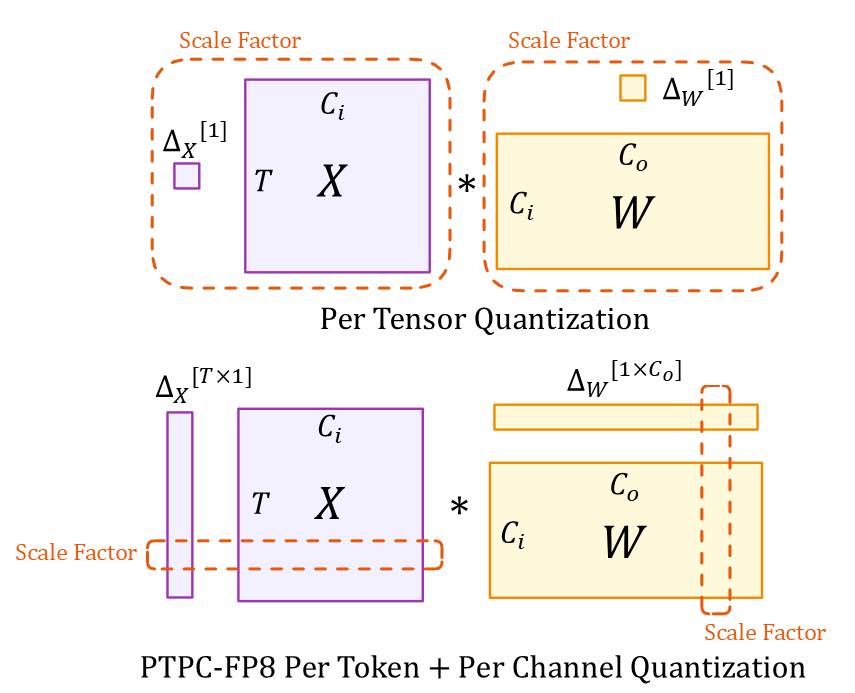
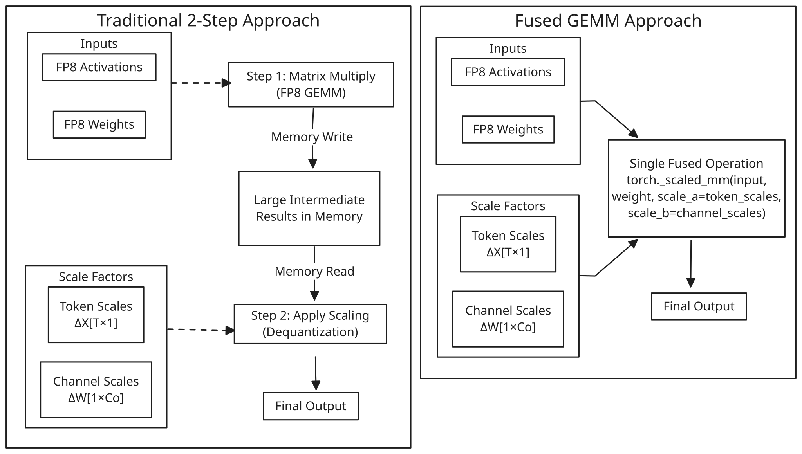
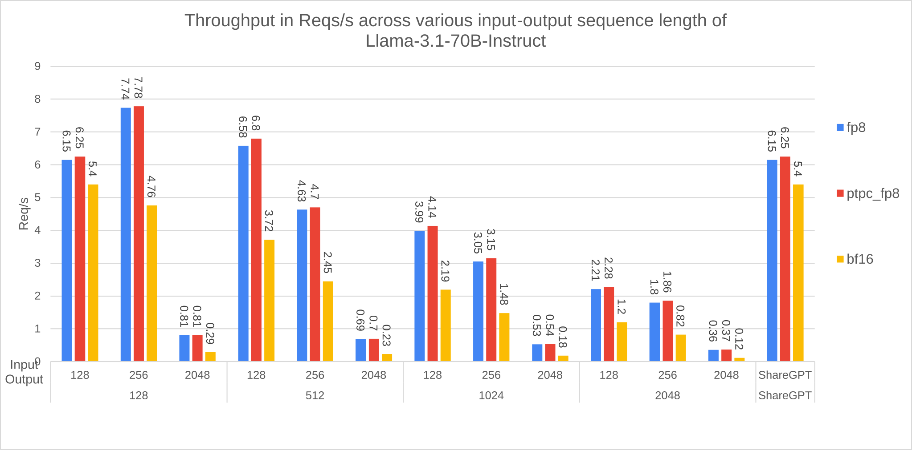
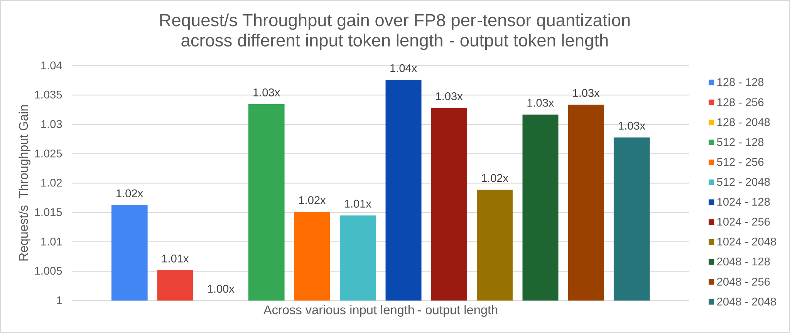
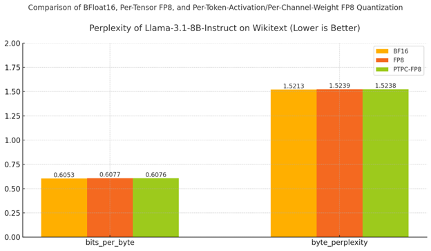
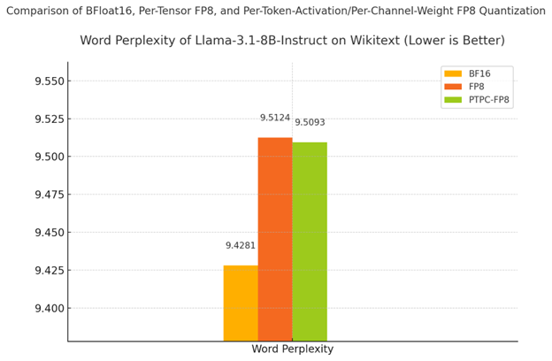
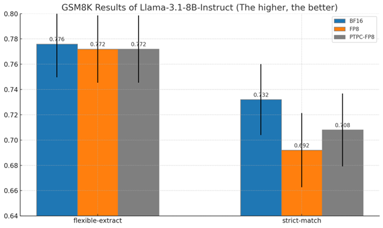
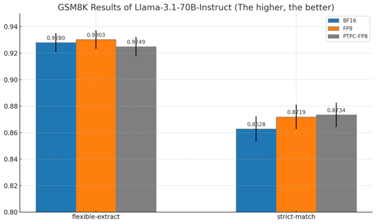

# PTPC-FP8: closer-to-BF16 FP8 on ROCm

Chinese: [zh/vllm/blog/performance/ptpc-fp8.md](../../../../zh/vllm/blog/performance/ptpc-fp8.md)  
vLLM ≥0.7.3. MI300X demos.

`--quantization ptpc_fp8`: quantize HF weights **on the fly**. Per-token activation scales, per-channel weight scales — outliers sit in the same channels; per-tensor FP8 starves most values of bits.

Naive path: GEMM then two scale multiplies, extra HBM. ROCm fuses `torch._scaled_mm(..., scale_a=token_scales, scale_b=channel_scales)` — up to ~**2.5×** vs two steps. Llama-3.1-70B SharedGPT throughput ≈ per-tensor FP8 (~1.01×). 8B Wikitext word perplexity: BF16 9.4281, PTPC 9.5093 (+0.86%), standard FP8 9.5124. GSM8K 8B strict-match: BF16 73.2%, PTPC 70.8%, standard FP8 69.2%. 70B PTPC sometimes beats BF16 — treat as noise, not free accuracy.

Their example also disabled chunked prefill and used multi-step scheduling; trust your version’s docs. Not [FP8 KV](fp8-kvcache.md): this is **weight** quant, not KV dtype.

Local figures (copyright remains with the original site; study copies):

