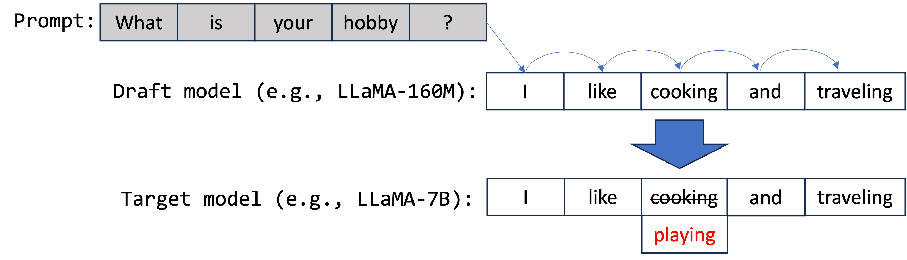
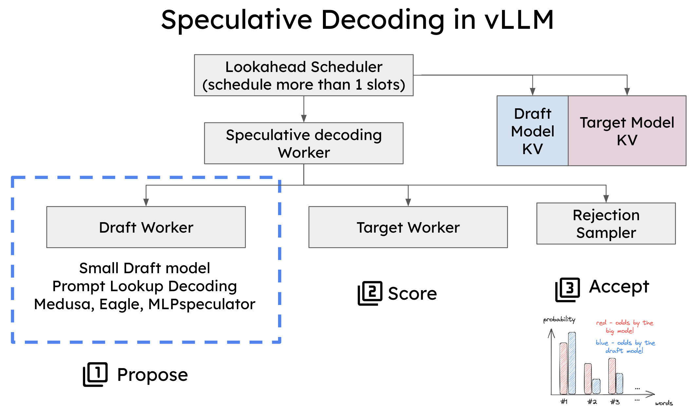
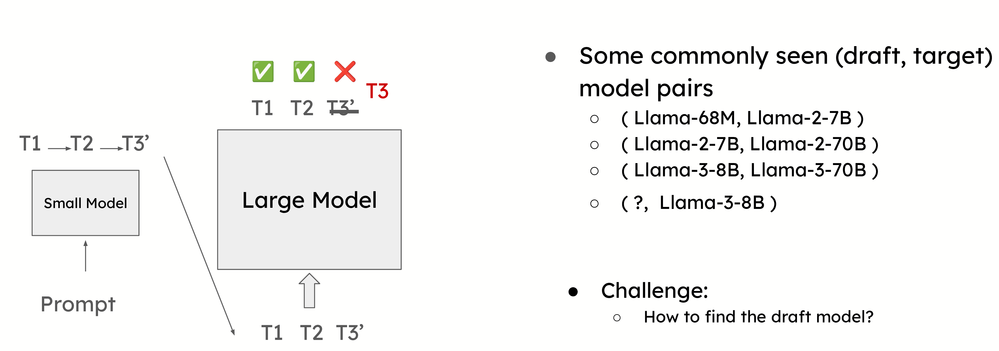
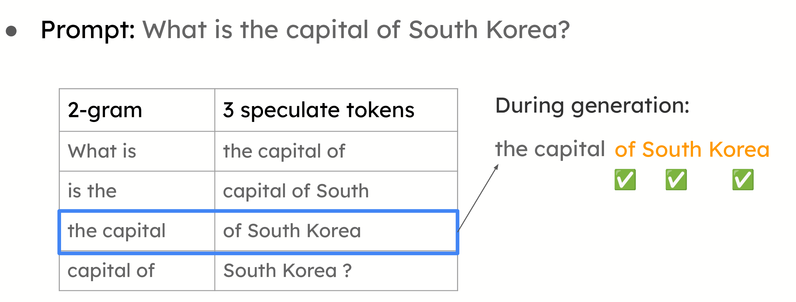
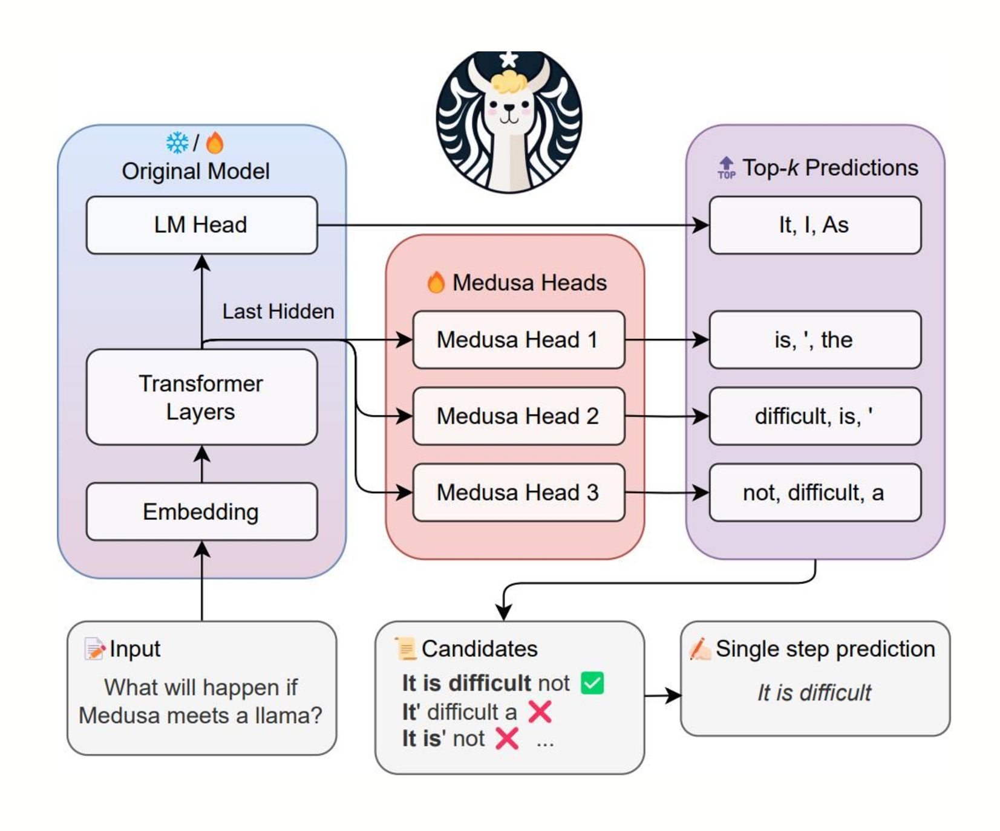
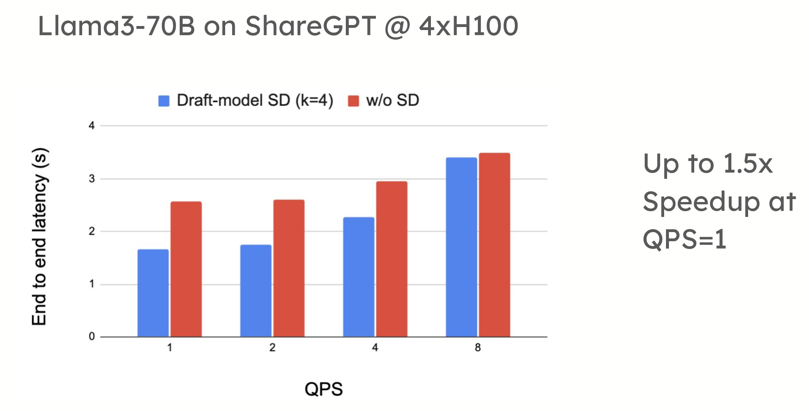
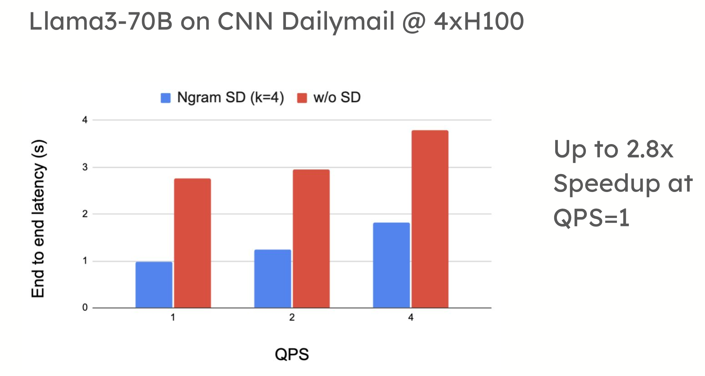
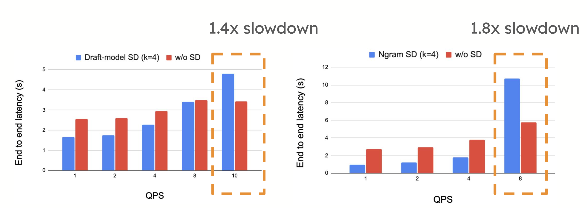
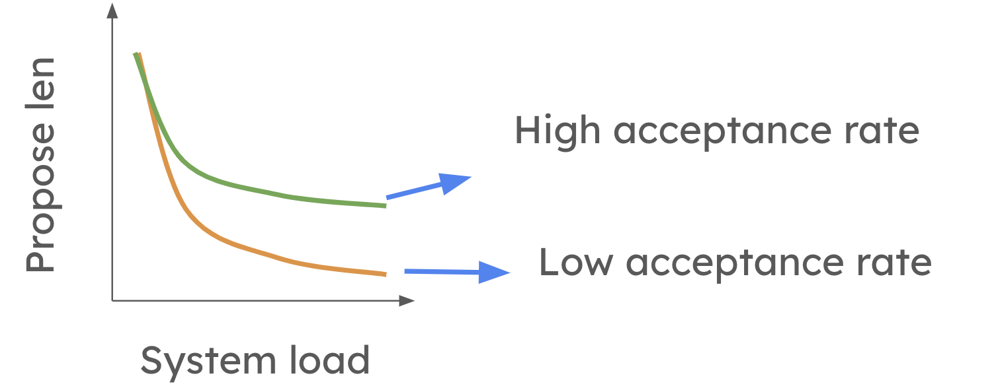

# How Speculative Decoding Boosts vLLM (up to 2.8×)

2024-10-17 Office Hours write-up. Flags are of that vintage — use current `speculative_decoding` docs. Figures / slides / recording on the official page.


Local figures (copyright remains with the original site; study copies):




















## Mechanism (Leviathan et al. 2023)

Draft model proposes tokens; target verifies the sequence in **one** forward pass, keeps a prefix, corrects the first miss. Lossless vs the target distribution. Example: draft `["I","like","cooking",…]` → target rewrites third token to `"playing"` → accept `["I","like","playing"]`.

## In vLLM

Continuous batching stays. **Draft runner** + **target runner**. Scheduler: multiple token slots per forward. Memory manager: two KV caches.

## Three draft styles

1. **Separate draft model** (e.g. 68M for Llama-2-70B). Same vocab required — often a blocker for Llama 3.
2. **Prompt lookup / n-gram** — summarization/QA where the answer copies the prompt. No second weight file.
3. **Medusa / EAGLE / MLPSpeculator** — extra heads on the target for parallel positions.

## When it helps

Low QPS (they show QPS=1), Llama-3-70B 4×H100: up to **1.5×** with a Qwama-0.5B draft on ShareGPT; up to **2.8×** n-gram on CNN/DailyMail.

High QPS, same 70B/4×H100: **1.4× slower** (ShareGPT), **1.8× slower** (CNN/DailyMail). Compute-bound serving pays for propose+verify and loses.

Roadmap then: **dynamic speculative decoding** — shorten proposals under load, less so when acceptance is high.

## Then-current offline API

```python
LLM(model="facebook/opt-6.7b", speculative_model="facebook/opt-125m", num_speculative_tokens=5)
LLM(model="facebook/opt-6.7b", speculative_model="[ngram]", num_speculative_tokens=5,
    ngram_prompt_lookup_max=4, ngram_prompt_lookup_min=1)
LLM(model="meta-llama/Meta-Llama-3.1-70B-Instruct", tensor_parallel_size=4,
    speculative_model="ibm-fms/llama3-70b-accelerator",
    speculative_draft_tensor_parallel_size=1)
```
