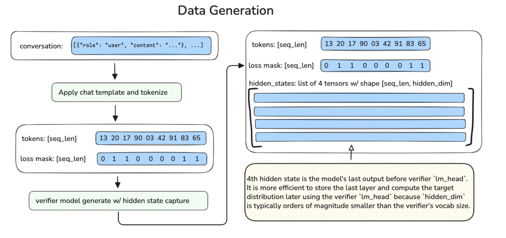
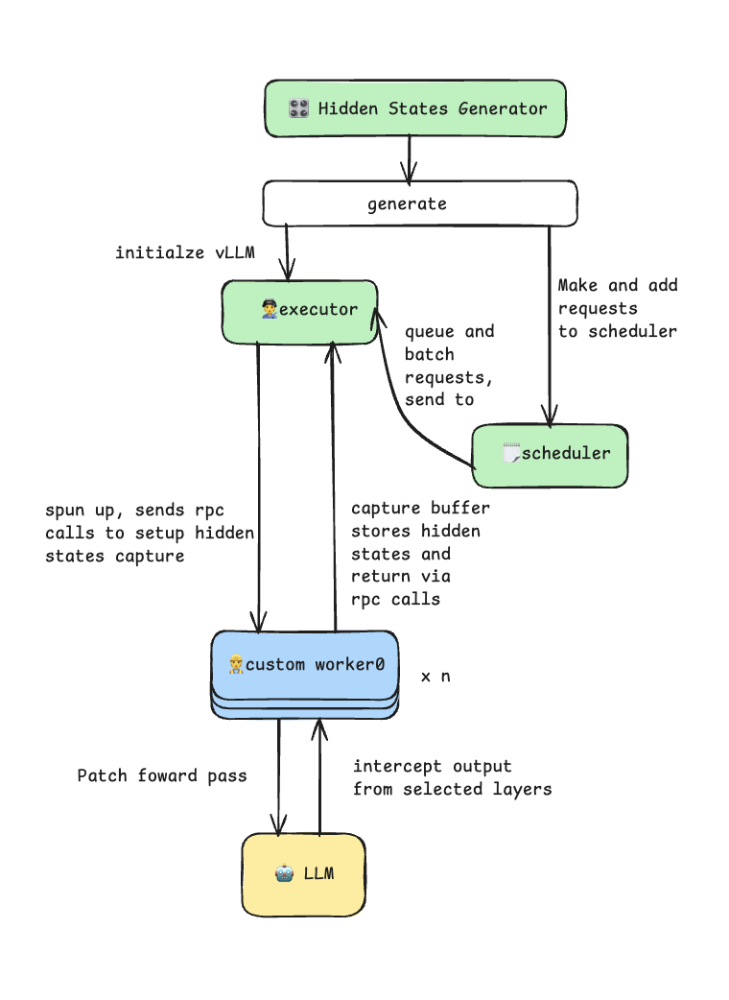
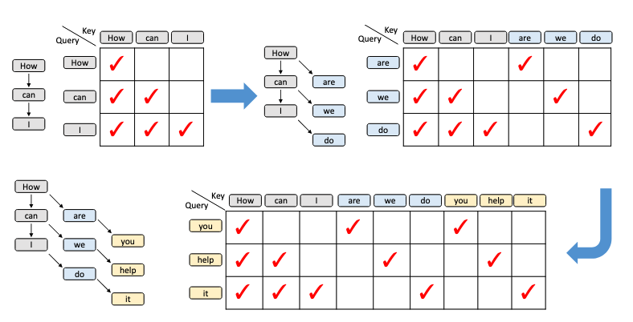
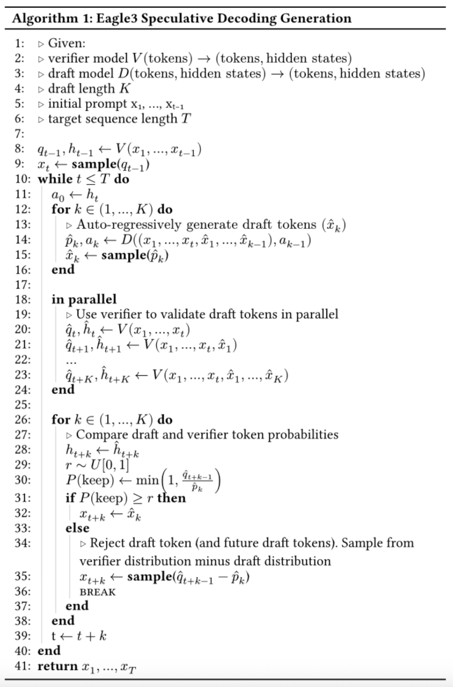

# Diving into speculative decoding training support for vLLM with Speculators v0.3.0

Chinese: [zh/vllm/blog/performance/speculators-v030.md](../../../../zh/vllm/blog/performance/speculators-v030.md)

2025-12-13. **Fynn Schmitt-Ulms, Helen Zhao, Rahul Tuli and Dipika Sikka (Red Hat AI Model Optimization Team)**. Repo: [vllm-project/speculators](https://github.com/vllm-project/speculators), release [v0.3.0](https://github.com/vllm-project/speculators/releases/tag/v0.3.0). Study note. Later DFlash / online training: [v0.5.0](speculators-v050.md). Hidden export later became an engine feature: [extract-hidden-states](../architecture/extract-hidden-states.md). Accept math still [spec-decode](spec-decode.md). Parallel-drafting overview: [parallel-drafting](parallel-drafting.md).

Each verifier wants its own draft. Training that draft is hard; production-ready training utilities aimed at vLLM were scarce. v0.3.0 wires offline data → train → `vllm serve`. Numbers on the page are their ranges, not your SLA.

## Key highlights

- Speculative decoding can cut inference latency, but a unique draft per LLM is costly, and vLLM-ready training utilities were thin.
- [Speculators v0.3.0](https://github.com/vllm-project/speculators/releases/tag/v0.3.0) trains Eagle3 drafts end-to-end that run in vLLM.
- Training: offline data generation with vLLM; single- and multi-layer drafts; MoE and non-MoE verifiers.

## Inference at scale

A decade of larger, more capable LLMs raised the inference bill. Tokens are sequential: each step is a full forward through billions of parameters. As size grows, that sequential work is the bottleneck — capable, often slow.

Speculative decoding is the optimization this post starts from: a small draft proposes, the large verifier checks in parallel, and “one token per forward” is no longer the only shape. The rest of the page introduces [Speculators](https://github.com/vllm-project/speculators) and the [v0.3.0](https://github.com/vllm-project/speculators/releases/tag/v0.3.0) release: researchers, engineers, and ML practitioners can build speculative-decoding models end-to-end with vLLM serving.

## What is speculative decoding?

Speculative decoding lets an LLM emit **several tokens in one verifier forward**. A cheap, fast **draft** (often a single transformer block) predicts a few tokens autoregressively. The full-size **verifier** (the LLM you actually serve) processes those candidates in parallel. Per token, it agrees or not: a reject discards the rest of the sequence; accepts land in the response.

Advantages listed:

1. The final response is from the **same distribution** as the verifier alone — no quality drop from the algorithm itself.
2. The verifier can generate **multiple tokens in parallel**.
3. The draft is small, so overhead is usually modest.

Together, latency can drop by about **1.5–3×** — the page’s range, when the draft is aligned.

## Using speculative decoding models in vLLM

vLLM and Speculators make serving a speculator about as short as `vllm serve` on any other model. Speculative decoding pays off most at **low throughput**, when the GPU is not saturated and the verifier’s parallel check has headroom. The draft also has to **match** the verifier, which is why drafts are trained **per verifier**. Training that draft used to be slow; Speculators shortens the path and the artifact plugs into vLLM.

## Creating new draft models

SOTA on the page is Eagle3 ([Zhang et al., 2025](https://arxiv.org/abs/2503.01840)).

Eagle3 drafts take hidden states from **three** verifier layers, plus token ids, and autoregressively emit draft tokens.

Training data therefore needs:

1. Verifier hidden states from three intermediate layers
2. Token ids
3. A loss mask (train on model responses, ignore user prompts)
4. Verifier output probabilities (the training target)

### Data generation

Pulling those tensors straight out of vLLM is non-trivial. v0.3.0 does **offline** generation through a hidden-states generator: hidden tensors from ordinary LLM text datasets, written to disk for training.

Three parts: preprocess, generate hidden states, save.

Local figures (copyright remains with the original site; study copies):



**Figure 1.** Offline data-generation overview: conversations are preprocessed, then hidden states are captured and saved.

Preprocessing takes a raw dataset and:

1. Reformats and normalizes conversation turns
2. Applies the model’s chat template
3. Tokenizes
4. Builds loss masks from assistant-response spans
5. Saves with token ids
6. Collects token-frequency stats for later

The loss mask trains only on **machine-generated** tokens. Reasoning models often insert thinking tokens only in the **last** turn; Speculators has a flag to randomly drop turns so the model sees varied conversation lengths.

The hidden-states generator uses the vLLM plugin path: a custom worker extension patches the forward pass and intercepts intermediate hidden states in **Prefill**. It uses vLLM’s multiprocess executor for batched inference and tensor parallelism for larger models.



**Figure 2.** Capturing hidden states in Prefill: a plugin worker intercepts the forward; the multiprocess executor drains the work.

Each sample is one `.pt` file:

- `input_ids`
- `hidden_states` — a list of tensors, one per captured layer
- `loss_mask`

Async I/O via `ThreadPoolExecutor` writes while generation continues.

Two extra files:

- `data_config.json` — generation metadata
- `token_freq.pt` — token frequencies

`token_freq.pt` builds target-to-draft (**t2d**) and draft-to-target (**d2t**) maps: the verifier’s full vocab down to a smaller draft vocab of the most frequent tokens.

Scripts:

- [`data_generation_offline.py`](https://github.com/vllm-project/speculators/blob/main/scripts/data_generation_offline.py) — preprocess, token frequencies, hidden states
- [`build_vocab_mapping.py`](https://github.com/vllm-project/speculators/blob/main/scripts/build_vocab_mapping.py) — t2d / d2t tensors

### Training

v0.3.0 trains Eagle3 drafts. Inputs: the samples and vocab maps plus model config, initializing an `Eagle3DraftModel`. Training uses the authors’ **train-time-testing**: simulate multi-step draft sampling so the model learns not only the first token but later ones.



**Figure 3.** Train-time-testing and the stepwise attention mask, from the Eagle3 paper ([Zhang et al., 2025](https://arxiv.org/abs/2503.01840)). For every prefix the draft emits a next token (blue); then prefix+first-step emits a second (yellow); and so on.

The mask is **sparse**; ordinary attention is a compute and memory tax. Speculators uses FlexAttention ([He et al., 2024](https://arxiv.org/abs/2412.05496)): split the mask into blocks and compute only non-empty regions. With `torch.compile`, that is faster and cuts activation VRAM in the backward pass.

Batching: sequences differ in length. Truncation + padding works when lengths are uniform and wastes compute when they are not. v0.3.0 concatenates along the **sequence** dim and configures attention masks so the pieces stay separate sequences. That fits FlexAttention; an intelligent packer that fills close to max sequence length helps further.

Together: fast, memory-efficient Eagle3 training, one [`train.py`](https://github.com/vllm-project/speculators/blob/main/scripts/train.py).

## Running Speculators models in vLLM

After training, the library writes a full artifact whose `config.json` includes `speculators_config`. Short serve:

```bash
vllm serve RedHatAI/Llama-3.1-8B-Instruct-speculator.eagle3
```

vLLM reads speculative settings from `speculators_config` (verifier name, and so on) and loads draft + verifier in one server. The config is a standardized, self-contained description of how the model should run. See the [appendix](#speculators_config).

Short form is for getting started. Long form is for control: a different verifier than the config, or tuning `num_speculative_tokens`. Serve the base verifier and point `--speculative-config` at the speculator. Example with a quantized verifier:

```bash
vllm serve RedHatAI/Qwen3-8B-FP8-dynamic \
  --tensor-parallel-size 1 \
  --gpu-memory-utilization 0.9 \
  --speculative-config '{"model": "RedHatAI/Qwen3-8B-speculator.eagle3", "num_speculative_tokens": 5, "method": "eagle3"}'
```

FP8 Qwen3-8B as verifier (not the BF16 default in `speculators_config`); speculative tokens **5** instead of default **3**. A knob on the page, not a promise.

## vLLM integration: production-ready speculative decoding

Tight Speculators ↔ vLLM wiring is what turns the research trick into a serving feature. Eagle3 in vLLM then covered:

**vLLM serving and Speculators training:**

- Llama (3.1, 3.2, 3.3): 8B to 70B
- Qwen3: 8B, 14B, 32B
- Qwen3 MoE: 235B-A22B
- GPT-OSS: 20B, 120B

**vLLM serving only then:**

- Multimodal: Llama 4 vision-language models

## What’s next

Planned on the page:

- **Online** data generation (hidden states while training, no intermediate disk cache)
- Data generation for vision-language models
- Regenerating verifier responses (replace dataset assistant text with verifier output for better-aligned data)

Online training later lands in [v0.5.0](speculators-v050.md), with hidden extraction via [extract-hidden-states](../architecture/extract-hidden-states.md).

## Get involved

Repo: [Speculators](https://github.com/vllm-project/speculators). [Good First Issues](https://github.com/vllm-project/speculators/issues) welcome patches.

- **Docs:** https://docs.vllm.ai/projects/speculators/en/latest/
- **vLLM Slack:** `#speculators`, `#feat-spec-decode`
- **Data-generation and training scripts:** https://github.com/vllm-project/speculators/blob/main/scripts/README.md
- **End-to-end examples:** https://github.com/vllm-project/Speculators/tree/main/examples/data_generation_and_training
- Trained models: [Red Hat AI Hub](https://huggingface.co/collections/RedHatAI/speculator-models)

## Appendix

### Eagle3 algorithm



**Figure 4.** Eagle3: three verifier hidden layers into the draft, then autoregressive draft tokens.

### `speculators_config`

Example as printed (key capitalization as on the page):

```yaml
{
  "architectures": ["Eagle3Speculator"],
  "auto_map": {"": "eagle3.Eagle3SpeculatorConfig"},
  "Speculators_model_type": "eagle3",
  "Speculators_version": "0.3.0",

  "draft_vocab_size": 10000,
  "transformer_layer_config": {
    "num_hidden_layers": 1,
    "hidden_size": 4096,
    ...
  },

  "Speculators_config": {
    "algorithm": "eagle3",
    "proposal_methods": [{
      "proposal_type": "greedy",
      "speculative_tokens": 3,
      ...
    }],
    "verifier": {
      "name_or_path": "meta-llama/Llama-3.1-8B-Instruct",
      "architectures": ["LlamaForCausalLM"]
    }
  }
}
```

The config defines the speculator as a complete model:

- **Identity:** `architectures` (e.g. `Eagle3Speculator`); `auto_map` (Hugging Face custom load); `Speculators_model_type`
- **Draft architecture:** `transformer_layer_config`; `draft_vocab_size` (reduced vocab, typically **10k–32k** on the page); model-specific options
- **Speculative decoding:** `algorithm` (EAGLE3); `proposal_methods` (`speculative_tokens`, `verifier_accept_k`, `accept_tolerance`); `verifier` `name_or_path` and `architectures` (compatibility checks)
