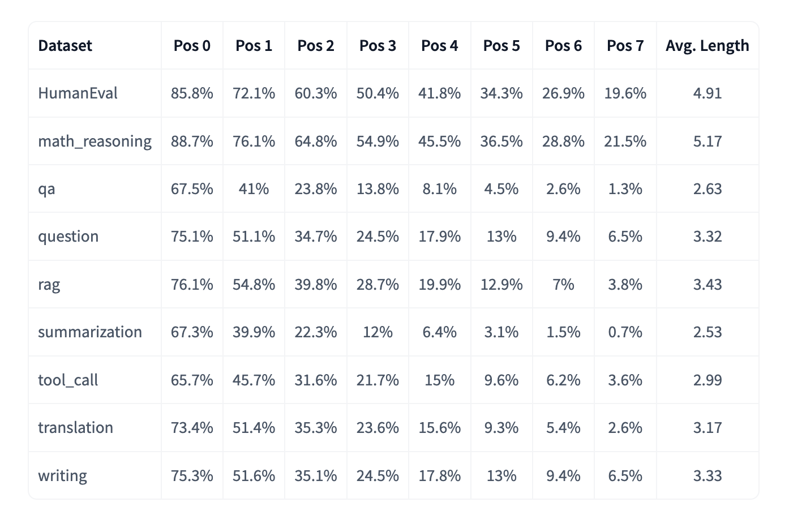
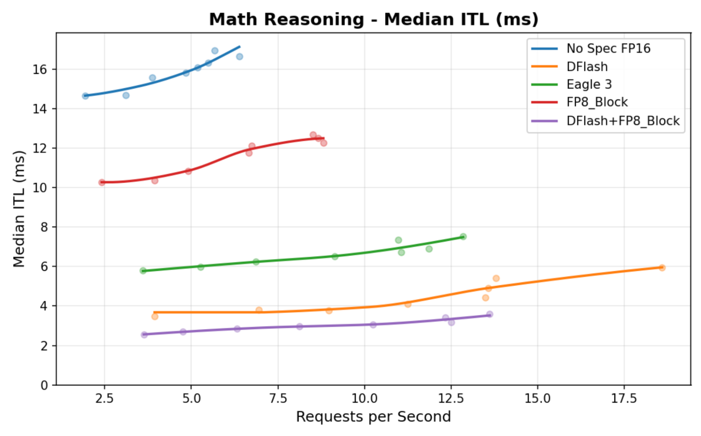

# Speculators v0.5.0: DFlash Support and Online Training

Chinese: [zh/vllm/blog/performance/speculators-v050.md](../../../../zh/vllm/blog/performance/speculators-v050.md)

2026-05-28. **Fynn Schmitt-Ulms, Helen Zhao, Rahul Tuli and Dipika Sikka (Red Hat AI Model Optimization Team)**. Release: [v0.5.0](https://github.com/vllm-project/speculators/releases/tag/v0.5.0). Study note. Previous offline Eagle3 path: [v0.3.0](speculators-v030.md). Hidden extraction no longer patches engine internals; it uses [extract-hidden-states](../architecture/extract-hidden-states.md) (`vllm>=0.18.0`). Read DFlash with the parallel-drafting family: [parallel-drafting](parallel-drafting.md). Gemma 4 numbers are their evals, not your SLA.

v0.5.0 is an architectural step for speculator training: DFlash, unified online training, and a full move onto vLLM’s native hidden-state extraction. More flexible to train; closer to production workflows.

Key features on the page:

- **DFlash** — single-pass draft tokens via block diffusion
- Gemma 4 DFlash results
- Online and offline training with the same vLLM-native extraction
- Docs and examples rewritten around the main workflows

## DFlash algorithm support

DFlash is a different draft path from autoregressive Eagle 3. Eagle 3 guesses token-by-token across several forwards; DFlash uses **block diffusion** and emits the whole draft block in **one forward**.

Single-pass can cut draft overhead, especially for longer draft sequences. For each prefix the drafter produces a block of length **B**. The block structure is entirely the attention mask. Unlike Eagle3, attention inside a block is **non-causal**: queries in the block may attend to every other token in the same block.

Training predicts several blocks in parallel. Naively starting a block at every position explodes the attention mask on long sequences. Instead they do **not** start blocks everywhere: they randomly sample a smaller set of **anchors** from positions that actually contribute to the loss, and attach predicted blocks only there. Block count is independent of sequence length, so training can scale to longer context without an unmanageable mask.

## Training a DFlash speculator

The online workflow is close to Eagle 3. Tutorial: [train DFlash online](https://docs.vllm.ai/projects/speculators/en/latest/user_guide/tutorials/train_dflash_online/).

The difference is the speculator-specific flags:

```bash
torchrun --standalone --nproc_per_node 2 scripts/train.py \
    --verifier-name-or-path "Qwen/Qwen3-8B" \
    --vllm-endpoint "http://localhost:8000/v1" \
    --speculator-type dflash \
    --draft-vocab-size 8192 \
    --block-size 8 \
    --max-anchors 3072 \
    --num-layers 5 \
    --target-layer-ids "2 18 33" \
    --epochs 5 --lr 1e-4
```

DFlash-specific:

```bash
--block-size # tokens per diffusion block
--max-anchors # max anchor points for speculation during training
--speculator-type # must be dflash
```

## Gemma 4 DFlash speculator

That path trained a [Gemma 4 31B DFlash speculator](https://huggingface.co/RedHatAI/gemma-4-31B-it-speculator.dflash). Acceptance rates were measured across task types. The prose says reasoning and code generation look especially strong — the body does **not** tabulate the bars; do not invent numbers from the PNG.

Local figures (copyright remains with the original site; study copies):



**Figure 1.** Gemma 4 DFlash acceptance rates across task types.

Gemma 4 DFlash inter-token latency beats both Eagle 3 and a standalone FP8-quantized verifier. Stacking DFlash on an FP8 verifier is shorter still:



**Figure 2.** Gemma 4 DFlash inter-token latency comparison. Milliseconds are not tabulated in the post.

## Serving DFlash models in vLLM

DFlash plugs into vLLM’s speculative-decoding stack as of PR [#38300](https://github.com/vllm-project/vllm/pull/38300), in `vllm>=0.20.0`.

Like Eagle 3, `config.json` carries `speculators_config`: target model, speculative token count, algorithm name, and so on. With that config, short serve:

```shell
vllm serve -tp 2 RedHatAI/gemma-4-31B-it-speculator.dflash
```

## Unified online and offline training

v0.5.0 supports both modes through [vLLM’s hidden-states extraction](https://vllm.ai/blog/extract-hidden-states) (`vllm>=0.18.0`). Older Speculators used lower-level vLLM utilities and treated vLLM as a **direct Python dependency**. Internal APIs moved; the training pipeline had to be resynced by hand. This release drops the custom data-generation pipeline and **stops** depending on vLLM as a Python package.

Both modes share one vLLM extraction path:

- **Online:** extract hidden states during training
- **Offline:** pre-generate and cache to disk, then train

Using native extraction also inherits vLLM inference optimizations: memory, batching, hardware acceleration. Training talks to a running vLLM server over the REST API instead of internal APIs. vLLM and Speculators can upgrade on separate clocks.

What happens in online training:

1. vLLM server starts with the base model (plus special configuration)
2. Training prompts go to vLLM for inference
3. Hidden states are extracted and written temporarily to disk (or a ram disk)
4. The trainer loads them and deletes the file
5. The speculator trains on the extracted states

Online tutorial: [train Eagle3 online](https://docs.vllm.ai/projects/speculators/en/latest/user_guide/tutorials/train_eagle3_online/).

Offline generation now uses the same extraction system and the same data format. New scripts saturate the running vLLM server and write to disk. The two modes are coupled tightly enough to mix: generate some hidden states offline, then train by loading what exists and filling gaps online; or run an online job that **does not** delete files, generate on epoch one, reload later epochs.

Offline tutorial: [train Eagle3 offline](https://docs.vllm.ai/projects/speculators/en/latest/user_guide/tutorials/train_eagle3_offline/).

## Documentation

The [docs site](https://docs.vllm.ai/projects/speculators/en/latest/) was rebuilt: short introductions to the algorithms Speculators supports, plus training walkthroughs. For developers: how to add a new speculative-decoding algorithm, and an API reference.
