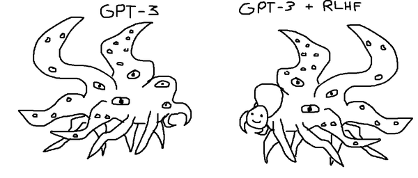
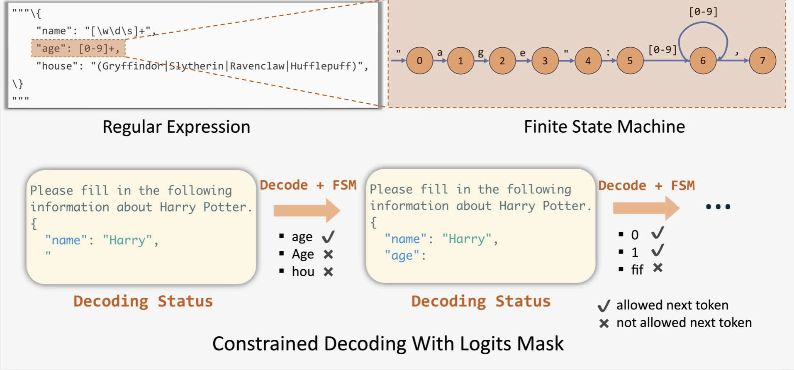
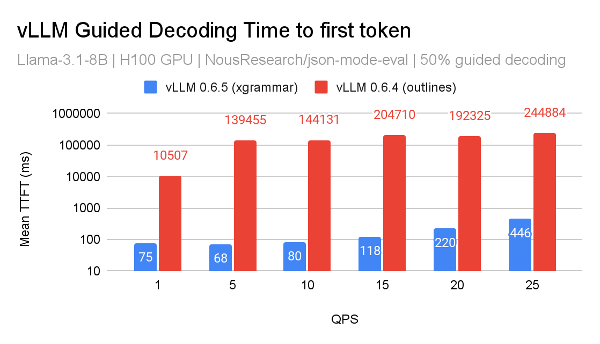
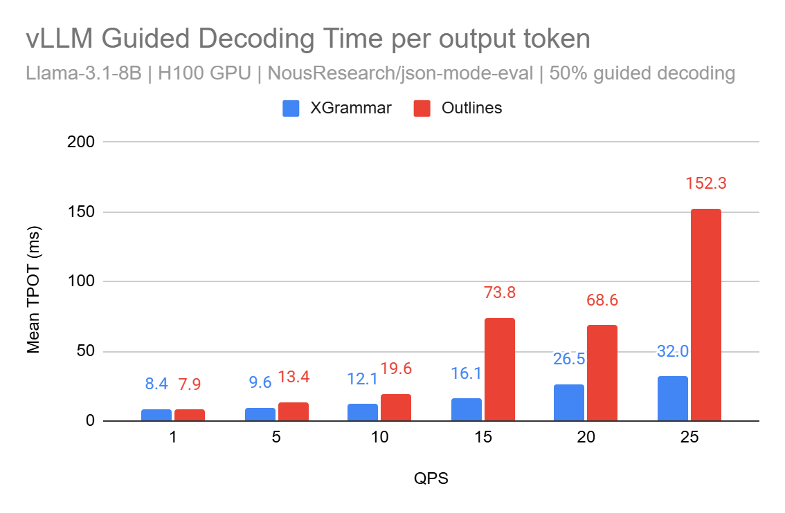

# Structured decoding

2025-01-14. “V1 upcoming” in the post is historical. JSON mode / tool calls are usually this. Study note.

LLMs sample likely continuations; they do not owe you valid JSON. Structured / constrained / guided decoding applies a schema as logit masks. Like validation for an API. Outlines: FSM over the schema. Pass a JSON schema in sampling params.

V0 Outlines pain: token-at-a-time FSM; logit processor on the hot path (compiling per request blocks the batch → TTFT); slow/crashy CFG; no jump-forward.

**XGrammar:** PDA (a collection of FSMs / CFGs), multi-step transitions, grammar compile in C/`pthread`. Up to **5×** better TPOT under load. V0 still a logit processor with tokenizer cache. Then missing: non-GBNF, regex, JSON with regex/numeric ranges → fall back to Outlines. lm-format-enforcer lagged on long context.

V1 plan (now largely present): scheduler-level guided decoding so other requests in the batch are not blocked; bitmask computed once and broadcast; shared API with spec-decode tree scoring and tool-use. Anatomy’s Structured Output Manager is that room.

Local figures (copyright remains with the original site; study copies):

