# A First Comprehensive Study of TurboQuant: Accuracy and Performance

Chinese: [zh/vllm/blog/performance/turboquant.md](../../../../zh/vllm/blog/performance/turboquant.md)

2026-05-11. Eldar Kurtić, Michael Goin, Alexandre Marques (Red Hat AI). Benchmarks on **vLLM 0.20.2** (commit `6ec9bbec3`). Read after [fp8-kvcache.md](fp8-kvcache.md). Paper: [TurboQuant](https://arxiv.org/pdf/2504.19874). Then-current TurboQuant docs: [quantization/turboquant](https://docs.vllm.ai/en/latest/api/vllm/model_executor/layers/quantization/turboquant/). Study note.

## Introduction

[TurboQuant](https://arxiv.org/pdf/2504.19874) advertised large GPU-memory savings from 3–4 bit KV-cache. Unlike [FP8 KV-cache](https://vllm.ai/blog/fp8-kvcache) (`--kv-cache-dtype fp8`), which quantizes **storage and attention compute** with hardware-native FP8 Tensor Cores, TurboQuant compresses **storage only** to 3–4 bits and dequantizes back to BF16 for attention. That split drives both accuracy and speed.

Most earlier numbers were small models on short-context benches that do not stress KV quantization. This post measures four models (dense and MoE, **30B to 200B+**) on five benches: Prefill-heavy long-context retrieval and Decode-heavy reasoning.

```bash
# FP8 KV-cache for all layers
vllm serve MiniMaxAI/MiniMax-M2.7 --kv-cache-dtype fp8

# TurboQuant KV-cache, skipping the first and last two layers
vllm serve MiniMaxAI/MiniMax-M2.7 --kv-cache-dtype turboquant_4bit_nc
```

Local figures (copyright remains with the original site; study copies):

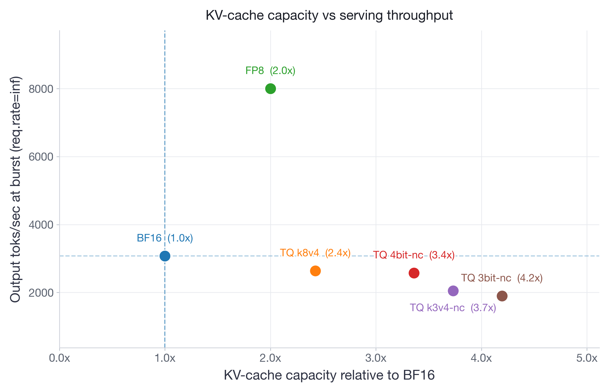

Figure 1: Pareto frontier for Llama-3.3-70B-Instruct on 4×H100. FP8 dominates with **2.6×** higher burst throughput than BF16 and **2×** KV-cache capacity. All TurboQuant variants trade throughput for extra memory savings.

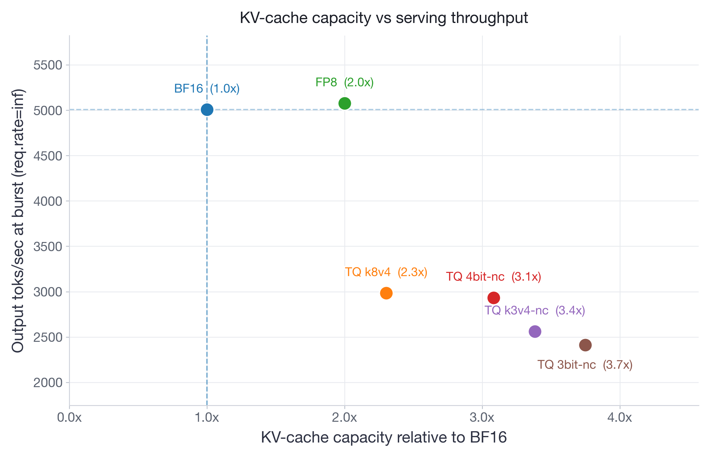

Figure 2: Pareto frontier for Qwen3-30B-A3B-Instruct-2507 on 2×H100. FP8 matches BF16 throughput at **2×** capacity. TurboQuant variants extend capacity to **2.3–3.7×** but at **40–52%** throughput reduction.

## TL;DR (as of the post)

- **FP8** via `--kv-cache-dtype fp8` stays the default: **2×** KV capacity, negligible accuracy loss, matches BF16 on most metrics, and wins when serving is memory-tight.
- TurboQuant **`k8v4`** does not beat FP8: only **2.4× vs 2×** capacity, with a consistent throughput/latency hit.
- TurboQuant **`4bit-nc`** is the most practical TQ variant: extra room under KV pressure, paid as moderate accuracy, latency, and throughput cost. Possible for edge / memory-dominated deployments.
- TurboQuant **`k3v4-nc`** and **`3bit-nc`**: meaningful accuracy drops on reasoning and very long context, plus substantial latency/throughput degradation. Poor production candidates.

## Experimental Setup

**Quantization schemes.** Four TurboQuant dtypes against unquantized BF16 and FP8:

| `--kv-cache-dtype` | Keys / values | Notes |
| --- | --- | --- |
| *(none / BF16)* | BF16 | Unquantized baseline |
| `fp8` | Q, K, V in FP8 | Also quantizes **attention compute** on Tensor Cores |
| `turboquant_k8v4` | 8-bit K, 4-bit V | No norm correction in the name |
| `turboquant_4bit_nc` | 4-bit K and V | Norm correction |
| `turboquant_k3v4_nc` | 3-bit K, 4-bit V | Norm correction |
| `turboquant_3bit_nc` | 3-bit K and V | Norm correction |

TurboQuant only compresses storage and dequants to BF16 before attention. Variant details: [paper](https://arxiv.org/pdf/2504.19874) and [vLLM TurboQuant docs](https://docs.vllm.ai/en/latest/api/vllm/model_executor/layers/quantization/turboquant/). FP8 background: [fp8-kvcache.md](fp8-kvcache.md).

**Benchmarks.** Five tasks, Prefill-heavy and Decode-heavy. Long-context retrieval: `openai/mrcr` (multi-round context retrieval) up to each model’s max length. Reasoning: AIME25, GPQA:Diamond, MATH500, LiveCodeBench-v6. All evals use the **default non-greedy** sampling suggested by the model creators.

**Models.** Dense and MoE, small and large: `Llama-3.3-70B-Instruct`, `Qwen3-30B-A3B-Instruct-2507`, `Qwen3-30B-A3B-Thinking-2507`, `MiniMax-M2.7`.

**Then-current support.** TurboQuant then supported **standard attention only** (e.g. GQA). Sliding-window and hybrid attention were **not yet supported**.

## Accuracy Results

### Long-context Retrieval

`openai/mrcr`. Average pass@1 per sequence-length bucket over **5** repetitions; Area-Under-Curve (AUC) across lengths ([Context Arena](https://contextarena.ai/)).

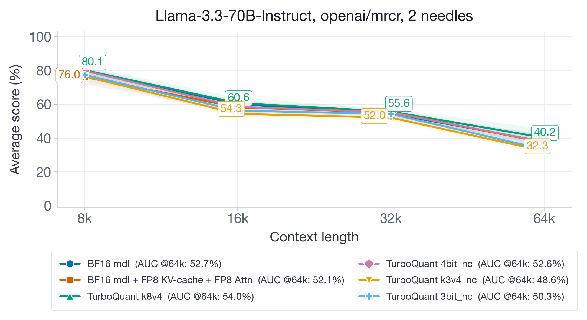

Figure 3: Long-context retrieval for Llama-3.3-70B-Instruct up to 64k. At **128k** (the model’s max), the BF16 baseline collapses to **under 10%**.

On Llama-3.3-70B-Instruct, higher-bit TQ (`k8v4`, `4bit-nc`) keeps retrieval and competitive AUC (**~52%**). `k3v4-nc` (**48.6%**) and `3bit-nc` (**50.3%**) degrade across lengths; the gap widens at 64k, up to **8 points**.

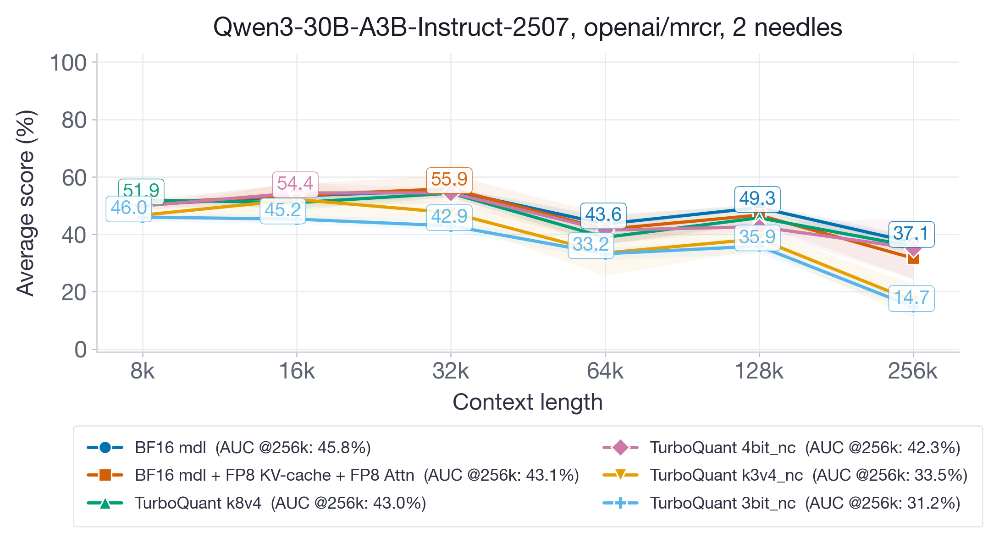

Figure 4: Long-context retrieval for Qwen3-30B-A3B-Instruct-2507 up to 256k.

On Qwen3-30B-A3B-Instruct-2507 (max **256k**), gaps are larger. BF16 (**45.8%**), FP8 (**43.1%**), and TQ `k8v4` (**43.0%**) sit within each other’s standard deviation. TQ `4bit-nc` (**42.3%**) is still competitive. Aggressive variants drop hard: TQ `k3v4-nc` **33.5%** AUC, TQ `3bit-nc` **31.2%** — about **30%** relative vs BF16. The damage concentrates at **128k–256k**: low-bit KV error accumulates with length.

**Takeaway:** `k8v4` and `4bit-nc` are safe for long-context retrieval. `k3v4-nc` and `3bit-nc` are not, especially at very long context. FP8 matches the higher-bit TQ variants and (later sections) serves faster.

### Reasoning

Decode-heavy: AIME25, GPQA:Diamond, MATH500, LiveCodeBench-v6. Average pass@1: **10** repetitions for AIME25 and LiveCodeBench-v6; **5** for GPQA:Diamond and MATH500.

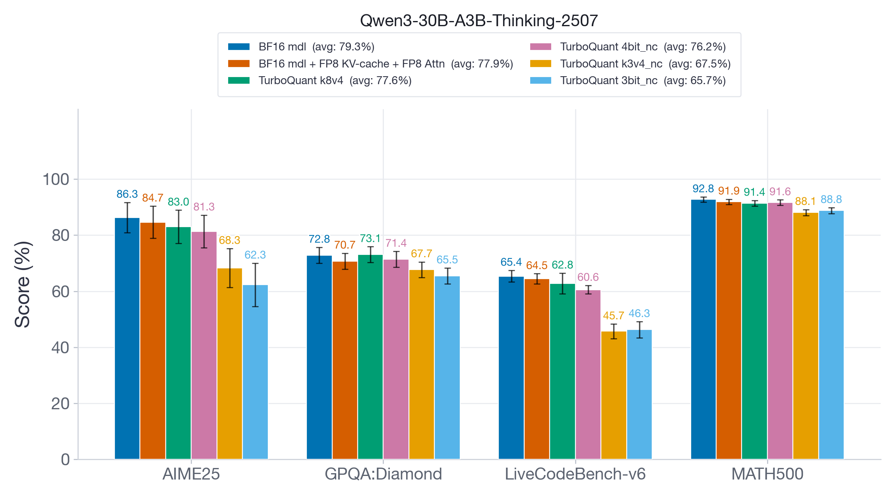

Figure 5: Reasoning for Qwen3-30B-A3B-Thinking-2507. Aggressive TQ (`k3v4-nc`, `3bit-nc`) drops hard on AIME25 and LiveCodeBench-v6.

On Qwen3-30B-A3B-Thinking-2507: FP8 and TQ `k8v4` stay close to BF16 with **>98%** average accuracy recovery. TQ `4bit-nc` is a bit worse at **96%** recovery. TQ `k3v4-nc` and `3bit-nc` lose about **20 points**. Even on easier MATH500 the drop is about **4 points** — aggressive TQ is a bad fit for long-generation reasoning.

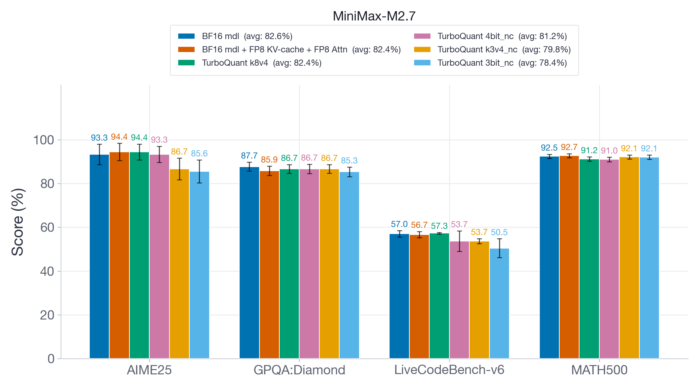

Figure 6: Reasoning for MiniMax-M2.7. Larger models are usually more quantization-robust; aggressive TQ still hurts, especially AIME25 and LiveCodeBench-v6.

On MiniMax-M2.7 (**200B+**): same hierarchy. FP8 and TQ `k8v4` keep **>99%** recovery; TQ `4bit-nc` a modest drop; `k3v4-nc` / `3bit-nc` still degrade, up to about **8 points** on AIME25 and LiveCodeBench-v6.

**Takeaway:** Aggressive TQ (`k3v4-nc`, `3bit-nc`) fails hard math/coding. `4bit-nc` is a modest hit. `k8v4` matches unquantized BF16. FP8 also matches the unquantized baseline and (below) is much faster than any TQ variant.

## Performance Results

Focus: `Qwen3-30B-A3B-Instruct-2507` on **2×H100** and `Llama-3.3-70B-Instruct` on **4×H100**. Latency, offline throughput, and online serving (TPOT and TTFT) at several request rates. vLLM **0.20.2**, commit `6ec9bbec3`.

### Latency

`vllm bench latency`. Fixed synthetic requests: input **1024**, output **256**; batch sizes **1, 8, 32, 64**. **10** warmup iterations, **30** measured. Reported as slowdown vs BF16 (lower is better).

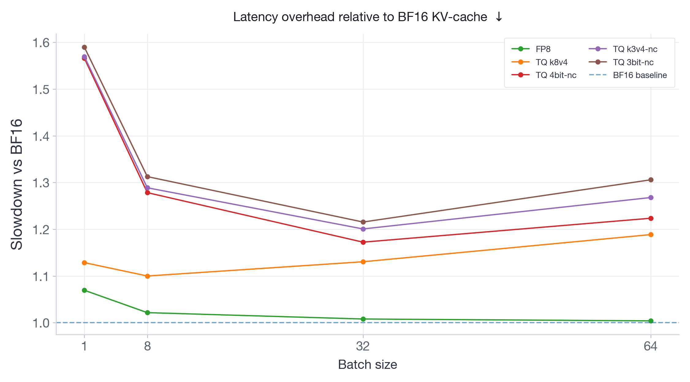

Figure 7: Latency overhead vs BF16 for Qwen3-30B-A3B-Instruct-2507. FP8 overhead is negligible and vanishes with batching. TQ adds up to **60%** slowdown depending on variant and batch.

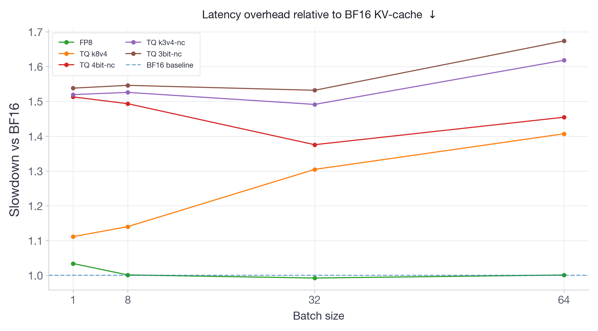

Figure 8: Latency overhead vs BF16 for Llama-3.3-70B-Instruct. FP8 negligible; TQ **10–68%**.

FP8 stays at negligible or zero extra latency on both models and all batches — it runs attention on FP8 Tensor Cores, so there is no dequant step. All TQ variants add measurable latency: Qwen3-30B about **10–60%**; Llama-3.3-70B about **10–68%**, and on 70B the TQ tax **grows with batch** (the opposite of what you want). Dequant from low-bit storage back to BF16 scales with how much KV is touched.

### Throughput

`vllm bench throughput`. **200** prompts; three input/output pairs: **256/256**, **1024/512**, **4096/256**. Percentage of BF16 throughput (higher is better).

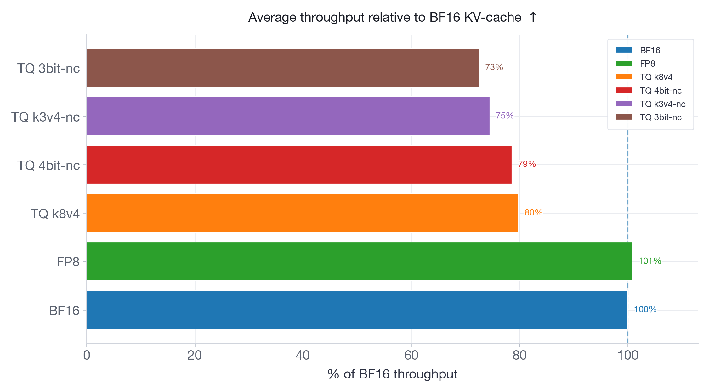

Figure 9: Average throughput vs BF16 for Qwen3-30B-A3B-Instruct-2507. FP8 keeps BF16 throughput; every TQ variant is slower. Cheaper KV storage does not mean faster serving.

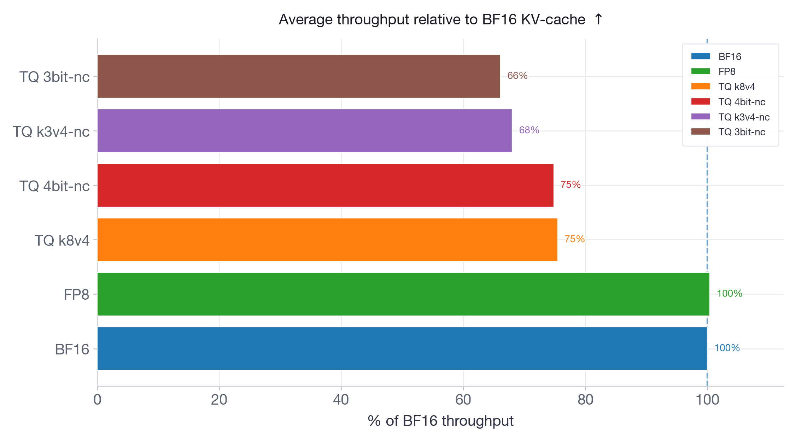

Figure 10: Average throughput vs BF16 for Llama-3.3-70B-Instruct. Same pattern.

FP8 matches BF16 on both models. All TQ variants sit strictly below BF16: Qwen3-30B from **80%** (`k8v4`) to **73%** (`3bit-nc`); Llama-70B from **75%** (`k8v4` and `4bit-nc`) to **66%** (`3bit-nc`). More aggressive packing → worse throughput. Dequant cost grows with packing complexity.

### Serving Speed

`vllm bench serve`. Synthetic input **1024**, output **512**; **300** measured prompts; **5** warmup requests. Request rates **2**, **8**, and `inf` (send as fast as possible). Metrics: **TPOT** (Time Per Output Token — Decode speed) and **P99 TTFT** (Time To First Token — how soon generation starts).

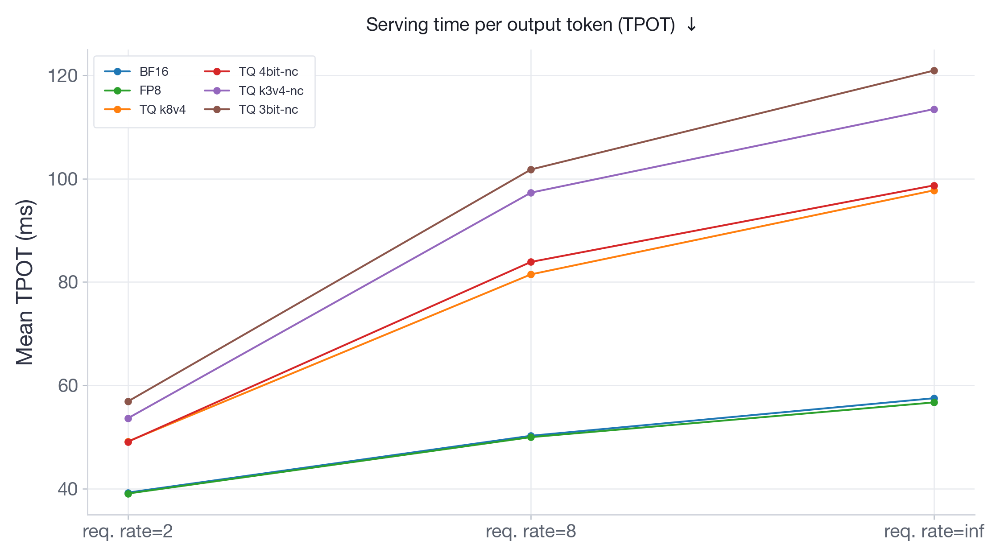

Figure 11: Serving TPOT for Qwen3-30B-A3B-Instruct-2507.

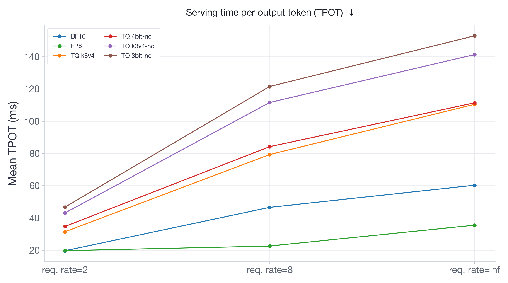

Figure 12: Serving TPOT for Llama-3.3-70B-Instruct.

TPOT tracks latency/throughput: FP8 tracks or beats BF16 at every rate; TQ adds a per-token tax that grows with load. At burst on Llama-70B, FP8 is almost **2×** faster than BF16; TQ variants are **1.5× to 2.5×** slower.

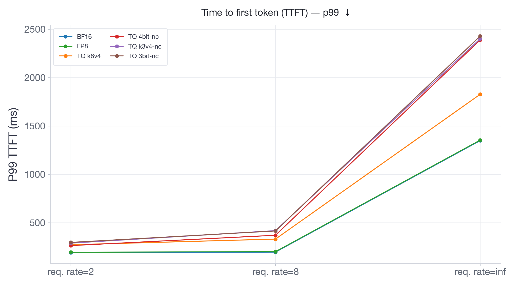

Figure 13: P99 TTFT for Qwen3-30B-A3B-Instruct-2507.

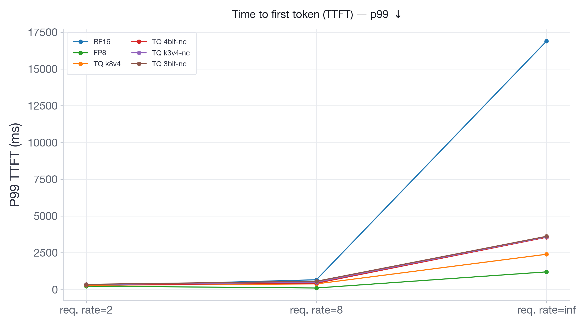

Figure 14: P99 TTFT for Llama-3.3-70B-Instruct. Under burst, BF16 TTFT explodes to **~17 s** from memory saturation; TurboQuant stays under **3.5 s**; FP8 under **1.5 s** (body text: **~1.3 s**).

On Qwen3-30B (more KV headroom on 2×H100), FP8 matches BF16 TTFT at every rate. TQ is consistently slower, up to **2×** at burst. On Llama-3.3-70B (4×H100, tight KV room), burst BF16 P99 TTFT hits **~17 s** because KV saturates and new requests queue. All TQ variants stay under **3.5 s** — about **5×** better — because compressed KV lets more in-flight work through without queuing. FP8 still wins TTFT at **~1.3 s** and beats every TQ variant.

**Takeaway:** TQ is slower than BF16 and FP8 on throughput and per-token latency. Under memory-tight serving, KV compression stops saturation and cuts burst TTFT vs BF16. That is TQ’s pitch: trade per-token speed so requests are not queued at the door. FP8 is both: BF16-class (or better) throughput, negligible latency tax, and much better burst TTFT.

## Key Findings and Recommendations

**FP8 (`--kv-cache-dtype fp8`) remains the default.** **2×** KV capacity, no throughput cost, negligible accuracy loss, sometimes faster via quantized attention. Safest, most predictable choice. Details: [fp8-kvcache.md](fp8-kvcache.md).

**TurboQuant `k8v4` is not worth it vs FP8.** Only **2.4× vs 2×** capacity, with a consistent throughput and latency hit.

**TurboQuant `4bit-nc` is the memory-for-throughput trade.** Up to **3.4×** KV capacity (Pareto figure for Qwen goes to **3.7×** across TQ variants) with modest **1–4 point** accuracy drops on most benches. Useful when burst TTFT from extra room outweighs the tax on everything else. Validate accuracy on the **target** workload before deploying.

**Avoid `k3v4-nc` and `3bit-nc` without thorough validation.** Accuracy can fall as much as **20 points** on hard math/coding. Complex dequant also makes them a poor production default.

**Stay BF16 when GPU memory is not the bottleneck.** Short context, low concurrency, or ample HBM: BF16 is the accuracy–performance default, with no quantization artifacts.
