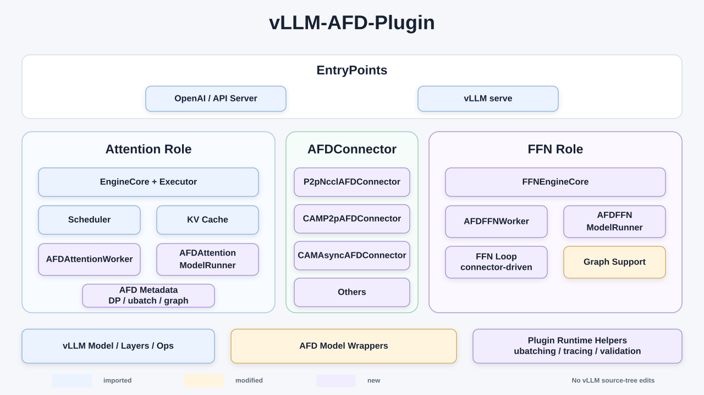
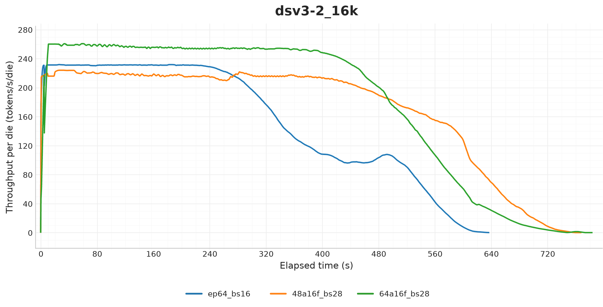
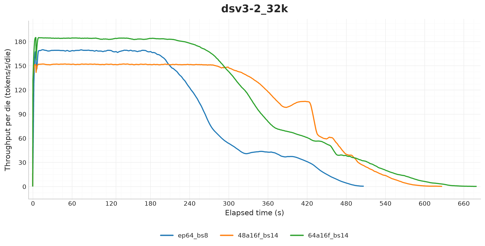
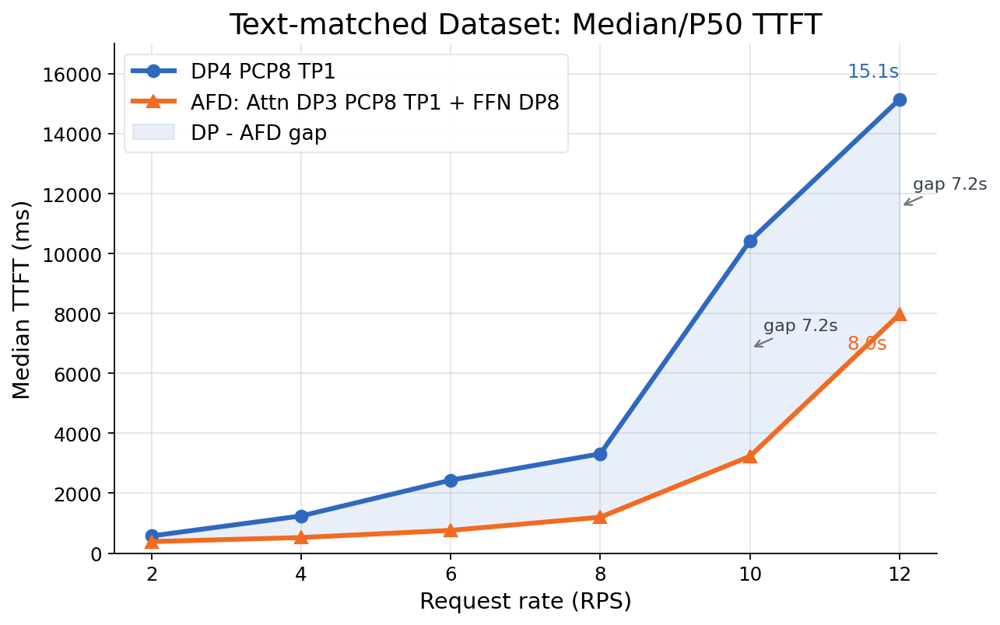

# Announcing vLLM AFD Plugin: Disaggregating Attention and FFN for Flexible MoE Serving

Chinese: [zh/vllm/blog/serving/afd.md](../../../../zh/vllm/blog/serving/afd.md)

2026-07-23. Experimental external plugin: https://github.com/vllm-project/afd-plugin. Hooks `vllm.general_plugins` and `--additional-config`; **no vLLM source edits**. Then pinned **vLLM 0.19.1**, Python **3.10–3.13**, model runner **v1 only**. Full weights on **both** roles. Study note; not an SLA. The page itself says it needs more large-scale testing across backends.

Local figures (copyright remains with the original site; study copies):

## Why split Attention from FFN

Every MoE layer mixes two tempers. Attention is **stateful** (scheduler + KV). FFN / experts are routed compute + all-to-all. One shared rank topology is the wrong number for both.

Design problems the plugin is answering:

1. **Different scaling.** Attention follows request state, sequence length, KV pressure. Experts follow token routing and expert load. Topologies should be allowed to differ.
2. **Different runtime jobs.** Attention keeps scheduling, KV, sampling. FFN only needs activations, routing metadata, and a way home. FFN can be a connector-driven **daemon**.
3. **Backend-specific comms.** CUDA vs Ascend: different collectives, graph runtimes, MoE ops. A **neutral connector contract** keeps the model-facing flow stable.
4. **Overlap.** Async dispatch and MoE ubatching can overlap instead of serializing all expert work behind Attention.

Requests still hit the **Attention** OpenAI-compatible server. vLLM keeps the serving control plane; the plugin owns AFD workers, runners, connectors, metadata, split points, and a small set of version-scoped compatibility patches.

## Architecture

Three parts:

- **Attention worker.** Scheduler, KV, batching, lifecycle, sampling stay. Plugin model runner installs AFD metadata in the forward context and publishes DP / ubatch / layer / graph state to FFN.
- **FFN worker.** No requests, no KV. Background loop: metadata + activations → `compute_ffn_output()` on the plugin wrapper → send back.
- **Connector.** At each split layer: Attention hidden states + execution metadata over, FFN outputs back.

GPU workers extend vLLM v1 classes; NPU workers extend **vLLM-Ascend** classes. Shared pieces live in config, topology, metadata, and the connector contract — not cross-device inheritance.

### Connectors

| Connector | Backend | Execution | Recommended stage | Graph |
| --- | --- | --- | --- | --- |
| `P2pNcclAFDConnector` | GPU | Sync P2P | Decode | `FULL_DECODE_ONLY` CUDA graph |
| `CAMP2pAFDConnector` | NPU | Sync CAMP2P/HCCL | Decode | `FULL_DECODE_ONLY` ACL graph |
| `CAMAsyncAFDConnector` | NPU | Async CAM | Prefill | **Not then supported** |

Same high-level exchange on every connector; backend packages stay separate so CUDA graph, ACL graph, NCCL, and Ascend ops do not leak into one another.

### Then-supported features

- Native `vllm serve` + OpenAI endpoint + `--additional-config`
- GPU and NPU implementations
- Sync AFD for Decode throughput (`P2pNcclAFDConnector`, `CAMP2pAFDConnector`) with `FULL_DECODE_ONLY` graphs
- Async AFD for Prefill (`CAMAsyncAFDConnector`): CAM async dispatch/combine, AFD-managed MoE ubatching, aimed at **P/D-disaggregated Prefill**; **no graph yet**
- Wrappers: DeepSeek **V2/V3-family** (including **V3.2**), **GLM MoE DSA** — split Attention vs FFN while reusing upstream layers
- Dual Batch Overlap: **exactly two** ubatches; CAM async has its own Prefill ubatching

## Performance snapshot (controlled)

### Sync Decode, `CAMP2pAFDConnector`

Recipe: [afd-plugin#67](https://github.com/vllm-project/afd-plugin/pull/67). DeepSeek-V3.2 **W8A8**, Ascend **910C**. Saturated Decode throughput, not online latency.

| Deployment | Physical topology | Total dies |
| --- | --- | --- |
| EP64 | DP64, EP64, TP1 | 64 |
| 48A16F | 48 Attention + 16 FFN | 64 |
| 64A16F | 64 Attention + 16 FFN | 80 |

**Then-current caveats:** not accuracy or production serving. Limited machines: physical 48A16F / 64A16F **simulate** logical **192A64F / 256A64F**. Routed expert IDs replaced by a **deterministic forced-balancing cycle** — **outputs change**. `AFDDecodeBenchConnector` supplies decode-only KV; **DBO on** for AFD.

Normalize: `tokens/s/die = aggregate output token throughput / total deployed dies`. Fixed-length inputs; outputs uniform **512–1536** tokens.

**16K** (Figure 2): EP64 **232.6**; 48A16F **220.3 (−5.3%)**; 64A16F **258.9 (+11.3%)**.

**32K** (Figure 3): EP64 **168.2**; 48A16F **151.4 (−10.0%)**; 64A16F **183.3 (+9.0%)**.

Split ≠ win. Attention:FFN **ratio** is the sentence. They did not test higher Attention ratios; the trend suggested FFN ranks still had **compute headroom**, so adding Attention might still help.

### Async Prefill, `CAMAsyncAFDConnector`

Early experiment: **two** 910C nodes, DeepSeek V3.2 W8A8 **cut to 10 layers**, forced expert balancing. Baseline `DP4 PCP8 TP1` vs Attention `DP3 PCP8 TP1` + FFN `EP8`. Figure 4.

AFD lowers median/P50 TTFT across measured rates. At **12 rps**: **15.1 s → 8.0 s** (~**47%**). At **10 and 12 rps**, the gap is about **7.2 s**. Path check, **not** a full-model claim; gains vary by workload.

## Getting started

Install: plugin [README](https://github.com/vllm-project/afd-plugin#install). Recipes live in-tree, not duplicated on the blog:

- GPU sync: [DeepSeek V2 Lite P2P NCCL](https://github.com/vllm-project/afd-plugin/tree/main/recipe/gpu/p2p_nccl/deepseek_v2_lite) — colocated and P/D-disagg Decode, eager and CUDA graph, several DP/TP layouts
- NPU async Prefill: [DeepSeek V3.2 CAM async](https://github.com/vllm-project/afd-plugin/blob/main/recipe/npu/cam_async/DeepSeek-V3.2.md) — env, topology, AFD config, bench, then-current limits

## Scope and roadmap (then)

Boundaries they listed: exact vLLM pin, runner v1 only, **full weights on both roles**, decode-only graph modes, **exactly two** DBO ubatches, hardware-gated e2e tests.

Next: newer vLLM + evaluate **model runner v2**, keep patches small, upstream what generalizes; more graph modes / ubatch counts / async stages / topologies; production-scale accuracy/latency/throughput/stability/multi-node on full models; more MoE wrappers and transports; **vLLM-Omni** / multimodal (AR, **DiT**, other stages that want independent Attention vs FFN scale); heterogeneous accelerators and interconnects, overlap work for TTFT and ITL.

Links: [code](https://github.com/vllm-project/afd-plugin), [GPU/Ascend design docs](https://github.com/vllm-project/afd-plugin/tree/main/docs), [issues](https://github.com/vllm-project/afd-plugin/issues).

EPD splits the ViT; Router splits text P/D; AFD splits Attention vs experts **inside the layer**.
