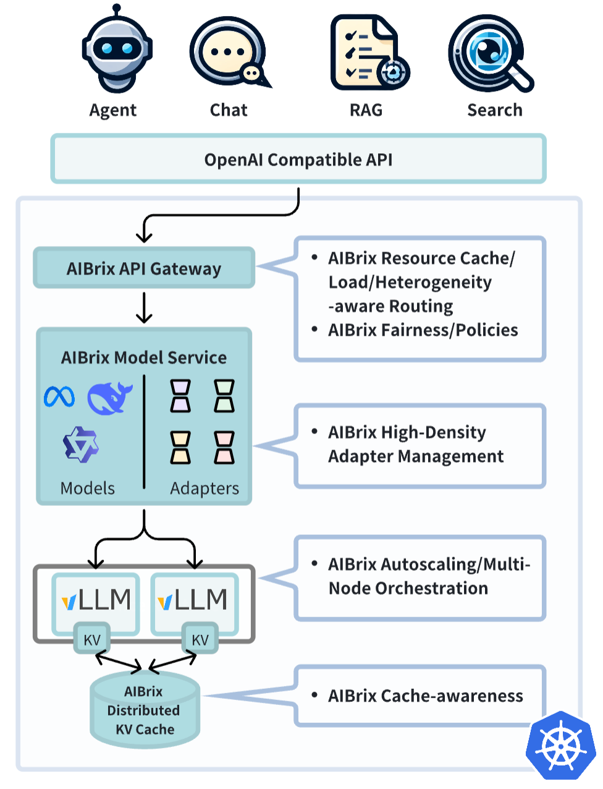

# Introducing AIBrix: A Scalable, Cost-Effective Control Plane for vLLM

Chinese: [zh/vllm/blog/serving/aibrix.md](../../../../zh/vllm/blog/serving/aibrix.md)

2025-02-21. Repo: [vllm-project/aibrix](https://github.com/vllm-project/aibrix). ByteDance Kubernetes serving stack, started **early 2024**, already on **multiple internal businesses**. Deeper architecture: [their own blog](https://aibrix.github.io/posts/2025-02-20-vllm-control-plane/), [white paper PDF](https://github.com/vllm-project/aibrix/blob/main/docs/paper/AIBrix_White_Paper_0219_2025.pdf), [docs](https://aibrix.readthedocs.io/latest/). Slack: `#aibrix`.

A single vLLM instance is easy (quickstart). Scale brings routing, autoscaling, fault tolerance. AIBrix's claim: **system and inference engine co-design**, cloud-native on Kubernetes — not “a Deployment that happens to run vLLM.”

Local figures (copyright remains with the original site; study copies):

## Launch feature list

Shipped blocks, not a wishlist:

- **High-density LoRA management** — many low-rank adapters on one set of weights.
- **LLM gateway and routing** — traffic across models and replicas.
- **LLM app-tailored autoscaler** — scale from this workload's demand, not CPU alone.
- **Unified AI runtime sidecar** — metric standardization, model download, management.
- **Distributed inference** — multi-node.
- **Distributed KV cache** — high-capacity, cross-engine reuse.
- **Cost-efficient heterogeneous serving** — mixed GPUs under SLO.
- **GPU hardware failure detection** — hardware dies before the request does.

## Vision (already named in 2025-02)

Co-design on Kubernetes. Three follow-ons they listed:

1. Distributed KV covering **P/D aggregation**, **request migration**, **cross-instance KV reuse**.
2. Classical resource management — **QoS / priority / fairness** — at **request-level** multi-tenancy.
3. **Roofline-based profiling** for SLO-guaranteed inference across workloads.

Later posts ([router](router.md), [mooncake](mooncake.md), [elastic-ep](elastic-ep.md)) pick up pieces of that list.

Industry quotes on the page (paraphrase, not a dump): Clayton Coleman (GKE inference) on ByteDance + Gateway API Inference Extension / WG Serving; Robert Nishihara (Anyscale / Ray) on productionizing vLLM.

## FAQ (more useful than the feature list)

**vs [production-stack](production-stack.md)?**

- AIBrix = ByteDance OSS, large-scale / cloud-native, **already in production 6+ months**.
- production-stack = UChicago LMCache, from-scratch blocks, community experiments; [roadmap issue](https://github.com/vllm-project/production-stack/issues/26).
- production-stack's stated strength: built-in **KV-centric** tricks (transfer, blending, routing), especially long-context / prefill-heavy. Near term they planned to **reuse AIBrix components**.

**Community-driven?** Yes — that is why it lives under `vllm-project`.

**vs KServe / KubeAI / generic cloud-native serving?** More **vLLM-native**: fast model load, autoscaling, LoRA, because it only has to serve **one** engine. A general serving framework has to host many runtimes.

Control planes can be swapped. **KV affinity** does not go away — that is the next post's router.
