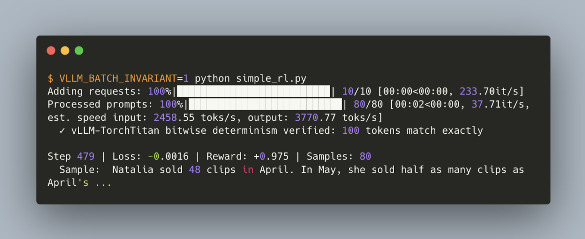
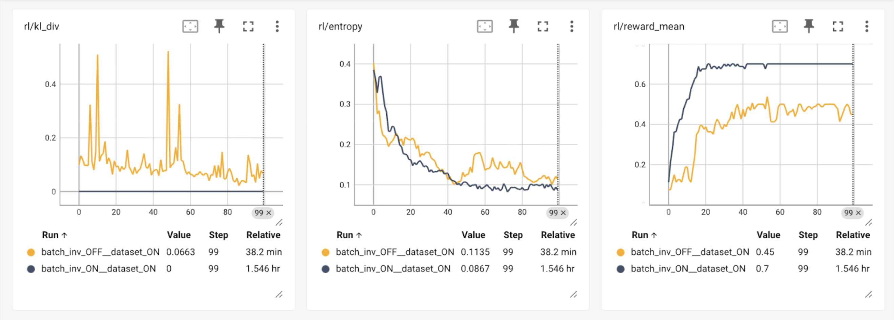

# Bitwise on-policy: vLLM × TorchTitan

Chinese: [zh/vllm/blog/serving/bitwise-rl.md](../../../../zh/vllm/blog/serving/bitwise-rl.md)

2025-11-10. **vLLM and TorchTitan Teams.** Authors on the page: Bram Wasti, Wentao Ye, Teja Rao, Michael Goin, Paul Zhang, Tianyu Liu, Natalia Gimelshein, Woosuk Kwon, Kaichao You, Zhuohan Li. Instructions: [torchtitan/experiments/deterministic_vllm_rl](https://github.com/pytorch/torchtitan/tree/main/torchtitan/experiments/deterministic_vllm_rl). RFCs: [#28326](https://github.com/vllm-project/vllm/issues/28326), [#27433](https://github.com/vllm-project/vllm/issues/27433). Later contract + one model: [isoexec.md](isoexec.md). Pause / weight APIs: [native-rl.md](native-rl.md). Study note.

Open-source bitwise-consistent on-policy RL: [TorchTitan](https://github.com/pytorch/torchtitan) trains, [vLLM](https://github.com/vllm-project/vllm) samples. Built on [vLLM batch-invariant inference](https://docs.vllm.ai/en/latest/features/batch_invariance/). Demo: RL fine-tune of **Qwen3 1.7B**.

Local figures (copyright remains with the original site; study copies):

Tiny numerical gaps between trainer and sampler get amplified by RL — non-deterministic, unstable runs ([He et al.](https://thinkingmachines.ai/blog/defeating-nondeterminism-in-llm-inference/), [Yao, Liu et al.](https://fengyao.notion.site/off-policy-rl), [Liu, Li et al.](https://yingru.notion.site/When-Speed-Kills-Stability-Demystifying-RL-Collapse-from-the-Training-Inference-Mismatch-271211a558b7808d8b12d403fd15edda)). They checked it on this stack.

Sampler kernels different from the trainer (`batch_inv_OFF`): **reduced reward over 100 steps**. Bitwise exact (`batch_inv_ON`, `kl_div` always **0.0**): fewer steps to a **higher** total reward.

## Approach

Training and inference pick different kernels because the workloads differ. Inside one inference engine the choice still moves: high-batch kernels parallelize on the batch dimension; low-batch kernels parallelize **within** a single instance to keep GPU cores busy. All of that is enough for numerical drift, and RL makes it worse.

Here the two frameworks are TorchTitan (train) and vLLM (infer). They audited **every kernel invocation on the forward pass** for bitwise equivalence. Forward kernels come from vLLM’s [batch invariance](https://docs.vllm.ai/en/latest/features/batch_invariance/) work; they wrote [simple backwards](https://github.com/pytorch/torchtitan/blob/main/torchtitan/experiments/deterministic_vllm_rl/batch_invariant_backward.py) for those ops.

vLLM ships fused ops — SiLU MLPs, RMSNorms with residuals. To keep bits, they **imported the exact forward ops** (`SiluAndMul`, `rms_norm` from the batch-invariant path). Those ops needed custom backwards, registered in the same vanilla PyTorch TorchTitan is written in. While wiring this, the original non-invariant Titan path stayed usable; they gated on vLLM’s `vllm_is_batch_invariant` rather than adding extra config.

RL demo: a generic script on **GSM8K** with a correctness reward. TorchTitan utilities for the trainer; a custom generator, `VLLMRolloutEngine`, wrapping generate and weight update. Everything **synchronous** on **one host**, trainer and generator alternating. That is exactly on-policy. It is **not** how large async RL runs (those want [native-rl.md](native-rl.md)).

## What’s Next

Follow the RFCs: [#28326](https://github.com/vllm-project/vllm/issues/28326), [#27433](https://github.com/vllm-project/vllm/issues/27433). Directions on the page:

**Unified model definition.** Two copies of the model code remain — one train, one infer. Fine for a first integration; fragile later: any slight edit on either side breaks equivalence. A shared definition is what [isoexec.md](isoexec.md) later attacks with a contract.

**Compilation support.** No `torch.compile` on the TorchTitan model then, so vLLM was forced **eager**. Lifting that is straightforward on paper; it needs a `torch.compile` Titan model. vLLM already keeps batch-invariance under `torch.compile`; cross-framework parity would require the trained copy to match.

**RL performance.** Bitwise run was **2.4× slower** than the non-bitwise case. Next: better-tuned batch-invariant kernels, and compilation.

**Wider model support.** Beyond Qwen3 1.7B; generalize the audit tools and backwards to more op types so bitwise train–inference is a reusable feature, not a one-model demo.

Slack (as linked): [#sig-post-training](https://vllm-dev.slack.com/archives/C07UUL8E61Z), [#sig-batch-invariant](https://vllm-dev.slack.com/archives/C09JVU355CG).

## Background

The page’s later draft (commented as deprecated in the source, still the intended “why bits”) sits here, after Approach / What’s Next, matching that file’s order.

Across the septillions of FLOPs in pre-training, numerical mismatch is effectively invisible. Pre-training usually runs at a **fixed batch size**, so the same reduction kernels fire and the issue is sidestepped.

RL almost exclusively runs **different** reduction algorithms: it is inference-heavy, latency- and memory-bound. Low-batch inference kernels typically reduce **without tiling**; training kernels parallelize hard to reuse data and raise compute utilization. Generators and trainers are therefore on **completely different kernels**.

Training then becomes implicitly **off-policy**: generator outputs need not match what the trainer would produce on the same inputs.

Floating-point is binary scientific notation: sign bit \(s\), mantissa \(M\), exponent \(e\), each stored as integers and rounded as integers are. In **bf16**, the common ML width, the mantissa is **7 bits**. **3.0** is exact; **3.6** is not — a new bf16 value rounds to the nearest representable. When that rounding happens at **different points** in a chain of additions, the **same** inputs, weights, framework, and hardware can still emit **different** outputs if **any** dispatch anywhere in the graph picks a different (still correct) kernel.

That is the numeric half of on-policy. The token-ID half — do not retokenize agent strings — is [agent-lightning.md](agent-lightning.md).
