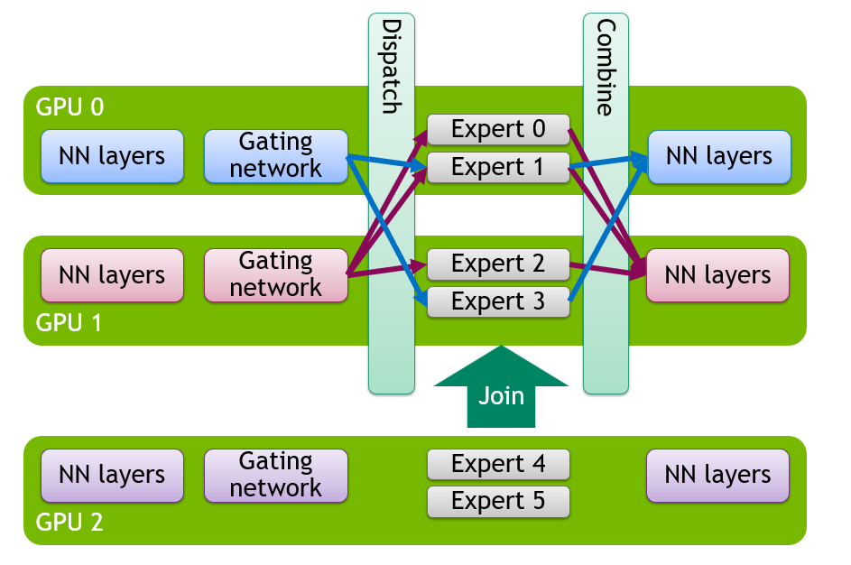

# Elastic Expert Parallelism in vLLM

Chinese: [zh/vllm/blog/serving/elastic-ep.md](../../../../zh/vllm/blog/serving/elastic-ep.md)  
Source: https://vllm.ai/blog/2026-05-14-elastic-expert-parallelism

2026-05-14. **Itay Alroy (NVIDIA), Yongji Wu (Sky Computing), Rui Qiao (Anyscale), Tyler Michael Smith (Red Hat), Moein Khazraee (NVIDIA), Omri Kahalon (NVIDIA), Tzu-Ling Kan (NVIDIA), Ron Tourgeman (NVIDIA).** [RFC #20323](https://github.com/vllm-project/vllm/issues/20323), landing [PR #34861](https://github.com/vllm-project/vllm/pull/34861); NIXL EP [PR #35627](https://github.com/vllm-project/vllm/pull/35627). Fault tolerance: [RFC #30112](https://github.com/vllm-project/vllm/issues/30112). DP Attention + EP: [RFC #16037](https://github.com/vllm-project/vllm/issues/16037). Scope in the post is **narrow** — flags as written then. Wide-EP background: [large-scale.md](large-scale.md).

EP is how MoE serves at high throughput. WideEP (EP across many workers) maximizes KV capacity for high concurrency or very long context — RL needs both; agents stretch multiturn context.

In vLLM, as in many frameworks, EP was **static**: start with N workers, live with N. Demand up: cannot add. Demand down: cannot shed GPUs. Only option: **full restart** with a new config — slow, drops in-flight traffic.

**Elastic Expert Parallelism** reconfigures worker count at runtime so MoE deployments can scale up or down with minimal interruption.

It adds or removes **data-parallel (DP) workers**. That changes the shared EP group size and how experts are distributed (see Background). One API call:

```bash
curl -X POST http://localhost:8000/scale_elastic_ep \
  -H "Content-Type: application/json" \
  -d '{"new_data_parallel_size": 8}'
```

Resizes a running deployment to 8 DP workers. No server restart.



**Caption.** Elastic EP scale-up: a new GPU joins an active deployment, expanding the EP group without restarting existing workers.

The post covers scale-up and scale-down, coordination with in-flight forwards, EPLB and EP communication backends, and why this is a brick for fault tolerance. NIXL EP ([PR #35627](https://github.com/vllm-project/vllm/pull/35627)) is the backend whose communication model fits elastic reconfiguration and recovery.

> **TL;DR for operators:**
> - Elastic EP scales MoE up or down at runtime by changing DP size, without restarting the server.
> - Trigger: `POST /scale_elastic_ep`; vLLM reconfigures the live topology and redistributes experts as needed.
> - This runtime reconfiguration path is a core building block for fault-tolerant serving.
> - NIXL EP can cut reinitialization work during scale events and provide EP-side failure detection, reporting, and recovery.

## Background: Expert Parallelism and DP Attention

MoE: dense attention; most FFNs become sparse experts that route each token to a selected set.

**Data Parallel (DP) Attention:** request-level parallelism. Each engine-core handles a shard of requests with its own KV cache and scheduler. Especially useful for MLA, where TP would duplicate KV across GPUs.

**Expert Parallelism (EP):** whole experts on different GPUs; tokens dispatch only to owners.

In vLLM, attention runs independently on each DP worker; expert layers share one EP group of size `DP × TP`. Elastic EP changes DP count at runtime, which scales the EP group and redistributes experts.

## The Challenge: What State Needs to Change?

Not just launching or killing processes. A change in EP size invalidates:

- **Distributed communication groups.** EP, DP, and world groups embed a fixed rank set.
- **Expert assignment.** Expert→rank mapping changes with EP size.
- **Model weights.** New ranks need weights; existing ranks may need updated expert weights after redistribution.
- **CUDA graphs and compiled state.** CUDA graph capture and `torch.compile` specialize around the old topology.

Scaling is a coordinated state machine. Each stage has explicit sync points that must coexist with model forward.

## Scale-Up Flow

`DP=N` → `DP=M` (`M > N`) is harder than scale-down: new ranks join a live deployment.

### 1. Trigger and Request Handling

Starts at `/scale_elastic_ep`. If `VLLM_ELASTIC_EP_DRAIN_REQUESTS=1`, wait for in-flight work to drain, up to `drain_timeout` seconds (**120** by default). Otherwise scaling proceeds immediately.

### 2. New Engine Core Initialization

New engine-cores depend on the **Ray DP backend**. During scale-up it brings up the extra DP workers on currently available GPUs. New ranks receive the current expert mapping and initialize the model with **placeholder** weights, then wait for transfer and reconfiguration.

Readiness is two-phase: one signal lets existing ranks create standby groups; a later signal starts weight transfer.

### 3. Standby Communication Groups

vLLM does **not** immediately tear down active groups. Existing ranks first create **standby groups** spanning the target rank set, via `StatelessGroupCoordinator` (independent of PyTorch `WORLD`).

New config can be prepared while the old config still executes forwards.

With `nixl_ep` the transition can be incremental: add/remove ranks via `connect_ranks()` / `disconnect_ranks()` without tearing down all EP-side connections.

### 4. Expert Mapping and Weight Transfer

Standby groups broadcast the current expert mapping and transfer **non-expert** weights from existing ranks to new ranks, load-spread across old ranks. Same GPU-to-GPU send/recv path EPLB uses for expert weights, extended to attention, norms, embeddings, and other non-expert weights (NVLink in-node, RDMA across nodes).

**Expert weights are not moved in this stage.** EPLB transfers them after the new topology is active. Ordinary EPLB is paused during the transition.

### 5. The Switch

All ranks leave the old topology and start the new one:

1. Release CUDA graphs and reset `torch.compile` state.
2. Promote standby groups to active EP, DP, and world groups.
3. Destroy the old groups.
4. Reconfigure MoE modules for the new EP size.
5. Re-warm so CUDA graphs and compiled paths match the new setup.

Engine coordination state (running flag, wave counter, step counter) is synchronized across the new DP group.

New ranks are in the active DP group and can run attention, but they **do not yet own experts**. Ownership updates in the EPLB reshuffle that follows.

### 6. EPLB Reshuffle

EPLB redistributes experts across all `M` ranks: new mapping, expert-weight movement. Normal EPLB resumes after the reshuffle.

## Scale-Down Flow

`DP=M` → `DP=N` follows the same pattern with one inversion: **EPLB reshuffle must happen first**. Departing ranks may still own expert weights. All `M` engine cores first reshuffle so experts and required weights consolidate onto the surviving `N` ranks, then the extra ranks leave.

## Coordinating Reconfiguration Steps Across DP Ranks

DP engine cores are asynchronous; reconfiguration notifications can arrive at slightly different times. Some ranks may reach the next Elastic EP stage after others have already started one more forward. If early ranks proceed immediately, the group splits between reconfiguration and forward execution — deadlock.

Elastic EP uses a **two-stage barrier**. Stage 1 has a timeout: if peers do not arrive, the early ranks infer those peers entered one more engine step, and they return to the engine loop for one more iteration instead of proceeding alone. On the next iteration, once all ranks reach the same boundary, stage 2 (no timeout path) lets them enter the next stage together.

## Path to Fault Tolerance

Elastic EP is a core building block for fault tolerance: the runtime reconfiguration path needed after a failure. If a rank dies: scale-down to remove it and redistribute experts; scale-up later when replacement capacity exists — without restarting the whole deployment. Part of [RFC #30112](https://github.com/vllm-project/vllm/issues/30112).

Recovery at a high level:

1. **Detect** via health checks or backend-specific failure signals.
2. **Scale down** to remove the failed rank and redistribute its experts.
3. **Scale up** once replacement capacity is available.

NIXL EP can detect, report, and recover from failures on the EP side, and reconnect replacement ranks when capacity returns.

## Next Steps (then)

Core path exists; implementation scope was still specific:

- **Richer parallel configurations.** Including `tensor_parallel_size > 1` and additional mixes.
- **More serving features.** `api_server_count` capped at **1**; **no DBO**; no MoE draft / drafter.
- **Shorter reconfiguration window.** Overlap, warmup cost, CUDA graph recapture, reuse of previously prepared state.
- **Autoscaling policies.** Control plane is here; policy and orchestration are Dynamo / llm-d.
- **Additional DP backends.** Scale ops then depended on the Ray DP backend.

## Getting Started

### Launch with Elastic EP Enabled

Small MoE example: `DeepSeek-V2-Lite-Chat`. Then: Ray DP, `tensor_parallel_size=1`, one API server, no DBO.

```bash
vllm serve deepseek-ai/DeepSeek-V2-Lite-Chat \
    --trust-remote-code \
    --tensor-parallel-size 1 \
    --data-parallel-size 2 \
    --data-parallel-backend ray \
    --api-server-count 1 \
    --enable-expert-parallel \
    --enable-elastic-ep \
    --enable-eplb \
    --eplb-config.num_redundant_experts 0 \
    --all2all-backend allgather_reducescatter \
    --gpu-memory-utilization 0.8
```

### Scale Up at Runtime

With Ray DP, adding capacity can be joining another node to the Ray cluster; once Ray sees the new GPUs, Elastic EP can scale onto them.

On a new worker node:

```bash
ray start --address="${HEAD_NODE_IP}:6379"
```

```bash
curl -X POST http://localhost:8000/scale_elastic_ep \
  -H "Content-Type: application/json" \
  -d '{"new_data_parallel_size": 16}'
```

### Scale Down

```bash
curl -X POST http://localhost:8000/scale_elastic_ep \
  -H "Content-Type: application/json" \
  -d '{"new_data_parallel_size": 8}'
```

### Using NIXL EP as the Communication Backend

```bash
uv pip install nixl

vllm serve deepseek-ai/DeepSeek-V2-Lite-Chat \
    --trust-remote-code \
    --tensor-parallel-size 1 \
    --data-parallel-size 2 \
    --data-parallel-backend ray \
    --api-server-count 1 \
    --enable-expert-parallel \
    --enable-elastic-ep \
    --enable-eplb \
    --all2all-backend nixl_ep
```

Install and transport: [NIXL repository](https://github.com/ai-dynamo/nixl).

## References

- [RFC #20323: Elastic Expert Parallelism](https://github.com/vllm-project/vllm/issues/20323)
- [PR #34861: [1/N] Elastic EP Milestone 2](https://github.com/vllm-project/vllm/pull/34861)
- [PR #35627: [2/N] Elastic EP Milestone 2: Integrating NIXL-EP](https://github.com/vllm-project/vllm/pull/35627)
- [RFC #30112: Fault-Tolerant Expert Parallelism](https://github.com/vllm-project/vllm/issues/30112)
- [RFC #16037: Data Parallel Attention and Expert Parallel MoEs](https://github.com/vllm-project/vllm/issues/16037)

## Acknowledgments

Sky Computing: Yongji Wu. NVIDIA: Itay Alroy, Moein Khazraee, Omri Kahalon, Tzu-Ling Kan, Ron Tourgeman. Red Hat: Tyler Michael Smith. Anyscale: Rui Qiao. Broader vLLM community.
