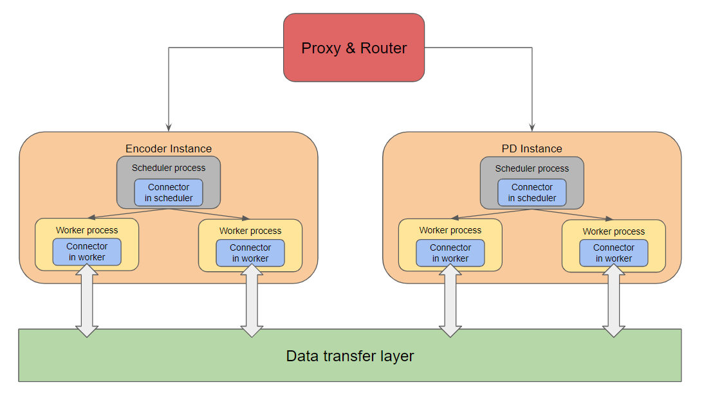
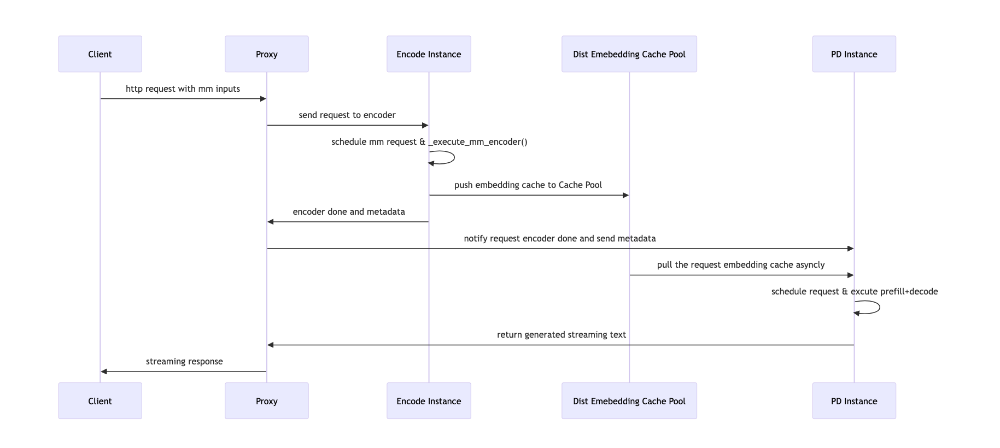
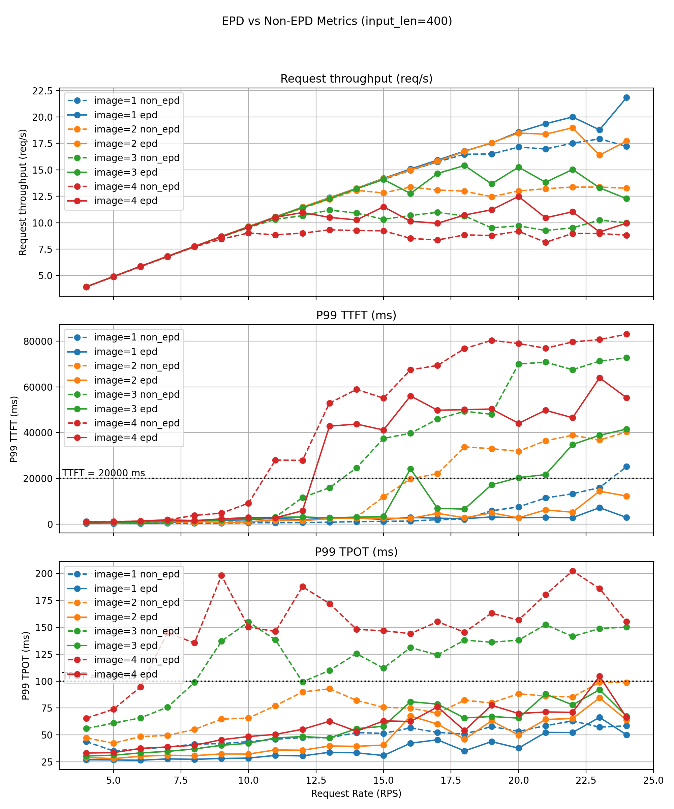
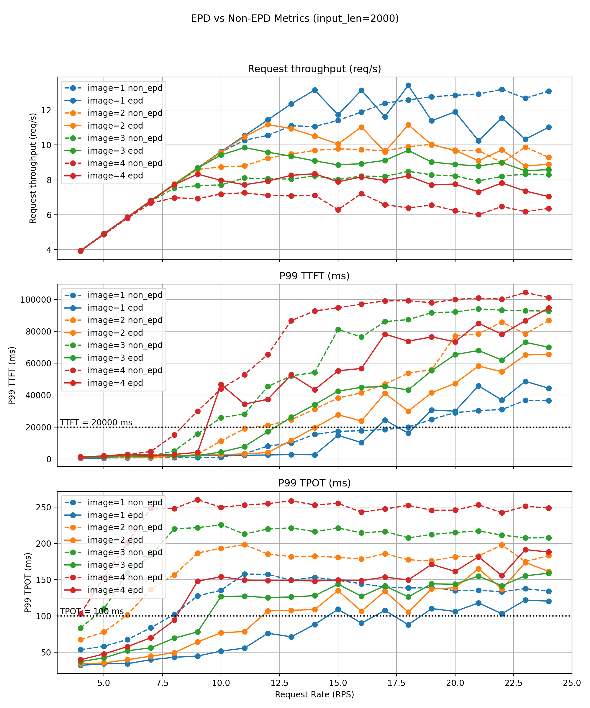
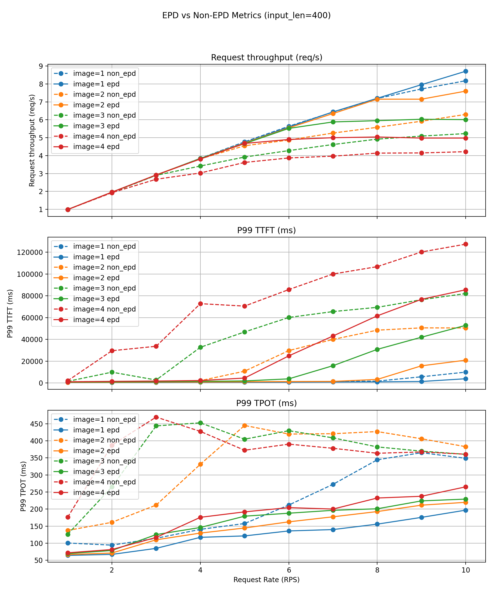
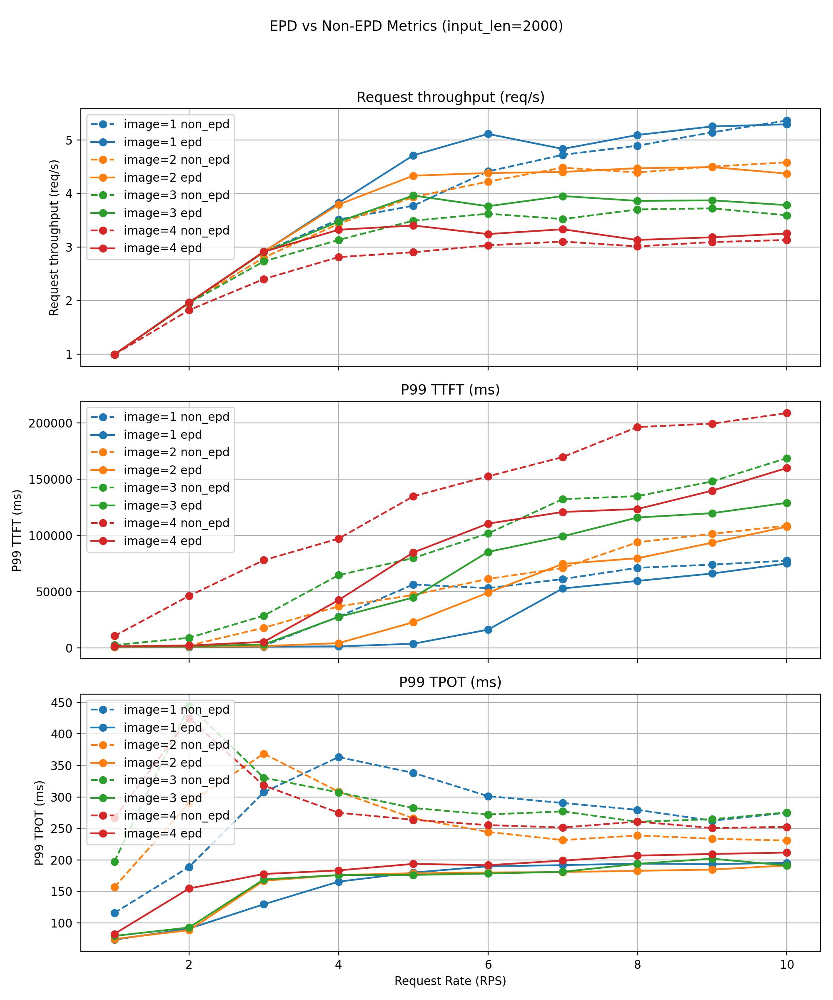

# Encoder Disaggregation (EPD)

Chinese: [zh/vllm/blog/serving/epd.md](../../../../zh/vllm/blog/serving/epd.md)

2025-12-15. **Encoder vs Prefill/Decode**, not the text P/D in [router.md](router.md). Two different “disaggregations.” Native implementation [PR #25233](https://github.com/vllm-project/vllm/pull/25233), merged early November 2025, in **v0.11.1**. NVIDIA Dynamo had an EPD-shaped split with vLLM first (docs were thin).

Before a VLM speaks, images go through a ViT. Encoder: one-shot, compute-bound, wants fat parallelism. Prefill: large GEMMs, bandwidth. Decode: memory-bound, long-lived. Colocate them and the house lists.

`mm_encoder_tp_mode="data"` in the optimization notes is the single-node cousin (batch-level DP on a small encoder — ViT DP + LM TP). EPD takes that knife to the cluster.

Local figures (copyright remains with the original site; study copies):













## Why colocation hurts

**1. Encoder–Prefill–Decode interference**

Colocated pipeline:

```
[E PD] -> [E PD] -> [E PD]
```

Every request finishes *both* stages before the next can proceed. Encoder work cannot overlap someone else’s Prefill/Decode.

Effects:

- Encoder latency jumps with resolution, image count, complexity.
- One image in a mixed batch stalls text-only requests.
- Prefill and streaming Decode jitter.
- Compute-bound encoder and memory-bound Decode share one card and one parallelism plan.

**2. Coupled resource allocation**

Three different optimal profiles, one pool:

- **Encoder:** one-shot, compute-bound, high parallelism.
- **Prefill:** high memory bandwidth, large GEMMs.
- **Decode:** heavily memory-bound, long-lived, sequential.

You cannot scale encoder throughput without overprovisioning text-generation GPUs. Occasional multimodal requests create outsized cost.

## What disaggregation unlocks

```
E → P D   (Request 1)
......E → P D   (Request 2)
..........E → P D   (Request 3)
```

- Encoder for request N runs while N–1 is already in Prefill or Decode.
- Text-only requests **bypass** the encoder and never wait behind image jobs.
- Encoder-induced queueing goes away. The system is pipeline-parallel.

Independent scaling: encoder GPUs follow multimodal image volume; Prefill/Decode GPUs follow request rate and output length. No more buying a fat Decode cluster for rare image spikes. Each pool uses the right hardware and parallelism.

**Encoder Cache (EC).** A centralized encoder service naturally caches embeddings (logos, diagrams, product shots) across users. Hits have **zero encoder cost**, which cuts TTFT, and encoder load falls as hit rate grows.

## Design

**Proxy & Router.** Orchestrates. Sends multimodal inputs to encoder instances. Waits for encoder completion, then forwards the original request (embeddings now in remote storage) to Prefill/Decode instances.

**Data transfer layer.** Remote storage for encoder-produced embeddings. Shared transport between encoder workers and PD workers.

**EC connectors.** Bridge workers/schedulers to that layer.

- **Scheduler-side:** which embeddings to load or save this scheduling iteration; metadata for downstream workers.
- **Worker-side:** actual read/write to remote storage; per-worker embedding transfers.

## Request lifecycle

1. **Proxy receives the request.** Extracts multimodal inputs. Creates **N encoder jobs** (one per MM input), dispatches to encoder instances.
2. **Encoder scheduling.** Encoder scheduler runs the jobs, writes embeddings to remote storage via EC connectors.
3. **Encoder completion.** Workers notify the proxy when all embeddings are stored.
4. **Proxy → PD.** Original request with **image hashes, no pixel data**.
5. **PD execution.** PD loads embeddings from remote storage via EC connectors, injects them into the model runner cache, runs Prefill and Decode as usual.

## Implementation APIs

### `ECConnectorRole`

Where the connector instance runs:

```python
class ECConnectorRole(enum.Enum):
    SCHEDULER = 0   # scheduler process
    WORKER = 1      # worker process
```

### `ECConnectorMetadata`

Abstract sync/state object shared between scheduler-side and worker-side connectors (`ABC`).

### `ECConnectorBase`

Fields: `role`, `config`, `metadata`.

Methods:

- `has_caches(request)` — remote embeddings already exist?
- `build_connector_meta(sched_output)` — which caches workers must load
- `update_state_after_alloc(request, item)` — update allocation on hit/miss
- `save_caches(encoder_cache)` — push encoder outputs to remote storage
- `start_load_caches(metadata)` — load on the PD side before Prefill/Decode

Cousin of the text **KVConnector**: do not recompute intermediate state across machines.

### Scheduler-side

Init if `vllm_config.ec_transfer_config is not None`:

```python
self.ec_connector = ECConnectorFactory.create_connector(
    config=self.vllm_config,
    role=ECConnectorRole.SCHEDULER,
)
```

Worker init via `ensure_ec_transfer_initialized(vllm_config)`: if `ec_transfer_config.is_ec_transfer_instance` and no global `_EC_CONNECTOR_AGENT` yet, create with `ECConnectorRole.WORKER`.

When scheduling media: `remote_cache_has_item = self.ec_connector.has_caches(request)`.

After scheduling, for each `external_load_encoder_input`: `encoder_cache_manager.allocate`, then `ec_connector.update_state_after_alloc`.

End of scheduler iteration: `ec_meta = self.ec_connector.build_connector_meta(scheduler_output)` hung on `scheduler_output.ec_connector_metadata`.

### Worker-side

`ECConnectorModelRunnerMixin` folds connector ops into GPU model runners.

**Encoder (save):** after computing embeddings, scatter placeholders into `self.encoder_cache[mm_hash]`, then `maybe_save_ec_to_connector(...)`.

**Prefill/Decode (load):** wrap the media encoder path with `maybe_get_ec_connector_output(scheduler_output, encoder_cache=...)` as a context manager, then `_execute_mm_encoder` / `_gather_mm_embeddings`. Cached embeddings inject before the local encoder runs.

## Performance (goodput)

**Goodput** = max QPS that still meets **P99 TTFT 20,000 ms** and **P99 TPOT 100 ms**.

Setup: **4×A100 80G**; `vllm bench serve --dataset-name random-mm`; text **400 / 2000** tokens; **1–4** images per request (640×640 → ~**400** visual tokens each); **150** output tokens; QPS **4–24**; **Qwen3-VL-4B-Instruct**. Versus: **1 encoder + 3 PD** against `--data-parallel-size 4`.

### Short text (~400 tokens)

Benefits grow with image count.

- **1 image:** goodput 23 → 24 QPS (modest).
- **4 images:** **6 → 12 QPS (2×)**.
- P99 TTFT/TPOT often **20–50%** lower.

Without EPD, multi-image workloads destabilize around **12–14 QPS**: P99 TPOT spikes **30–50%**, SLO broken. EPD pushes that cliff out and keeps latency curves slower-growing — encoder/Decode no longer share a queue; text-only bypasses vision.

### Long text (~2000 tokens)

Image encode is a small fraction; Decode-dominated. Still:

Baseline sustainable QPS before P99 violations: **8** (1 image) / **4** (3–4 images).

EPD holds **18 / 11 / 9 / 8** — **2× to 2.5×** goodput.

Also: Decode throughput **+10–30%**; P99 TTFT **−30–50%**; P99 TPOT **−20–40%** inside stable regions.

### Ascend 910B (portability)

**4×Ascend 910B 32G**, **Qwen2.5-VL-7B-Instruct**, QPS **1–10**, minimal code changes.

Same shape: throughput **+5–20%** in stable regions; P99 TTFT/TPOT down; congestion delayed. Gains from architectural decoupling, not a vendor GPU’s temperament.

## Single-node cousin and prior art

Before cluster EPD, vLLM shipped **ViT Data Parallel + LLM Tensor Parallel** on one node ([issue #22743](https://github.com/vllm-project/vllm/issues/22743)): vision encoder DP across GPUs, language model TP. Cuts TTFT, raises throughput. SGLang followed ([sglang#13126](https://github.com/sgl-project/sglang/pull/13126)).

Papers: Qiu et al., *ModServe: Modality- and Stage-Aware Resource Disaggregation for Scalable Multimodal Model Serving* (2025); Singh et al., *Efficiently Serving Large Multimodal Models Using Encoder-Decoder Disaggregation* (2025).

Follow-ons named then: [encoder parameter loading](https://github.com/vllm-project/vllm/pull/30242), [more EC connectors](https://github.com/vllm-project/vllm/pull/30468).

## Acknowledgments

Main contributors: ZHENG Chenguang, Nguyen Kha Nhat Long, Tai Ho Chiu Hero, Le Manh Khuong, Wu Hang, Wu Haiyan. Maintainers: Roger Wang, Nicolò Lucchesi, Cyrus Leung.

Router owns text P/D; EPD owns “the image goes to another building first.” [large-scale.md](large-scale.md) welds text P/D to Wide-EP. Processor / IPC multimodal caches (`mm_processor_cache_gb`) avoid re-sending the same image inside one box; EPD moves the building.
