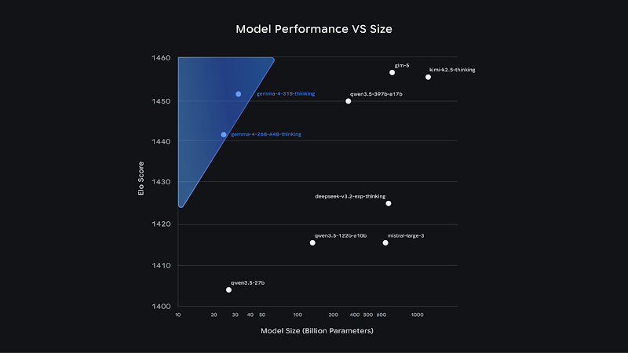

# Gemma 4 day-0: NVIDIA / AMD / Intel / TPU together, Apache 2.0

Chinese: `../../zh/vllm/blog/serving/gemma4.md`  
E2B / E4B / 26B MoE / 31B Dense. Recipes on the model card and GKE/GCE demos.

Edge 128K, larger 256K. All sizes native image/video; E2B/E4B also audio. Function calling, structured JSON, system instructions. TPU day-0 is the hook — [vllm-tpu](../architecture/vllm-tpu.md). Almost no reproducible TPS here; treat as a support matrix, not a benchmark.

Local figures (copyright remains with the original site; study copies):

