# HaluGate: the tool was right; the model still lied

Chinese: `../../zh/vllm/blog/serving/halugate.md`  
Plugin on [Iris](semantic-router-iris.md).

Tool says Eiffel 1887–1889 / 330 m; the model says 1950 / 500 m — extrinsic hallucination. HaluGate is **not** LLM-as-judge: tool message = context, user = question, assistant = claims. Three stages: Sentinel (skip creative/code) → Detector (which tokens are ungrounded) → Explainer (contradiction vs neutral). Verdicts ride HTTP headers; downstream blocks or labels. Rust path, claimed millisecond-class — trust their measurement. Not structured decode inside the engine.

Local figures (copyright remains with the original site; study copies):

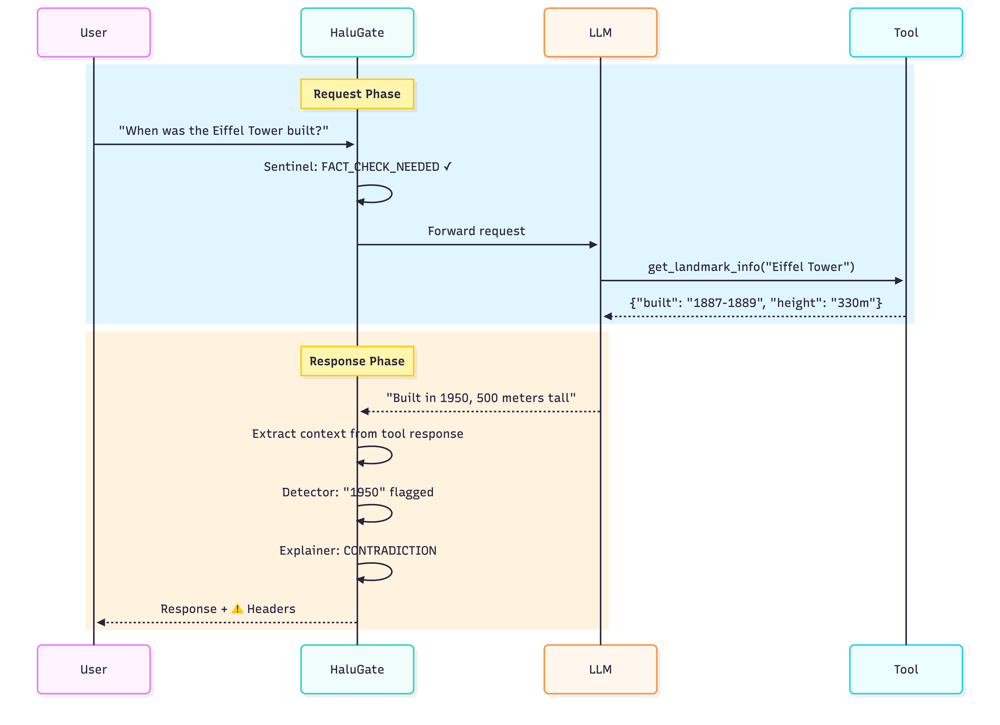

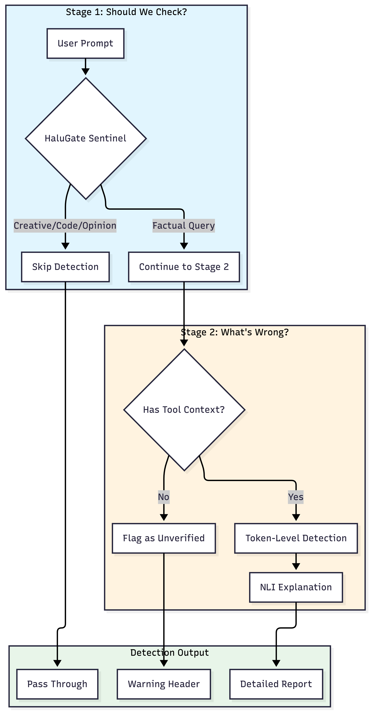

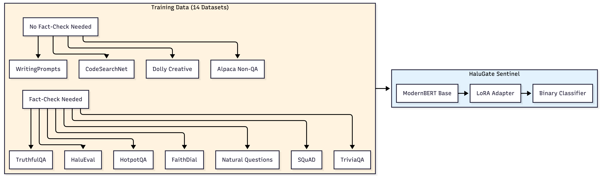

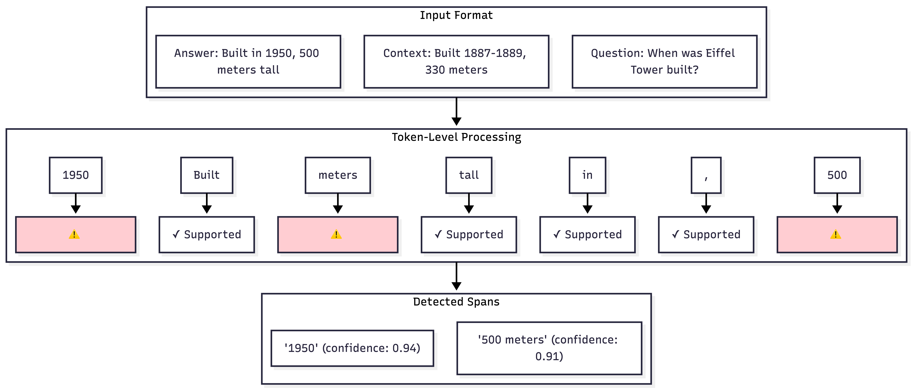

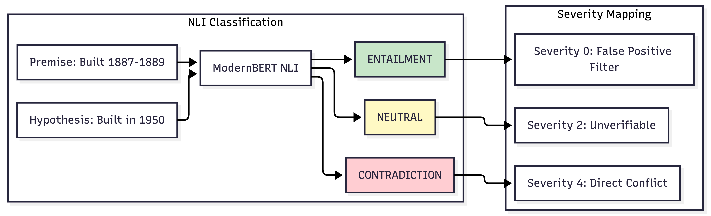

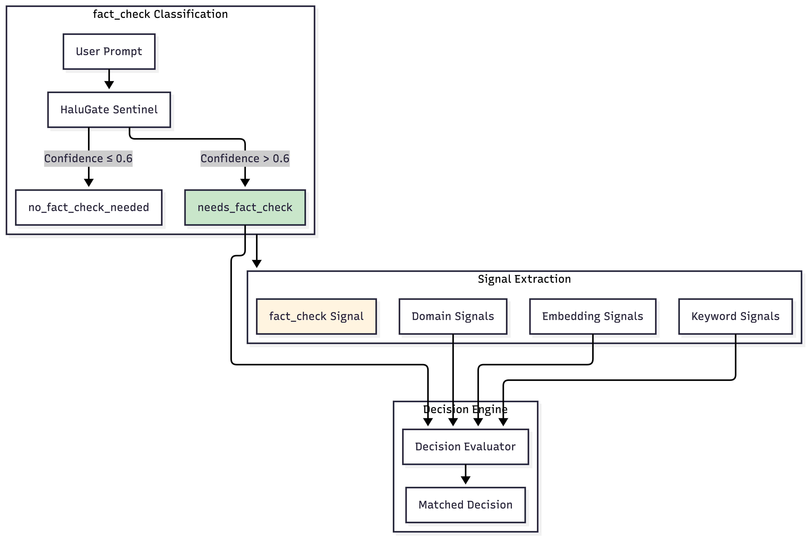

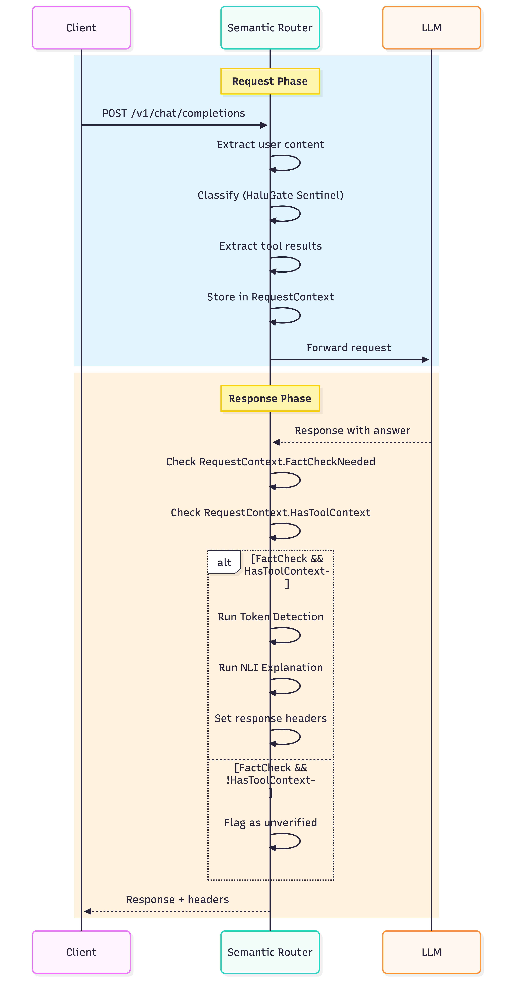

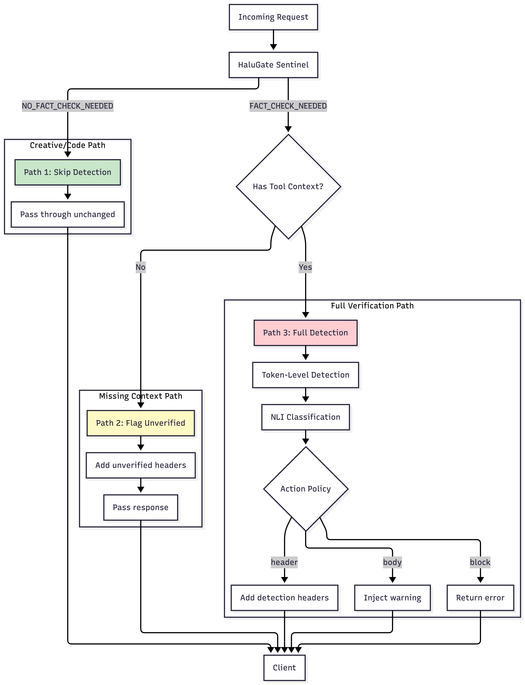

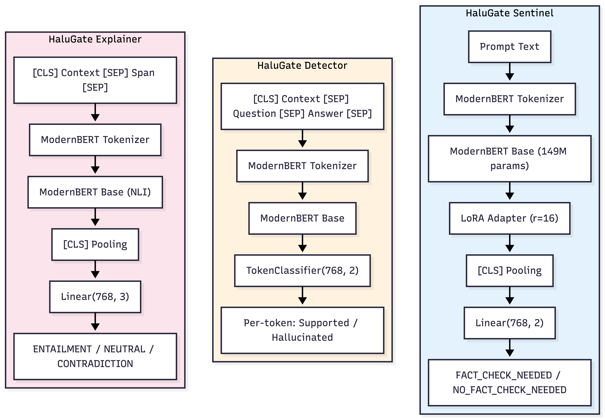

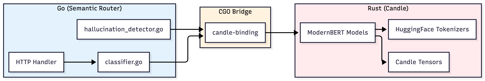

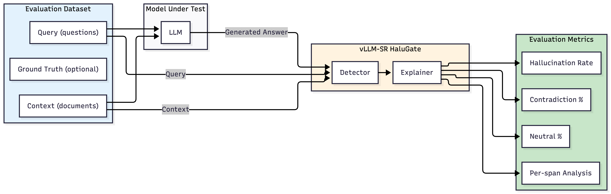
