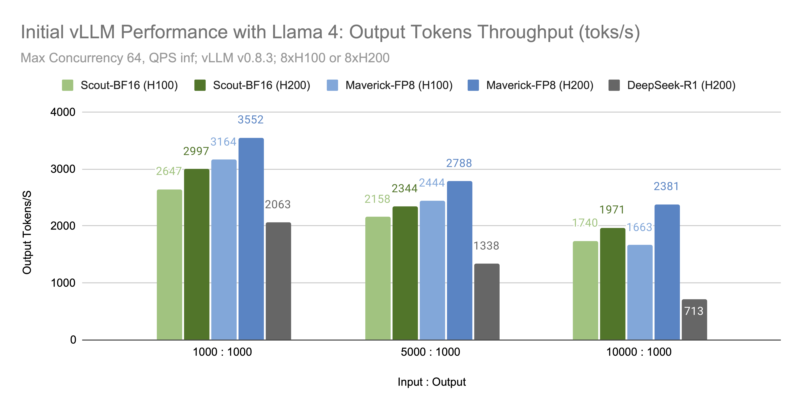

# Llama 4 in vLLM

Chinese: [zh/vllm/blog/serving/llama4.md](../../../../zh/vllm/blog/serving/llama4.md)

2025-04-05. **The vLLM Team**. Need **v0.8.3+**. Scout **17B-16E**, Maverick **17B-128E**. Native multimodal (they say 8–10 images with good results). Long-context Meta demo: [llama-cookbook notebook](https://github.com/meta-llama/llama-cookbook/blob/main/getting-started/build_with_llama_4.ipynb). Docker / `LLM` class alternatives named, CLI below. `VLLM_DISABLE_COMPILE_CACHE=1` is the launch flag they print.

Install: `pip install -U vllm`.

## Hardware windows they print

**8×H100:** Scout up to **1M**; Maverick about **430K**.

Scout:

```
VLLM_DISABLE_COMPILE_CACHE=1 vllm serve meta-llama/Llama-4-Scout-17B-16E-Instruct \
  --tensor-parallel-size 8 \
  --max-model-len 1000000 --override-generation-config='{"attn_temperature_tuning": true}'
```

Maverick FP8:

```
VLLM_DISABLE_COMPILE_CACHE=1 vllm serve meta-llama/Llama-4-Maverick-17B-128E-Instruct-FP8 \
  --tensor-parallel-size 8 \
  --max-model-len 430000
```

**8×H200:** Scout **3.6M**; Maverick **1M**.

```
VLLM_DISABLE_COMPILE_CACHE=1 vllm serve meta-llama/Llama-4-Scout-17B-16E-Instruct \
  --tensor-parallel-size 8 \
  --max-model-len 3600000
```

```
VLLM_DISABLE_COMPILE_CACHE=1 vllm serve meta-llama/Llama-4-Maverick-17B-128E-Instruct-FP8 \
  --tensor-parallel-size 8
  --max-model-len 1000000
```

(Second command is missing `\` in the original after `8`; keep the two flags.)

## Multimodality

Default server: **1 image per request**. Up to 10: `--limit-mm-per-prompt image=10`. Offline multi-image example: [vision_language_multi_image.py @ v0.8.3](https://github.com/vllm-project/vllm/blob/v0.8.3/examples/offline_inference/vision_language_multi_image.py).

## Performance figure

Local figures (copyright remains with the original site; study copies):



Output tok/s for Scout-BF16 and Maverick-FP8 under the configs above. No numeric table in prose.

## Tips

- `--kv-cache-dtype fp8` — they say it can **roughly double** usable context and help speed; little/no accuracy drop in their evals
- Scout **up to 10M**: multi-node TP or PP; [distributed serving](https://docs.vllm.ai/en/latest/serving/distributed_serving.html)

## Other hardware / quant

- A100: BF16 verified
- INT4 Scout on a **single H100**: work in progress then
- AMD MI300X: build vLLM from source (ROCm GPU install), same commands

## Accuracy they print (Maverick Instruct)

| | MMLU Pro | ChartQA |
|---|---|---|
| Reported | 80.5 | 90 |
| H100 FP8 | **80.4** | **89.4** |
| AMD MI300x BF16 | **80.4** | **89.4** |
| H200 BF16 | **80.2** | **89.3** |

lm-eval-harness vs Meta report.

## Architecture they highlight

- MoE: Scout 16 experts, Maverick 128; **17B activated**; **one expert per token**
- **iRoPE:** global attention **without RoPE** interleaved with chunked local attention **with RoPE** at **1:3**. Local layers attend inside non-overlapping chunks — quadratic cost does not grow with full length.

V1 engine + torch.compile named. Q2 roadmap they point at: [issue 15735](https://github.com/vllm-project/vllm/issues/15735) — expert parallelism, multi-node DP, cluster prefill disaggregation.

## Acknowledgements

Long Meta name list on the page (Lucia Fang, Ye Qi, …). AMD: Hongxia Yang, Weijun Jiang. Hardware for vLLM benches: Nebius and NVIDIA.
