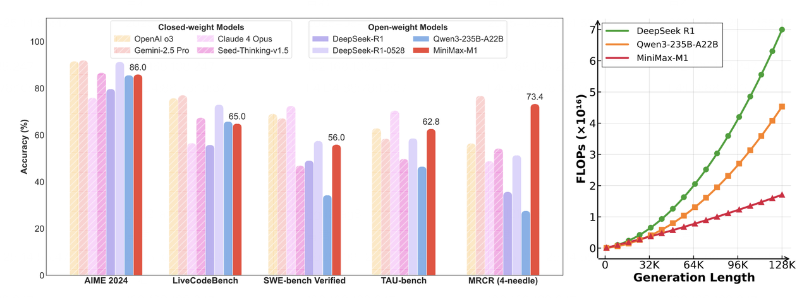
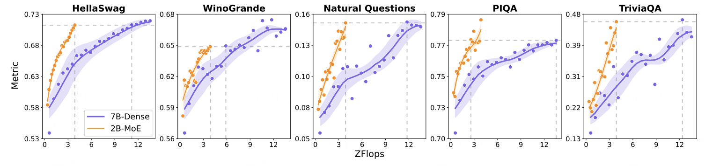
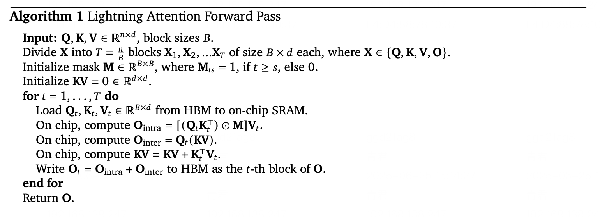

# MiniMax-M1 Hybrid Architecture Meets vLLM: Long Context, Fast Inference

Chinese: [zh/vllm/blog/serving/minimax-m1.md](../../../../zh/vllm/blog/serving/minimax-m1.md)

2025-06-30. **MiniMax**. Paper: [arXiv:2506.13585](https://arxiv.org/pdf/2506.13585). 456B total, ~45.9B active. Later MSA / 1M cousin: [minimax-m3.md](minimax-m3.md). Omni stack later still: [minimax-h3.md](minimax-h3.md). V1 then-planned: [v1-alpha.md](../architecture/v1-alpha.md). PagedAttention background: [paged-attention.md](../architecture/paged-attention.md). Study note; architecture + then-deploy. The Docker sample pins **`VLLM_USE_V1=0`** — **historical**; hybrid allocator later landed in V1.

This post is how MiniMax-M1’s hybrid architecture is served in vLLM: model features, inference challenges, and the then-current technical path.

Local figures (copyright remains with the original site; study copies):







## Introduction

[MiniMax-M1](https://arxiv.org/pdf/2506.13585) is an open-source large-scale MoE inference model. Hybrid architecture aimed at long-context reasoning and complex tasks. vLLM is the recommended serving path.

**Figure (left).** Benchmark comparison of commercial and open-source models on math, code, software engineering, tool use, long-context understanding. MiniMax-M1 leads among open-source models on that figure.

**Figure (right).** Theoretical inference FLOPs vs token length. Versus DeepSeek R1, MiniMax-M1 uses about **25%** of the FLOPs when generating **100k** tokens.

## Deploying MiniMax-M1 with vLLM

Claimed benefits in their tests: throughput, memory management, batched requests, backend performance.

### Model Download

Hugging Face: `MiniMaxAI/MiniMax-M1-40k` (or `MiniMax-M1-80k`).

```bash
pip install -U huggingface-hub
huggingface-cli download MiniMaxAI/MiniMax-M1-40k
# huggingface-cli download MiniMaxAI/MiniMax-M1-80k
```

### Deployment

Then-current Docker + vLLM snippet. **`VLLM_USE_V1=0` is historical** — do not treat it as today’s default.

```bash
IMAGE=vllm/vllm-openai:latest
MODEL_DIR=<model storage path>
NAME=MiniMaxImage
DOCKER_RUN_CMD="--network=host --privileged --ipc=host --ulimit memlock=-1 --rm --gpus all --ulimit stack=67108864"

sudo docker run -it \
    -v $MODEL_DIR:$MODEL_DIR \
    --name $NAME \
    $DOCKER_RUN_CMD \
    $IMAGE /bin/bash

export SAFETENSORS_FAST_GPU=1
export VLLM_USE_V1=0
vllm serve \
--model <model storage path> \
--tensor-parallel-size 8 \
--trust-remote-code \
--quantization experts_int8 \
--max_model_len 4096 \
--dtype bfloat16
```

## MiniMax-M1 Hybrid Architecture Highlights

### Mixture-of-Experts (MoE)

**456B** total. Routing activates a sparse subset (~**45.9B**, ~**10%**) from token semantics. Gating network computes expert-selection probabilities.

Classification: they claim up to **90%** less compute vs dense at comparable accuracy.

**Figure.** Isoflop MoE vs Dense, both trained on 1T tokens. Gray dashed lines: compute difference to reach the same performance.

### Lightning Attention

Quadratic softmax attention → linearized approximation: softmax as a **linear combination of matrix multiplications**, with dynamic memory tiling and gradient approximation.

Code-completion claim at **100k**-token sequences: memory **−83%**, inference latency **−67%**.

**Figure.** Lightning Attention algorithm overview — memory and latency for long sequences.

### Efficient Computation & Activation Strategy

Lightning Attention for runtime; sparse expert activation to skip unnecessary compute. Paper for architecture depth: [arXiv:2506.13585](https://arxiv.org/pdf/2506.13585).

## Efficient Inference with vLLM

### Advanced Memory Management

PagedAttention: KV in pages instead of one contiguous allocation. They claim fragmentation **<4%** vs traditional **60–80%**. Matters for ultra-long context: inference without walking into a memory wall.

### Deep Kernel-Level Optimizations

FlashAttention, FlashInfer; quantization GPTQ, AWQ, INT4, INT8, FP8. Quantization cuts memory and compute with (claimed) minimal accuracy loss; FlashAttention accelerates attention itself.

### Lightning Attention in vLLM

Implemented via **Triton**. Triton execution covers Lightning Attention’s core compute so the hybrid path sits inside vLLM.

## Future Work

Hybrid-allocator work for models like MiniMax-M1. Full support for [vLLM V1](../architecture/v1-alpha.md) planned then, with the hybrid architecture expected to migrate into V1. That later happened; this page is the 2025-06 snapshot.

## Conclusion

MiniMax-M1’s hybrid path is long-context reasoning and complex-task inference. vLLM’s then-pitch: paged KV, batching, kernel-level backends. Together: code generation, document analysis, conversational AI. M3 later replaces Lightning Attention with MSA — [minimax-m3.md](minimax-m3.md).

## Acknowledgement

vLLM community, in particular Tyler Michael Smith, Simon Mo, Cyrus Leung, Roger Wang, Zifeng Mo, Kaichao You. MiniMax engineering: Gangying Qing, Jun Qing, Jiaren Cai.
