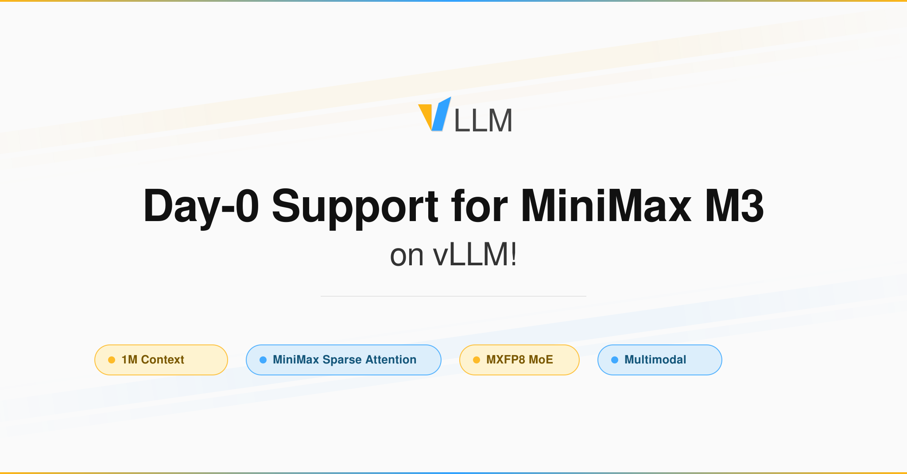
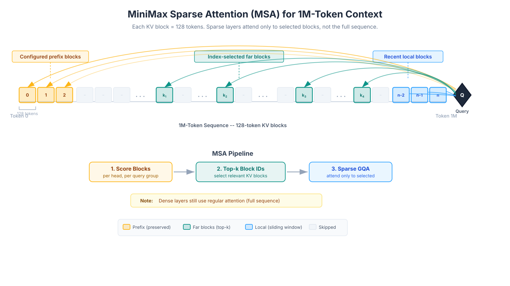
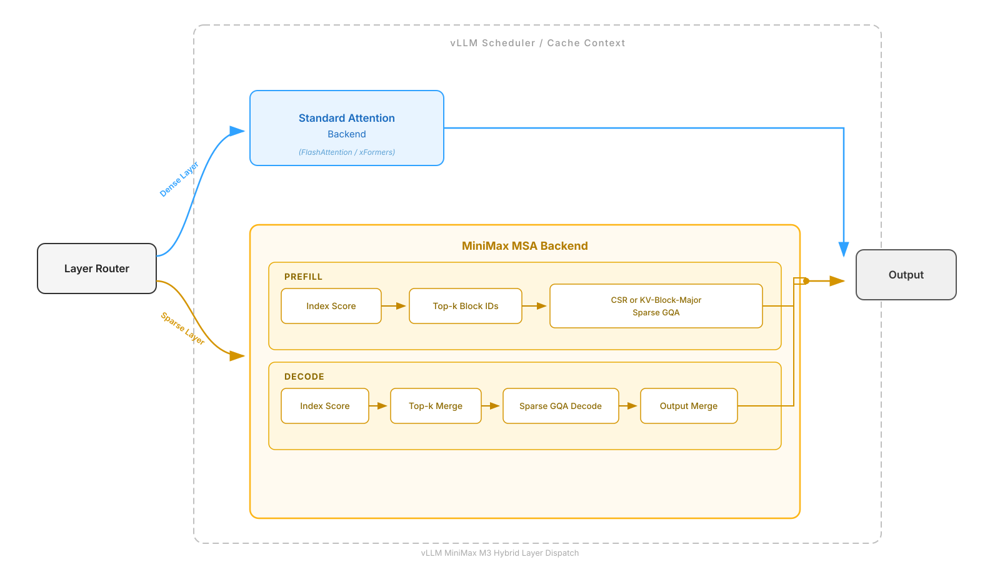
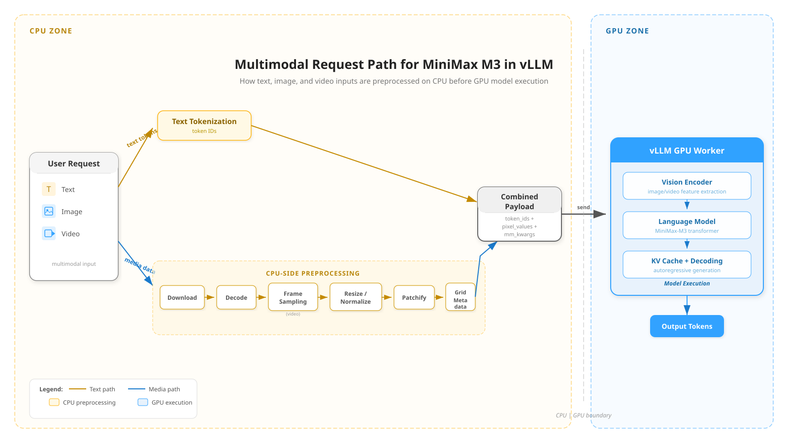
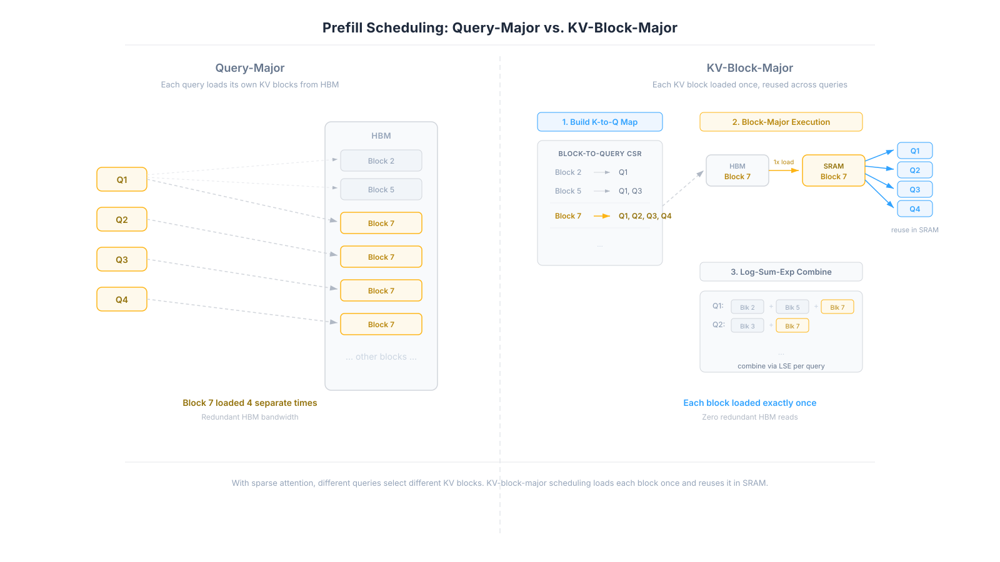
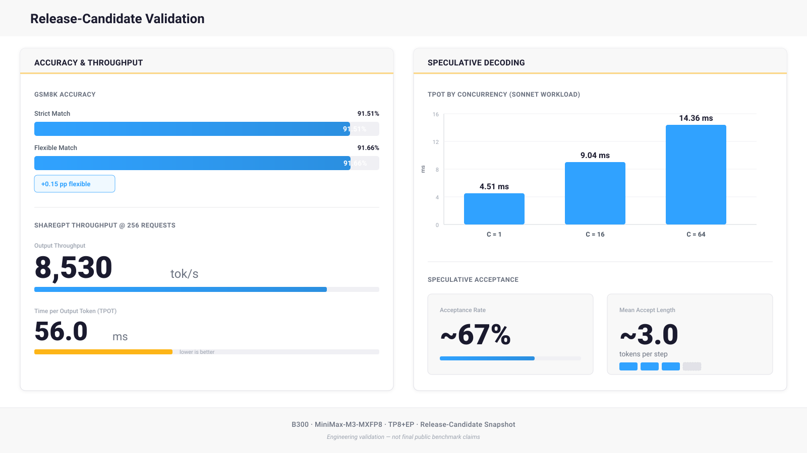

# MiniMax M3: 1M context via MSA over 128-token blocks, not full attention

Chinese: `../../zh/vllm/blog/serving/minimax-m3.md`  
BF16 / MXFP8. Verified H200 / GB200 / B300; AMD MI350/MI300.

MiniMax Sparse Attention scores 128-token KV blocks, picks top per query/KV group, then GQA. `--block-size 128` must match that grain. NVIDIA: default MSA backend; vision `--mm-encoder-attn-backend FLASHINFER`, `--mm-processor-cache-type shm`, `--mm-encoder-tp-mode data`. AMD: `--attention-backend TRITON_ATTN`, vision `ROCM_AITER_FA`. MXFP8 MoE: DeepGEMM on Blackwell, Marlin on Hopper. Parsers: `--tool-call-parser minimax_m3` `--reasoning-parser minimax_m3`. Day-0 EAGLE3: `Inferact/MiniMax-M3-EAGLE3`. NeMo RL GRPO uses vLLM for generation. Full CLI in Recipes.

Local figures (copyright remains with the original site; study copies):

