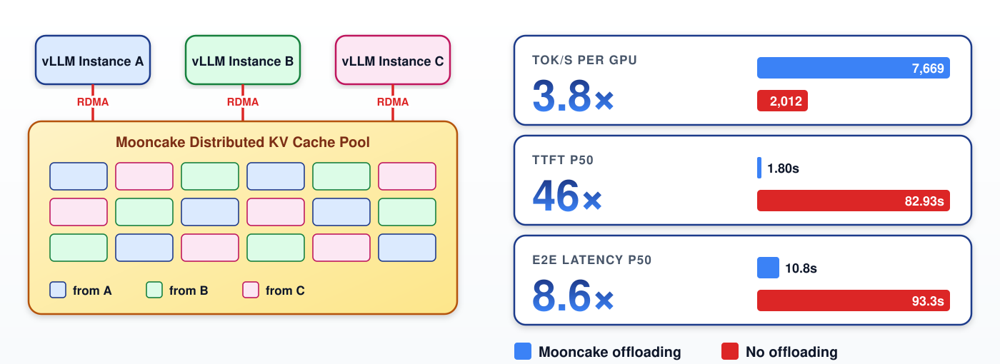
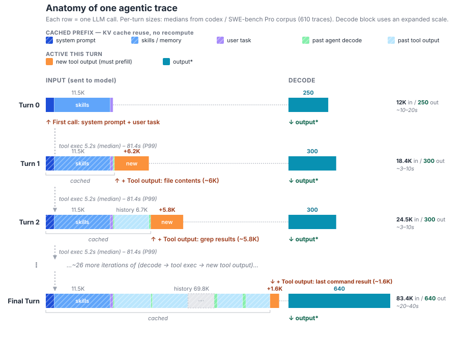
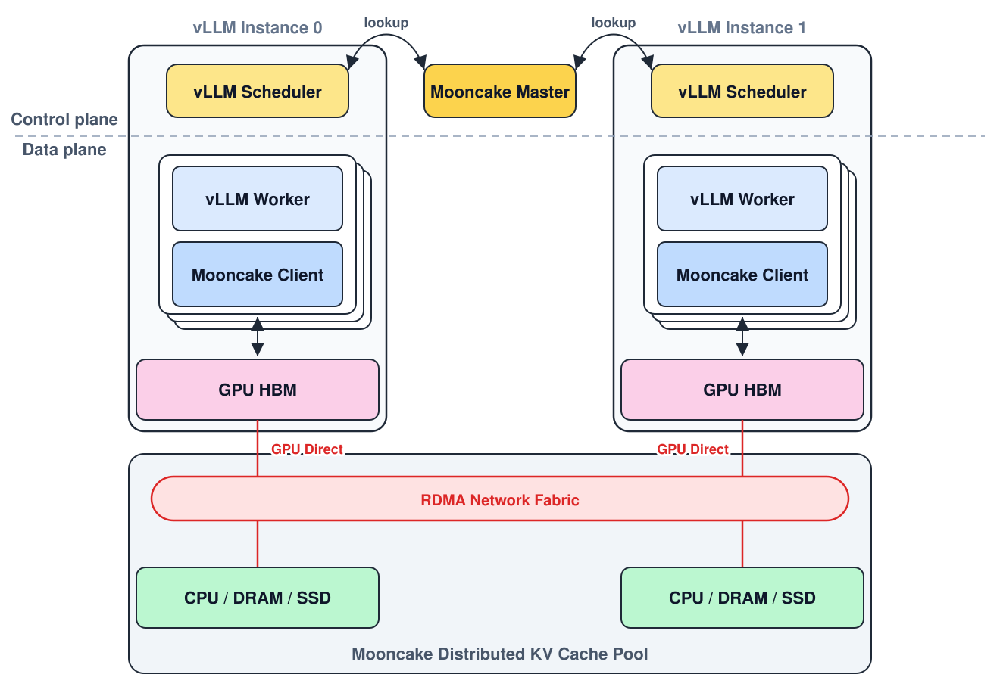
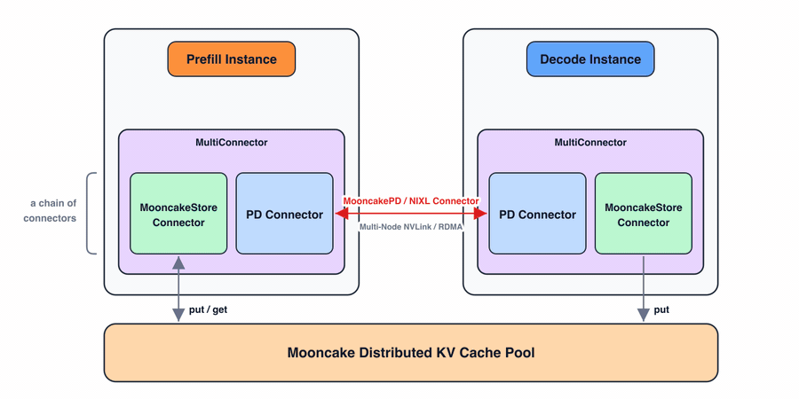
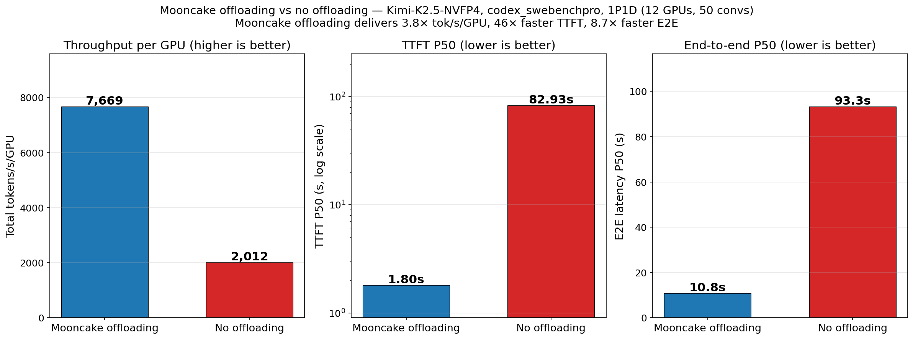
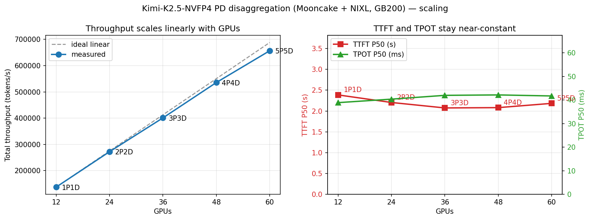

# Serving Agentic Workloads at Scale with vLLM × Mooncake

Chinese: [zh/vllm/blog/serving/mooncake.md](../../../../zh/vllm/blog/serving/mooncake.md)

2026-05-06. [Mooncake](https://github.com/kvcache-ai/Mooncake) already moved KV for P/D via [`MooncakeConnector`](https://docs.vllm.ai/en/stable/features/mooncake_connector_usage/). This post adds a **cluster-wide Mooncake Store**. Implementation: [PR #40900](https://github.com/vllm-project/vllm/pull/40900); bench scripts in the artifact tree linked from the original. Numbers are a demo, not your SLA.

**TL;DR from the page:** on realistic agentic traces, **3.8×** throughput, **46×** lower TTFT, **8.6×** lower e2e, scaling nearly linearly to **60 GB200 GPUs**.

Local figures (copyright remains with the original site; study copies):

## Agentic workloads reshape serving

Chatbots become long-running agents (reason ↔ tool). Jensen's GTC 2026 keynote is the slogan; serving sees a **shared prefix** that grows every turn.

Traces: Codex and GPT-5.4 on SWE-bench Pro, open-sourced as [Inferact/codex_swebenchpro_traces](https://huggingface.co/datasets/Inferact/codex_swebenchpro_traces). **610** traces, median **~33** turns. Figure 1: each row is one LLM call; per-turn sizes are **medians**. Cached prefix (system prompt, skills/memory, history) is reused; only new tool output + Decode are “active.”

By turn 30, median context ~**80K** tokens; longest **>180K**. Each turn typically adds hundreds to a few thousand **new** tokens. Dataset-wide ISL:OSL ~**131:1**.

If prefixes are cached, Prefill on the cached portion is almost free. The per-turn bill is the delta.

Across the 610 traces:

- **94.2%** would-be cache hit
- **131:1** input-to-output
- ~**2,242** tokens of context growth per turn
- Median context **12K → 80K** per trace
- Inter-turn delay: median **5.2 s**, P99 **81.4 s**

Local CPU/disk KV offload hits two walls:

1. **Capacity / eviction.** A 100K-token context can be several GB (example: ~**3.8 GB** for Kimi-2.5 FP8 KV). Busy instances evict long prefixes.
2. **Cross-instance miss.** The router may send the next turn to a replica that never saw the prefix.

Agent serving cannot treat replicas as isolated. They need a **distributed KV pool**.

## Mooncake Store in vLLM

Master: cluster-wide metadata (block hashes, sizes), client health, discovery, dead-node cleanup. Clients on GPU nodes pool local DRAM/SSD and speak **RDMA** to each other.

Plugs into the existing [`KVConnector`](https://github.com/vllm-project/vllm/blob/db9a84e0cd0e17ab693467ff4a71103abd4b77bf/vllm/distributed/kv_transfer/kv_connector/v1/base.py) (same door as P/D):

- **Scheduler:** hash prompt token blocks, query the master, use hits to schedule.
- **Worker:** embed a Mooncake client; background threads move data. GPU KV registered as RDMA buffers → **GPUDirect RDMA** (no SM copy kernel, no CPU staging).

### Design bets

**SM-free zero-copy.** `cudaMemcpyAsync` is weak on many small transfers; a copy kernel fights attention for SMs. Third path: NIC + GPUDirect. Transfer Engine pools multiple RNICs and picks topology-aware paths.

**Fully async I/O thread.** RDMA is async; building descriptors still burns CPU, worse for long sequences. Keep that off the CPU path that launches GPU kernels.

**`MultiConnector`** chains independent sub-connectors (P/D + store):

- **Prefill** prepares KV for the P/D connector **and** stores into the pool. Hits can be recovered from Store.
- **Decode** writes become immediately visible to Prefill. Decode did **not** yet *read* from the pool: vLLM schedules each request onto both a Prefill and a Decode instance; Prefill loads prefix KV from the pool and forwards it over the P/D connector.
- Dual-path load (Prefill instance **and** pool) was still in progress, later pointed at [DualPath](https://arxiv.org/abs/2602.21548)-like simultaneous loading.

## Results (demo)

Kimi-2.5 **NVFP4** on GB200, P/D: Prefill **TP4**, Decode **DP8 + EP** — their then-best latency–throughput tradeoff.

**Codex traces, 1P1D, 12×GB200:** ~**3.8×** throughput, ~**46×** lower P50 TTFT, ~**8.6×** lower e2e. Hit rate **1.7% → 92.2%** (system prompt only → almost the whole prefix).

**Scale 12→60 GB200**, synthetic mix shaped like Codex:

- 20K common tokens, 10K first input, 2048 tokens/turn input, 900 output, 30 turns
- Sessions scale with GPUs: 75 → 150 → 225 → 300 → 375
- Output/input kept ~**1.3%** to match Codex

**Round-robin** routing on purpose (forces cross-node fetches). Without a pool that pattern would miss constantly. With Store: hit rate **>95%**, near-linear throughput to **60 GPUs**.

## What's next (then)

Distributed disk / NVMe / DFS offload; hybrid-attention (mixed) cache policies; **cache-aware routing** (local hit first, pool as fallback); multi-node NVLink + RDMA; DualPath-like simultaneous KV load from Prefill and Decode.

## Acknowledgements

Lineage: [vLLM-Ascend](https://github.com/vllm-project/vllm-ascend). Chao Lei (Ant Group) initial implementation; Zijing Liu (Inferact) traces. Also named: Approaching.AI, Huawei, Alibaba Cloud, Ant Group, 9#AISoft, plus Inferact collaboration. Read after [router.md](router.md) and [large-scale.md](large-scale.md): the router decides *where* the next turn goes; the pool means *another instance does not have to reread*.
