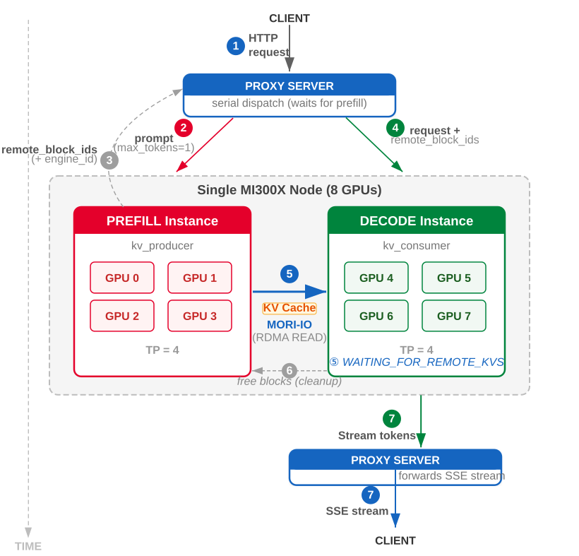
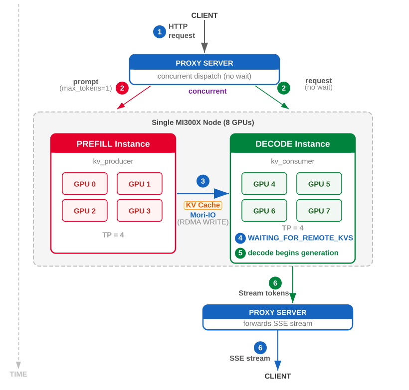
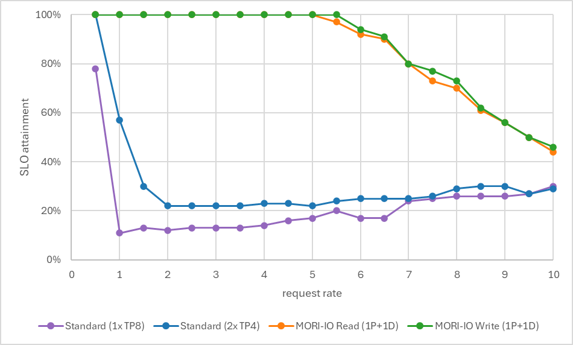
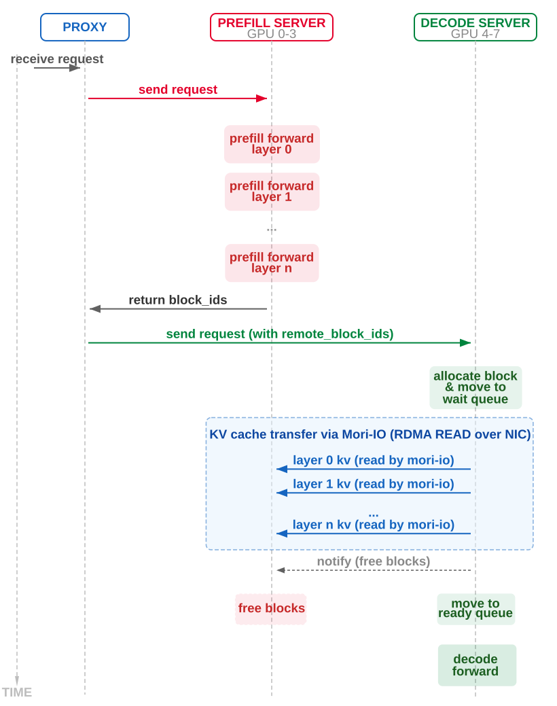
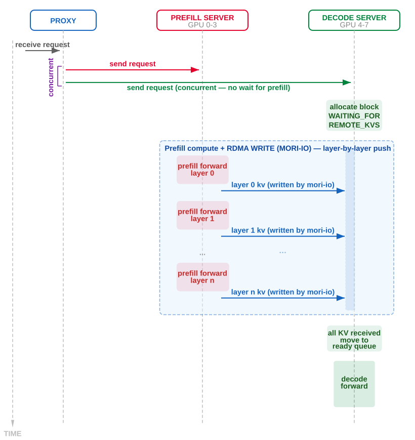

# Single-node P/D with MORI-IO

2026-04-07. One 8-GPU MI300X node. Connector: `MoRIIOConnector`. Demo: Qwen3-235B-A22B-FP8, 8 req/s, 2000/1000. Study note.

Prefill (compute-bound GEMMs) and decode (memory-bound weight walks) sharing an instance spike ITL. Split e.g. 4+4 on the same box; hand KV over in-node RDMA (MORI). First pair: background ZMQ handshake of base addresses / strides; session cached.

`VLLM_MORIIO_CONNECTOR_READ_MODE=1` → decode **pulls** after proxy waits for prefill (`remote_block_ids`). Default **write**: proxy fires both; prefill **pushes** per layer into decode’s preallocated blocks; better TTFT, no block-id relay.

Goodput (DistServe): TTFT **< 1 s** and ITL **< 50 ms**. At 8 req/s / 100 reqs: 1×TP8 26/100; 2×TP4 30/100; Read 70/100 (**2.4×**); Write **73/100 (2.5×)**. Collocated dies on bimodal ITL (~30 ms and ~150 ms). Disagg kills ITL violations; leftovers are TTFT.

[router.md](router.md) is the cross-pod gateway; this post is P/D **inside one box**. Same connector family as Mooncake / NIXL / CPU offload, different transport.

Local figures (copyright remains with the original site; study copies):

