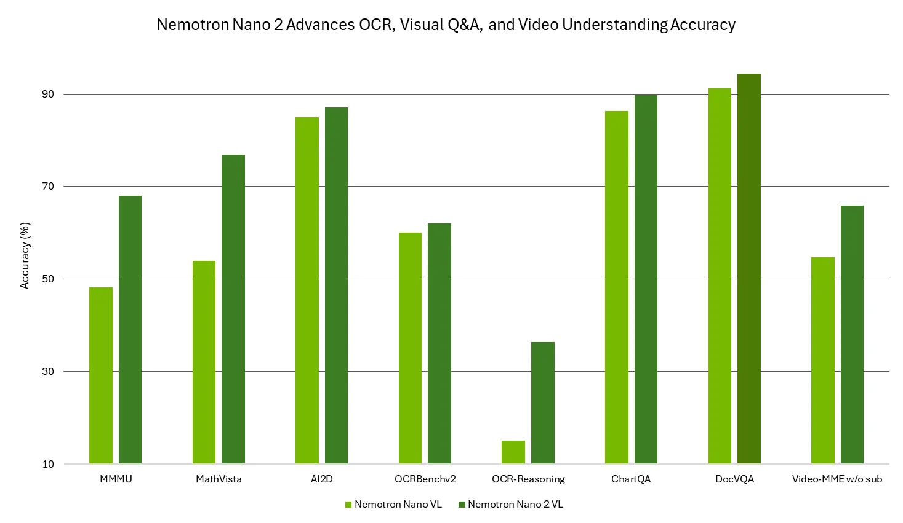
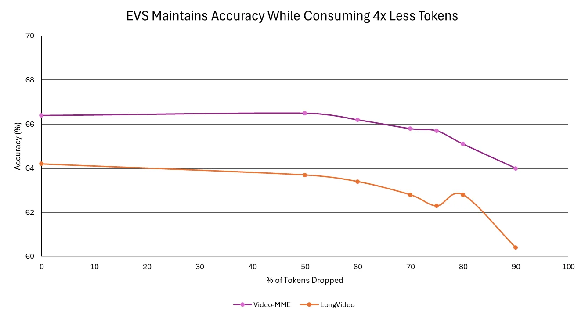

# Nemotron Nano 2 VL: 12B video/docs, EVS drops redundant frames

Chinese: [zh/vllm/blog/serving/nemotron-nano-vl.md](../../../../zh/vllm/blog/serving/nemotron-nano-vl.md)  
128K. CRADIOH-V2 encoder + EVS + Nano 2 LLM. Then nightly.

`--video-pruning-rate 0` means no prune; FP8/FP4 `--quantization modelopt` / `modelopt_fp4`. System `/no_think` disables thinking. They quote VLM-suite average 74 vs then-top VL 64.2 — marketing; re-measure from the cookbook. Successor Omni: [nemotron-omni](nemotron-omni.md).

Local figures (copyright remains with the original site; study copies):

