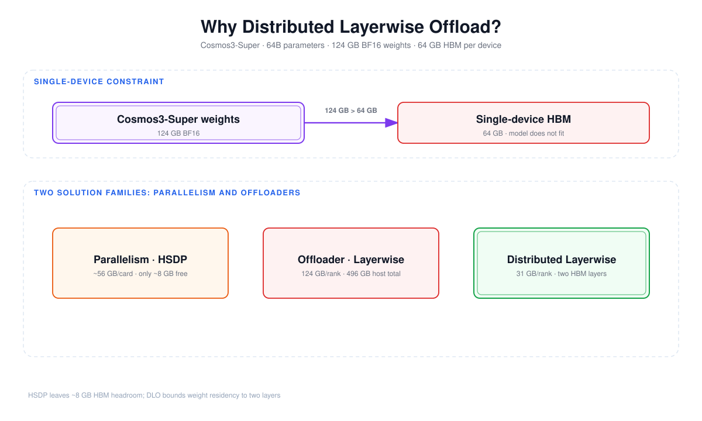
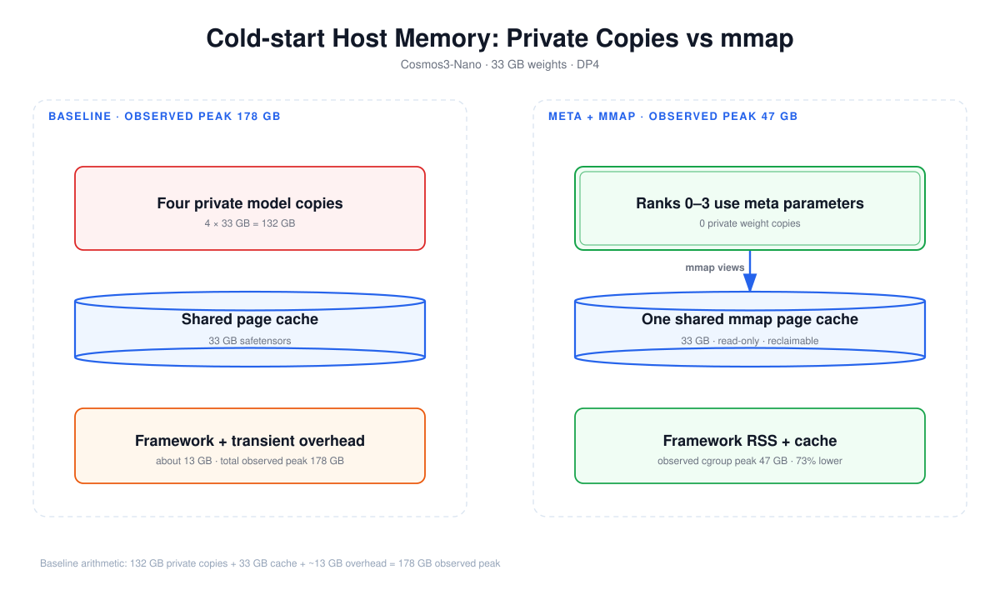
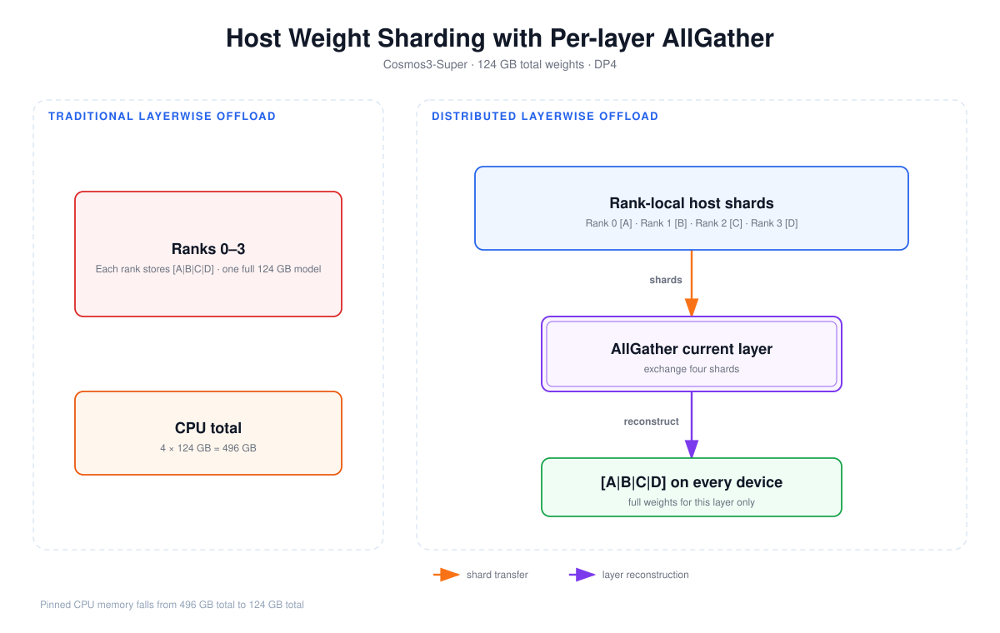
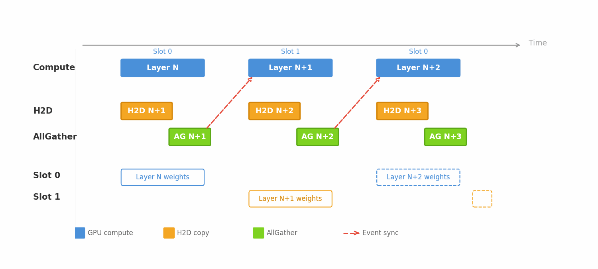
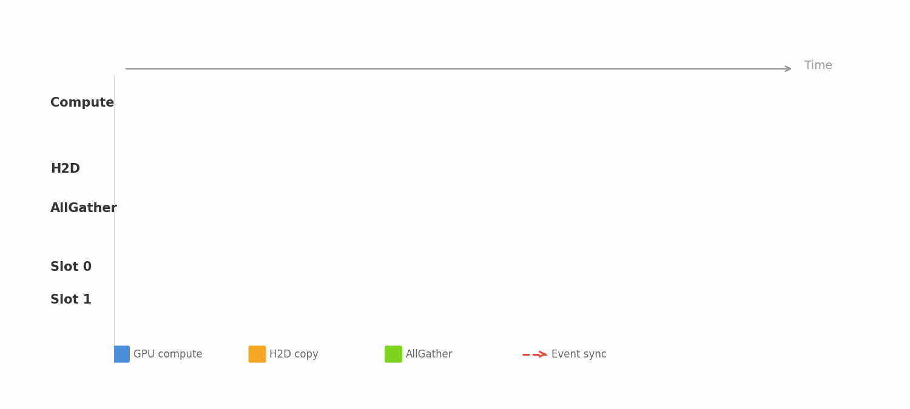
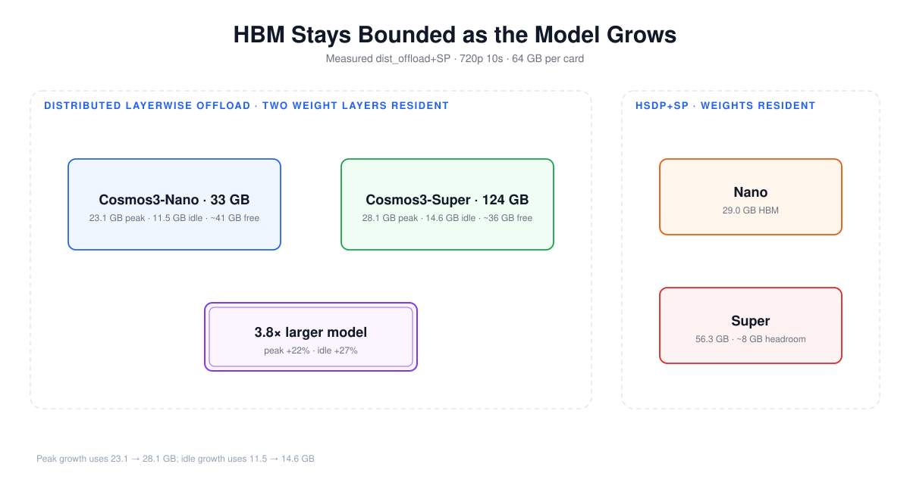
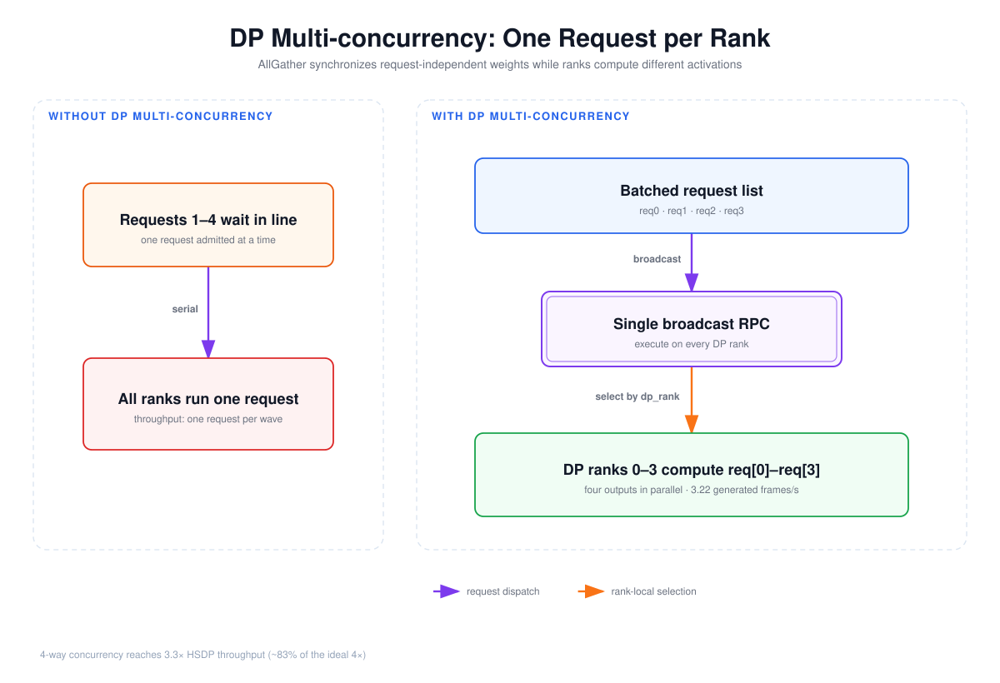
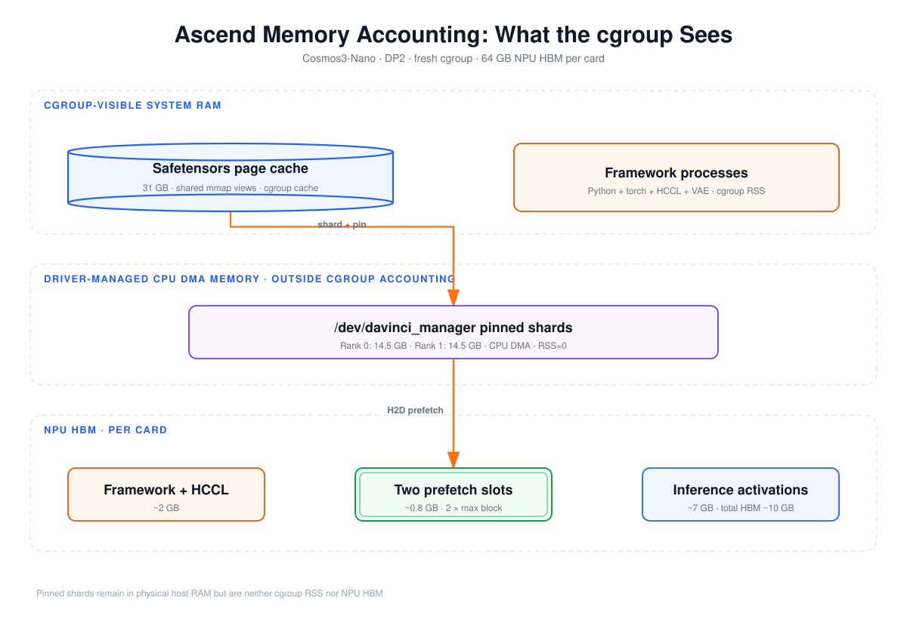
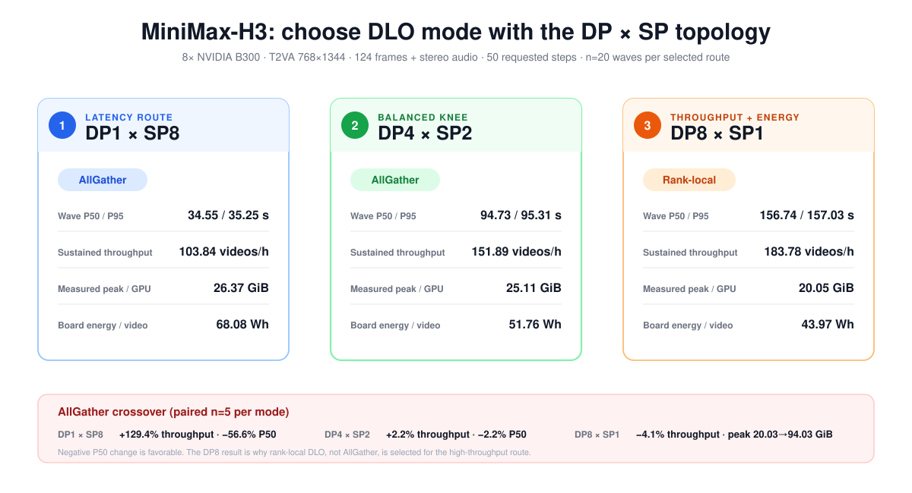
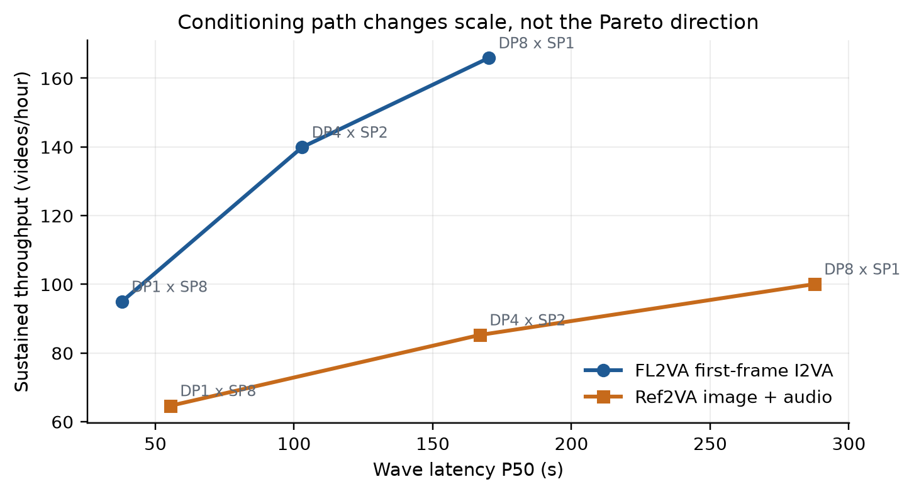

# Distributed Layerwise Offload: Scaling Toward 200B+ DiT Models Efficiently in vLLM-Omni

Chinese: [zh/vllm/blog/serving/omni-layerwise-offload.md](../../../../zh/vllm/blog/serving/omni-layerwise-offload.md)

2026-08-17. **vLLM-Omni Diffusion Team**. DLO shards and streams DiT weights so a measured **124 GB** Cosmos3-Super can run on **64 GB** HBM, with a host-capacity *estimate* toward 200B+. Same Omni line: [vllm-omni.md](vllm-omni.md), [minimax-h3.md](minimax-h3.md), [omni-diffusion-cache.md](omni-diffusion-cache.md). Study note; production-oriented measurements on the page, not your SLA.

## TL;DR

- Out-of-the-box DLO + AllGather quickstart: vLLM `0.27.0` with vLLM-Omni `v0.27.0rc1`.
- Meta-device init + mmap: Cosmos3-Nano DP4 cold-start cgroup-visible peak **178 GB → 47 GB** (−73%).
- Each rank stores `1/dp_size` of weights; AllGather reconstructs the current layer, overlapped on dedicated streams.
- Fixed double buffer: **exactly 2 layers** of weights on device at a time. Measured 720p 10s `dist_offload+SP`: peak HBM **23.1 → 28.1 GB** (~22%) from 17B to 64B; idle HBM **11.5 → 14.6 GB** (~27%).
- DP multi-concurrency: **3.3×** throughput vs single-request HSDP — about **83%** of ideal 4×.
- CUDA/NCCL and Ascend CANN/HCCL via Omni’s platform layer. On 8× B300 MiniMax-H3, AllGather wins DP1×SP8 and DP4×SP2; rank-local DLO wins DP8×SP1 at **183.78 videos/h** and **43.97 Wh/video**.
- No 200B-class model was actually run. The 400 GB / 2 TB table is host-capacity extrapolation.

Local figures (copyright remains with the original site; study copies):





















## Quickstart

The two AllGather commands need vLLM-Omni `v0.27.0rc1` or later with vLLM `0.27.0`. On `v0.26.0`, the Cosmos3 DLO+DP path rejects every request because the engine requires `supports_request_batch=True` for multi-request admission, and `Cosmos3OmniDiffusersPipeline` does not declare it ([#5953](https://github.com/vllm-project/vllm-omni/issues/5953)). [#5864](https://github.com/vllm-project/vllm-omni/pull/5864) bypasses that requirement for DLO+AllGather+DP: each DP rank runs its own request through the pipeline’s single-request forward path; the engine collects per-rank queues. The no-AllGather DP command is **not** covered by #5864; independent request dispatch for `--dlo-no-use-allgather` is [#5911](https://github.com/vllm-project/vllm-omni/pull/5911) (still open in the post). #5864 does not change DLO sharding or offload memory. Each measurement section reports its own environment.

```bash
# 4× NPU or GPU — Cosmos3-Nano with DP=4
vllm serve /path/to/Cosmos3-Nano --omni \
    --enable-distributed-layerwise-offload \
    --data-parallel-size 4

# 2× devices — Cosmos3-Super (124 GB) with DP=2
vllm serve /path/to/Cosmos3-Super --omni \
    --enable-distributed-layerwise-offload \
    --data-parallel-size 2

# Disable AllGather (each rank loads full weights, no sharding)
vllm serve /path/to/Cosmos3-Nano --omni \
    --enable-distributed-layerwise-offload \
    --data-parallel-size 4 \
    --dlo-no-use-allgather
```

`--dlo-use-allgather` / `--dlo-no-use-allgather` controls sharding (default: sharded). Disabled: each rank loads the standard loader’s rank-local tensors — a full model copy in pure-DP, while existing TP shards are already rank-local and reused. Use when AllGather sync costs more than the memory save.

## The problem: large diffusion models vs HBM and host memory

Cosmos3-Super (**64B**, **124 GB** BF16) cannot fit on a single **64 GB** HBM device. Two families of existing solutions:

**Figure 1.** Offloader vs parallelism for Cosmos3-Super. HSDP uses about **31 GB** of weights plus roughly **25 GB** of activations and communication buffers per card (~**56 GB** total), **8 GB** headroom; DLO keeps only two layers in HBM while sharding host weights.

| Approach | Device HBM | Host memory per rank | Limitation |
|---|:---:|:---:|---|
| HSDP (FSDP2) | model / N | 0 | HBM fills: 64B → 56 GB/card (8 GB headroom) |
| Layerwise offload (pure DP) | 2 layers only | full model | N × model_size host RAM (4 × 124 GB = 496 GB) |
| Tensor Parallel | model / N | 0 | Activation scaling helps; communication overhead |
| Dist. Layerwise (ours) | 2 layers only | model / N | Requires AllGather synchronization |

Pure-DP host RAM is the killer: traditional layerwise offload stores a full copy per rank. 4 devices → **4 × 124 GB = 496 GB**. TP deployments may already use rank-local shards.

During loading, each rank independently calls `param.data.copy_(loaded_weight)`, creating `dp_size` private copies in RSS. Peak RSS scales as `O(dp_size × model_size)`, reaching **2 TB** for a 200B model with `dp_size=4`.

## Solution overview

Four cooperating techniques:

| Technique | Problem it addresses | Primary benefit |
|---|---|---|
| Meta device + mmap | O(dp_size × model) RSS during loading | −73% cold-start cgroup-visible peak |
| Weight sharding + AllGather | N × model_size host memory | 1× model_size total (shared page cache) |
| Double-buffer prefetch | All weights on device | Only 2 layers on HBM at any time |
| DP multi-concurrency | Serial request processing | 3.3× throughput via N parallel requests |

The first three make large-model serving memory-feasible. DP multi-concurrency is a throughput optimization on the AllGather already required by sharding.

## 1. Meta device + mmap weight loading

**Why.** Original path: each rank `load_model(load_device="cpu")` before `offload_backend.enable()`. `param.data.copy_(loaded_weight)` created `dp_size` private copies. Cosmos3-Nano DP4 cgroup-visible peak **178 GB** for a **33 GB** model.

**Why it works.** Offloader converts already-created DiT modules to meta with `to_empty(device="meta")`, then replaces meta parameters with mmap views from `safe_open().get_tensor()` into the OS page cache.

```python
# distributed_layerwise_backend.py — release existing DiT parameter storage
dit_module.to_empty(device="meta")

# Resolve an HF repo ID, then replace meta parameters with mmap views
model_path = download_weights_from_hf(...)
tensor = safe_open(file_path, framework="pt", device="cpu").get_tensor(ckpt_key)
parent._parameters[name] = Parameter(tensor)  # points to shared page cache
```

All ranks mmap the same safetensors; the OS keeps one page-cache copy. Hugging Face repo IDs (not local paths) resolve via `download_weights_from_hf()`, matching DiffusersPipelineLoader.

**What you gain.** Cold-start cgroup-visible peak **178 GB → 47 GB** for Cosmos3-Nano DP4 (−73%). The 178 GB baseline: **132 GB** private copies + **33 GB** shared page cache + ~**13 GB** framework/transient. mmap page cache (1× model_size) is shared and read-only; OS can reclaim under pressure.

**Figure 2.** Those two bars: four private copies replaced by meta parameters backed by one shared mmap page cache.

## 2. Weight sharding with AllGather reconstruction

**Why.** mmap does not stop layerwise offload from copying the full model into each rank’s pinned CPU memory for H2D. Pure-DP baseline: 4 devices × 33 GB = **132 GB** pinned, linear in device count.

**Why it works.** Each rank stores `1/dp_size`. Runtime reconstructs via `all_gather_into_tensor` on a dedicated comm stream.

```python
# _shard_and_pin: each rank stores only its 1/dp_size shard
shard_size = (total_numel + dp_size - 1) // dp_size  # ceil division
shard = torch.zeros(shard_size, dtype=dtype, device="cpu")
# Copy only the portion within [rank * shard_size, (rank+1) * shard_size)
shard[dst_slice].copy_(mmap_view.flatten()[src_slice])
shard = shard.pin_memory()  # DMA buffer for fast H2D
```

Ceil division with zero-padding so shards are equal-sized (`all_gather_into_tensor` requirement). After sharding, mmap views become zero-element placeholders.

**What you gain.** Total pinned memory: `dp_size × model_size` → `model_size` (sum across ranks). Cosmos3-Super DP4: **4 × 124 GB → 124 GB** total, **31 GB** per rank.

**Figure 3.** Host-resident weights shrink from one full model per rank to one shard per rank; AllGather reconstructs only the current full layer on device.

## 3. Double-buffered prefetch with H2D + AllGather overlap

**Why.** Sharding solved memory; each layer still needs full weights on-device. Load all layers → HBM fills again. Synchronous H2D → wait → AllGather → wait → compute leaves the GPU idle.

**Why it works.** Exactly two device buffers, each sized to the **largest block**. While compute runs layer N on slot 0, background streams prepare layer N+1 into slot 1.

**Figure 4 / GIF.** Three-stream timeline: Compute (blue), H2D (orange), AllGather (green). Red dashed arrows: event sync — compute waits for AllGather before switching slots.

Two-stage prep on separate streams:

1. **H2D** (`copy_stream`): load `1/dp_size` shard from pinned CPU to device
2. **AllGather** (`comm_stream`): gather shards into the full-weight buffer

Event-based overlap with compute. After AllGather, parameters re-point to slices of the output buffer using cached metadata. Buffers allocated once to max block size, reused. HBM weights bounded by `2 × max_block_size`, independent of layer count.

On Ascend NPU, `pin_memory()` allocates DMA-capable memory via `/dev/davinci_manager`. That memory sits in CPU kernel space and is **not** tracked by cgroup — why cgroup peak is much lower than expected.

**What you gain.** HBM holds only 2 layers of weights (~**2 GB** Nano, ~**3 GB** Super), independent of depth. Buffer capacity still grows with the largest block; total HBM also includes workload-dependent activation and comm buffers. Measured `dist_offload+SP` 720p 10s: peak HBM ~**22%** (**23.1 → 28.1 GB**) Nano→Super; idle HBM ~**27%** (**11.5 → 14.6 GB**). Model is **3.8×** larger; both stay well below 64 GB.

**Figure 6 (numbered 4 in the post’s HBM chart).** Same 720p 10s HBM. HSDP+SP reaches **56.3 GB** on Super.

## 4. DP multi-concurrency: N requests in parallel

**Why.** AllGather only gathers **weight** shards — request-independent. Ranks sync at each AllGather but can compute different activations. Without exploiting that, DP ranks idle between AllGathers; throughput is 1 request at a time.

**Why it works.** With `dp_concurrent`, the scheduler batches up to `dp_size` requests. Executor sends them in one broadcast RPC.

**Figure 5.** A single broadcast carries a request list; each DP rank computes a different request while synchronized AllGather exchanges request-independent shards.

```python
# Executor: send all requests at once
reqs_list = [nr.req for nr in new_reqs]
results = collective_rpc("execute_model", args=(reqs_list, ...),
                         unique_reply_rank=None, exec_all_ranks=True)
```

Each worker picks one request by **DP rank** (not global rank, for SP/TP):

```python
dp_rank = get_data_parallel_rank()
req = reqs_list[dp_rank % len(reqs_list)]
```

Only the primary rank in each DP replica (SP=0, TP=0, CFG=0, PP=0) replies, tagged with `dp_rank`. Executor round-robin polls and sorts by `dp_rank`.

A validation step rejects concurrent requests whose batch-compatibility key differs. The key covers spatial/temporal shape (`height`, `width`, `num_frames`, `fps`), CFG/guidance (`guidance_scale`, `true_cfg_scale`, `cfg_normalize`), `num_inference_steps`, LoRA identity (`lora_int_id`, `lora_scale`), output count, quality mode, and pipeline-specific `extra_args` — AllGather is a collective; mismatch would hang. `extra_args` must be JSON-identical. Seeds and generators may differ per rank. Since #5864, the pipeline need not declare `supports_request_batch=True`. Incompatible or empty-prompt waves are rejected before worker dispatch; a partial-wave timeout **fails closed** rather than deadlocking the collective.

**What you gain.** 4 concurrent requests: **3.22** generated video frames/s — **3.3×** the HSDP single-request baseline, ~**83%** of ideal 4×. Fixed AllGather overhead (~**150 ms/step**) amortized across 4 concurrent computations.

## Ascend memory accounting: cgroup-visible vs physical RAM

Naive expectation: 2× model_size host memory (page cache + shard buffers). On Ascend, `pin_memory()` via `/dev/davinci_manager` puts the shard in CPU kernel DMA **invisible to cgroup**. Physical RAM ≈ page cache + pinned shards + framework overhead.

**Figure 6.** Cosmos3-Nano DP2: cgroup sees shared page cache and framework RSS; pinned shards through `/dev/davinci_manager` are driver-managed CPU DMA, not NPU HBM.

Verified (Cosmos3-Nano DP2, fresh cgroup):

```
cgroup usage_in_bytes = 49 GB = cache(31) + rss(18)  ← exact match, no extra
cgroup kmem           = 0 GB
davinci_manager RSS   = 0 kB  (in /proc/<pid>/smaps)
NPU HBM per card      = 10 GB  (< 14.5 GB shard → shard NOT in HBM)
Slab                  = 3.3 GB  (too small for 29 GB shard)
```

| Component | Location | Size | Tracked by cgroup? |
|---|---|---|:---:|
| Safetensors page cache | System RAM (user space, shared) | 1× model_size | yes (cache) |
| Framework (Python/torch/HCCL) | System RAM (user space, per-rank) | ~3.5 GB × dp_size | yes (rss) |
| Shard (pinned) | CPU kernel DMA (`/dev/davinci_manager`) | model_size / dp_size per rank | no |
| Prefetch buffers | NPU HBM | 2 × block_size per rank | no |

cgroup-visible memory scales as `O(model_size + dp_size × constant)`, not `O(dp_size × model_size)` — but total physical RAM is cgroup-visible **plus** pinned DMA shards. For a 200B model with `dp_size=4`: ~**423 GB** cgroup + ~**400 GB** kernel DMA = ~**823 GB** physical (fits in 2 TB) vs **2000 GB** without mmap.

## Validation results

All tests on Ascend 910B3 (**64 GB** HBM/card, **2 TB** system RAM), Cosmos3-Nano (**33 GB**) and Cosmos3-Super (**124 GB**).

### Correctness

| Model | Config | Requests | HTTP | Frames | Video |
|---|---|:---:|:---:|:---:|:---:|
| Nano (33 GB) | DP2 | 2 concurrent, 35 steps | 2/2 × 200 | 29/29 | OK |
| Nano (33 GB) | DP4 | 4 concurrent, 35 steps | 4/4 × 200 | 29/29 | OK |
| Super (124 GB) | DP2 | 1 request, 5 steps | 200 | 29 | OK |
| Super (124 GB) | DP4 | 1 request, 5 steps | 200 | 29 | OK |

### Host memory (cgroup peak)

| Model | Config | cgroup Peak | Page Cache | RSS | Per-worker HWM | vs. Baseline |
|---|---|:---:|:---:|:---:|:---:|:---:|
| Nano (33 GB) | DP4 (mmap) | 47 GB | 31 GB | 14 GB | 12.1 GB | — |
| Nano (33 GB) | DP4 (no mmap) | 178 GB | — | — | 36 GB | −73% |
| Super (124 GB) | DP2 | 157 GB | 149 GB | 7 GB | 65.2 GB | — |
| Super (124 GB) | DP4 | 172 GB | 149 GB | 14 GB | 35.5 GB | — |

### NPU HBM

| Model | Config | HBM/card (idle) | HBM/card (inference) | 64 GB Headroom |
|---|---|:---:|:---:|:---:|
| Nano (33 GB) | DP2 | 9.9 GB | 10.4 GB | 55 GB |
| Nano (33 GB) | DP4 | 9.4 GB | 10.2 GB | 55 GB |
| Super (124 GB) | DP2 | ~15 GB | — | ~49 GB |
| Super (124 GB) | DP4 | ~10 GB | — | ~54 GB |

Super inference HBM for those DP2/DP4 rows is **not** reported. The 720p 10s `dist_offload+SP` peak/idle numbers above are the Super HBM evidence they do give.

### Performance

Ascend: Cosmos3-Nano at **832×480**, **29** frames, **35** denoising steps. **Generated frames/s** = aggregate output video frames per wall-clock second (`29 frames × outputs per wave / wave latency`), **not** playback FPS.

| Strategy | Per-step (ms) | Generated frames/s | CPU/rank | HBM/card | vs. HSDP |
|---|:---:|:---:|:---:|:---:|:---:|
| HSDP+SP (baseline) | 870 | 0.967 | 0 GB | 20.3 GB | — |
| dist_offload+AG (DP4, 1 req) | 1,020 | 0.806 | 3.5 GB | 12.4 GB | −17% |
| dist_offload+AG (DP4, 4 req) | 1,020 | 3.22 | 3.5 GB | 12.4 GB | 3.3× |
| dist_offload no-AG | 1,877 | 0.439 | 28.3 GB | 14.1 GB | −55% |

AllGather overhead = **150 ms/step** (**72 ms** stream switch + **10 ms** HCCL + **68 ms** Python dispatch), Cosmos3-Nano DP4. Communication volume varies with layer dims, participant count, topology. With 4 concurrent requests the fixed cost is amortized 4×.

### NVIDIA B300 GPU results

Same DLO stack on NVIDIA B300 SXM6. Cosmos3-Super BF16 (**124 GB**), 4× B300 (physical GPUs **1,5,6,7**), Python 3.12.3, PyTorch 2.11.0+cu130, CUDA 13.0, vLLM `0.23.0`, vLLM-Omni commit [`9772bb32`](https://github.com/vllm-project/vllm-omni/commit/9772bb321f558a28c0dca1cb53b44aaf10e4ab69) — a **pre-merge** snapshot of PR [#5397](https://github.com/vllm-project/vllm-omni/pull/5397). The merged head has later loader-gating and TP/mmap validation **not** in this benchmark. MiniMax-H3 below uses its own versions, `enforce_eager=True`, and a local pipeline patch; **do not** assume those for Cosmos3.

Correctness: byte-identical output hashes across strategies. T2I seed 42: SHA256 `6e7d2a8c63b88391...` across DLO+AG, no-AG, DLO+USP4, legacy layerwise+USP4, HSDP+USP4. T2V 832×480×29f seed 17: identical **666,029**-byte output (SHA256 `c5d38f5d21ca619e...`).

CUDA process-tree PSS includes shared page cache, pinned CPU shards, and framework memory. Ascend cgroup **excludes** `/dev/davinci_manager`-backed pinned shards — GPU PSS and Ascend cgroup are **not** directly comparable.

#### 1024×1024 T2I, 50 steps

| Strategy | Concurrency | Wave latency | Throughput | Process-tree PSS | Peak HBM/card |
|---|:---:|:---:|:---:|:---:|:---:|
| DLO+AG DP4 | 4 | 43.69s (median) | 0.0915 outputs/s | 198–202 GiB | 12.62 GiB |
| DLO no-AG DP4 | 4 | 112.96s | 0.0354 outputs/s | 532 GiB | 11.43 GiB |
| HSDP+USP4 | 1 | 15.19s | 0.0658 outputs/s | 483 GiB | 42.00 GiB |
| legacy layerwise+USP4 | 1 | 105.22s | 0.0095 outputs/s | 533 GiB | 13.99 GiB |

DLO+AG DP4 with 4 concurrent requests: **1.39×** HSDP+USP4 throughput, **30%** of the HBM (**12.6 GiB** vs **42.0 GiB**).

#### 832×480 T2V, 29 frames, 35 steps

| Strategy | Outputs/wave | Wave latency | Throughput | Output SHA |
|---|:---:|:---:|:---:|:---|
| DLO+AG DP4 | 4 | 38.79s | 0.1033 outputs/s | c5d38f5d... |
| HSDP+USP4 | 1 | 15.38s | 0.0653 outputs/s | c5d38f5d... |
| DLO+AG+USP4 | 1 | 30.79s | 0.0326 outputs/s | c5d38f5d... |
| legacy layerwise+USP4 | 1 | 81.46s | 0.0123 outputs/s | c5d38f5d... |

#### Workload latency and HBM (35 steps, DLO+AG DP4 vs HSDP+USP4)

| Workload | DLO strategy | DLO outputs/wave | DLO wave latency | DLO peak HBM/card | HSDP outputs/wave | HSDP wave latency | HSDP peak HBM/card |
|---|---|:---:|:---:|:---:|:---:|:---:|:---:|
| 480p, 29f | DLO+AG DP4 | 4 | 38.79s | 14.55 GiB | 1 | 15.38s | 43.77 GiB |
| 480p, ~5s (121f) | DLO+AG DP4 | 4 | 102.58s | 15.88 GiB | 1 | 41.36s (125f) | 53.73–62.65 GiB |
| 480p, ~10s (241f) | DLO+AG DP4 | 4 | 226.70s | 17.33 GiB | 1 | 82.47s (245f) | 53.74 GiB |
| 720p, 5s (121f) | DLO+AG DP4 | 4 | 288.29s | 24.95 GiB | 1 | 87.47s | 52.19 GiB |
| 720p, 10s (241f) | DLO+AG+USP4 | 1 | 214.53s | 24.99 GiB | 1 | 210.05s | 53.73 GiB |

720p 10s (241f): DLO+AG+USP4 **214.53s** — within **2.13%** of HSDP **210.05s** — byte-identical (SHA256 `08cb679322996ea6...`), **47%** of HSDP HBM (**24.99 GiB** vs **53.73 GiB**).

#### MiniMax-H3 on 8× B300: DLO mode is topology-dependent

Separate [MiniMax-H3 B300 study](https://github.com/lishunyang12/vllm-omni-rankings/tree/main/scripts/minimax_h3_b300_dlo_industrial_report) by Shunyang Li. Unlike Cosmos3, this generates video **and** audio: **768×1344**, **124** video frames, stereo audio, BF16, batch size 1 per replica, **50** requested steps (**49** scheduler denoising updates). `environment.json.txt`: vLLM `0.24.0`, vLLM-Omni `0.26.0rc2.dev11+g6607f4a7f` (source [`9e73ee1`](https://github.com/vllm-project/vllm-omni/commit/9e73ee1a50ce247c638052011914d8027d717f28)); runner sets `enforce_eager=True` (graph compilation **disabled**) and applies a [local subgroup-broadcast patch](https://github.com/lishunyang12/vllm-omni-rankings/tree/main/scripts/minimax_h3_b300_dlo_industrial_report) to `pipeline_minimax_h3.py`. **Not** an unmodified release or the default compiled-graph path. Each selected T2VA route: **20** measured waves across two engine lifecycles after one full warmup per lifecycle. Throughput = output count / wave time; energy integrates summed eight-GPU board power per output **without** subtracting idle; external `nvidia-smi` at **0.758s** median interval.

**Figure 7.** Measured service frontier within three evaluated routes. Increasing DP trades per-wave latency for concurrent output; preferred DLO mode switches from AllGather to rank-local at DP8×SP1.

| Service objective | Topology / DLO mode | Wave P50 | Wave P95 | Sustained throughput | Measured peak/GPU | Board energy/video |
|---|---|:---:|:---:|:---:|:---:|:---:|
| Lowest latency | DP1×SP8 / AllGather | 34.55s | 35.25s | 103.84 videos/h | 26.37 GiB | 68.08 Wh |
| Balanced knee | DP4×SP2 / AllGather | 94.73s | 95.31s | 151.89 videos/h | 25.11 GiB | 51.76 Wh |
| Highest throughput / lowest energy | DP8×SP1 / rank-local | 156.74s | 157.03s | 183.78 videos/h | 20.05 GiB | 43.97 Wh |

Paired five-wave mode comparison: no single global DLO policy. DP1×SP8: AllGather uses the SP group, throughput **+129.4%**, P50 latency **−56.6%**. DP4×SP2: throughput benefit **2.2%**. DP8×SP1: AllGather **−4.1%** throughput, **+3.8%** P50 latency, measured per-GPU peak **20.03 → 94.03 GiB** — rank-local preferred. FL2VA first-frame and Ref2VA image+audio preserve the same latency-to-throughput ordering.

**Figure 8.** Three evaluated routes (n=5 waves per route): FL2VA first-frame I2VA and Ref2VA image+audio change absolute latency/throughput but keep DP1×SP8 → DP4×SP2 → DP8×SP1 ordering.

Caveats on the page: topology study, **not** a universal production claim. DP2×SP4 **not** measured; one node, one input set, one resolution and frame count; **shape validation**, not perceptual quality; commit `9e73ee1` plus a recorded local subgroup-broadcast fix; runtime warned vLLM-Omni and vLLM versions were **not release-aligned**. Archive: [PDF, CSVs, 105 wave samples, environment hashes, local diff, runners](https://github.com/lishunyang12/vllm-omni-rankings/tree/main/scripts/minimax_h3_b300_dlo_industrial_report).

### Extrapolation to 400 GB

Host-capacity extrapolation from the measured memory model. **No 200B-class model was actually run.** Max block size, HBM headroom, bandwidth, latency, and output quality at that scale remain unvalidated.

| Model | dp_size | cgroup Peak (est.) | Total RAM (est.) | Fits 2 TB? |
|---|:---:|:---:|:---:|:---:|
| 33 GB | 4 | 47 GB | ~80 GB | yes |
| 124 GB | 4 | 172 GB | ~296 GB | yes |
| 185 GB | 4 | ~220 GB | ~405 GB | yes |
| 400 GB | 4 | ~423 GB | ~823 GB | yes |
| 400 GB | 8 | ~443 GB | ~843 GB | yes |

## Acknowledgements

vLLM-Omni contributors, including @hsliuustc0106 and @yuanheng-zhao for review; Shunyang Li ([@lishunyang12](https://github.com/lishunyang12)) for the MiniMax-H3 B300 topology study and artifacts; Ascend NPU team for hardware.

## References

**Source code:** `distributed_layerwise_backend.py` (backend, meta conversion, mmap); `base.py` (OffloadConfig and strategy); `multiproc_executor.py` (multi-queue executor); `diffusion_worker.py` (DP multi-concurrency worker); `test_distributed_layerwise_backend.py`.

**RFC and PR:** Issue #5396; implementation [vllm-omni#5397](https://github.com/vllm-project/vllm-omni/pull/5397); DLO DP concurrent fix [vllm-omni#5864](https://github.com/vllm-project/vllm-omni/pull/5864); independent requests for rank-local DLO DP [vllm-omni#5911](https://github.com/vllm-project/vllm-omni/pull/5911).

**Models:** Cosmos3-Nano 33 GB safetensors (17B params, 72 blocks); Cosmos3-Super 124 GB (64B params, 128 blocks); MiniMax-H3 [B300 DLO artifacts](https://github.com/lishunyang12/vllm-omni-rankings/tree/main/scripts/minimax_h3_b300_dlo_industrial_report).
