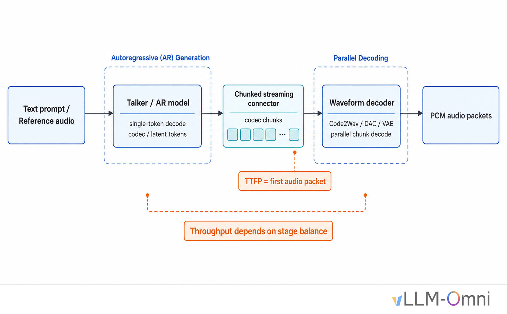
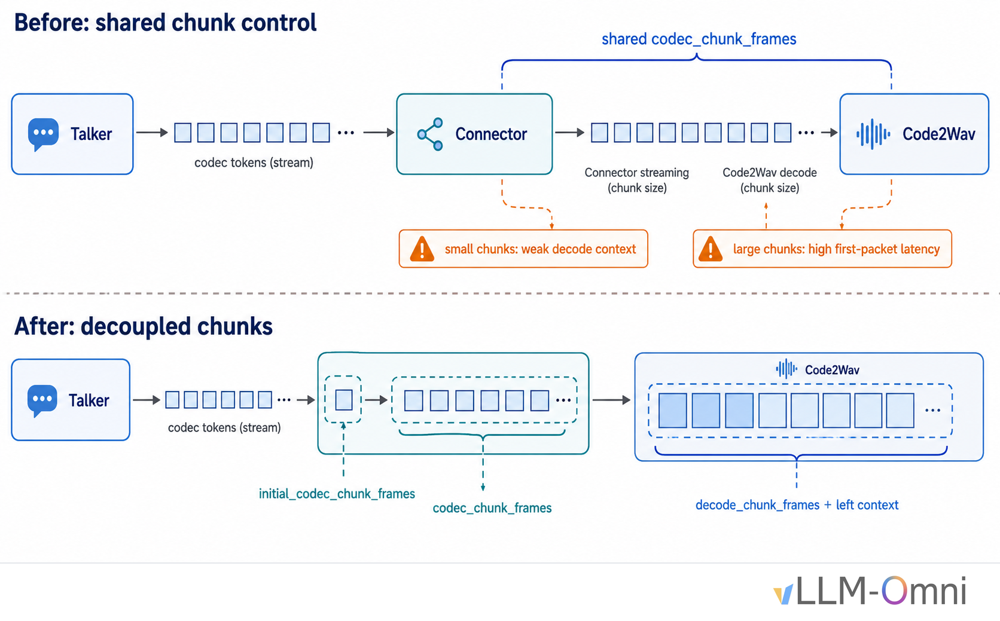
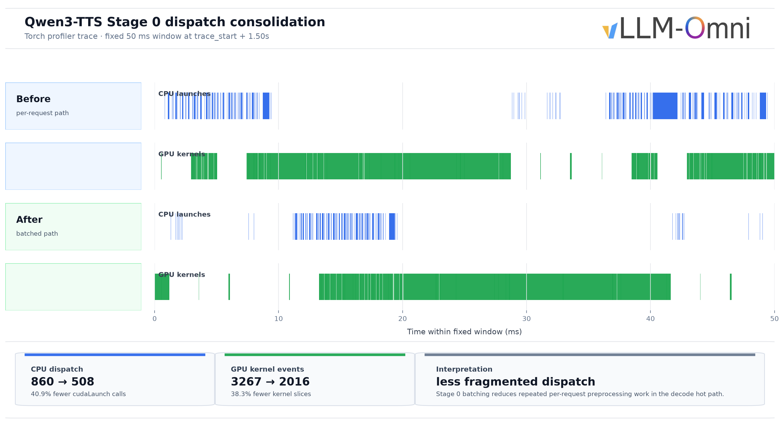
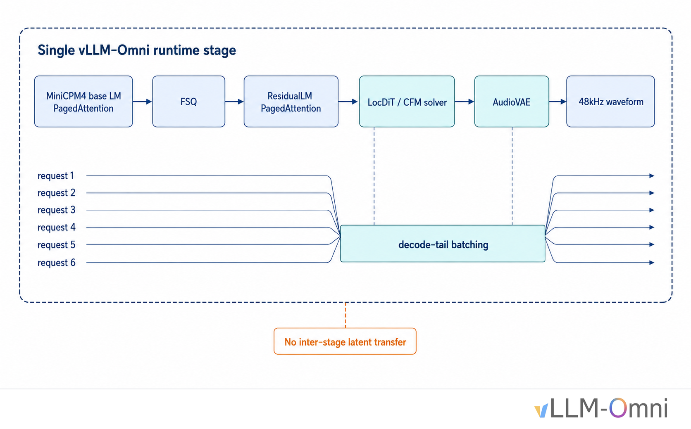
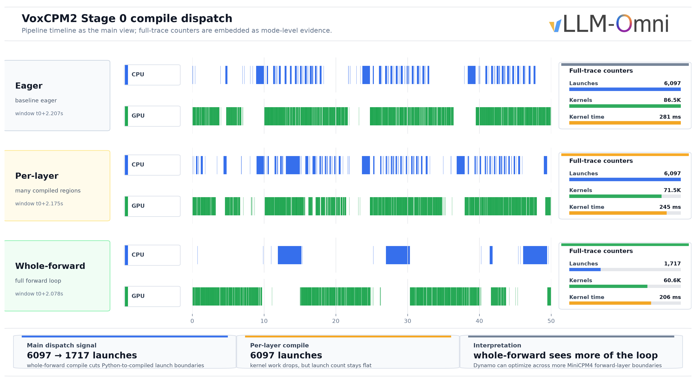
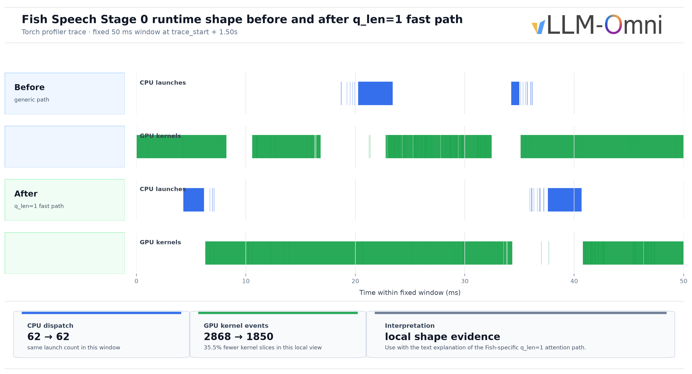

# Engineering TTS Inference in vLLM-Omni

Chinese: [zh/vllm/blog/serving/omni-tts.md](../../../../zh/vllm/blog/serving/omni-tts.md)

2026-06-23. **vLLM-Omni TTS Team**. How Omni serves and optimizes Qwen3-TTS, VoxCPM2, Higgs Audio V3, and Fish Speech S2 Pro: staged serving, batching, CUDA Graphs, model-specific kernels. Same Omni line: [vllm-omni.md](vllm-omni.md), [qwen3-omni.md](qwen3-omni.md). Study note; cookbook numbers on the page, not your SLA.

**TL;DR from the page:** TTS is a pipeline, not one LLM. Talker is latency-bound single-token Decode; Code2Wav is throughput-bound parallel decode. Same scheduler hurts both. Chunks too small break continuity; too large blow **TTFP** (Time To First Audio Packet). No single recipe: Qwen3-TTS stage split + connector chunks + batched Talker preprocess; VoxCPM2 whole-forward `torch.compile` + CFM/LocDiT tail batching; Higgs GPU-resident multi-codebook state; Fish `q_len=1` decode attention.

Local figures (copyright remains with the original site; study copies):













## How TTS inference differs from traditional LLM inference

Both use autoregressive models; serving bottlenecks differ.

**TTS is a pipeline, usually with multiple model stages.** Typical: Talker predicts codec tokens autoregressively; Code2Wav reconstructs waveform from those tokens. Talker is a latency-bound single-token Decode workload; Code2Wav is a throughput-bound parallel decoder. One scheduler for both: Talker latency blocks Code2Wav input, Code2Wav parallelism stays underused. Latency and throughput both suffer.

**Streaming output has a strict latency budget.** Users expect the first audio packet within a few hundred milliseconds. The connector must support chunked streaming; chunk size directly affects TTFP. Too small: Code2Wav lacks context across chunk boundaries. Too large: first-packet latency is unacceptable.

**Throughput still matters.** Online serving cost tracks how much concurrency one GPU can sustain, and how many seconds of audio it generates per wall-clock second. Talker and Code2Wav have different bottlenecks; the connector adds transfer cost. Improving throughput means balancing the two stages and removing bottlenecks inside each.

**Figure (pipeline).** Talker → connector → Code2Wav serving path.

The rest of the post: optimization overview, then Qwen3-TTS as the full path, then VoxCPM2 / Higgs Audio V3 / Fish Speech S2 Pro as architecture-specific strategies.

## Optimization overview

vLLM-Omni does not apply one fixed recipe. Choice depends on pipeline structure, decode state, batch shapes, and numerical constraints.

| Technique | Applies to | Why it matters |
|---|---|---|
| Stage separation and connector chunking | Qwen3-TTS, Higgs Audio V3 | Lets Talker latency and Code2Wav throughput be tuned independently. |
| Batched decode preprocessing | Qwen3-TTS | Reduces repeated per-request Python work in the Talker Decode hot path. |
| Whole-forward `torch.compile` | VoxCPM2 | Lets Dynamo see more of the MiniCPM4 forward loop and reduces Python-to-compiled boundaries. |
| CFM/LocDiT decode-tail batching | VoxCPM2 | Turns many tiny per-request diffusion calls into larger GPU batches. |
| GPU-resident decode state | Higgs Audio V3 | Moves multi-codebook state updates out of Python loops and reduces synchronization. |
| Model-specific q_len=1 attention | Fish Speech S2 Pro | Specializes pure Decode attention instead of paying for generic paged/varlen paths. |

Not every optimization works for every TTS architecture. The work is picking the right lever for the model shape.

## Qwen3-TTS: a full optimization path

Qwen3-TTS is a Qwen-team speech generation family: discrete multi-codebook language-model architecture, **12 Hz** tokenizer for acoustic compression and high-fidelity reconstruction. Three variants share the same two-stage architecture (Talker AR codec tokens, Code2Wav parallel decode):

- **Base** — voice cloning
- **CustomVoice** — predefined speakers with instruction-based emotion and style
- **VoiceDesign** — new voices from natural-language descriptions of timbre, emotion, and prosody

Qwen3-TTS Code2Wav is a lightweight **non-DiT** decoder; it does **not** need an iterative denoising loop. Among the four models, this is the most standard Talker → connector → Code2Wav shape, so it is the walkthrough.

### 1. Streaming: decoupling connector chunks from the Code2Wav decode window

Early Qwen3-TTS tied connector streaming chunks and Code2Wav decode chunks to the same parameter, mainly `codec_chunk_frames`. Small connector chunks made Code2Wav see tiny decode chunks (continuity suffers). Larger chunks for quality raised first-packet latency.

Separate knobs:

- `codec_chunk_frames`: connector streaming chunk size (Talker-to-Code2Wav transfer cadence)
- `decode_chunk_frames` and `decode_left_context_frames`: Code2Wav internal decode window and left context, independent of connector chunking
- `initial_codec_chunk_frames`: a smaller first codec chunk so Code2Wav can start earlier; later chunks return to the regular size

Connector can use a small chunk to cut first-packet latency while Code2Wav keeps a **300**-frame decode window plus **25** frames of left context. Tuned independently ([PR #3485](https://github.com/vllm-project/vllm-omni/pull/3485)).

**Figure.** Connector chunk decoupling.

### 2. Throughput: Stage 0 decode preprocessing

Next bottleneck: Talker Decode. Each step needs request-level preprocessing: speaker embedding, `trailing_text` maintenance, input embedding construction. At c=1 the overhead is small. At c=64 every Decode step loops over 64 requests; Python loops and tensor slicing become visible.

Profiled Talker Decode on **H20 × 2**, voice cloning, c=64. Warm run before broader hot-path work: model-external Python and runner-side work — `preprocess_decode_batch`, `make_omni_output`, `process_additional_info`, `build_mm_cpu`, bookkeeping sync — was in the **millisecond range per Decode step**. One utterance can need roughly **200** Decode steps. At c=64 that cost repeats through the whole sequence.

`nvidia-smi` at c=64: baseline average GPU utilization about **14%** (Stage 0) and **6%** (Stage 1). GPU waiting on Python scheduling, small tensor allocation, kernel launch — not raw FLOPs.

First concrete target: speaker embedding. Voice-clone mode extracts a speaker embedding from reference audio, then does mel/STFT during Decode. Original path: per-request mel on CPU, copy to GPU. High concurrency → many small H2D transfers and launches. Fix: cache mel basis and window buffers on GPU; batch mel/STFT on GPU.

Next: `trailing_text`. Talker keeps a sliding window of embeddings for generated tokens. Original: tensor slicing and concatenation, allocating a new tensor frequently. Optimized: track an offset; compact only when the offset crosses a threshold or reaches the end of the buffer (`_TRAILING_TEXT_COMPACT_MIN_FRAMES = 64`). Intermediate steps index by offset without allocating.

Batched `preprocess_decode_batch` removed one major per-request Decode overhead ([PR #3662](https://github.com/vllm-project/vllm-omni/pull/3662)). Final stacked numbers include Stage 0 batching, connector changes, async D2H, runner hot-path cleanup, and CUDA Graph tuning ([PR #3689](https://github.com/vllm-project/vllm-omni/pull/3689), #3485, #3662). Final stacked run, Qwen3-TTS on H20 × 2: audio throughput **26.55 → 42.88 audio-s/s** (+**61.5%**); P99 E2EL **17.7s → 9.0s**.

**Figure.** Stage 0 dispatch consolidation: fewer CPU launch calls and fewer small GPU kernel slices. Not a claim about higher GPU utilization.

### 3. Hot-path cleanup

After batching, remaining profile: many small Python overheads that add up in a high-frequency c=64 Decode loop.

`req_id_to_index` used `req_ids.index()` — O(N²) list scan every Decode step. Replaced with a dictionary (O(1)). Non-streaming requests skip the per-output streaming path in the orchestrator early. Codec-disallowed mask is precomputed into a buffer so `compute_logits` can `masked_fill` instead of rebuilding the mask each time.

Qwen3-TTS uses CUDA Graph in several places. Talker code predictor has its own graph path depending on deploy profile. Focus here: Code2Wav decoder CUDA Graph. Decoder input shape `(batch, num_quantizers, codec_frames)`. In chunked decode, `codec_frames` has a small set: streaming chunk plus left context; non-streaming `decode_chunk_frames + decode_left_context_frames` (**300 + 25 = 325**); tail chunks. Enumerable at warmup. `CUDAGraphDecoderWrapper` captures graphs by `(batch_size, frames)` and uses `bisect_left` at inference to pick the nearest padded bucket. No match → eager.

Repeated c=16 tests with `qwen3_tts.yaml`: Code2Wav CUDA Graph hit rate started at **88%**, settled around **81%** after five consecutive rounds. Main single-sample shapes hit captured buckets: `(1, 98) -> 169`, `(1, 73) -> 73`, `(1, 123) -> 169`, `(1, 325) -> 325`. Fallbacks mostly batch-size > 1: `(2, 98, 169)`, `(8, 73, 73)`. Across the run, `stream_capture_fallbacks=0` — no fallback from stream capture failure.

### 4. Numerical precision: fp32 alignment for the code predictor

Talker code predictor is precision-sensitive. Very short sequences, typically **2–8** tokens, repeated Prefill. vLLM fused kernels in bfloat16 can differ slightly from the reference. In this short-sequence, high-frequency path those differences accumulate and can affect audio quality after dozens of steps.

Fix: split code predictor layers; keep selected ops in fp32: RMSNorm variance, RoPE cos/sin, attention, and QKV projection use PyTorch-native implementations for bit-level alignment with the reference.

### 5. Validation

Stacked optimizations, Qwen3-TTS on H20 × 2 at c=64 voice cloning: audio throughput **+61.5%**, P99 E2EL nearly halved. Full numbers in Performance Data.

Warm concurrency sweep, H20 × 2, voice cloning, streaming:

| c | Mean TTFP | Mean E2E | P50 TTFP | P50 E2E |
|---:|---:|---:|---:|---:|
| 1 | 70.61ms | 564ms | 70.61ms | 564ms |
| 8 | 268.75ms | 1.55s | 287.15ms | 1.70s |
| 16 | 451.32ms | 2.62s | 516.15ms | 2.75s |
| 32 | 637.43ms | 5.05s | 634.22ms | 5.10s |
| 64 | 1127.93ms | 8.73s | 1051.05ms | 8.78s |

c=1 → c=64, E2E **0.56s → 8.73s**, not linear 64×. Warm high-concurrency amortizes fixed costs, but at c=64 Talker and scheduling still queue. Why hot-path cleanup and CUDA Graph remain important.

## VoxCPM2: single-stage hybrid TTS

VoxCPM2 (OpenBMB) is tokenizer-free TTS: diffusion-autoregressive hybrid in AudioVAE V2 latent space. Talker is a four-part cascade:

```text
MiniCPM4 (28 layers, PagedAttention) → FSQ → MiniCPM4 ResidualLM (8 layers) → LocDiT (CFM solver) → AudioVAE
```

LocDiT does CFM (Conditional Flow Matching) denoising; AudioVAE reconstructs **48 kHz** waveform. In vLLM-Omni, VoxCPM2 is **not** split into multiple runtime stages. Single-stage AR TTS: MiniCPM4, FSQ, ResidualLM, LocDiT, and AudioVAE in one model instance, emitting audio directly. Avoids latent transfer between stages; makes cross-request batching easier for decode-tail CFM/LocDiT and VAE.

**Figure.** Single-stage hybrid pipeline.

Unlike two-stage Qwen3-TTS, VoxCPM2 asks: how to make 28-layer MiniCPM4 faster, and how to stop CFM/LocDiT from underusing the GPU at high concurrency.

### Exploring torch.compile

28-layer MiniCPM4 is the heaviest Talker piece. First target: `torch.compile`. Best path was not the first attempt.

First attempt: compile each layer’s `mlp` and `o_proj` separately — 28 × 2 = **56** compiled regions with `fullgraph=True` ([PR #2690](https://github.com/vllm-project/vllm-omni/pull/2690)). Dynamo cannot optimize across compiled-region boundaries. Each boundary is Python → compiled → Python; 56 regions means many transitions per Decode step.

Then wrap entire `Model.forward` in `torch.compile` with `fullgraph=False` ([PR #2758](https://github.com/vllm-project/vllm-omni/pull/2758)). Dynamo sees the full 28-layer loop. PagedAttention still graph-breaks, but Dynamo only memoizes a small number of subgraphs. Per-step dispatch: many small regions → a few larger ones. RTF **~0.21 → ~0.13** — largest single VoxCPM2 optimization.

Three configs profiled: eager, per-layer compile, whole/unified graph. Per-layer compile cut some kernel count and kernel time, but **launch count did not drop**. Whole/unified graph: `cudaLaunchKernel` count **~−71%**, kernel events **~−30%**, kernel time **~−27%**. Single-request E2E **~−2.6%** (per-layer) vs **~−6.5%** (whole graph).

**Figure.** Compile dispatch timeline and counters. Launch count stayed flat until whole-forward compile.

`mode="reduce-overhead"` (automatic CUDA Graph capture) conflicted with PagedAttention’s stateful KV cache. During capture, `slot_mapping` becomes fixed; replay can write attention results to the wrong KV location → incorrect stop logits and early truncation.

`fullgraph=True` cannot tolerate graph breaks from PagedAttention and custom precision boundaries. `fullgraph=False` keeps the whole-forward view while allowing those boundaries to fall back to eager.

### CFM/LocDiT decode-tail batching

After single-request latency improved, high-concurrency bottleneck moved to CFM/LocDiT. Each request runs LocDiT attention/GEMM during CFM denoising, but per-request batch is tiny, typically **B=2** under CFG — far too small to fill the GPU. Independent LocDiT at high concurrency leaves the GPU underused.

Solution: batch the CFM/LocDiT decode tail across requests. Collect `lm_h`, residual outputs, and prefix feature conditions from multiple requests; run `dit_proj`, CFM/LocDiT, `feat_encoder`, and `stop_head` once as a batch; scatter results back. Combined with VAE decoding every **three** latent chunks, batched VAE decode, coalesced audio D2H copies, and LocDiT fused-QKV / fused gate-up MLP: H20 × 1 at c=64 **4.19 → 10.83 req/s** (+**158.8%**), audio throughput **12.16 → 33.07 audio-s/s** (+**172.0%**) ([PR #3882](https://github.com/vllm-project/vllm-omni/pull/3882)).

Synchronization in the Euler integration loop: `.item()` on 0-dim GPU tensors forces GPU-to-CPU sync. Original: **four** times per diffusion step. With **10** timesteps and roughly **60** Decode steps, one request could trigger around **2,400** synchronizations. Replace `.item()` with GPU-side `.copy_()` broadcasting — CPU leaves that loop.

VAE structural issue: first implementation accumulate-and-re-decode — every **five** steps concatenate all previously generated latent patches and decode the whole prefix again. Work **O(N²)**. Sliding-window decode: **12** frames of pad context and **four** new frames per call → **O(N)**. Long-text RTF no longer grows with text length; all lengths stay around RTF **0.132–0.138** ([PR #2758](https://github.com/vllm-project/vllm-omni/pull/2758)).

## Higgs Audio V3: dynamic batches and multi-codebook state

Higgs Audio V3 (Boson AI): more than **100** languages, zero-shot voice cloning. Qwen3 backbone, **36** layers, **2560** hidden size, GQA, fused multi-codebook embedding with a large `[N × V, D]` matrix plus offset lookup, MusicGen-style delay pattern `[0, 1, 2, ..., 7]` with BOC/EOC special tokens.

Talker → Code2Wav shape similar to Qwen3-TTS; Talker internals differ because of multi-codebook prediction and the delay pattern.

Qwen3-TTS is limited by Python hot paths and streaming chunk boundaries; Higgs v3 by complex multi-codebook Decode state and CUDA Graph compatibility.

### Moving decode state to the GPU

Main throughput gain: move per-request Python dict state machine into GPU-resident batched tensors ([PR #4204](https://github.com/vllm-project/vllm-omni/pull/4204)). State includes `_decode_last_codes`, `_decode_has_codes`, delay count, EOC countdown, generation-done flags, related Decode metadata. Benefit: fewer Python per-request loops, less D2H sync, sampling/state update on the batched GPU hot path. Reported **35.26 audio-s/s** was measured on a **single H20** at **c=16** with the **eager + local MLP CUDA Graph** profile, **not** the PIECEWISE full-decode graph path.

Hard part: vLLM scheduler may reorder, shrink, finish, or remove requests during Decode. Row-level state ≠ request-level state. Audio AR state is more complex than text: delay codebooks, EOC ramp-down, and terminal frames all have semantic meaning. One-step lag is an audio quality problem, not a clean crash. GPU state, CPU override state, and scheduler tokens need a single source of truth, or stop semantics become inconsistent.

### Adapting CUDA Graph to dynamic batch shapes

Talker CUDA Graph capture: audio feedback replaces the embedding of the next continuation token with the previous audio token’s embedding. Implementation used a boolean mask to select requests currently in Decode. Resulting tensor shape depends on how many requests are in Decode at runtime.

CUDA Graph capture needs fixed stream operations and fixed I/O shapes. Data-dependent boolean-mask selection violates that.

Workaround: CUDA Graph path uses a uniform single-token Decode batch. Each span length is 1, so `decode_mask` is all True. Selection is a no-op and returns the original tensor. Graph sees a stable full-batch shape instead of a data-dependent compacted shape.

### Local MLP CUDA Graph vs PIECEWISE

Local MLP CUDA Graph remains the most important graph optimization for Higgs v3. It covers the main GPU cost in `post_attention_layernorm + mlp`. vLLM PIECEWISE CUDA Graph looks more complete (larger Decode step). In practice, Higgs v3’s multi-codebook delay pattern makes token layout vary across Decode steps. Embedding lookup and pre-attention index ops are data-dependent. PIECEWISE either graph-breaks back to eager or needs extra metadata sync.

E2E: PIECEWISE required disabling local MLP graph, and that tradeoff lost more than it gained. Eager plus local MLP graph was faster than PIECEWISE graph.

### A rejected staging-overlap design

Documented because it is still useful: one-step audio staging overlap — overlap audio-staging D2H copies with the next Decode step to cut GPU idle. Dry runs passed; load tests showed the scheduler may reorder, shrink, or finish requests during Decode. A cursor pointing to a row can lose its mapping to a request. Structurally unsafe under dynamic batching, not a boundary-condition bug. A future overlap design should be request-id keyed and include finish/remove drain hooks.

## Fish Speech S2 Pro: when generic attention becomes the bottleneck

Fish Speech S2 Pro (Fish Audio): Dual-AR, trained on more than **10 million hours**, more than **80** languages. In vLLM-Omni: slow_ar + Fast AR + DAC decoder. slow_ar predicts semantic codebooks along time; Fast AR predicts residual codebooks at each Decode step; DAC reconstructs waveform from **10** codebooks.

Unlike Qwen3-TTS (Python preprocessing), Fish is GPU-side bottlenecked. At high concurrency, **q_len=1** attention dominates. Generic paged/varlen attention carries shape checks and branches for Prefill, chunked Prefill, Decode, other model shapes. For Fish’s pure Decode shape that flexibility is overhead.

### Model-specific attention kernel

Profiling: Fish slow_ar at high concurrency spent most time in q_len=1 SlowAR attention and in DAC↔runtime handoff. Fish Decode is narrow: q_len=1, fp16/bf16, head_dim=**128**, block size **16**, Fish GQA layout.

Fish-specific Triton kernel for SlowAR Decode attention ([PR #3773](https://github.com/vllm-project/vllm-omni/pull/3773)). Does **not** handle Prefill or other models. Shape mismatch → original attention path.

Two paths. Short sequences up to **1024** tokens: standard online softmax in one pass. Grid `(batch_size, num_kv_heads)`; each program handles one batch row and one KV head across its Q heads. Block size hard-coded to **16**, matching vLLM’s KV cache block size, so block table lookup is a direct `tl.load` without extra gather. Long sequences: split-partial-combine — split into segments, compute partial m/l/acc independently, merge with online softmax recurrence. Keeps reference-audio long-context requests on the fast path.

Dispatch subtlety: kernel needs sequence length to choose short vs long, but exact length lives on GPU. Reading it to CPU would synchronize. Runner computes CPU-side `seq_lens_cpu_upper_bound` from computed tokens plus scheduled tokens. Upper bound is always ≥ true sequence length. Short path does not under-read; long split path does not under-cover. During CUDA Graph capture, upper bound is `max_model_len` so all graph paths stay covered.

**Figure.** Stage 0 runtime shape before/after q_len=1 fast path. Complements kernel design; does not replace benchmark numbers.

Fast path only for Fish SlowAR attention layers. At load, walk `model.layers` and replace each attention layer’s `impl.forward` with a wrapper that dispatches to the Fish fast path when constraints match. Prefill, non-Fish models, unsupported Decode shapes use original attention.

### Fast AR buffer reuse and compile

Fish Speech Fast AR: four-layer lightweight transformer predicting residual codebooks after each slow_ar step. Per-call KV cache: each residual codebook step only Decodes a new token and writes K/V into preallocated `_k_cache` and `_v_cache`.

Each Fast AR Decode step: project slow_ar hidden state, embed current semantic token, attention + MLP layer by layer, sample logits. Sequence at most **10** tokens, but repeated allocation and Prefill become visible at c=64.

Allocate `_embed_buf`, `_pos_ids`, `_k_cache`, `_v_cache` once and reuse. `_embed_buf` shape `(batch_size, num_codebooks + 1, hidden_dim)` covers all time steps of one Fast AR Decode. `_k_cache` / `_v_cache` preallocated by layer, batch, KV head, sequence position, head dim, so `forward_one` writes and reads in place.

Also compile Fast AR with `torch.compile`. Unlike VoxCPM2 MiniCPM4, Fast AR has only four layers — compile overhead is small. `fullgraph=False` because attention uses `F.scaled_dot_product_attention` rather than paged attention; SDPA may graph-break internally. Dynamo memoizes a few subgraphs. `dynamic=True` lets the compiled result handle batch-size changes.

### DAC and runtime-side optimizations

Codec payload transfer: Python `list[int]` → tensor payload — 2D code tensor serialized directly instead of expanded into Python integers, cutting allocation and GC at high concurrency. fp16 DAC halves memory and compute. Frame-count-bounded DAC batching caps frames in one DAC forward so one long request does not block others. Async chunk processing overlaps connector transfer and DAC: slow_ar and Fast AR produce one 10-codebook codec frame per Decode step; connector batches until `codec_chunk_frames`; DAC processes the current chunk while the connector accumulates the next.

## Performance data

vLLM-Omni cookbook benchmarks.

- **RTF**: generation time / audio duration. Lower than 1 means faster than realtime.
- **TTFP**: Time To First Audio Packet.
- **Tput**: audio throughput — generated audio seconds per wall-clock second.
- **E2EL**: end-to-end latency.

### Qwen3-TTS (c=64, p=512, H20 × 2, voice clone)

| Metric | Before | After | Change |
|---|---:|---:|---:|
| Audio throughput | 26.55 audio-s/s | 42.88 audio-s/s | +61.5% |
| Median E2EL | 9654ms | 5699ms | −41.0% |
| P99 E2EL | 17686ms | 8956ms | −49.4% |
| P99 TTFP | 7558ms | 5563ms | −26.4% |

### VoxCPM2 (c=64, H20 × 1, before/after CFM batching)

| Metric | Before | After | Change |
|---|---:|---:|---:|
| Request throughput | 4.19 req/s | 10.83 req/s | +158.8% |
| Audio throughput | 12.16 audio-s/s | 33.07 audio-s/s | +172.0% |

### Fish Speech S2 Pro (H20, single GPU, c=64, Triton KV cache + tensor payload)

| Metric | Value |
|---|---:|
| Audio throughput | 23.72 audio-s/s |
| Request throughput | 5.95 req/s |
| Mean TTFP | 899.67 ms |
| Mean E2EL | 10.47 s |

### Higgs Audio V3 (H20, single GPU, c=16, eager + local MLP graph)

| Metric | Value |
|---|---:|
| Request throughput | 5.18 req/s |
| Audio throughput | 35.26 audio-s/s |
| Wall time | 96.5s |
| Speedup vs. baseline | 2.70× |

## Acknowledgements

Minghui Jiang, Yueqian Lin, Canlin Guo, Shunyang Li, Taichang Zhou, Yuekai Zhang, Juan Pablo Zuluaga, Nick Cao, Ruirui Yang, Wenjing Chen, Haiyan Wu, Han Gao, Hongsheng Liu, and Roger Wang.

## References

- Qwen3-TTS hot-path micro-optimizations — [PR #3689](https://github.com/vllm-project/vllm-omni/pull/3689)
- VoxCPM2 per-layer compile + PagedAttention — [PR #2690](https://github.com/vllm-project/vllm-omni/pull/2690)
- VoxCPM2 whole-model compile + streaming VAE + CFM sync fix — [PR #2758](https://github.com/vllm-project/vllm-omni/pull/2758)
- VoxCPM2 CFM/LocDiT batching + decode-tail optimizations — [PR #3882](https://github.com/vllm-project/vllm-omni/pull/3882)
- Qwen3-TTS streaming connector decoupling — [PR #3485](https://github.com/vllm-project/vllm-omni/pull/3485)
- Qwen3-TTS high-concurrency Stage 0 batching — [PR #3662](https://github.com/vllm-project/vllm-omni/pull/3662)
- Fish Speech S2 Pro KV cache fast path + DAC optimizations — [PR #3773](https://github.com/vllm-project/vllm-omni/pull/3773)
- Higgs Audio V3 GPU-resident state machine + CUDA Graph — [PR #4204](https://github.com/vllm-project/vllm-omni/pull/4204)
- Qwen3-TTS — [QwenLM/Qwen3-TTS](https://github.com/QwenLM/Qwen3-TTS)
- VoxCPM2 — [OpenBMB/VoxCPM](https://github.com/OpenBMB/VoxCPM)
- Fish Speech S2 Pro — [fishaudio/fish-speech](https://github.com/fishaudio/fish-speech)

TTS inference: `#sig-omni` on [vLLM Slack](https://slack.vllm.ai), or issues on [vLLM-Omni GitHub](https://github.com/vllm-project/vllm-omni).
