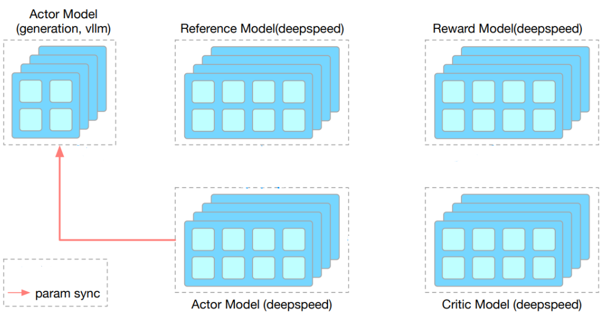

# OpenRLHF × vLLM: generation is 90% of RLHF

Chinese: `../../zh/vllm/blog/serving/openrlhf.md`  
April 2025. Later pause/resume APIs: [Native RL](native-rl.md).

Chain-of-thought generation can be **90%** of RLHF wall time. OpenRLHF stitches vLLM generation to ZeRO-3 training on Ray: after the trainer updates weights, `ColocateWorkerExtension` **IPC-loads** them into colocated vLLM workers instead of shipping the full tensor set over TCP.

This post is **how a trainer hangs off the engine**. Native RL is **how the engine pauses, keeps KV, and swaps weights for RL**. Do not merge the two. Numbers and API names follow the April 2025 post; `keep` pause / DPEP / `VLLM_SERVER_DEV_MODE` follow Native RL.

Local figures (copyright remains with the original site; study copies):

