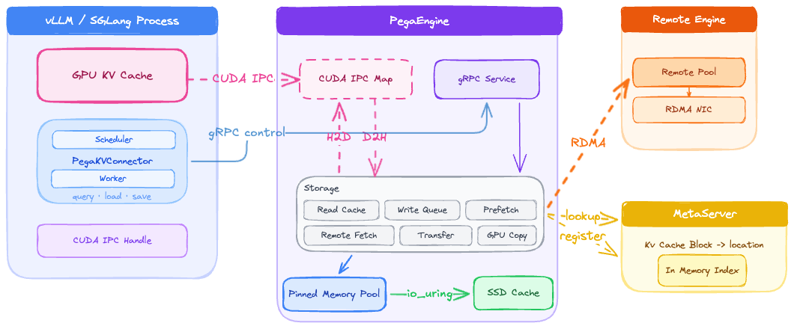
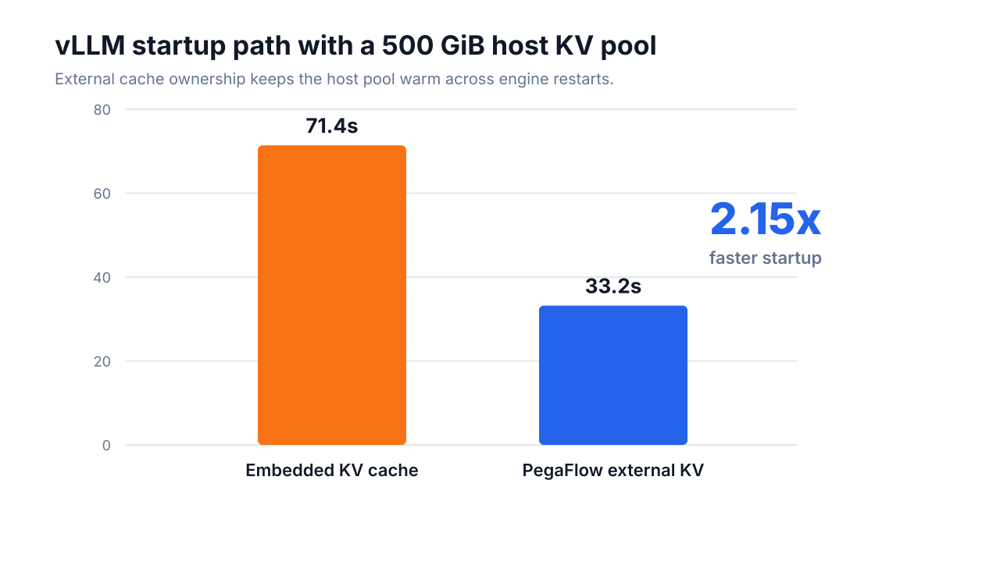
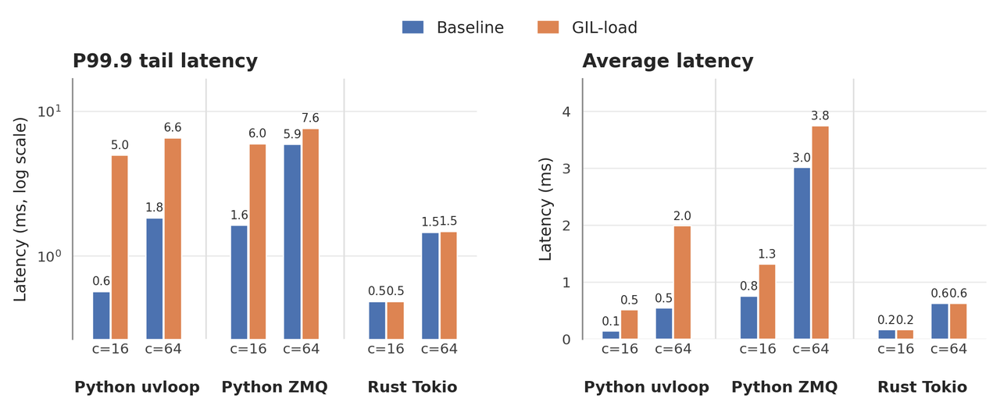
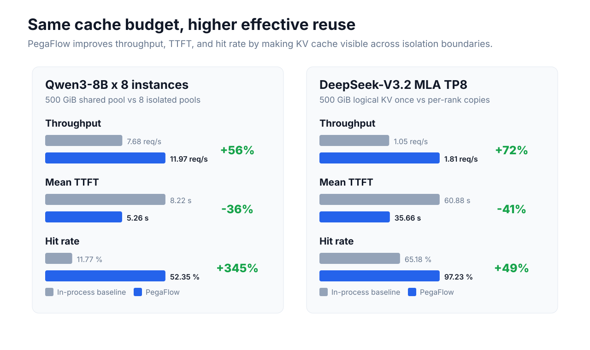
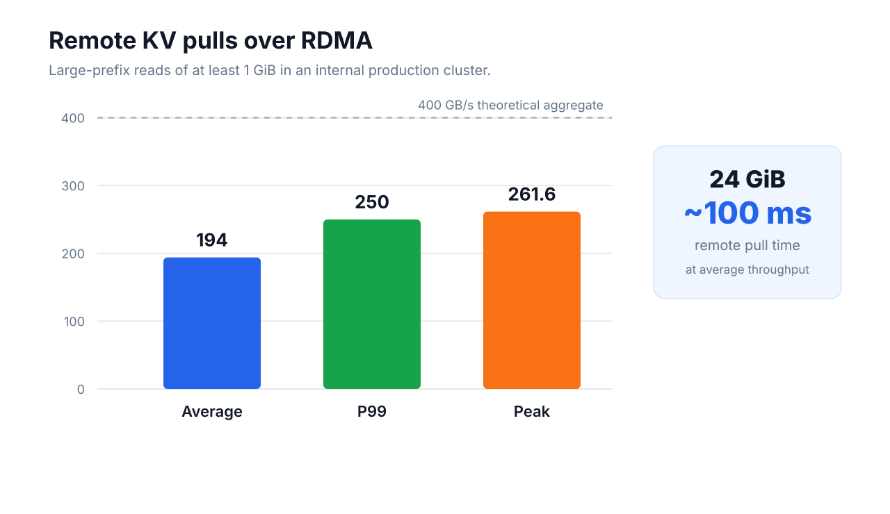
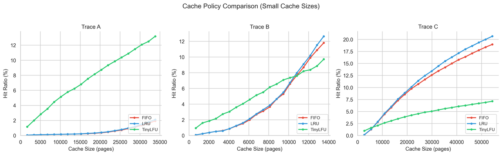

# PegaFlow

2026-05-18. Novita AI. Rust daemon + external KVConnector, no vLLM fork. `vllm>=0.20.0`. Same door as [mooncake.md](mooncake.md) / [kv-offload.md](kv-offload.md): the pool outlives the engine. Study note.

KV can be hundreds of GiB, slow to allocate, longer-lived than the request mix. Tied to the worker: crash / upgrade / model switch kills the pool. PegaFlow owns pinned DRAM, SSD, RDMA, index, background work. vLLM talks CUDA IPC (data) + gRPC (control). One daemon, many engines/models, namespace isolation.

**Startup:** 8×RTX 5090, Qwen3-8B TP8, dummy/eager, ~500 GiB host pool. In-process 71.4 s ready; pre-owned pool **33.2 s (2.15×)**.

**Share 500 GiB:** eight Qwen3-8B. Shared 11.97 req/s / 5.26 s TTFT / 52% hit vs eight 62.5 GiB islands 7.68 / 8.22 s / 11.8% (**+56%** throughput, **~4.4×** hit).

**MLA TP8** DeepSeek-V3.2: store logical KV once vs per rank. 1.81 vs 1.05 req/s (**+72%**), hit 97% vs 65%.

**RDMA:** 8×400 Gbps/node, ≥1 GiB remote prefix: avg **194 GB/s**. 24 GiB ~**100 ms**.

L1 pinned DRAM; L2 remote DRAM (one-sided RDMA READ); L3 SSD (`io_uring`, ~6.5 GB/s/disk steady). Optional TinyLFU. HyperLogLog ceiling `r* = (N−U)/N` so operators see distance to the workload’s reuse bound.

```bash
vllm serve <model> --kv-transfer-config '{
  "kv_connector": "PegaKVConnector",
  "kv_role": "kv_both",
  "kv_connector_module_path": "pegaflow.connector"
}'
```

Local figures (copyright remains with the original site; study copies):












