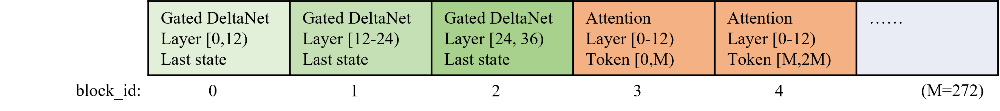

# Qwen3-Next: Gated DeltaNet interleaved with full attention; hybrid KV aligned by physical page

Chinese: [zh/vllm/blog/serving/qwen3-next.md](../../../../zh/vllm/blog/serving/qwen3-next.md)

2025-09-11. **The vLLM Team**. Then nightly. 80B-A3B, 1:50 MoE. Later 3.5/3.8: [qwen35-25k-tps.md](qwen35-25k-tps.md) / [qwen38.md](qwen38.md). Hybrid Mamba/linear serving internals: [hybrid-ssm.md](hybrid-ssm.md). Qwen3.5 GDN+P/D is the sequel, not this post.

Local figures (copyright remains with the original site; study copies):


**TL;DR from the page:**

- Hybrid attention: Gated DeltaNet (linear) interleaved with full attention; target **65K+**.
- Hybrid KV manager sizes full-attention logical blocks so they occupy the same physical page as linear state.
- Triton launch is CPU-heavy on decode-only, so full CUDA graph is default.
- MTP native. Then-roadmap: GDN kernels, prefix cache and P/D on hybrid.

## Quickstart

Nightly then:

```
uv pip install vllm --extra-index-url https://wheels.vllm.ai/nightly --torch-backend=auto
```

```
vllm serve Qwen/Qwen3-Next-80B-A3B-Instruct -tp 4
```

Recipes: [Qwen3-Next](https://docs.vllm.ai/projects/recipes/en/latest/Qwen/Qwen3-Next.html).

## Hybrid Attention: efficient context modeling

Replaces standard attention with:

- **Gated DeltaNet** — linear attention for long-context efficiency
- **Full Attention** — high-fidelity reasoning

Interleaved across layers; claimed efficient scaling to **65K** and beyond.

vLLM: Triton kernels from [Flash Linear Attention](https://github.com/fla-org/flash-linear-attention); [hybrid KV cache manager](https://arxiv.org/abs/2503.18292) for linear + full attention — less fragmentation, more GPU utilization when memory is full.

Logical block size of full-attention layers is tuned so full-attention state and linear-attention state occupy the same **physical** GPU page. Paged hybrid memory; throughput when the GPU is packed.



**Figure.** Hybrid KV: full-attention logical blocks aligned to the same physical page as linear state.

Flash Linear Attention is Triton. Triton launch is CPU-heavy on decode-only batches → full CUDA graph **on by default** for low-latency.

## High-sparsity MoE: extreme efficiency

MoE at a **1:50** activation ratio. Flagship **80B-A3B**: **3B** active per token. vLLM’s built-in MoE path.

## Multi-Token Prediction (MTP)

MTP: pretraining efficiency and inference speed. Native in vLLM — multiple tokens per step, no app-code change. How-to: the recipe.

## Looking ahead

Then-roadmap (this post, not the 3.5 sequel):

- Further GatedDeltaNet kernels
- Better memory management; automatic prefix caching and P/D disaggregation for hybrid models
- Throughput and CPU-overhead cuts

Qwen3.5’s GDN + P/D is that sequel: [qwen35-25k-tps.md](qwen35-25k-tps.md).

## Acknowledgements

Qwen Team: Tao He, Jianwei Zhang. Flash Linear Attention: Yu Zhang et al. (gated deltanet review + numerics). NVIDIA: Vadim Gimpelson (testing). IBM Research: Thomas Parnell (hybrid memory + CUDA graph). Red Hat: Tyler Michael Smith, Doug Smith, Tarun Kumar, Elvir Crncevic (testing + MoE kernels). Community: Meta, Roblox. vLLM: Jie Li, Kaichao You, Chen Zhang, Simon Mo.
