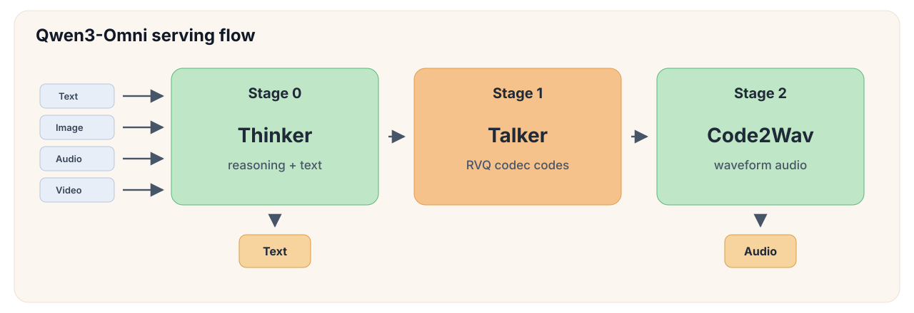
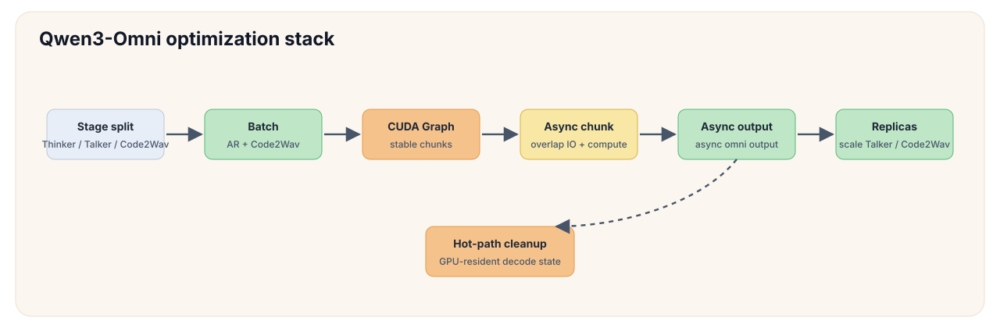
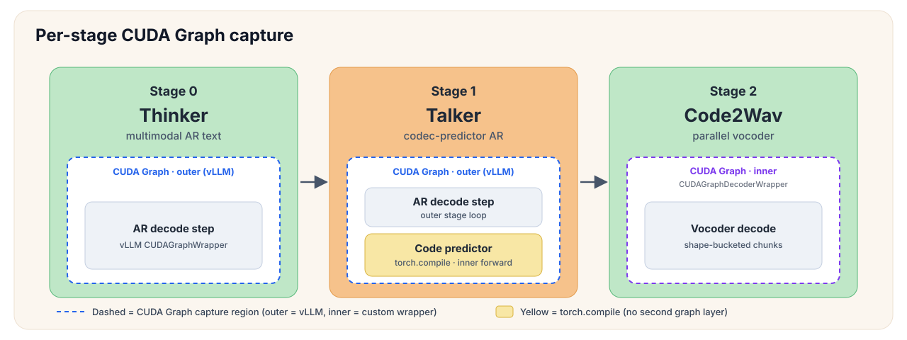
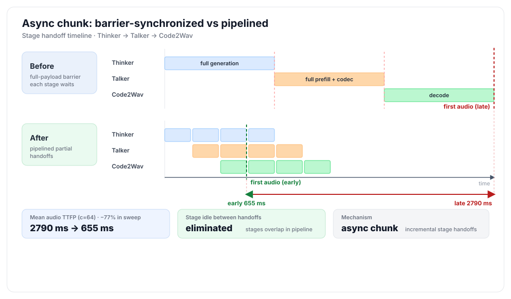
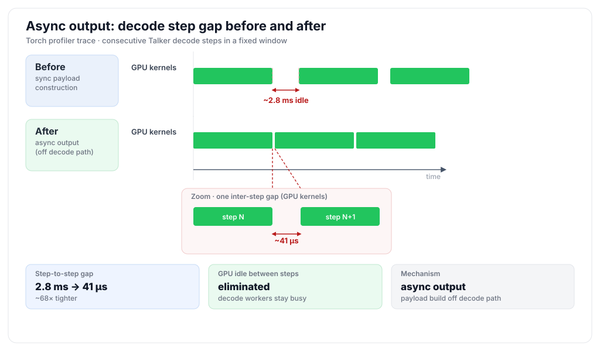
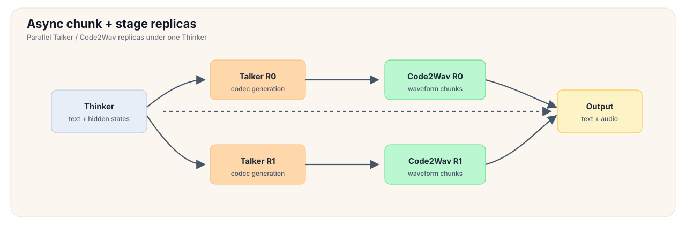
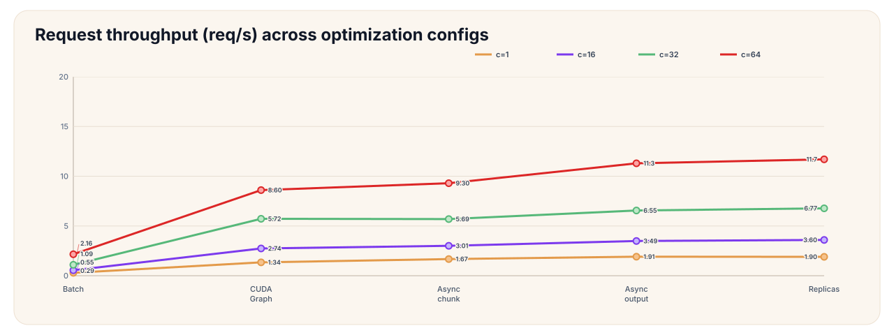
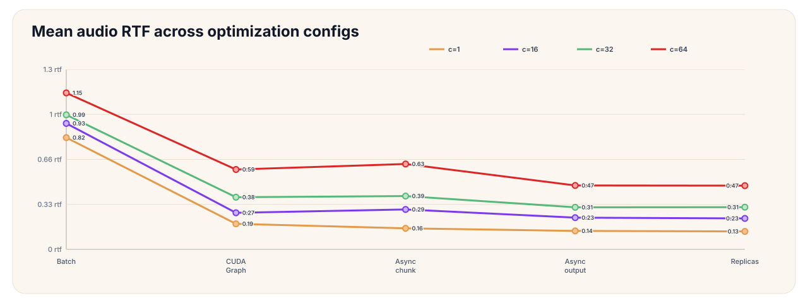
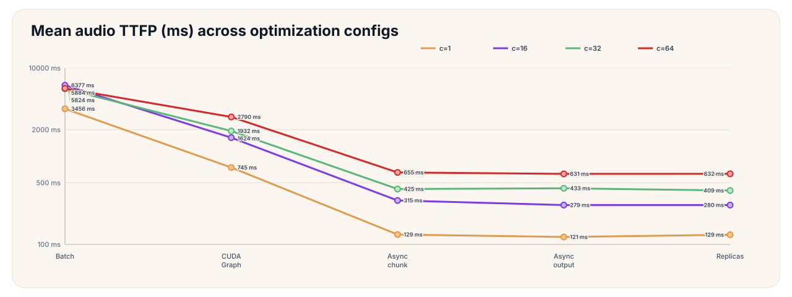

# Qwen3-Omni: Thinker / Talker / Code2Wav

Chinese: [zh/vllm/blog/serving/qwen3-omni.md](../../../../zh/vllm/blog/serving/qwen3-omni.md)  
TTS engineering: [omni-tts](omni-tts.md).

```
vllm serve Qwen/Qwen3-Omni-30B-A3B-Instruct --omni --port 8091
```

`/v1/chat/completions` emits text and audio. Each stage batches and CUDA-graphs; async chunk / async output avoid waiting on full payloads; Talker/Code2Wav can replica. `platforms:` in the yaml merges CUDA/NPU/ROCm/XPU. They sweep audio TTFP, RTF, throughput —  Not the same stopwatch as text TTFT.

Local figures (copyright remains with the original site; study copies):


















