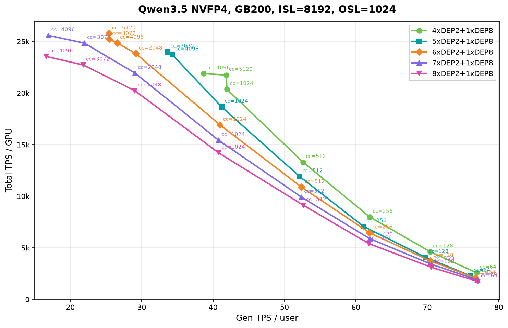
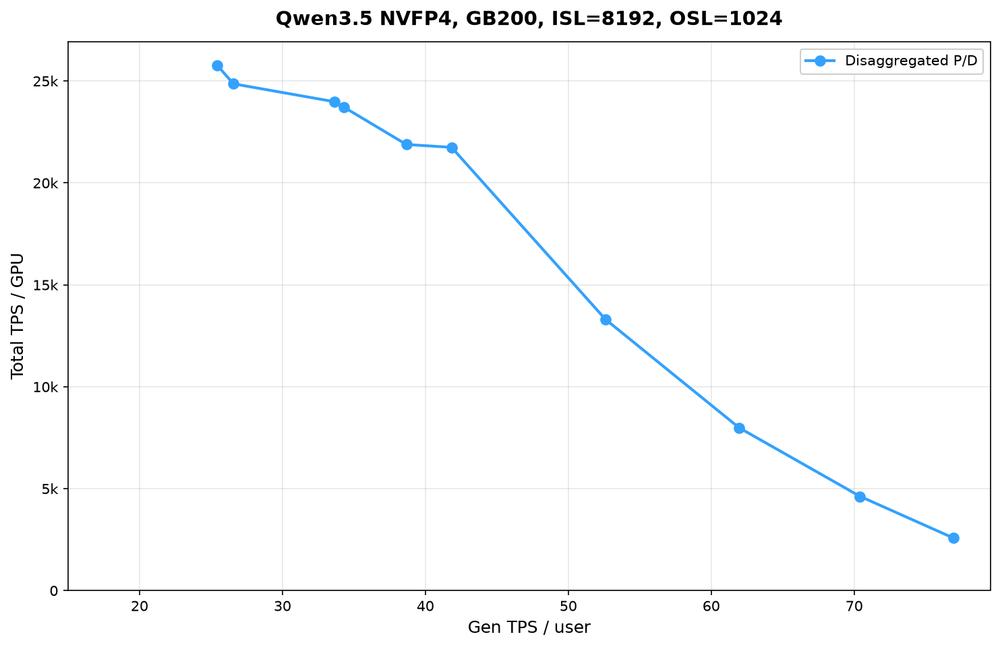

# Qwen3.5 25K TPS/GPU: GDN + heterogeneous cache transfer, then the left Pareto

Chinese: [zh/vllm/blog/serving/qwen35-25k-tps.md](../../../../zh/vllm/blog/serving/qwen35-25k-tps.md)  
GB200 NVL72. Qwen3.5-397B-A17B-NVFP4. ISL/OSL=8192/1024.

System TPS/GPU ≠ per-user TPS. They sweep the **left** Pareto (aggregate throughput), concurrency 64–5120, not 1–32. Decode fixed 1×DEP8; prefill 4–8×DEP2. Peak **25,000 tok/s/GPU**. GSM8K **88%** on all five topologies, matching aggregated.

Three cuts: Blackwell GDN prefill (FlashInfer ~1.02–5.78× vs FLA/Triton; 8×B200 e2e prefill ~**1.13×**, mean TTFT −12%). `--gdn-prefill-backend flashinfer`; `auto` picks it. HMA+NIXL descriptors 4284→1650; Qwen3.5 then ships GDN state. Two async-scheduling races had to land before `--async-scheduling` — without them, accuracy went to zero.

Recipe: `VLLM_SSM_CONV_STATE_LAYOUT=DS` (mandatory for P/D); `--mamba-ssm-cache-dtype bfloat16` for decode KV capacity; `--language-model-only` disables multimodal and unlocks fused QK-norm+RoPE+gate; prefill `--max-num-batched-tokens 16384` (2×ISL, ~+8% when prefill-starved); raise `--max-cudagraph-capture-size` to cc/8+128 at high cc; no prefix cache on random data; `--stream-interval 100` cuts frontend but buffers — skip if you care about ITL/TPOT. `--api-server-count 1` restores default stats. Next: TEP/TP for **per-user** Gen TPS. Read [hybrid-ssm](hybrid-ssm.md) and [dcp](../performance/dcp.md).

Local figures (copyright remains with the original site; study copies):

