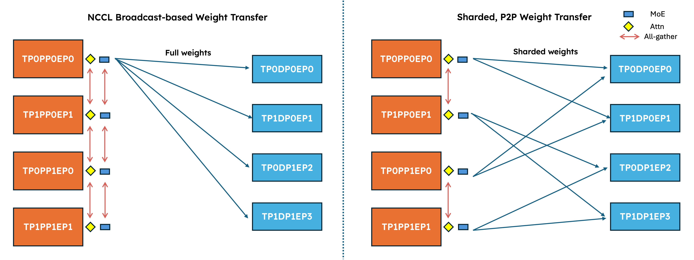
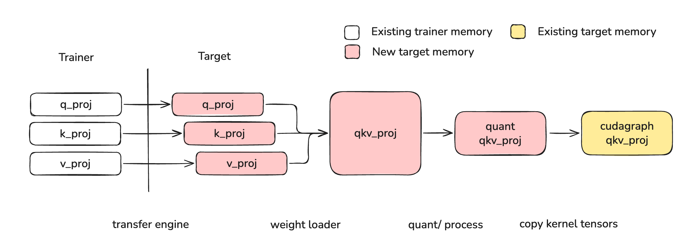
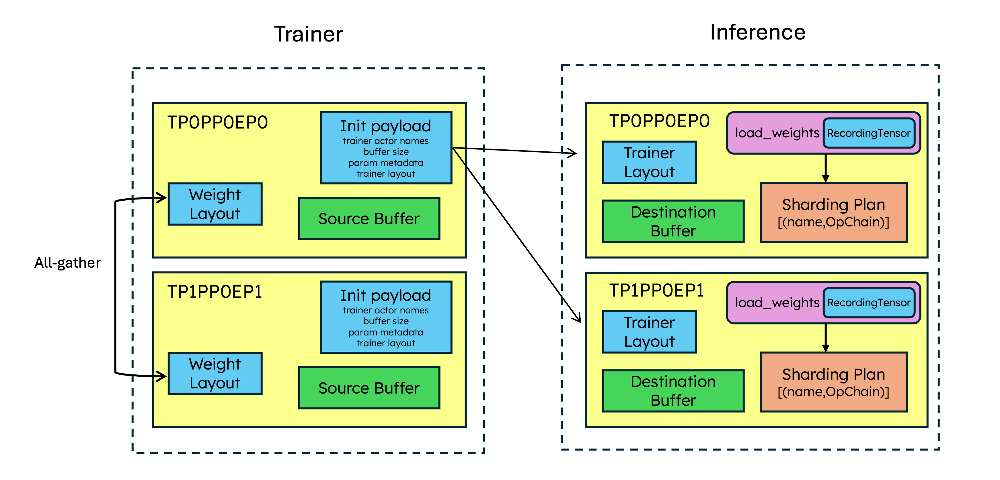
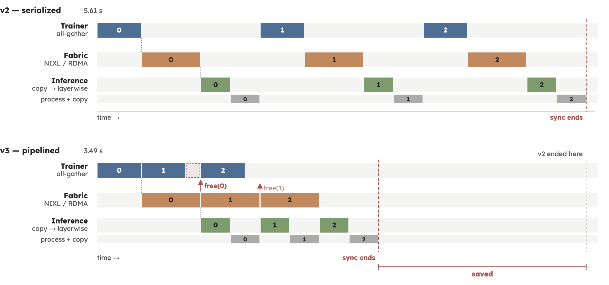
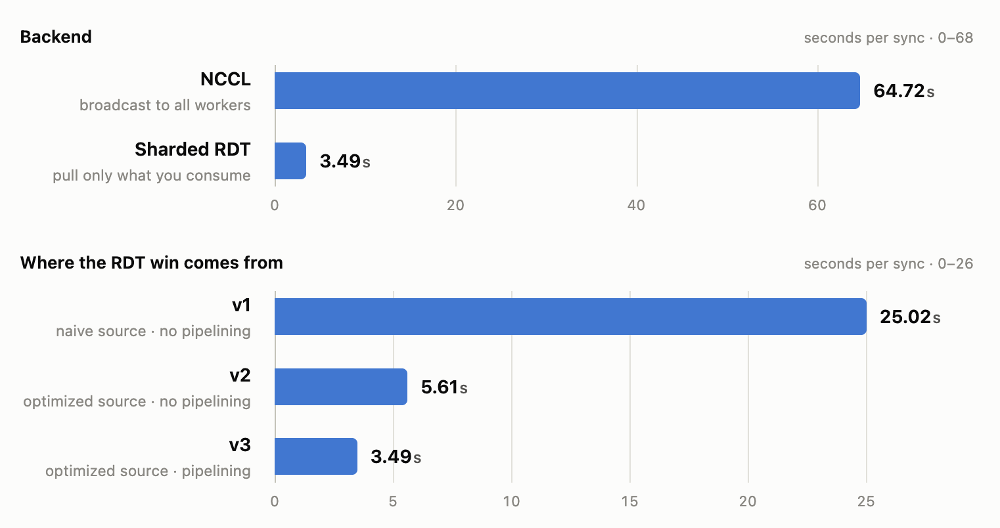
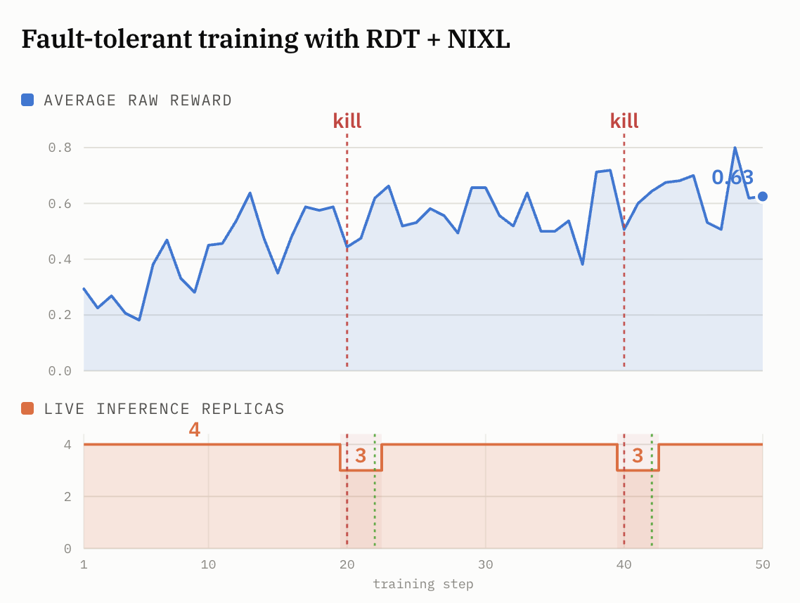

# Sharded weight transfer with RDT: Kimi K2 in 7.53s

Chinese: [zh/vllm/blog/serving/rdt-weight-transfer.md](../../../../zh/vllm/blog/serving/rdt-weight-transfer.md)

2026-08-22. Aaron Hao, Sumanth Hegde, Gal Meirom, Istvan Haller, Kourosh Hakhamaneshi, Gavin Parnaby, Moein Khazraee, Omri Kahalon. Docs: [sharded RDT](https://docs.vllm.ai/en/latest/training/weight_transfer/sharded_rdt/). End-to-end: [SkyRL `sharded_rdt`](https://github.com/NovaSky-AI/SkyRL/tree/main/examples/train/megatron/sharded_rdt). This post is **how shards move**. Pause / keep / DPEP: [native-rl.md](native-rl.md). Earlier Ray `WorkerExtension` path: [openrlhf.md](openrlhf.md). How the Ray cluster comes up: [ray-symmetric.md](ray-symmetric.md). Study note.

Kimi K2 BF16 on **48 × (8×H100)**: **32** trainer nodes + **16** inference nodes, **7.53 s** for ~**7.9 TB**, **1,049 GB/s** aggregate.

## Introduction

In online RL, weights must sync so rollouts come from a recent checkpoint. At trillion-parameter scale, both memory and wall time of that sync start to bound the loop.

This post is a native sharded weight-transfer engine in vLLM on [Ray Direct Transport (RDT)](https://docs.ray.io/en/latest/ray-core/api/direct-transport.html). Claims on the page:

- A **native sharded engine** across dense, MoE (fused or per-expert checkpoints), and quantized models, on the [native RL APIs](https://vllm.ai/blog/2026-05-28-native-rl-apis) (`WeightTransferEngine`).
- A **small trainer API**: the framework describes how its weights are laid out; the engine owns transport.
- **Overlap** of gather, transfer, and post-process.
- A **fault-tolerant rollout** demo of RDT with NIXL.

Local figures (copyright remains with the original site; study copies):



**Overview.** Broadcast vs sharded transfer with RDT (NIXL backend). NCCL: trainer rank 0 forms a collective with every inference rank and broadcasts **full** HuggingFace weights. Sharded engine: **all** trainer ranks participate; each inference rank receives **only its shard**. Further: no gather across PP; expert layers are not gathered.

## Background

The usual sync is an NCCL broadcast. The trainer all-gathers each parameter into HuggingFace layout and broadcasts it to every inference worker. Fine at modest scale. As models grow:

1. **Every worker receives the whole model.** Under TP8 a worker keeps ⅛ and discards the rest. Worse for large MoE (Kimi K2, often wide-EP): full parameters **per layer** can still be tens of GB — peak memory and transfer time both hurt.
2. **A broadcast is a collective.** NCCL wants every rank in the group. Stragglers stall the collective; a dead replica can take the group down and force re-init.

Prior large-scale sharded transfer: [LMSYS P2P update](https://www.lmsys.org/blog/2026-04-29-p2p-update/), [Perplexity, under 2 seconds](https://research.perplexity.ai/articles/weight-transfer-for-rl-post-training-in-under-2-seconds). This post’s stated focus is **generality** on two axes: almost any model vLLM serves, and any RL framework willing to describe its layout.

## Weight loading in vLLM

### The journey of a weight

A HuggingFace tensor arriving at a vLLM worker is not a memcpy. The page lists seven steps:

1. **Fuse** — e.g. Q, K, V in attention.
2. **Relayout** — transpose / reshape to match the original checkpoint format.
3. **Split / select** — chunk, or keep a subset (expert parallelism).
4. **Shard** — slice for tensor parallelism.
5. **Copy into buffer** — into a per-layer staging buffer (“layerwise buffer”) allocated at load time.
6. **Process** — optional quantization, plus kernel-specific padding / striding.
7. **Copy** — into already-allocated live GPU storage.

Steps 1–5 live in the weight loader via [layerwise reloading](https://docs.vllm.ai/en/latest/training/layerwise/). That path is what keeps CUDA graphs alive while bounding extra memory.



Layerwise reloading ([source](https://docs.vllm.ai/en/latest/training/layerwise/)).

The ideal transfer would ship **final processed** weights (after step 6) and write straight into live storage. To keep post-process (quantization schemes, kernel packing) inside vLLM, they transfer **sharded but unprocessed BF16** — after step 4 — and let the engine do 5–7.

### Custom weight loading behaviors

Moving steps 1–4 onto the trainer means the trainer must know, for every worker and every weight, which bytes that worker keeps. Computing it from the parallel config by hand fails because the op chain is **layer- and model-specific**. Two examples on the page:

1. **QKV fusion under GQA.** `q_proj`, `k_proj`, `v_proj` fuse into one tensor. Under GQA there can be fewer KV heads than TP ranks, so two workers can pull **different Q** and **identical K and V**. That is not standard MHA, where Q / K / V shard the same way.
2. **Llama-4 fused expert.** The HuggingFace expert tensor is transposed, split into `gate_proj` and `up_proj`, then the worker’s experts are selected from that.

Hand-coding 1–4 per model is a non-starter. The only general path is to **record** what the loader actually does at runtime.

### Solution: a recording-tensor dry run

At engine init, loaders receive a **recording tensor**: a tensor subclass with the right shape and dtype and **no data**. Every `view` / `narrow` / `transpose` / `reshape` appends to an op chain. When the loader copies into a parameter, the engine records *from where* and *to where*. That chain is the **sharding plan**.

Because the plan comes from vLLM’s own loaders, it is correct for whatever those loaders do. Trainer side: replay steps 1–4 and send sharded BF16. Inference side: steps 5–7 into live weights.

## A sharded weight-transfer engine with RDT

verl, SkyRL, Slime, NemoRL and similar stacks orchestrate with [Ray](https://www.ray.io/); trainer and inference ranks are typically Ray actors. [RDT](https://docs.ray.io/en/latest/ray-core/api/direct-transport.html) lets an actor method return GPU tensors without copying them off the GPU. The caller gets an [`ObjectRef`](https://docs.ray.io/en/latest/ray-core/objects.html); bytes move over a pluggable transport (NIXL, NCCL, Gloo) when the caller reads it.

They picked the **NIXL** backend for flexible P2P (custom weights per consumer) and for fault tolerance on long runs. RDT+NIXL is **pull-based**: each inference rank pulls the shards it needs from one or more mapped trainer ranks.

### At initialization

1. **Trainer collects ownership metadata.** Every parameter: name, dtype, full shape; plus trainer layout — which layers (PP) and which names (e.g. a subset of experts under EP) live on this rank. Trainer ranks all-gather that metadata.
2. **Rank 0 sends transfer metadata** to inference workers: parameter + ownership metadata, and trainer Ray actor names for RDT.
3. **Each vLLM worker records its sharding plan** via the recording-tensor dry run.
4. **Each vLLM worker maps source trainer ranks.** If several trainers hold a parameter, the worker picks one in a **load-balanced** way. Workers spread across producers; the **same worker rank from different replicas** pulls from the **same** producer — less extra buffer, better transfer time.
5. **Both sides allocate and register RDT buffers** with NIXL once, up front.



**Initialization.** Trainer all-gather of ownership; rank 0 ships ownership + transfer metadata; inference ranks dry-run the recording tensor; everyone registers RDT buffers.

### During weight sync

1. **Each trainer rank gathers one weight group at a time.** A group is one transformer block (attention + MoE). Layer-at-a-time all-gather to cap memory. Optionally gather only tensors that are local. In their integration: gather **across TP only** — not across PP, and **not experts under EP**. Distributed experts: map each inference rank to the trainer ranks that already hold those experts (done at init).
2. **Workers pull sharded weights.** Walk the recorded plan; ask the mapped trainer actor for the next batch of slices. The trainer **replays** the recorded ops on the gathered weights and packs into its registered RDT buffer. The worker RDMA-reads into its own buffer.
3. **Workers run process + copy in the background.** A background thread copies each slice out of the worker RDT buffer into the layerwise buffer; the engine then does process + copy into kernel-ready live weights.
4. **Workers release the weight group.** After the last slice of a group, each worker signals the owning trainers. When every worker has signalled, the trainer drops that gathered tensor and may gather the next group.
5. **Trainer closes the sync** when nothing is in flight; workers finish layerwise reloading.


**Weight sync for an attention layer.** One trainer rank and one inference rank; Q, K, V.


**Weight sync for an MoE layer.** Same two ranks; experts.

## Performance optimizations

Small-scale journey on **Qwen3-235B-A22B** in SkyRL (Megatron trainer + vLLM). **4 × 8×H100**: two trainer nodes, two inference nodes. Megatron **TP4 / PP2 / EP8 / ETP1**; vLLM **DP16 / EP16** (wide-EP serving shape). End-to-end sync latency: all-gather extraction included, averaged across syncs **excluding the first cold iteration**.

NCCL broadcast baseline in SkyRL on that setup: **64.72 s**. Versions below change only how the trainer **gathers, iterates, and transfers**. Mapping, recording-tensor dry run, and the rest stay as above.

### V1 — a simple iterator (gather across all dims)

Iterate parameter by parameter; gather each tensor across **TP, PP, and EP**; yield a full HuggingFace tensor. Two costs:

1. **Thousands of tiny collectives.** MoE checkpoints name every expert. Qwen3-235B: **94 layers × 128 experts × several projections** — about **37,000** tensors, most of them small. One-at-a-time gather is overhead.
2. **Every rank gathers everything.** Full tensors reconstructed on every trainer rank: redundant memory.

End-to-end: **25.02 s**.

### V2 — PP-local, EP-local

- **PP-local gather.** A layer’s all-gather runs only among ranks in the same pipeline stage.
- **EP-local transfer.** Experts are **not gathered**. Trainer ranks declare who holds which expert; inference ranks pull from those ranks.

Especially for Kimi K2: a **full MoE layer in BF16 is ~30 GB**. Allocating that per GPU during sync OOMs easily.

**25.02 s → 5.61 s.** Extra work such as metadata caching is called out as minor; more in the [SkyRL example](https://github.com/NovaSky-AI/SkyRL/tree/main/examples/train/megatron/sharded_rdt).

### V3 — pipelined execution

V2 still runs all-gather, replay, and transfer **sequentially**. Those stages use different resources.

- **Trainer: gather in weight groups.** One decoder block is the unit of gather / transfer / release.
- **Trainer: overlap gather and pull.** Gather group N+1 while inference still pulls group N.
- **Trainer: overlap replay and transfer.** While one chunk’s RDMA is landing, pack and replay the next. Inference can receive the next block while copying the current RDT block into the layerwise buffer.
- **Inference: process in the background.** After RDT → layerwise buffer, schedule process + copy (steps 6–7) in the background so the RDT buffer can receive the next layer.



Multiple all-gathered layers resident on the trainer at once: pipeline extraction, NIXL transfer, and inference post-process. EP/PP-local extraction is what makes the extra trainer memory affordable.

**5.61 s → 3.49 s.**



End-to-end weight sync for Qwen3-235B-A22B, 4×8×H100, Megatron TP4/PP2/EP8 → vLLM DP16 EP16.

### Final results: Kimi K2 at 48 nodes

NIXL team validation: **Kimi K2** across **48 × 8×H100**.

Trainer: Megatron **TP8 / PP8 / EP32 / ETP1**. Inference: vLLM **TP32 / EP32**.

| Metric | Value |
| --- | ---: |
| Trainer topology | 32 × 8×H100 |
| Inference topology | 16 × 8×H100 |
| Bytes moved per sync | 7.9 TB |
| Weight sync time | **7.53 s** |
| Achieved aggregate bandwidth | 1,049 GB/s |

Speed-of-light estimate on the page. Absolute SoL = time to put the weights on the wire. Trainer occupies 32 nodes; each inference replica occupies **4** nodes. With PP **8**, each PP group of 4 nodes sends about **2 TB / 8 = 0.25 TB** to **4** replicas → about **1 TB** from those 4 nodes. Each inference replica of 4 nodes receives **2 TB**. Focusing on one replica:

- Bytes = **2 TB**
- Aggregate bandwidth: **400 × 4 GB/s = 1600 GB/s** (InfiniBand)
- Absolute SoL ≈ **1.25 s**

They **serialize transfer across trainer PP groups** because layerwise reloading allocates a per-layer GPU buffer; parallel PP → replica transfers OOM easily. A more honest expected SoL is therefore send-side: **~0.625 s per PP group × PP 8 = 5 s**. Measured **7.53 s** is within **~1.5×** of that expected SoL.

## Fault tolerance for rollouts

NIXL’s selling point vs a broadcast collective: one dead rank does not kill the group, and you do not have to rebuild the communicator.

SkyRL demo: an inference engine dies; the run continues degraded — the router sends traffic to remaining engines; trainers talk only to **live** engines on the next sync. When the replica comes back, it rejoins at the **next weight-sync boundary**, receives updated weights, and serves again.



Qwen3-32B, Text2SQL, **4 × 8×H100**, **4** inference replicas. Kill an engine at **step 20** and **step 40**; bring it back after a few steps. RDT+NIXL training continues; convergence on the page is unaffected.

A broadcast collective cannot do that. That is the operational difference from the NCCL path in [native-rl.md](native-rl.md) / [openrlhf.md](openrlhf.md).

## Integration with SkyRL

Overrides:

```shell
generator.inference_engine.weight_sync_backend=sharded_rdt \
trainer.placement.colocate_all=false
```

Other frameworks implement a trainer-side `WeightSource` iterator:

```python
class WeightSource(ABC):
    def metadata(self) -> list[ParamMeta]: ...        # names, dtypes, full shapes — no transfer
    def __iter__(self): ...                           # yield (name, materialized tensor)

    # Optional, for sharded trainers — declare what THIS rank holds:
    def held_names(self) -> "Collection[str] | None": ... # which params are yielded?
```

`held_names` is what enables the V2 PP-local / EP-local optimizations.

## Limitations and what's next

Early. Caveats on the page:

- Loaders must stay inside **recordable** ops. A loader that **inspects real values** during load fails at init.
- RDT destination buffers live **outside** `gpu_memory_utilization` and must be sized **before** choosing that fraction.
- **Not compatible with EPLB** in vLLM (then).
- Transfer is **serial across trainer PP** to avoid layerwise-reload OOMs. Parallelizing PP groups toward **different replicas** is named as a possible fix.
- GPU → GPU RDT only, then. Remote GPU → CPU landed in [Ray PR 64815](https://github.com/ray-project/ray/pull/64815). CPU staging would avoid extra RDT GPU buffers on inference ranks, and would remove the need to **synchronize pulls of the same worker across replicas** (today that is to avoid a separate GPU buffer per replica).

## Acknowledgements

Collaboration with the NIXL team: large-scale Kimi K2 validation and performance tips. Josh Lee and Stephanie Wang for RDT guidance. vLLM team, especially Ao Shen, for reviews.
