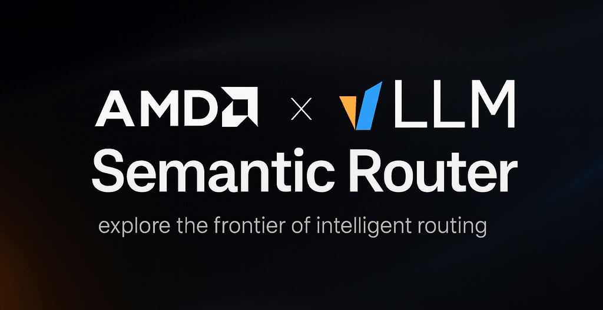
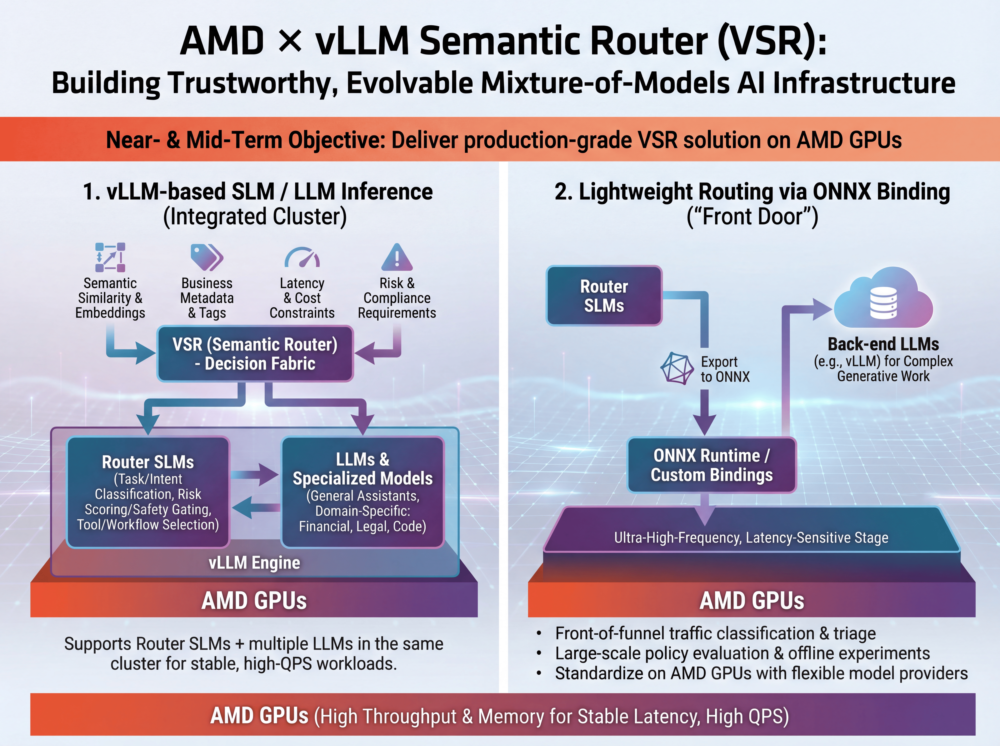
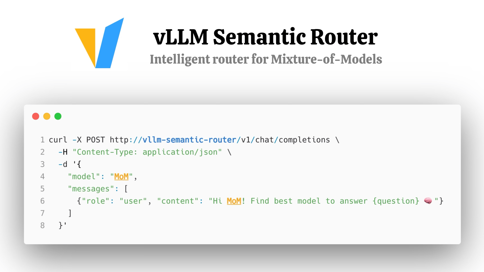
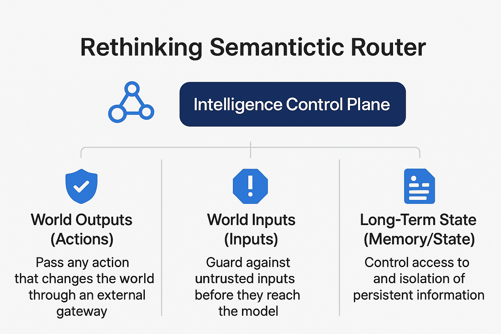

# AMD × Semantic Router: control plane on GPU

Chinese: [zh/vllm/blog/serving/semantic-router-amd.md](../../../../zh/vllm/blog/serving/semantic-router-amd.md)

2025-12-16. **The AMD and vLLM Semantic Router Team**. Repo: [vllm-project/semantic-router](https://github.com/vllm-project/semantic-router). Launch: [semantic-router.md](semantic-router.md). Spine: [Iris](semantic-router-iris.md) / [signal-decision](semantic-router-signal.md). Live MI300X pool later: [mom-amd](semantic-router-mom-amd.md). LoRA kernel: [modular](semantic-router-modular.md). Later: [athena](semantic-router-athena.md), [themis](semantic-router-themis.md), [mom](semantic-router-mom.md). Do not confuse with the in-engine [router.md](router.md). Partnership essay; **few kernel numbers**. Public-beta / GPU-CI / playground items are roadmap on this page, not a shipped SLA.

Siblings: [session](semantic-router-session.md), [vision](semantic-router-vision.md), [fusion](semantic-router-fusion.md), [micro-agent](semantic-router-micro-agent.md).

AMD as a long-term vLLM partner: first the inference engine on GPUs and ROCm, now the next stack layer — **intelligent routing and governance for Mixture-of-Models (MoM)**. As serving leaves the one-model world, the question on the page is no longer only “how big is your model” but how you orchestrate many models **intelligently and safely**. VSR is framed as the **intelligent control plane**: semantic routing, safety policy, trust as systems scale.

Local figures (copyright remains with the original site; study copies):

**Figure 1.** Three pillars: signal routing, cross-instance intelligence, guardrails.

Three strategic pillars:

1. **Signal-based routing**: keyword, domain classification, semantic similarity, fact-checking — for Multi-LoRA and multi-model deployments
2. **Cross-instance intelligence**: shared state across vLLM instances — centralized response storage and semantic cache
3. **Guardrails & governance**: PII, jailbreak, hallucination, alignment enforcement

## From single models to Mixture-of-Models

A typical enterprise stack on the page:

- **Router SLMs** that classify, route, and enforce policy
- **Multiple LLMs** and domain models (code, finance, healthcare, legal)
- **Tools, RAG**, vector search, business systems

Without a routing layer this is an opaque mesh. The collaboration’s aim: routing as a **first-class, GPU-accelerated infrastructure component**, not a script between services.

## VSR core capabilities

### 1. Signal-based routing for Multi-LoRA

- **Keyword-based**: fast, deterministic pattern matching
- **Domain classification**: intent-aware adapter selection with trained classifiers
- **Embedding-based semantic similarity**: routing from semantic understanding
- **Fact-checking / verification routing**: high-stakes queries to specialized verification pipelines

### 2. Cross-instance intelligence

- **Response API**: centralized response storage for stateful multi-turn
- **Semantic Cache**: token reduction via cross-instance vector similarity

### 3. Enterprise-grade guardrails

Single-turn through multi-turn:

- **PII detection**
- **Jailbreak prevention**
- **Hallucination detection**
- **Super Alignment**: the page’s phrase for keeping systems aligned as they scale toward AGI-level capabilities — a governance slogan on this essay, not a measured eval

## Two deployment paths on AMD GPUs

Near-term objective they write: a production-grade VSR that **runs efficiently on AMD GPUs**. Two complementary paths.

**Figure 2.** Path 1: vLLM + router SLMs + many LLMs. Path 2: ONNX Runtime at the front door.

### Path 1: vLLM-based inference on AMD GPUs

vLLM engine on AMD GPUs runs:

**Router SLMs** for task/intent classification, risk scoring and safety gating, tool and workflow selection.

**LLMs and specialists** for general assistance and domain tasks (finance, legal, code, healthcare).

VSR sits above as the decision fabric: semantic similarity, business metadata, latency constraints, compliance → **dynamic routing** across models and endpoints. Claim: AMD GPUs supply throughput and memory to run **router SLMs + multiple LLMs** in one cluster at high QPS with stable latency — not only demos. No kernel table on this page; the live numbers live in [mom-amd](semantic-router-mom-amd.md).

### Path 2: lightweight ONNX-based routing

Not every hop needs a full generative stack. For ultra-high-frequency, latency-sensitive stages at the **front door**:

- Export router SLMs to **ONNX**
- Run them on AMD GPUs through ONNX Runtime
- Forward complex generation to vLLM or other backend LLMs

Designed for:

- Front-of-funnel classification and triage
- Large-scale policy evaluation and offline experiments
- Enterprises that want to **standardize on AMD GPUs while keeping model providers flexible**

## From model director to intelligence judger

Early VSR goal was practical: **intelligent model selection** — task type, cost, performance. vLLM engine = run large models stably. Semantic Router = scheduler.

**Figure 3.** Engine plus scheduler is not enough once actions, untrusted inputs, and long-term state exist.

The page’s shift: as systems move toward AGI-level capabilities, talking about engine efficiency without brakes and traffic law is incomplete. **The real challenge is maintaining control as models get more powerful.** With AMD they recast Semantic Router as **governance**: from traffic director to **Intelligence Control Plane**. A **constitutional layer** defined by responsibilities, not a feature list.

### Three control lifelines

**Figure 4.** Gates on world output (actions), world input (untrusted data), and long-term state.

**1. World output (actions)**

The dangerous capability is **execution**. Tool calls, database writes, API invocations, config changes must pass an **external checkpoint** before they run. Claim: AMD GPUs can run those checkpoints **inline at production scale** — risk, policy, logs — without becoming the bottleneck. No latency number attached.

**2. World input (inputs)**

External inputs untrusted by default: web pages, retrieval, uploads, plugin returns — prompt injection, data poisoning, privilege escalation. VSR as **border inspection** before data reaches the model: classifiers, sanitizers, verification as first line, not afterthought.

**3. Long-term state (memory / state)**

Hardest failures: **wrong answers written into memory, system state, or automated workflows**. First-class concerns they name: who can write, what can be written, how to undo, how to isolate contamination. Continuous verification and rollback as a GPU-backed hope on this page.

Ultimate question they pose: how to turn alignment from a **training-time aspiration** into a **runtime institution**.

## Long-term vision (roadmap on this page)

### Train a next-generation encoder router on AMD GPUs

Longer-term: an **encoder-only** router model on AMD GPUs for semantic routing, RAG, and safety classification. They note ModernBERT-class encoders are still limited in context length, multilingual coverage, and long-context attention alignment. Target: an **open encoder** that plugs into VSR, plus hardware-diverse training. Not a released checkpoint here.

### Community public beta on AMD infrastructure

Each major VSR release to be accompanied by a **public beta** on AMD-sponsored infrastructure, free to the community, to validate routing / cache / safety, get hands-on GPU time, and collect feedback before broader production. Roadmap item.

### AMD GPU-powered CI/CD and end-to-end testbed

Long run: AMD GPUs under how VSR is **built, validated, and shipped**. GPU-backed CI/CD and E2E testbed:

- Router SLMs, LLMs, domain models, retrieval, and tools together on AMD GPU clusters
- Multi-domain, multi-risk datasets replayed as traffic
- Automated eval per change: routing/policy regression, A/B of strategies, stress on latency/cost/scale, hallucination and compliance suites

Target sentence on the page:

> Every VSR release comes with a reproducible, GPU-driven evaluation report, not just a changelog.

AMD GPUs as **verification engine for the routing infrastructure itself**, not only serving boxes.

### An AMD-backed Mixture-of-Models playground

Online MoM playground on AMD GPUs (they later ship a live one; see [mom-amd](semantic-router-mom-amd.md)): experiment with routing strategies and topologies; watch which model is called, when to retrieve, when to check or fall back; compare quality / latency / cost. For vendors: a **neutral** test environment under routing and governance constraints.

## Why the collaboration (their ambitions)

Beyond “does this model run on this GPU”:

- A **reference architecture** for GPU-accelerated routing on AMD: vLLM inference paths, ONNX lightweight router paths, multi-model coordination and safety
- Routing as **trusted infrastructure**: GPU CI/CD and E2E eval, hallucination-aware and risk-aware policies, online learning and adaptive strategies
- A **long-lived AMD GPU–backed MoM playground** for ideas, models, and policies in the open

Hardware = execution layer. VSR = control plane. Alignment “not through hope, but through **architecture**.” Treat that as the essay’s thesis, not a measured result.

## Acknowledgements

- **AMD**: Andy Luo, Haichen Zhang, and the AMD AIG Teams
- **vLLM SR**: Xunzhuo Liu, Huamin Chen, Chen Wang, Yue Zhu, and the vLLM Semantic Router OSS team

Contacts: Haichen Zhang (`haichzha@amd.com`), Xunzhuo Liu (`xunzhuo@vllm-semantic-router.ai`).

Resources: [AMD ROCm](https://www.amd.com/en/products/software/rocm.html), [GitHub](https://github.com/vllm-project/semantic-router), [docs](https://vllm-semantic-router.com). Slack: `#semantic-router` on [vLLM Slack](https://vllm-dev.slack.com/archives/C09CTGF8KCN).
