# vLLM Semantic Router v0.2 Athena: ClawOS, Model Refresh, and the System Brain

Chinese: [zh/vllm/blog/serving/semantic-router-athena.md](../../../../zh/vllm/blog/serving/semantic-router-athena.md)

2026-03-10. **vLLM Semantic Router Team**. Repo: [vllm-project/semantic-router](https://github.com/vllm-project/semantic-router). Launch: [semantic-router.md](semantic-router.md). Spine: [semantic-router-signal.md](semantic-router-signal.md). v0.1: [iris](semantic-router-iris.md). LoRA kernel: [modular](semantic-router-modular.md). HaluGate: [halugate](halugate.md). Vision-path bug later: [vision](semantic-router-vision.md). Partnership essay: [amd](semantic-router-amd.md). Live pool: [mom-amd](semantic-router-mom-amd.md). Next release: [themis](semantic-router-themis.md). Do not confuse with the in-engine [router.md](router.md). MI300X latencies and community counts are a release snapshot.

Siblings: [session](semantic-router-session.md), [fusion](semantic-router-fusion.md), [micro-agent](semantic-router-micro-agent.md), [mom](semantic-router-mom.md).

Since [Iris](semantic-router-iris.md), one cycle rebuilt the model stack, expanded routing into safety, semantic cache, memory, retrieval, and long-context signals, and started a broader bet: semantic routing as the **system brain** for mixture-of-models and multi-agent deployments.

v0.2, codename **Athena**, is where that shift is visible. Complete model refresh, stronger runtime, and **ClawOS**: an experimental operating layer where Semantic Router orchestrates multiple OpenClaw systems through routing, memory, safety, and chat-driven team management. If Iris was the bridge between users and models, Athena starts turning that bridge into an operating surface for model teams.

Local figures (copyright remains with the original site; study copies):

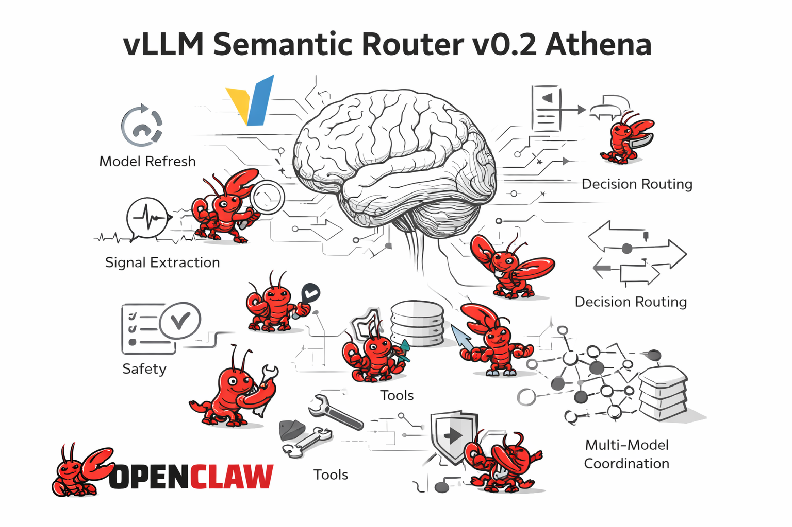

**Figure 1.** Athena: refreshed models, a stronger runtime, and ClawOS as an experimental operating layer.

## Why Athena?

In myth, Athena is wisdom, strategy, disciplined craft. v0.2 is not only faster routing or more plugins. It is **more strategic**: which model to choose, coordinating OpenClaw workers, remembering across turns, exposing decisions through tooling, turning a powerful runtime into something teams can operate.

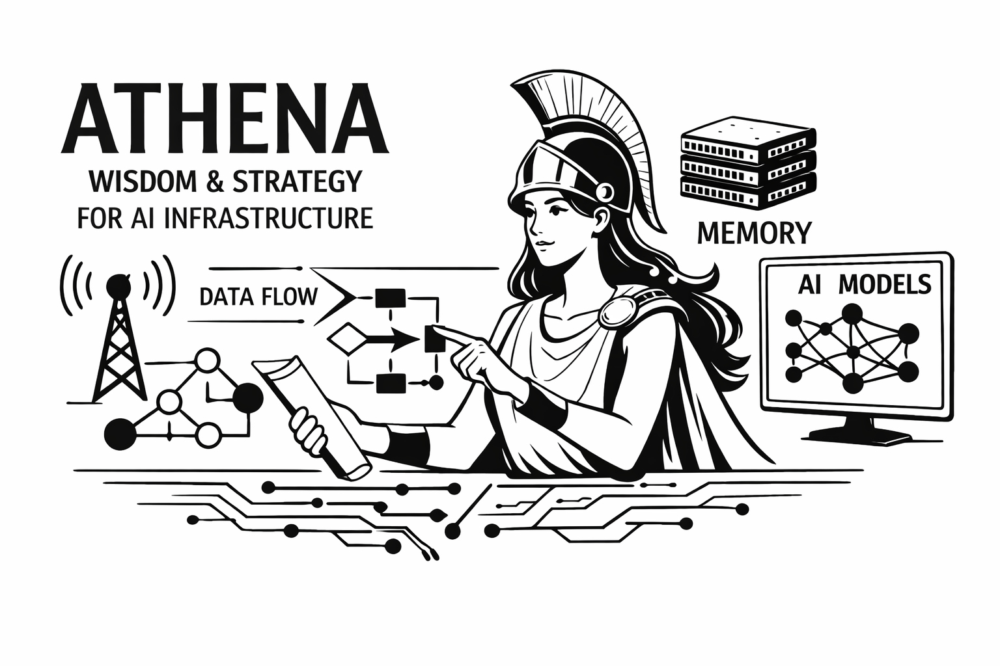

**Figure 2.** Strategy, not only more plugins: selection, teams, memory, tooling.

## What’s new in v0.2

### 1. A complete model refresh rebuilds the MoM foundation

The consequential change sits below the UI and the DSL: **the model stack was rebuilt**.

Center: [`mmbert-embed-32k-2d-matryoshka`](https://huggingface.co/llm-semantic-router/mmbert-embed-32k-2d-matryoshka) and the classifier family [`mom-multilingual-class`](https://huggingface.co/collections/llm-semantic-router/mom-multilingual-class). Embedding, intent, jailbreak, PII, feedback, fact-check, and related surfaces move onto a shared mmBERT-derived foundation, aligned with the same ONNX + Flash Attention path.

Also: [`multi-modal-embed-small`](https://huggingface.co/llm-semantic-router/multi-modal-embed-small) — text, images, and audio in **one 384d space**. Cross-modal retrieval (search images with text, find audio with descriptions). Load with `transformers` and `torch`; no custom runtime claimed. Later the Candle path for this model was the [vision](semantic-router-vision.md) hardening story.

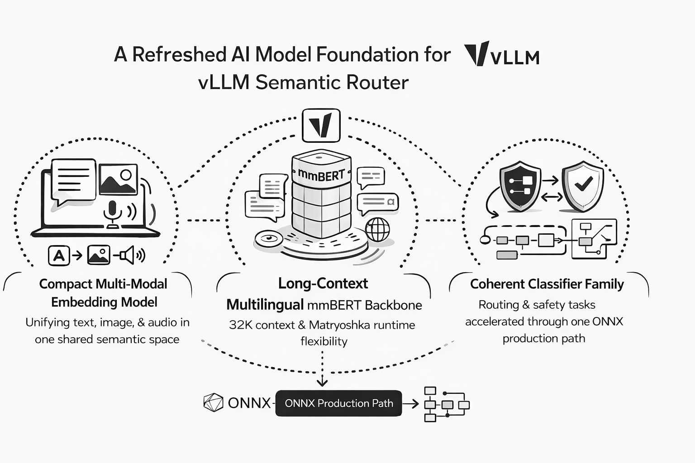

**Figure 3.** Shared mmBERT foundation plus a compact cross-modal embed.

Three immediate changes (release-page numbers):

- **Multi-Modal Embed Small:** ~**120M** params, shared **384d**, strong image-text alignment, 2D Matryoshka, sub-100ms inference targets, reported **Audio-Text Retrieval R@1 = 36.4%**
- **mmBERT-Embed-32K-2D-Matryoshka:** **32K** context, **1800+** languages, **307M**, **STS 80.5**, **768d → 256d** truncation with **~99%** quality retention, **22L → 6L** early exit ~**3.3×**
- **mom-multilingual-class** turns that backbone into a coherent classifier family sharing ONNX acceleration

Five core tasks, each **merged** and **LoRA**:

| Task | Merged model | LoRA model |
| --- | --- | --- |
| Intent | `mmbert32k-intent-classifier-merged` | `mmbert32k-intent-classifier-lora` |
| Jailbreak | `mmbert32k-jailbreak-detector-merged` | `mmbert32k-jailbreak-detector-lora` |
| PII | `mmbert32k-pii-detector-merged` | `mmbert32k-pii-detector-lora` |
| Fact-check | `mmbert32k-factcheck-classifier-merged` | `mmbert32k-factcheck-classifier-lora` |
| Feedback | `mmbert32k-feedback-detector-merged` | `mmbert32k-feedback-detector-lora` |

| New foundation | What Athena changes |
| --- | --- |
| `multi-modal-embed-small` | Unified text-image-audio embeddings in one 384d space |
| `mmbert-embed-32k-2d-matryoshka` | 32K context, 1800+ languages, 2D Matryoshka runtime controls |
| ONNX + CK Flash Attention | The refreshed stack is faster in production, not only newer on paper |

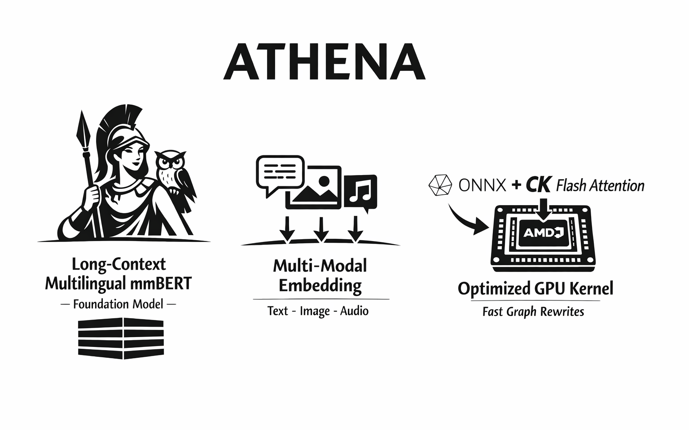

**Figure 4.** Model refresh is also a runtime refresh: ONNX, ROCm, CK Flash Attention.

Three-way benchmark on **AMD Instinct MI300X**, real router path **Envoy (:8801) → ext_proc → SR (:50051)**:

| Request size | ONNX + GPU avg | ONNX + CPU avg | Candle + CPU avg |
| --- | --- | --- | --- |
| ~500 tokens | 22 ms | 853 ms | 1053 ms |
| ~2000 tokens | 31 ms | 1814 ms | 1805 ms |
| ~8000 tokens | 128 ms | 4796 ms | 1830 ms |

**Domain extraction:** ONNX+GPU **10.2 / 16.3 / 36.1 ms** at those lengths vs ONNX+CPU **630.4 / 833.3 / 743.9 ms** vs Candle+CPU **849.0 / 1304.9 / 1311.5 ms**. **PII extraction:** ONNX+GPU **8.4 / 19.0 / 118.8 ms** vs ONNX+CPU **729.5 / 1781.8 / 4783.9 ms** vs Candle+CPU **854.2 / 1299.8 / 1327.8 ms**.

Three classifiers concurrent on MI300X; old SDPA hit a memory wall:

| Sequence length | SDPA | CK Flash Attention | Result |
| --- | --- | --- | --- |
| 4096 | 167 ms | 51 ms | **3.3× faster** |
| 8192 | OOM | 105 ms | SDPA fails, FA works |
| 16384 | OOM | 259 ms | FA at 16K |
| 32768 | OOM | 756 ms | FA to full 32K |

How FA is supported: under `onnx-binding/ort-ck-flash-attn`, a standalone **ONNX Runtime custom-op library** registers `com.ck::CKFlashAttention` on ROCm and calls AMD Composable Kernel tiled FMHA. A graph-rewrite replaces dense SDPA subgraphs with a single CK Flash Attention node. Instead of a dense **`[1, 1, S, S]`** attention mask, the rewrite derives a lightweight **`[B, 1, 1, S]`** padding bias from `attention_mask` and passes sliding-window settings into the kernel. Local-attention layers use CK window parameters; global layers switch to full attention. **Model-aware ONNX rewrite plus a custom ROCm kernel**, not a backend toggle.

Heavier load: CK Flash Attention completed **20 concurrent 32K-token requests** at **9872 ms median / 14862 ms p95**, **zero OOMs**, identical classification outcomes on the validation queries.

### 2. Model selection as a first-class primitive

Not a roadmap item. Trainable ML selectors **and** runtime strategies. Position in the pipeline is explicit: extract signals → match decisions → **only after a decision matches** does a **per-decision algorithm** choose among that decision’s `modelRefs`. Selection is the last step between “this request belongs to this decision” and “this exact model should serve it.”

| Family | Method | What it does |
| --- | --- | --- |
| ML-based | **KNN** | Nearby historical queries vote |
| ML-based | **KMeans** | Cluster-level quality / efficiency |
| ML-based | **SVM** | RBF boundaries between model preferences |
| ML-based | **MLP** | Neural router from embeddings; Candle inference |
| Advanced | **Static** | Fixed default when predictability matters |
| Advanced | **Latency-Aware** | Fastest candidate from TPOT and TTFT percentiles |
| Advanced | **Elo** | Bradley-Terry updates from feedback / pairwise prefs |
| Advanced | **RouterDC** | Dual-contrastive match to model descriptions |
| Advanced | **AutoMix** | Cheap first; escalate on self-verification |
| Advanced | **Hybrid** | Quality / similarity / cost with configurable weights |
| Advanced | **Thompson Sampling** | Explore / exploit while serving |
| Advanced | **GMTRouter** | Graph routing from multi-turn history |
| Advanced | **Router-R1** | External router model reasons, then chooses downstream |

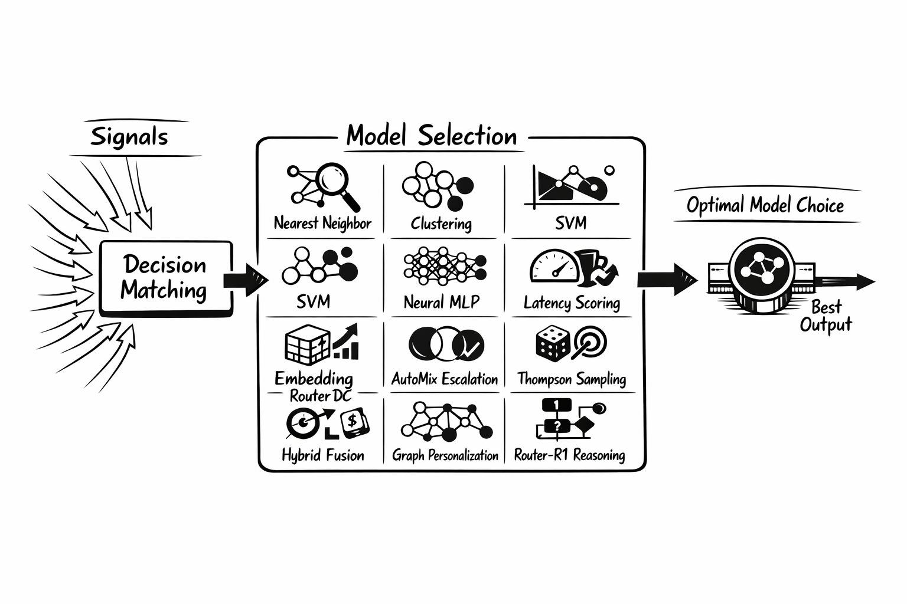

**Figure 5.** Model selection after a decision matches, not instead of signals.

Operational layer: setup wizard for ML training and config generation, CLI and runtime integration, metrics, E2E coverage, Elo feedback in the dashboard.

### 3. ClawOS: an operating layer for OpenClaw

**OpenClaw** = underlying agent platform. **ClawOS** = orchestration and operating experience Athena builds on top, inside Semantic Router. Experimental, already tangible: MCP tools and room-style chat to spin up OpenClaw teams and workers, coordinate in shared rooms, observe runtime state.

Dashboard capabilities they want in that setup:

- **Intelligent Routing** for cost-quality model selection
- **Safety Guardrails** against jailbreaks, PII leakage, and hallucination risk
- **Hierarchical Memory Storage** for long-horizon, multi-step execution
- **Knowledge Sharing** across agents
- **Isolation & Team Management** for multi-agent operations in one orchestration layer

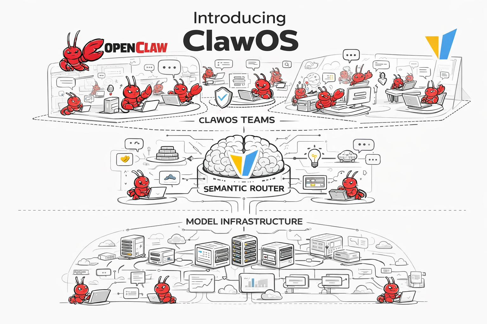

**Figure 6.** ClawOS: routing, safety, memory, and team control on one surface.

Product surfaces in v0.2: natural-language MCP control; team support with leader-and-worker composition; shared room chat; leader-and-worker collaboration; worker provisioning from the dashboard; runtime health / composition / status; readonly room chat for safer demos; shared runtime so Claw workers can live alongside the router.

Not a finished platform. An early answer: what if semantic routing does not just choose a model, but **powers a multi-agent operating layer** on OpenClaw?

### 4. Memory, RAG, and response state in the core runtime

**Agentic Memory** with Milvus, hybrid memory search, memory scoring, Llama Stack vector backends, memory metrics. OpenAI **Responses API** with Redis persistence, conversation chaining, stronger tests. **Router Replay** with pluggable storage, per-decision isolation, dashboard visualization.

Hybrid search: **vector + BM25 + n-gram**, weighted fusion or **RRF**. In-memory backend can run hybrid natively; Milvus-style backends pull broader candidates then hybrid-rerank.

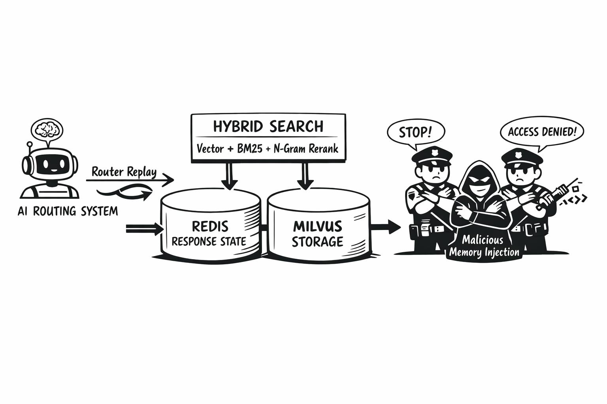

**Figure 7.** Memory, RAG, Responses API, and replay become core runtime, not side features.

Trust: **MINJA** defenses against memory injection; response-level jailbreak gating before memory storage; cross-model cache sharing; Demand RAG and vector-store ingestion. Routing from a stateless decision point toward remember / retrieve / verify / replay.

### 5. Signals richer, faster, safer

Iris introduced Signal-Decision. Athena expands it.

| Signal surface | What Athena adds | Why it matters |
| --- | --- | --- |
| Core request | Language, latency, context, complexity (incl. few-shot variants) | More than topic |
| Control context | Modality and authz | Media intent and access earlier |
| Feedback loop | Feedback and preference classifiers | User-side signals are first-class |
| Semantic matching | Multimodal embeddings, soft embedding rules, HNSW | Broader / faster as retrieval grows |
| Deterministic fast path | BM25, n-gram fuzzy, regex | Auditable, less brittle |
| Runtime confidence | Dynamic confidence scoring | Quality, not only binary matches |

Safety closer to the main signal path:

| Safety surface | What Athena adds | Why it matters |
| --- | --- | --- |
| Jailbreak | Parallel signals; classifier + **contrastive multi-turn** | Single-turn and gradual escalation |
| PII | Parallel signals; policy and reveal controls | Same routing / enforcement layer |
| Tool safety | Confidence-gated reranking for tool filtering | Selective without every edge case hardcoded |
| Hallucination | More flexible **multi-level** response handling | Warn / annotate / surface risk |

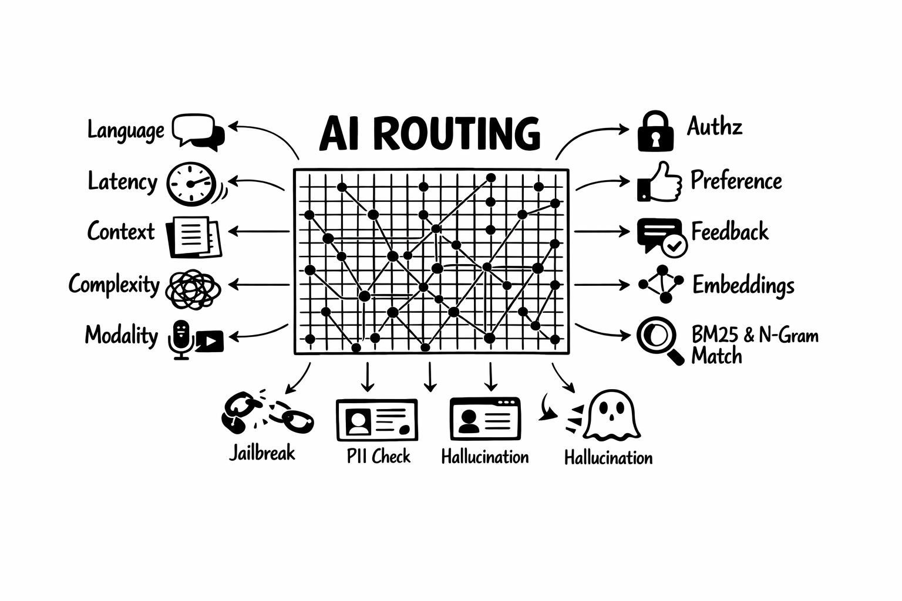

**Figure 8.** Broader signals; keyword path no longer literal-only.

Keyword path: **BM25** for topic-style routing across larger sets; **n-gram** for typo-tolerant near-misses; **regex** for compliance / structured detection. Fast path stays auditable; noisy wording need not miss it.

### 6. NLP prompt compression as a long-context primitive

Compress **before signal extraction**, not another LLM hop.

| Compression layer | What Athena does | Why it matters |
| --- | --- | --- |
| Method | TextRank, position weighting, TF-IDF, novelty scoring | Reduce long prompts without an LLM hop |
| Placement | Compressed text **only for signal extraction** | Original request still goes to the serving model |
| Safety | `skip_signals` keep jailbreak and PII on original text | Full-fidelity where needed |
| E2E | Envoy STREAMED body mode + fast JSON | Production latency, not only a diagram |

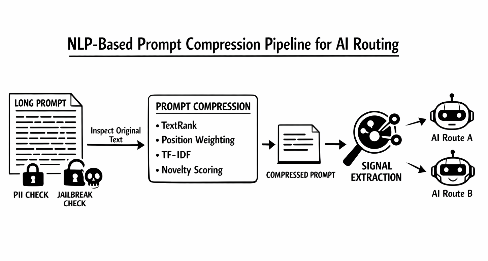

**Figure 9.** Deterministic NLP compression on the signal path; serving model still sees the original prompt.

MI300X buffered-vs-streamed: STREAMED path (fast JSON, semi-streaming chunks, prompt compression) **143 ms → 103 ms** e2e at ~16K tokens; **jailbreak** extraction **127 ms → 10 ms** when the signal path compresses **16K → 512** tokens.

### 7. Programmable neural-symbolic configuration language

White paper: a typed configuration language as the instruction set for the routing engine — neural signal extraction + symbolic decision evaluation. Routing setup toward **program synthesis**: natural-language spec → valid routing program. LLM coding agents synthesizing policy from NL is an explicit paper claim.

Landed: full DSL compiler; visual builder; richer dashboard CRUD for signals and decisions; better convergence across config surfaces; stronger deploy-time translation for Kubernetes.

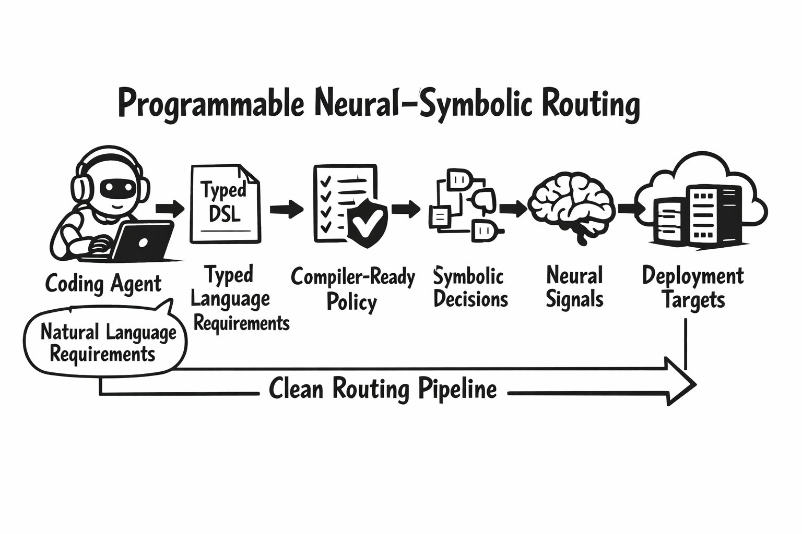

**Figure 10.** Runtime config, dashboard, CLI, and Kubernetes representations converging.

Also: config reload fixes; apiserver classification service refresh after deploy reload. Compile, validate, round-trip, increasingly ask an agent to write.

### 8. Zero-config onboarding

Install and first-run as one flow. macOS / Linux:

```bash
curl -fsSL https://vllm-semantic-router.com/install.sh | bash
```

Installer: detect Python, install `vllm-sr` into an isolated local env, write a launcher to `~/.local/bin/vllm-sr`, prepare Docker or Podman unless opted out, run the first `vllm-sr serve`, open the dashboard when possible; remote machines get access / SSH tunnel hints instead of failing silently.

Later, or any time from an empty directory:

```bash
vllm-sr serve
```

it can: bootstrap a minimal workspace; create `.vllm-sr/router-defaults.yaml` behind the scenes; launch the dashboard in setup mode; guide first model + routing starter; write `config.yaml` only after activation.

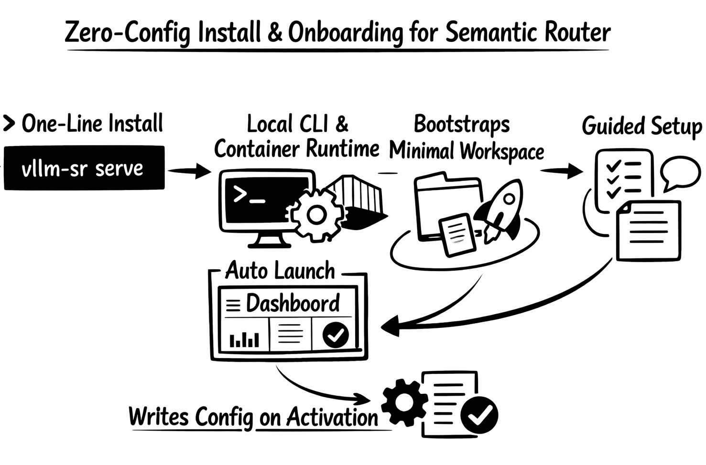

**Figure 11.** Dashboard-first first run; `vllm-sr init` optional.

YAML still there for advanced users. CLI-only mode, skip auto-launch, pin runtime, or `--platform amd` for the first AMD launch. Shortest path: install, auto-launch, open dashboard, configure one model, activate.

### 9. Dashboard as a system brain

Topology with test-query support; Router Replay visualization; evaluation API and dashboard eval surfaces; monitoring; reasoning-aware playground; readonly mode for public beta; MCP tools in the dashboard; layout / mobile / landing / manager / monitoring refinements.

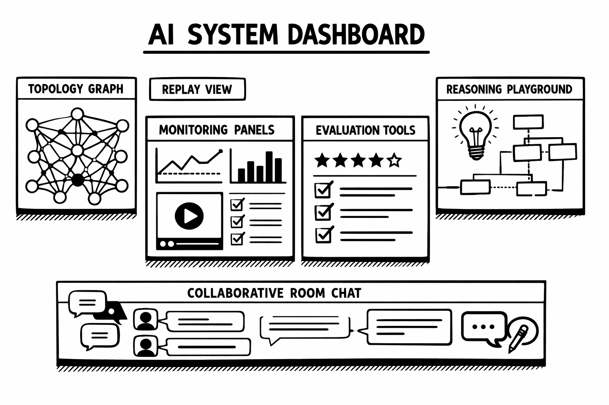

**Figure 12.** Observe, debug, evaluate, demonstrate from the dashboard — not only YAML and logs.

### 10. AMD ROCm as a first-class `vllm-sr` path

Canonical flow, not a side experiment. ROCm edition of the `vllm-sr` image, AMD playbook, CLI:

```bash
vllm-sr serve --platform amd
```

Selects ROCm image defaults, passes the AMD platform through the container runtime, GPU-first config (`use_cpu` → `false` unless explicitly disabled), mounts `/dev/kfd` and `/dev/dri` when present.

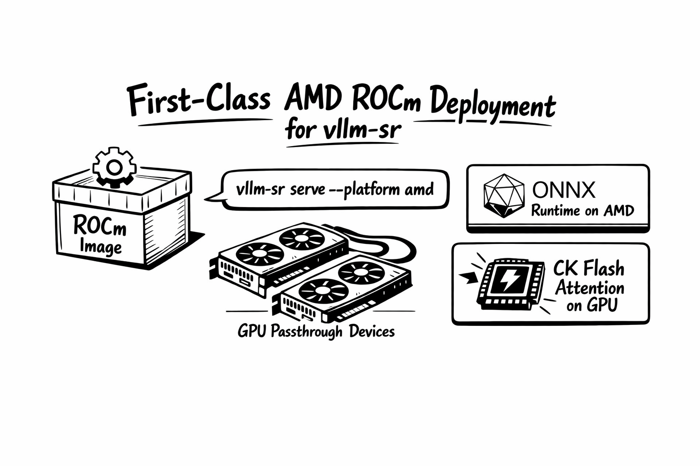

**Figure 13.** `--platform amd`: ROCm image, GPU defaults, ONNX + CK Flash Attention.

ROCm image builds the ONNX-backed router, installs ROCm ONNX Runtime, can load the CK Flash Attention custom op. Reference AMD profile: alias-based routing against a ROCm vLLM backend. End-to-end path: dedicated image, documented serve, GPU passthrough, ONNX + FA in the intended operator experience. Live demo write-up: [mom-amd](semantic-router-mom-amd.md).

### 11. Research and model-systems cycle

- White paper: [Signal Driven Decision Routing for Mixture-of-Modality Models](https://vllm-semantic-router.com/white-paper/)
- Multimodal / modality-aware training, including cross-modal embeddings and mmBERT classifiers / modality routers
- Longer-context acceleration via CK Flash Attention, ONNX graph rewriting, ROCm-oriented paths
- Tighter bridge from research artifacts to deployable runtime

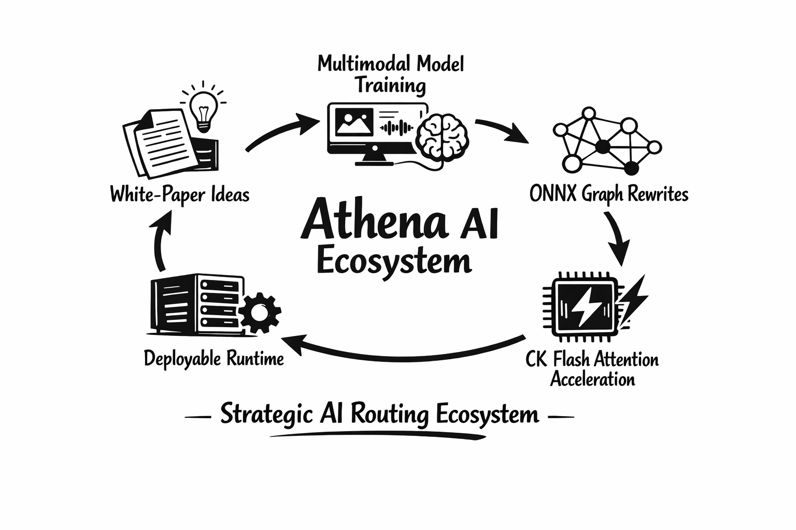

**Figure 14.** Research, training, and production moving together.

## Looking ahead: Beyond Athena

Athena operationalizes strategic routing. Next they list: a training coding agent that writes / revises the DSL from NL; a self-learning loop from reverse signals and routing outcomes; deeper multi-turn memory and agentic tools; more operator automation; broader multimodal and tool-aware safety; continued research-to-runtime convergence. The next numbered release is [Themis](semantic-router-themis.md).

## Acknowledgments

`v0.1.0` on **2026-01-05** to `main` on **2026-03-09**: **304 commits**, **43 contributors**. Named thanks: Red Hat, IBM, AMD, NVIDIA, DaoCloud, and the broader OSS community.

## Get started

Hosted: [play.vllm-semantic-router.com](http://play.vllm-semantic-router.com).

```bash
curl -fsSL https://vllm-semantic-router.com/install.sh | bash
```

Installs the CLI, prepares local Docker or Podman for `vllm-sr serve`, runs the first launch, opens the dashboard when possible.

Manual / Windows:

```bash
pip install vllm-sr
vllm-sr serve
```

No `config.yaml` yet: bootstrap + dashboard setup mode. YAML-first: still `vllm-sr init` then `vllm-sr serve`.

```bash
helm install semantic-router oci://ghcr.io/vllm-project/charts/semantic-router
```

- Docs: [vllm-semantic-router.com](https://vllm-semantic-router.com)
- GitHub: [vllm-project/semantic-router](https://github.com/vllm-project/semantic-router)
- Models: [Hugging Face](https://huggingface.co/LLM-Semantic-Router)
- Slack: [vLLM Slack](https://vllm-dev.slack.com/archives/C09CTGF8KCN)

Closing line: *The bridge can now reason strategically. Welcome to Athena.*
