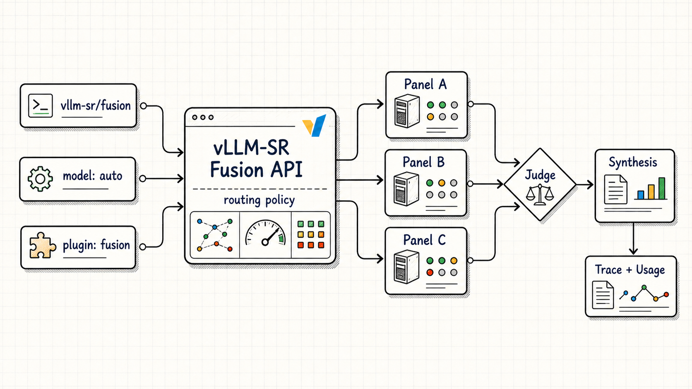
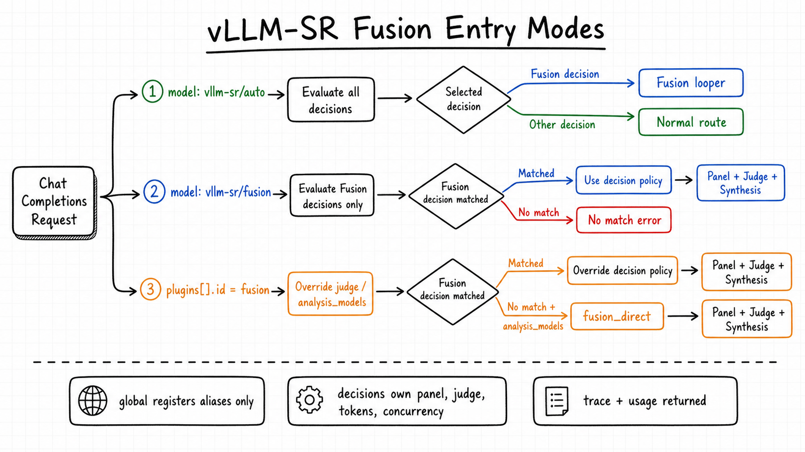
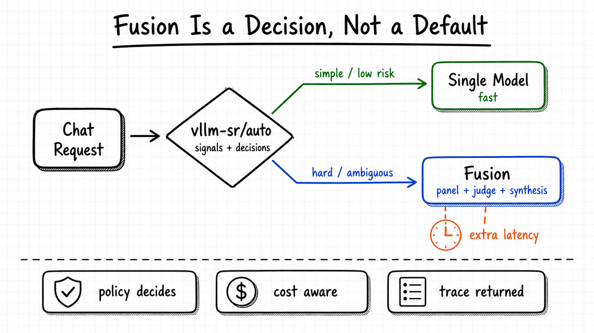
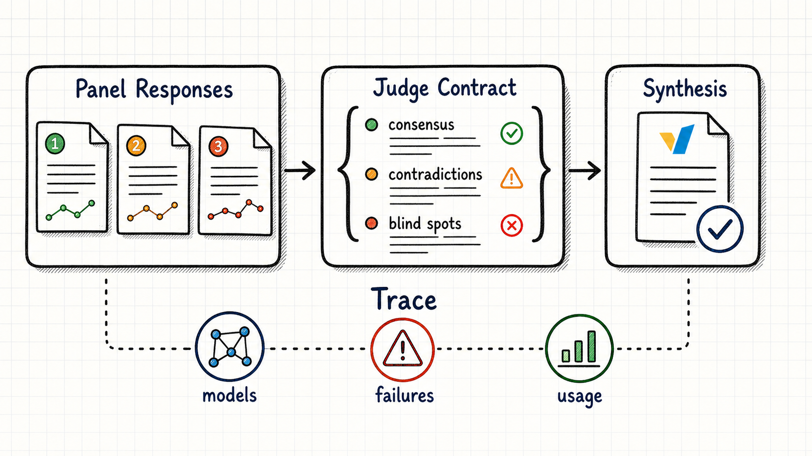

# Fusion: panel, judge, synthesis — as a routing decision

Chinese: `../../zh/vllm/blog/serving/semantic-router-fusion.md`  
2026-06-16. MoM: [mom](semantic-router-mom.md). Loopers: [micro-agent](semantic-router-micro-agent.md).  OpenRouter DRACO rows are **their** numbers, not a vLLM-SR eval.

Fusion is policy, not a global slug. Signals first; only a Fusion decision pays for a panel.

- `vllm-sr/auto` (`auto` / `MoM`): all decisions; Fusion iff `algorithm.type: fusion`.
- `vllm-sr/fusion`: Fusion-capable decisions only; no silent single-model fallback.
- Plugin `id: fusion`: per-request judge/panel override.

Concurrent panel, `max_concurrent`. `on_error: skip` vs `fail`. Registered Fusion slugs cannot be judge/panel. In agent loops only the **final judge** may emit `tool_calls`.

OpenRouter demo (DRACO): Fable 5 + GPT-5.5 / Opus synth **69.0%**; three-model **68.3%**; dual Opus **65.5%**; solo Fable 5 **65.3%**; budget panel **64.7%**; solos 60.3 / 53.7 / 43.1. External signal, not a promise.

Local figures (copyright remains with the original site; study copies):

