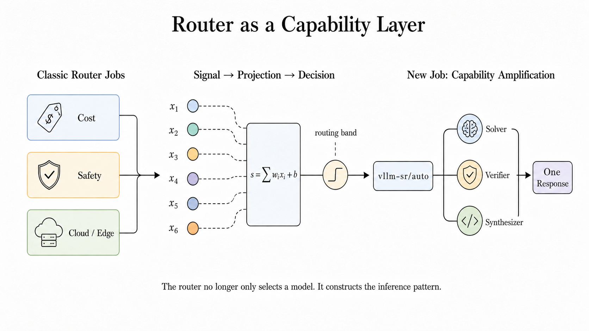
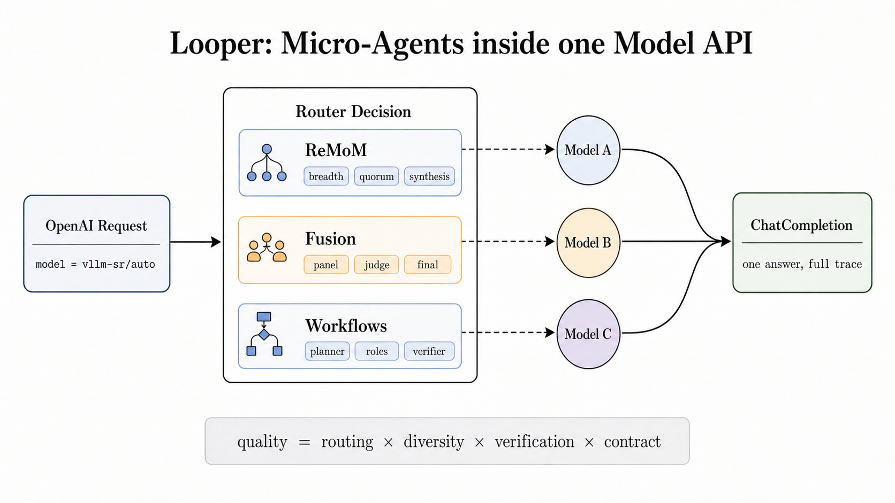
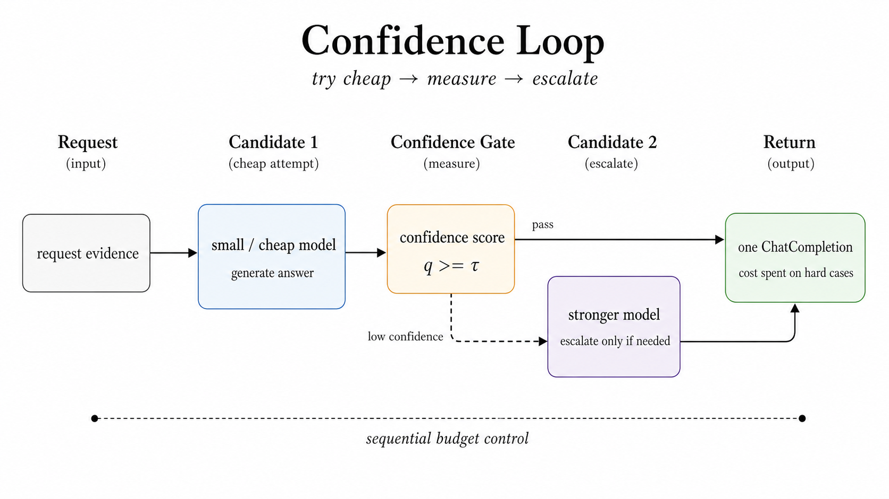
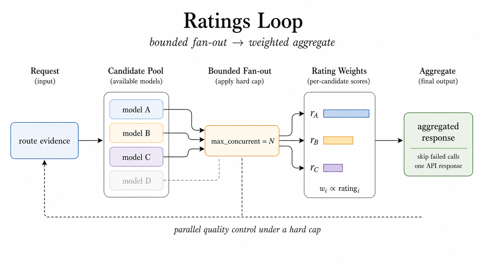
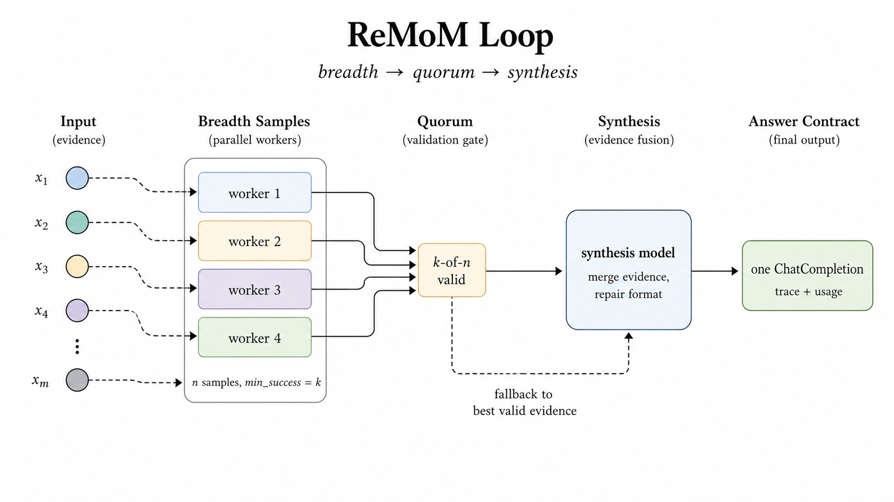
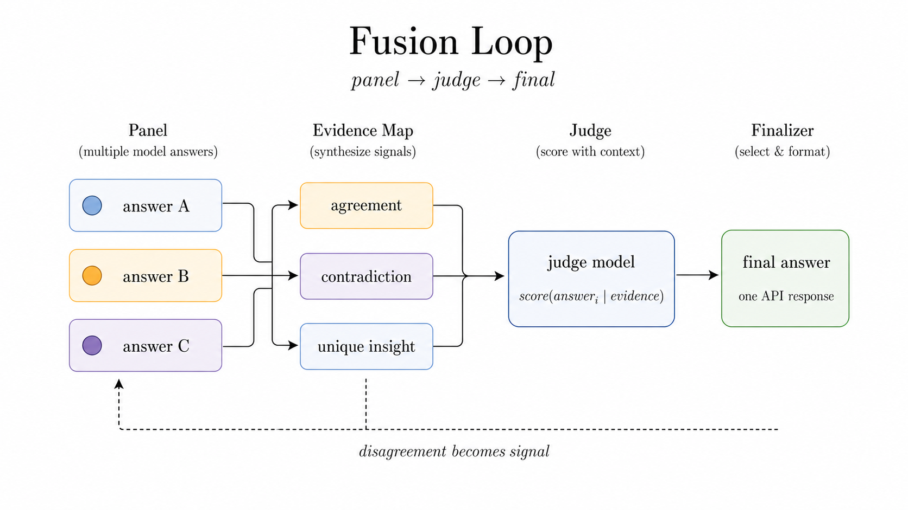
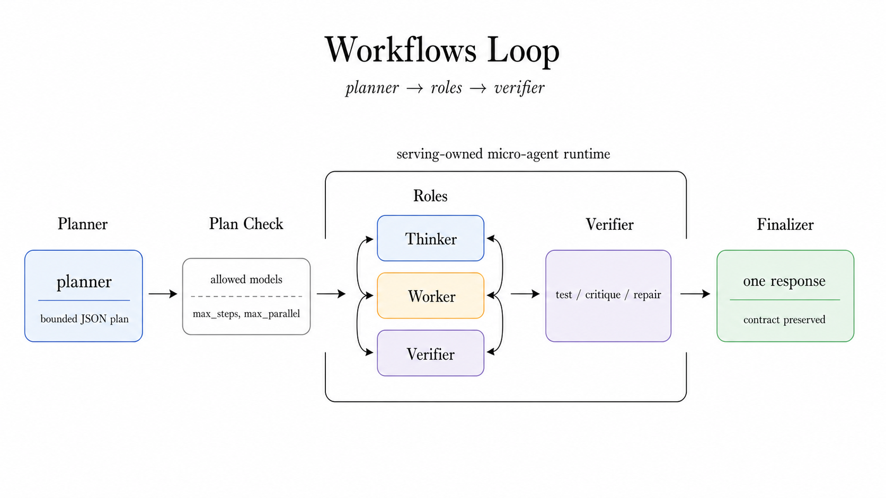
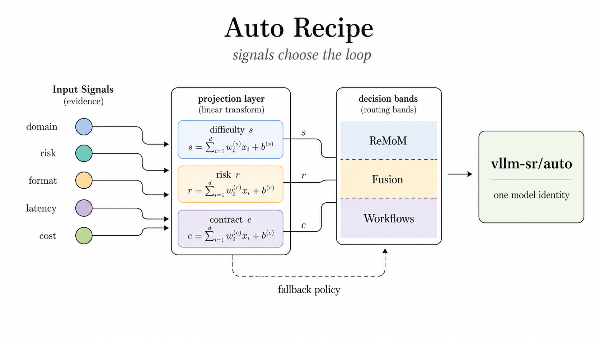
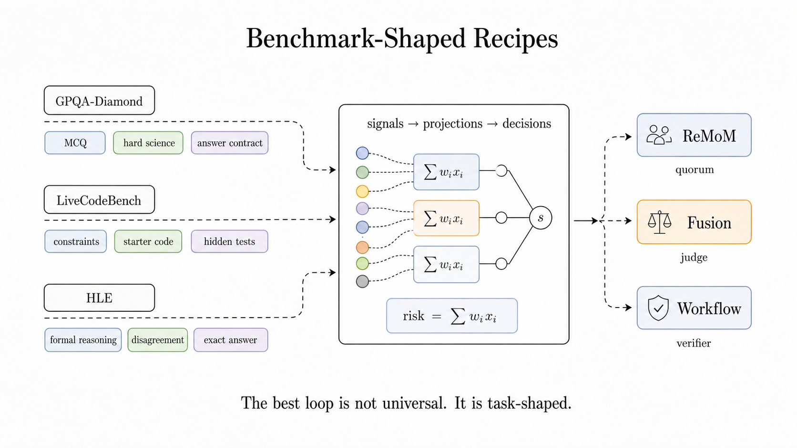
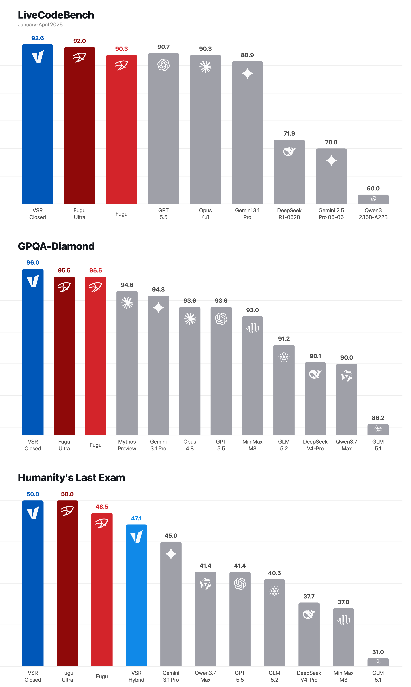

# Micro-Agent: bounded collaboration behind one model name

Chinese: [zh/vllm/blog/serving/semantic-router-micro-agent.md](../../../../zh/vllm/blog/serving/semantic-router-micro-agent.md)

2026-06-29. **vLLM Semantic Router Team**. Repo: [vllm-project/semantic-router](https://github.com/vllm-project/semantic-router). Launch: [semantic-router.md](semantic-router.md). Spine: [Iris](semantic-router-iris.md) / [signal-decision](semantic-router-signal.md). Panel–judge: [fusion](semantic-router-fusion.md). MoM as a system: [mom](semantic-router-mom.md). Session continuity: [session](semantic-router-session.md). Operable contract: [themis](semantic-router-themis.md). Do not confuse with the in-engine [router.md](router.md). Scorecard rows are **their** closed/hybrid recipes — not “always run every closed model.”

Siblings: [athena](semantic-router-athena.md), [amd](semantic-router-amd.md), [mom-amd](semantic-router-mom-amd.md), [modular](semantic-router-modular.md), [vision](semantic-router-vision.md), [halugate](halugate.md).

Everyone is watching for the next frontier checkpoint. The more interesting layer may sit in front of it.

Routers are becoming the control plane for AI inference. The first job was practical: the right request to the right model. Production is no longer a one-model world, so that already matters.

A router can cut cost by deciding when a request deserves a frontier model and when an open-source or local model is enough. It can make safety policy executable by sending sensitive domains to stricter models, stricter filters, or stronger review. It can coordinate cloud and edge, keeping private or low-latency intent local while escalating harder work to the cloud.

Those jobs matter. The next job on the page is more interesting:

> A router can make the model better.

Not by changing weights. Not by asking every application to build a bespoke agent graph. By turning **one model API call** into a **bounded collaboration** inside the serving layer.

Local figures (copyright remains with the original site; study copies):



**Figure 1.** From model selection to capability construction.

[Sakana Fugu](https://sakana.ai/fugu/) made a commercial product of a simple idea: a “model” can be a surface, a team behind it. Useful language: [Fugu technical report](https://arxiv.org/abs/2606.21228), [Conductor](https://arxiv.org/abs/2512.04388), [Trinity](https://arxiv.org/abs/2512.04695). vLLM-SR’s bet is different **where** the abstraction lives: collaboration should not live only inside one commercial endpoint or one application-specific agent graph. It should become an **open serving primitive**.

The user still calls one model:

```json
{
  "model": "vllm-sr/auto",
  "messages": [{"role": "user", "content": "..."}]
}
```

Behind that stable identity the router can select a recipe, fan out to workers, collect a quorum, verify disagreement, synthesize, repair the output contract, and return one ordinary OpenAI-compatible response. The point is not to expose complexity. Collaboration should **feel like a model**.

## The looper is the runtime

In vLLM Semantic Router, the looper is the execution runtime for bounded micro-agents.

A request enters as an ordinary chat completion. Signals → projections (task-shape or risk bands) → decision → algorithm. That algorithm may be a single-model route **or** a looper route.

Today’s main patterns:

- **Confidence:** sequential escalation. Cheaper first; measure confidence; escalate only when the score is too low
- **Ratings:** bounded fan-out under `max_concurrent`; rating-aware aggregation
- **ReMoM:** repeated mixture-of-model reasoning. Breadth samples, wait for a success quorum, synthesis round
- **Fusion:** panel → judge → finalizer ([fusion](semantic-router-fusion.md))
- **Workflows:** micro-agent workflow runtime. Static roles or a dynamic planner; bounded worker steps; synthesize



**Figure 2.** Looper algorithms inside the router; the model API surface stays.

Implementation details matter. A looper is not the slogan “ask more models.” It is a small runtime with **budget, topology, trace, and failure policy**.

### Confidence: spend escalation only on hard cases

The cost-aware loop. Start smaller/cheaper, then ask whether the answer is confident enough to stop. Confidence can come from token-level log probability, logprob margin, a hybrid score, self-verification, or an AutoMix-style entailment verifier.

If the score passes the threshold, return immediately. If it is too low, escalate to the next candidate. The important part is not that escalation exists. Escalation becomes explicit router policy: thresholds, failure behavior, and stopping conditions are visible and tunable.



**Figure 3.** Escalation as a measured stopping policy.

### Ratings: parallel quality under a hard cap

The controlled ensemble loop. Several candidates in parallel, only up to a configured `max_concurrent`. Useful when a route should benefit from multiple model views without turning every request into unbounded fan-out.

Collect successful responses, apply rating-aware aggregation, handle failures according to the route policy. Fit for A/B-style evaluation, ensembles, routes where the operator already has per-candidate quality signals.



**Figure 4.** Multi-candidate execution stays bounded and rating-aware.

### ReMoM: breadth with a contract

High reasoning variance, but the answer format must survive. Fan out attempts, wait for a minimum-success quorum, then a synthesis model merges evidence into the required output contract.

If synthesis fails but earlier workers produced valid evidence, the route does not have to collapse into an API error. Fall back to the best valid evidence and still return a normal response.



**Figure 5.** Breadth, quorum, synthesis, fallback as serving-time controls.

### Fusion: disagreement as signal

A different bet. Sometimes the useful object is not the average answer; it is the **structure of disagreement**. Independent panel answers become evidence. The judge sees agreement, contradiction, unique insight; the finalizer returns one answer with the trace collapsed behind the API.

Hard multiple-choice reasoning, long-form expert judgment, exact-answer tasks where a single confident response can be brittle.



**Figure 6.** Disagreement is evidence, not something to hide.

### Workflows: roles under a budget

The most agentic pattern, therefore the strictest boundaries. The planner can only choose **allowed** worker models. The plan is validated. Steps bounded by max steps, max parallelism, timeouts, and error policy. The final response still has to satisfy the output contract.

For SWE-style tasks: planner, patcher, verifier, finalizer — without the application owning a bespoke agent stack. For production serving that distinction is critical: the loop is powerful, but it is still governed by infrastructure.



**Figure 7.** A bounded role system, not an unbounded autonomous agent.

### Auto recipes: one name, many loops

The public surface remains `vllm-sr/auto`. Internally, signals and projections choose the loop. Difficulty, risk, contract pressure, latency, and cost are not comments in a prompt. They are routing facts that can select Confidence, Ratings, ReMoM, Fusion, Workflows, or a fallback path.



**Figure 8.** Signals pick the collaboration pattern; one model identity remains.

This is the difference between “agent as app logic” and “micro-agent as serving runtime.” The router owns budget, policy, topology, trace, and failure mode.

## Recipes beat one universal loop

The eval lesson on the page is not that one algorithm always wins. The opposite:

> The best loop is task-shaped.

GPQA-Diamond wants strict multiple-choice answer preservation. LiveCodeBench wants runnable code and hidden-test robustness. Humanity’s Last Exam wants disagreement resolution and exact-answer formatting. SWE-style tasks need a planner, patcher, verifier, and finalizer.

That is why `vllm-sr/auto` should not mean “always run the biggest loop.” It should mean: select the recipe that fits this task.



**Figure 9.** Benchmark-shaped collaboration via signals and projections.

In their recipes that shape is explicit:

- GPQA-Diamond: hard science multiple-choice → ReMoM with strict `ANSWER: X` preservation
- LiveCodeBench: constraints, starter code, standard input, float tolerance, timeout risk, hidden-test risk → a code-shaped loop
- HLE: formal reasoning, disagreement risk, long context, exact-answer pressure → deeper ReMoM, smaller Fusion, or a fallback path

The prompt is only one part. The recipe also defines model pool, roles, reasoning effort, concurrency, quorum, timeout, synthesis model, fallback, output contract, observability labels. That is why router-side collaboration is more than prompt engineering.

## The scorecard is a proof, not the whole story

Closed-model recipe across three hard benches. The numbers are useful because the idea is not only aesthetic.



**Figure 10.** VSR Closed and VSR Hybrid across LiveCodeBench, GPQA-Diamond, HLE.

**VSR Closed** = only closed-model backends. **VSR Hybrid** = mix open and closed; stronger closed models where judging / repair / synthesis / fallback is higher-risk.

| Benchmark | VSR scorecard row | Score | Reference rows (on the page) |
| --- | --- | ---: | --- |
| LiveCodeBench, Jan–Apr 2025 | VSR Closed | 92.6 | Fugu Ultra 92.0, Fugu 90.3, GPT-5.5 90.7, Opus 4.8 90.3 |
| GPQA-Diamond | VSR Closed | 96.0 | Fugu Ultra 95.5, Fugu 95.5, Gemini 3.1 Pro 94.3, GPT-5.5 93.6 |
| Humanity’s Last Exam | VSR Closed | 50.0 | Fugu Ultra 50.0, Fugu 48.5, Gemini 3.1 Pro 45.0 |
| Humanity’s Last Exam | VSR Hybrid | 47.1 | GLM-5.2 40.5, Qwen3.7 Max 41.4, GPT-5.5 41.4 |

Read carefully. Not a claim that every request should always use every closed model. That would be the wrong product. The claim: router-owned collaboration can create a **stronger model identity** than the individual calls beneath it. It can beat or match frontier single-model baselines while preserving one API surface.

Product shape:

- Users see one model name.
- Operators control the recipe.
- The system can improve without changing the client integration.
- Open and closed models can participate under the same serving abstraction.

## What this means for model serving

The old serving stack was passive. It accepted a model name and sent the request to a backend.

The next serving stack is active. It asks:

- What evidence do we have about this request?
- What quality, cost, latency, and safety band does it fall into?
- Is one model enough?
- If not, what collaboration pattern should run?
- Which answer contract must be preserved?
- What should happen if one provider is slow or wrong?
- How do we expose one clean response while keeping the full trace?

That is infrastructure, not application glue. Micro-agents belong in the router because the router already owns the things micro-agents need: model aliases, provider policy, credentials, cost metadata, signals, decisions, retries, timeouts, traces, and OpenAI-compatible response semantics.

## The takeaway

The phrase “frontier model” is starting to mean two things. One is a checkpoint. The other is a **system boundary**.

The recent orchestration wave made the direction visible. vLLM Semantic Router is the bet that this capability should be programmable, observable, and open at the serving layer.

The next model race will still involve better models. It will also involve better routers: when to save money, when to enforce safety, when to stay on the edge, when to go to the cloud, and when to turn one request into a small, disciplined team.

That is the promise of micro-agents inside the Model API.

## Acknowledgements

Researchers from [MBZUAI](https://mbzuai.ac.ae/), [McGill University](https://www.mcgill.ca/), [Mila](https://mila.quebec/), and [Agentic Intelligence Lab](https://agentic-in.ai/), especially [Prof. Xue Liu](https://www.linkedin.com/in/xueliu) and [Dr. Bowei He](https://www.linkedin.com/in/bowei-he-8a9450199/), for collaboration around router-side model collaboration.

Individual contributors: [Huamin Chen](https://www.linkedin.com/in/huaminchen/), [Yincheng Ren](https://www.linkedin.com/in/yincheng-ren/).

AMD GPU evaluation: [Andy Luo](https://www.linkedin.com/in/andyluo77/) and [Haichen Zhang](https://www.linkedin.com/in/haichen-zhang-9010b6382/).
