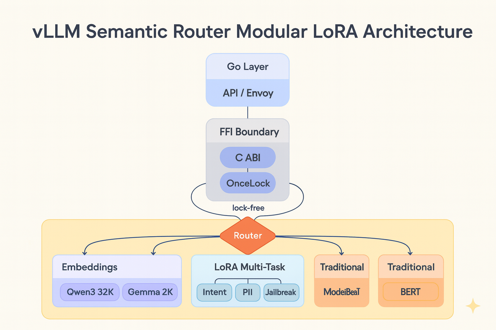
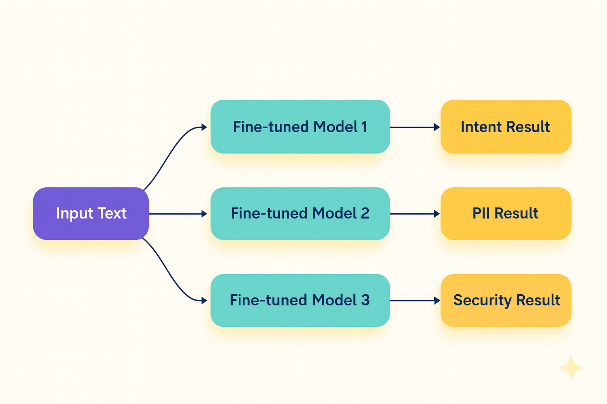
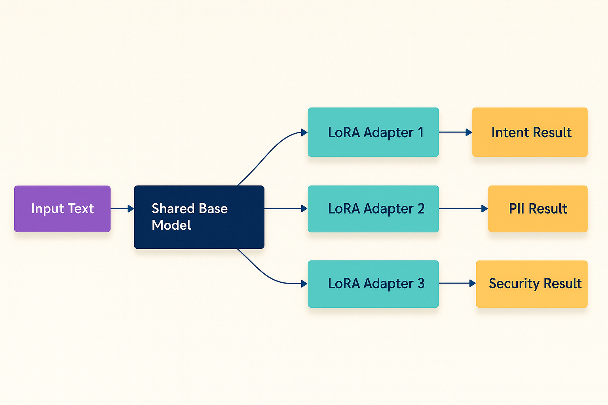

# Modular LoRA: stop running a full model per classifier

Chinese: `../../zh/vllm/blog/serving/semantic-router-modular.md`  
2025-10-27. Launch: [semantic-router.md](semantic-router.md). Shared-base LoRA lands in [Iris](semantic-router-iris.md).  Cited numbers are demos.

Intent + PII + jailbreak used to mean three full BERT forwards. Candle binding is layered; `DualPathUnifiedClassifier` picks fine-tuned vs LoRA.

Long context: **Qwen3-Embedding** (32,768, 100+ languages cited) and **EmbeddingGemma-300M** (2,048; Matryoshka 768/512/256/128; MQA 3Q/1KV). LoRA: one base pass, adapters typically **<1%** params; Rayon in `parallel_engine.rs`. LoRA wins on multi-task, not single-task. `OnceLock` replaces `lazy_static` (10 threads / 30 classifications in their test).

Optional Flash Attention 2 (Ampere+). ModernBERT ~**3×** attention, Qwen3 ~**4×** / 14B 70–110 vs 30–35 tok/s are **citations**, not a vLLM-SR cluster run. Rust classify + Go FFI for Envoy `ext_proc`.

Local figures (copyright remains with the original site; study copies):

